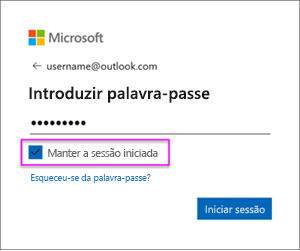

# Atualizar um conjunto de dados criado com base num ficheiro .CSV no OneDrive ou SharePoint Online
## Quais são as vantagens?
Quando se liga a um ficheiro .csv no OneDrive ou SharePoint Online, é criado um conjunto de dados no Power BI. Os dados do ficheiro .csv são então importados para o conjunto de dados no Power BI. Em seguida, o Power BI se conecta automaticamente ao ficheiro e atualiza todas as alterações com o conjunto de dados no Power BI. Se editar o ficheiro .csv no OneDrive ou SharePoint Online, depois de salvar, essas alterações aparecem no Power BI, normalmente, em menos de uma hora. Todas as visualizações no Power BI baseadas no conjunto de dados também são atualizadas automaticamente.

Se os ficheiros estiverem numa pasta partilhada no OneDrive for Business ou SharePoint Online, outros utilizadores podem trabalhar no mesmo ficheiro. Depois de salvas, quaisquer alterações feitas são atualizadas automaticamente no Power BI, geralmente numa hora.

Muitas organizações realizam processos que consultam automaticamente nas bases de dados os dados que são então guardados diariamente num ficheiro .csv. Se o ficheiro estiver armazenado no OneDrive ou SharePoint Online e o mesmo ficheiro for substituído todos os dias, em vez de criar um novo ficheiro com um nome diferente todos os dias, será possível se conectar a esse ficheiro no Power BI. O conjunto de dados que se conecta ao ficheiro será sincronizado logo depois que o ficheiro no OneDrive ou SharePoint Online for atualizado. Todas as visualizações com base no conjunto de dados também são atualizadas automaticamente.

## O que é suportado?
Os ficheiros de valores separados por vírgulas são ficheiros de texto simples; portanto, não há suporte para conexões a relatórios e origens de dados externas. Não é possível agendar uma atualização num conjunto de dados criado por meio de um ficheiro delimitado por vírgulas. No entanto, quando o ficheiro estiver no OneDrive ou SharePoint Online, o Power BI sincronizará todas as alterações no ficheiro com o conjunto de dados automaticamente em intervalos aproximados de sessenta minutos.

## OneDrive ou OneDrive para Empresas. Qual é a diferença?
Se tiver um OneDrive Pessoal e um OneDrive para Empresas, é recomendável manter todos os ficheiros aos quais deseja se conectar no Power BI no OneDrive para Empresas. Eis o porquê: Provavelmente utiliza duas contas diferentes para iniciar sessão.

A ligação ao OneDrive para Empresas no Power BI é normalmente contínua, porque a mesma conta com a qual inicia sessão no Power BI é geralmente a mesma conta utilizada para iniciar sessão no OneDrive para Empresas. Mas, com o OneDrive pessoal, provavelmente entra com outra [conta da Microsoft](https://account.microsoft.com).

Quando iniciar a sessão com a sua conta Microsoft, certifique-se de seleciona Mantenha-me conectado. Em seguida, o Power BI pode sincronizar as atualizações com conjuntos de dados no Power BI

Se fizer alterações no ficheiro .csv no OneDrive que não podem ser sincronizadas com o conjunto de dados no Power BI devido à possibilidade de as suas credenciais de conta da Microsoft terem sido alteradas, precisará de se ligar ao ficheiro e importá-lo novamente do seu OneDrive pessoal.

## Quando algo dá errado
Se os dados no ficheiro .csv no OneDrive forem alterados e essas alterações não forem refletidas no Power BI, isso ocorre provavelmente porque o Power BI não pode se conectar ao OneDrive. Tente se conectar ao ficheiro e importá-lo novamente. Se for solicitado a iniciar a sessão, certifique-se de selecionar **Manter-me ligado**.

## Próximos passos
[Ferramentas para resolver problemas de atualização](service-gateway-onprem-tshoot.md)
[Resolver problemas de cenários de atualização](refresh-troubleshooting-refresh-scenarios.md)

Mais perguntas? [Experimente perguntar à Comunidade do Power BI](https://community.powerbi.com/)

