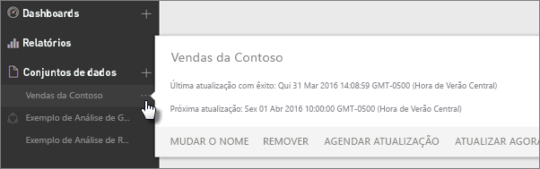
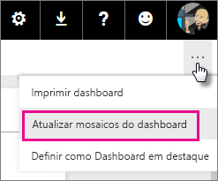
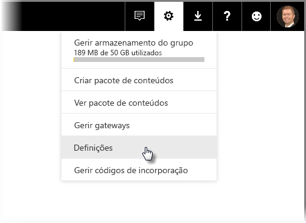
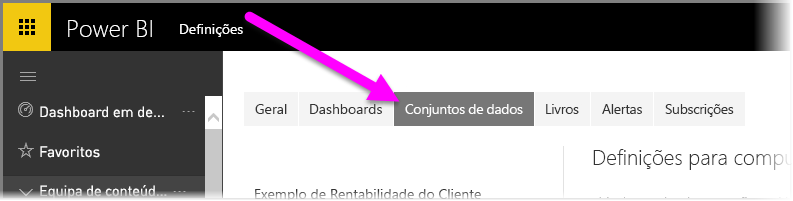
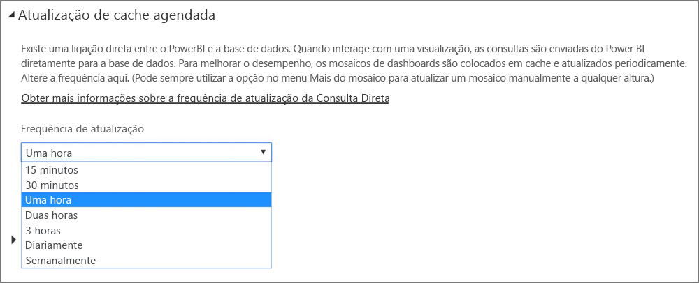

# Atualizar dados no Power BI
Certificar-se de que obtém sempre os dados mais recentes, muitas vezes, é fundamental para tomar as decisões certas. Provavelmente já usou Obter Dados no Power BI para se ligar e carregar alguns dados, e já criou alguns relatórios e um dashboard. E agora quer certificar-se de que os seus dados são realmente os mais recentes e os melhores.

Em muitos casos, não precisa de fazer absolutamente nada. Alguns dados, como os provenientes de um pacote de conteúdos do Salesforce ou Marketo são atualizados automaticamente. Caso ligação utiliza uma ligação em direto ou o DirectQuery, os dados estarão atualizados até o momento. Todavia, noutros casos, como ocorre com um livro do Excel ou um ficheiro do Power BI Desktop que se liga a uma origem de dados externa online ou local, tem de atualizar manualmente ou configurar um agendamento de atualização para o que o Power BI possa atualizar os dados nos relatórios e dashboards para si.

Este artigo, juntamente com outros, destina-se a ajudá-lo a entender como a atualização de dados no Power BI realmente funciona, se é ou não necessário configurar um agendamento de atualização e o que tem de ocorrer no local para atualizar os dados com êxito.

## Entendendo a atualização de dados
Antes de configurar a atualização, é importante entender o que está a atualizar e onde está a obter os dados.

Uma *origem de dados* é de onde os dados que explora nos seus relatórios e dashboards realmente são provenientes; por exemplo, um serviço online, como o Google Analytics ou QuickBooks, uma base de dados na cloud, como a Base de Dados SQL do Azure, ou uma base de dados ou ficheiro num computador ou servidor local na sua organização. Todas estas são origens de dados. O tipo de origem de dados determina a forma como os dados são atualizados. Vamos abordar a atualização para cada tipo de origem de dados mais tarde na secção [O que pode ser atualizado?](#what-can-be-refreshed).

Um *conjunto de dados* é criado automaticamente no Power BI quando usa Obter Dados para se ligar e carregar dados de um pacote de conteúdos, ficheiro, ou se liga a uma origem de dados em direto. No Power BI Desktop e Excel 2016, também é possível publicar o seu ficheiro diretamente no serviço Power BI, que é semelhante ao uso do recurso Obter Dados.

Em cada caso, é criado e exibido um conjunto de dados nos contentores da Minha área de trabalho ou Grupo no serviço Power BI. Ao selecionar as **reticências (...)** para um conjunto de dados, é possível explorar os dados num relatório, editar definições e configurar a atualização.

Um conjunto de dados pode obter dados de uma ou mais origens de dados. Por exemplo, pode usar o Power BI Desktop para obter dados de uma Base de Dados SQL na sua organização e obter outros dados online de um feed OData. Em seguida, ao publicar o ficheiro no Power BI, um único conjunto de dados é criado, mas terá origens de dados tanto para a Base de Dados SQL como para o feed OData.

Um conjunto de dados contém informação sobre as origens de dados, credenciais de origem de dados e, na maioria dos casos, um subconjunto de dados copiados da origem de dados. Ao criar visualizações em relatórios e dashboards, observa dados no conjunto de dados ou, no caso de uma ligação em direto como a Base de Dados SQL do Azure, o conjunto de dados define os dados que vê diretamente da origem de dados. Para uma ligação em direto com o Analysis Services, a definição do conjunto de dados é recebida diretamente do Analysis Services.

> *Ao atualizar os dados, está a atualizar os dados no conjunto de dados que é armazenado no Power BI da sua origem de dados. Esta é uma atualização total e não incremental.*
> 
> 

Sempre que atualiza os dados de um conjunto de dados, seja ao usar Atualizar Agora ou configurando um agendamento de atualização, o Power BI usa a informação do conjunto de dados para se ligar às origens de dados definidas para o mesmo, consultar sobre dados atualizados e, em seguida, carrega os dados atualizados no conjunto de dados. Quaisquer visualizações nos seus relatórios ou dashboards com base nos dados são atualizadas automaticamente.

Antes de continuarmos, precisamos de abordar algo que é muito importante perceber:

> *Independentemente da frequência com que atualiza o conjunto de dados ou examina dados dinâmicos, são os dados na origem de dados que devem estar atualizados primeiro.*
> 
> 

A maioria das organizações processa os dados uma vez por dia, geralmente durante a noite. Se agendar a atualização de um conjunto de dados criado a partir de um ficheiro do Power BI Desktop que se liga a uma base de dados local e o seu departamento de TI executar uma vez o processamento nessa base de dados SQL durante a noite, só tem de configurar a atualização agendada para ser executada uma vez por dia. Por exemplo, após o processamento da base de dados, mas antes de entrar no trabalho. É claro que nem sempre é esse o caso. O Power BI fornece várias formas de se ligar a origens de dados que são atualizadas com frequência ou até mesmo em tempo real.

## Tipos de atualização
Há quatro tipos principais de atualização que ocorrem no Power BI. Atualização de pacotes, atualização de modelo/dados, atualização de mosaicos e atualização de contentores de elementos visuais.

### Atualização de pacotes
Esta sincroniza o ficheiro do Power BI Desktop ou do Excel entre o serviço Power BI e o OneDrive ou SharePoint Online. Isto não efetua o pull de dados da origem de dados inicial. O conjunto de dados no Power BI só será atualizado com o conteúdo do ficheiro no OneDrive ou SharePoint Online.

### Atualização de dados/modelo
Refere-se à atualização do conjunto de dados, no serviço Power BI, com dados da origem de dados inicial. Isto é feito por meio da atualização agendada ou do recurso Atualizar Agora. Requer um gateway para origens de dados locais.

### Atualização de mosaico
A atualização de mosaicos atualiza a cache dos elementos visuais do mosaico, no dashboard, após as alterações de dados. Isto ocorre, aproximadamente, a cada quinze minutos. Também pode forçar uma atualização do mosaico ao selecionar as **reticências (...)** no canto superior direito de um dashboard e selecionar **Atualizar mosaicos do dashboard**.

Para obter detalhes sobre erros comuns de atualização de mosaico, veja [Resolução de Problemas de erros de mosaico](refresh-troubleshooting-tile-errors.md).

### Atualização de contentores de elementos visuais
A atualização do contentor de elementos visuais atualiza também os elementos visuais do relatório em cache, num relatório, após as alterações de dados.

## O que pode ser atualizado?
No Power BI, normalmente, usa Obter Dados para importar dados de um ficheiro numa unidade local, no OneDrive ou SharePoint Online, publicar um relatório a partir do Power BI Desktop ou ligar-se diretamente a uma base de dados na cloud na sua organização. Praticamente, quaisquer dados no Power BI podem ser atualizados, mas se tal é necessário ou não depende de como o conjunto de dados é criado e das origens de dados a que se liga. Vamos ver como cada um atualiza os dados.

Antes de avançarmos, eis algumas definições que é importante entender:

**Atualização automática**  -  significa que nenhuma configuração de utilizador é necessária para o conjunto de dados ser atualizado regularmente. As definições de atualização de dados são configuradas para si pelo Power BI. Para fornecedores de serviços online, a atualização normalmente ocorre uma vez por dia. Para ficheiros carregados a partir do OneDrive, a atualização automática ocorre a cada hora para dados que não provenham de uma origem de dados externa. Embora possa configurar diferentes definições de atualização agendada e atualizar manualmente, provavelmente não tem de o fazer.

**Atualização manual ou agendada configurada pelo utilizador** – significa que pode atualizar manualmente um conjunto de dados com Atualizar Agora ou configurar uma atualização agendada usando Agendamento da Atualização nas definições do conjunto de dados. Esse tipo de atualização é necessário para ficheiros do Power BI Desktop e livros do Excel que se ligam a origens de dados locais e online externas.

> [!NOTE]
> Ao configurar um horário para a atualização agendada, poderá haver um atraso de até uma hora antes do início.
> 
> 

**Live/DirectQuery** – Isto significa que há uma ligação em direto entre o Power BI e a origem de dados. Para origens de dados no local, os Administradores precisarão de ter uma origem de dados configurada num gateway empresarial, mas poderá não ser necessária interação com o utilizador.

> [!NOTE]
> Para melhorar o desempenho, os dashboards com dados ligados através do DirectQuery são atualizados automaticamente. Também pode atualizar manualmente um mosaico a qualquer altura, ao utilizar o menu **Mais** no mosaico.
> 
> 

## Ficheiros locais e ficheiros no OneDrive ou SharePoint Online
A atualização de dados é suportada para ficheiros do Power BI Desktop e livros do Excel que se ligam a origens de dados locais ou online externas. Isto atualizará apenas os dados do conjunto de dados no serviço Power BI. Não atualizará o ficheiro local.

Manter os seus ficheiros no OneDrive ou SharePoint Online e ligar-se a eles através do Power BI permite uma enorme flexibilidade. Mas tanta flexibilidade também é de entendimento complexo. A atualização agendada para os ficheiros armazenados no OneDrive ou SharePoint Online é diferente da atualização de pacotes. Pode saber mais na secção [Tipos de atualização](#types-of-refresh).

### Ficheiro do Power BI Desktop
| **Origem de dados** | **Atualização automática** | **Atualização manual ou agendada configurada pelo utilizador** | **Gateway necessário** |
| --- | --- | --- | --- |
| Obter Dados (no friso) é usado para ligação e consulta de dados a partir de qualquer origem de dados online listada. |Não |Sim |Não (ver abaixo) |
| O recurso Obter Dados é usado para se ligar e explorar em direto uma base de dados do Analysis Services. |Sim |Não |Sim |
| O recurso Obter Dados é usado para se ligar e explorar uma origem de dados DirectQuery local. |Sim |Não |Sim |
| Obter Dados é usado para ligação e consulta de dados a partir do Spark para Azure HDInsight, Base de Dados SQL do Azure, Azure SQL Data Warehouse. |Sim (por hora) |Não |Não |
| Obter Dados é usado para ligação e consulta de dados a partir de qualquer origem de dados local listada, com exceção do ficheiro Hadoop (HDFS) e Microsoft Exchange. |Não |Sim |Sim |

> [!NOTE]
> Se estiver a utilizar a função [**Web.Page**](https://msdn.microsoft.com/library/mt260924.aspx), precisa de um gateway se tiver republicado o conjunto de dados ou o seu relatório após 18 de novembro de 2016.
> 
> 

Para detalhes, consulte [Atualizar um conjunto de dados criado a partir de um ficheiro do Power BI Desktop no OneDrive](refresh-desktop-file-onedrive.md).

### Livro do Excel
| **Origem de dados** | **Atualização automática** | **Atualização manual ou agendada configurada pelo utilizador** | **Gateway necessário** |
| --- | --- | --- | --- |
| Tabelas de dados numa folha de cálculo não carregadas no modelo de dados do Excel. |Sim, por hora *(somente OneDrive/SharePoint Online)* |Somente manual *(somente OneDrive/SharePoint Online)* |Não |
| Tabelas de dados numa folha de cálculo ligada a uma tabela no modelo de dados do Excel (tabela ligada). |Sim, por hora *(somente OneDrive/SharePoint Online)* |Somente manual *(somente OneDrive/SharePoint Online)* |Não |
| Power Query* é usado para ligação e consulta de dados a partir de qualquer origem de dados online listada e para carregar dados para o modelo de dados do Excel. |Não |Sim |Não |
| Power Query* é usado para ligação e consulta de dados a partir de qualquer origem de dados listada local, com exceção do ficheiro Hadoop (HDFS) e Microsoft Exchange e para carregar dados para o modelo de dados do Excel. |Não |Sim |Sim |
| Power Pivot é usado para ligação e consulta de dados a partir de qualquer origem de dados online listada e para carregar dados para o modelo de dados do Excel. |Não |Sim |Não |
| Power Pivot é usado para ligação e consulta de dados a partir de qualquer origem de dados no local listada e para carregar dados para o modelo de dados do Excel. |Não |Sim |Sim |

*\* O Power Query é conhecido como Obter e Transformar Dados no Excel 2016.*

Para informações mais detalhadas, consulte [Atualizar um conjunto de dados criado a partir de um livro do Excel no OneDrive](refresh-excel-file-onedrive.md).

### Ficheiro .csv (valores separados por vírgulas) no OneDrive ou SharePoint Online
| **Origem de dados** | **Atualização automática** | **Atualização manual ou agendada configurada pelo utilizador** | **Gateway necessário** |
| --- | --- | --- | --- |
| Valor separado por vírgulas simples |Sim, por hora |Apenas manual |Não |

Para informações mais detalhadas, consulte [Atualizar um conjunto de dados criado a partir de um ficheiro .csv (valores separados por vírgula) no OneDrive](refresh-csv-file-onedrive.md).

## Pacotes de conteúdos
Há dois tipos de pacotes de conteúdos no Power BI:

**Pacotes de conteúdos dos serviços online**: como Adobe Analytics, SalesForce e Dynamics CRM Online. Os conjuntos de dados criados a partir de serviços online são atualizados automaticamente uma vez por dia. Embora provavelmente não seja necessário, pode atualizar manualmente ou configurar um agendamento de atualização. Uma vez que os serviços online estão na cloud, não é necessário um gateway.

**Pacotes de conteúdos organizacionais**: criados e partilhados por utilizadores na sua organização. Os consumidores de pacotes de conteúdos não podem configurar um agendamento de atualização ou atualizar manualmente. Apenas o criador do pacote de conteúdos pode configurar a atualização dos conjuntos de dados no pacote de conteúdos. As definições de atualização são herdadas com o conjunto de dados.

### Pacotes de conteúdos de serviços online
| **Origem de dados** | **Atualização automática** | **Atualização manual ou agendada configurada pelo utilizador** | **Gateway necessário** |
| --- | --- | --- | --- |
| Serviços online em Obter Dados &gt; Serviços |Sim |Sim |Não |

### Pacotes de conteúdos organizacionais
As funções de atualização de um conjunto de dados incluídas num pacote de conteúdos organizacional dependem do conjunto de dados. Veja as informações acima em relação aos ficheiros locais, OneDrive ou SharePoint Online.

Para saber mais, consulte [Introdução aos pacotes de conteúdos organizacionais](service-organizational-content-pack-introduction.md).

## Ligações em direto e DirectQuery para origens de dados locais
Com o gateway de dados no local, pode emitir consultas do Power BI para as suas origens de dados no local. Quando interage com uma visualização, as consultas são enviadas do Power BI diretamente para a base de dados. Os dados atualizados são então devolvidos e as visualizações são atualizadas. Como há uma ligação direta entre o Power BI e a base de dados, não é necessário agendar a atualização.

Ao ligar a uma origem de dados do SQL Service Analysis Services (SSAS) através de uma Ligação em direto, ao contrário do DirectQuery, a Ligação em direto a uma origem SSAS pode ser executada em função da cache, mesmo ao carregar um relatório. Este comportamento melhora o desempenho de carga do relatório. Pode pedir os dados mais recentes da origem de dados SSAS ao utilizar o botão **atualizar**. Os proprietários de origens de dados SSAS podem configurar a frequência da atualização de cache agendada para que o conjunto de dados garanta que os relatórios estão tão atualizados quanto necessário. 

Ao configurar uma origem de dados com o gateway de dados no local, é possível usar essa origem de dados como a opção de atualização agendada. Isto seria usado em vez do gateway pessoal.

> [!NOTE]
> Se o seu conjunto de dados estiver configurado para uma ligação em direto ou do DirectQuery, os conjuntos de dados são atualizados aproximadamente uma vez por hora ou quando ocorre uma interação com os dados. Pode ajustar manualmente a *frequência de atualização* na opção *Atualização de cache agendada* no serviço Power BI.
> 
> 

| **Origem de dados** | **Em direto/DirectQuery** | **Atualização manual ou agendada configurada pelo utilizador** | **Gateway necessário** |
| --- | --- | --- | --- |
| Tabela do Analysis Services |Sim |Sim |Sim |
| Multidimensional do Analysis Services |Sim |Sim |Sim |
| SQL Server |Sim |Sim |Sim |
| SAP HANA |Sim |Sim |Sim |
| Oracle |Sim |Sim |Sim |
| Teradata |Sim |Sim |Sim |

Para saber mais, consulte [Gateway de dados no local](service-gateway-onprem.md)

## Bases de dados na cloud
Com o DirectQuery, há uma ligação direta entre o Power BI e a base de dados na cloud. Quando interage com uma visualização, as consultas são enviadas do Power BI diretamente para a base de dados. Os dados atualizados são então devolvidos e as visualizações são atualizadas. E uma vez que o serviço Power BI e a origem de dados estão na cloud, não é necessário um Personal Gateway.

Se não houver nenhuma interação do utilizador numa visualização, os dados são atualizados automaticamente aproximadamente uma vez por hora. Pode alterar essa frequência de atualização ao utilizar a opção *Atualização de cache agendada* e definir a frequência de atualização.

Para definir a frequência, selecione o ícone da **engrenagem** no canto superior direito do serviço Power BI e, em seguida, selecione **Definições**.

É apresentada a página das **Definições**, onde pode selecionar o conjunto de dados para o qual pretende ajustar a frequência. Nessa página, selecione o separador **Conjuntos de dados** na parte superior.

Selecione o conjunto de dados e, no painel à direita, verá uma coleção de opções para esse conjunto de dados. Para a ligação DirectQuery/Em Direto, pode definir a frequência de atualização entre 15 minutos e semanal, utilizando o menu pendente associado, conforme apresentado na seguinte imagem.

| **Origem de dados** | **Em direto/DirectQuery** | **Atualização manual ou agendada configurada pelo utilizador** | **Gateway necessário** |
| --- | --- | --- | --- |
| SQL Azure Data Warehouse |Sim |Sim |Não |
| Spark no HDInsight |Sim |Sim |Não |

Para saber mais, consulte [Azure e Power BI](service-azure-and-power-bi.md).

## Dashboards em tempo real
Os dashboards em tempo real usam a API REST do Microsoft Power BI ou o Microsoft Stream Analytics para garantir que os dados estão atualizados. Uma vez que os dashboards em tempo real não requerem a configuração da atualização pelos utilizadores, estes estão fora do âmbito deste artigo.

| **Origem de dados** | **Automático** | **Atualização manual ou agendada configurada pelo utilizador** | **Gateway necessário** |
| --- | --- | --- | --- |
| Aplicações personalizadas desenvolvidas com a API Rest do Power BI ou o Microsoft Stream Analytics |Sim, transmissão em direto |Não |Não |

Para mais informações, consulte [Criar um dashboard em tempo real no Power BI](https://msdn.microsoft.com/library/mt267603.aspx).

## Configurar a atualização agendada
Para saber como configurar a atualização agendada, consulte [Configurar a atualização agendada](refresh-scheduled-refresh.md)

## Cenários de atualização de dados comuns
Às vezes, a melhor maneira de aprender sobre a atualização de dados no Power BI é ver exemplos. Aqui estão alguns dos cenários de atualização de dados mais comuns:

### Livro do Excel com tabelas de dados
Tem um livro do Excel com várias tabelas de dados, mas nenhuma delas é carregada no modelo de dados do Excel. Use Obter Dados para carregar o ficheiro de livro da sua unidade local para o Power BI e criar um dashboard. Mas agora efetuou algumas alterações nalgumas tabelas do livro na sua unidade local e pretende atualizar o dashboard no Power BI com os novos dados.

Infelizmente, a atualização não é suportada neste cenário. Para atualizar o conjunto de dados para o seu dashboard, tem de carregar novamente o livro. No entanto, há uma excelente solução: colocar o ficheiro de livro no OneDrive ou SharePoint Online!

Quando se liga a um ficheiro no OneDrive ou SharePoint Online, os relatórios e dashboards apresentam os dados tal como estão no ficheiro. Neste caso, o seu livro do Excel. O Power BI verifica automaticamente se há atualizações do ficheiro em intervalos aproximados de sessenta minutos. Se fizer alterações no livro (armazenado no OneDrive ou SharePoint Online), essas alterações são refletidas no dashboard e nos relatórios dentro de uma hora. Não precisa de configurar qualquer atualização. No entanto, se precisar de ver as suas atualizações no Power BI imediatamente, pode atualizar manualmente o conjunto de dados através de Atualizar Agora.

Para saber mais, consulte [Dados do Excel no Power BI](service-excel-workbook-files.md) ou [Atualizar um conjunto de dados criado de um livro do Excel no OneDrive](refresh-excel-file-onedrive.md).

### O livro do Excel liga-se a uma base de dados SQL na sua empresa
Suponhamos que tem um livro do Excel denominado SalesReport.xlsx no computador local. O Power Query no Excel foi usado para ligação a uma base de dados SQL num servidor na sua empresa e para consultar dados de vendas que são carregados no modelo de dados. Todas as manhãs, abre o livro e clica em Atualizar para atualizar as suas tabelas dinâmicas.

Agora pretende explorar os seus dados de vendas no Power BI, portanto usa Obter Dados para conectar e carregar o livro SalesReport.xlsx a partir da sua unidade local.

Neste caso, pode atualizar manualmente os dados no conjunto de dados do SalesReport.xlsx ou configurar um agendamento de atualização. Visto que os dados são, de facto, recebidos da base de dados SQL na sua empresa, tem de transferir e instalar um gateway. Depois de instalado e configurado o gateway, tem de ir às configurações do conjunto de dados SalesReport e inscrever-se na origem de dados; mas só tem de o fazer uma vez. Pode depois configurar um agendamento de atualização para que o Power BI se ligue automaticamente à base de dados SQL e obtenha os dados atualizados. Os relatórios e dashboards também serão atualizados automaticamente.

> [!NOTE]
> Isto só atualizará os dados no conjunto de dados no serviço Power BI. O ficheiro local não será atualizado como parte da atualização.
> 
> 

Para saber mais, consulte [Dados do Excel no Power BI](service-excel-workbook-files.md), [Power BI Gateway - Personal](personal-gateway.md), [Gateway de dados no local](service-gateway-onprem.md), [Atualizar um conjunto de dados criado de um livro do Excel numa unidade local](refresh-excel-file-local-drive.md).

### Ficheiro do Power BI Desktop com dados a partir de um feed OData
Neste caso, utiliza Obter Dados no Power BI Desktop para se ligar e importar dados de censo de um feed OData.  Cria vários relatórios no Power BI Desktop, em seguida nomeia o ficheiro WACensus e guarda-o numa partilha da sua empresa. Depois, publica o ficheiro no serviço Power BI.

Neste caso, pode atualizar manualmente os dados no conjunto de dados do WACensus ou configurar um agendamento de atualização. Como os dados na origem de dados são recebidos de um feed OData online, não é necessário instalar um gateway; no entanto, tem de ir às configurações do conjunto de dados WACensus e inscrever-se na origem de dados do OData. Pode depois configurar um agendamento de atualização para que o Power BI se ligue automaticamente ao feed OData e obtenha os dados atualizados. Os relatórios e dashboards também serão atualizados automaticamente.

Para saber mais, consulte [Publicar a partir do Power BI Desktop](desktop-upload-desktop-files.md), [Atualizar um conjunto de dados criado a partir de um ficheiro do Power BI Desktop numa unidade local](refresh-desktop-file-local-drive.md) e [Atualizar um conjunto de dados criado a partir de um ficheiro do Power BI Desktop no OneDrive](refresh-desktop-file-onedrive.md).

### Pacote de conteúdos partilhado a partir de outro utilizador na sua organização.
Ligou-se a um pacote de conteúdos organizacional. Inclui um dashboard, vários relatórios e um conjunto de dados.

Neste cenário, não pode configurar a atualização do conjunto de dados. O analista de dados que criou o pacote de conteúdos é responsável por verificar se o conjunto de dados é atualizado, dependendo das origens de dados usadas.

Se os seus dashboards e relatórios do pacote de conteúdos não estiverem a ser atualizados, deve falar com o analista de dados que criou o pacote de conteúdos.

Para saber mais, consulte [Introdução aos pacotes de conteúdos organizacionais](service-organizational-content-pack-introduction.md) e [Trabalhar com pacotes de conteúdos organizacionais](service-organizational-content-pack-copy-refresh-access.md).

### Pacote de conteúdos de um fornecedor de serviços como o Salesforce
No Power BI usou Obter Dados para se ligar aos seus dados e importá-los de um fornecedor de serviços online como o Salesforce. Bem, não há muito a fazer aqui. O seu conjunto de dados do Salesforce está agendado automaticamente para atualizações uma vez por dia. 

Tal como a maioria dos fornecedores de serviços, o Salesforce atualiza os dados uma vez por dia, geralmente à noite. Pode atualizar manualmente o seu conjunto de dados do Salesforce ou configurar um agendamento de atualização, mas não é necessário porque o Power BI atualizará automaticamente o conjunto de dados e os relatórios e dashboards também serão atualizados.

Para saber mais, consulte [Pacote de conteúdos do Salesforce para o Power BI](service-connect-to-salesforce.md).

## Resolução de problemas
Quando as coisas correm mal, normalmente, deve-se ao facto de o Power BI não conseguir entrar nas origens de dados. Outra razão é o conjunto de dados ligar-se a uma origem de dados local e o gateway estar offline. Certifique-se de que o Power BI pode entrar nas origens de dados. Se uma palavra-passe que utiliza para entrar numa origem de dados for alterada ou o Power BI for desligado de uma origem de dados, certifique-se de que se inscreve novamente nas suas origens de dados nas Credenciais da Origem de Dados.

Para mais informações sobre a resolução de problemas, consulte [Ferramentas para resolução de problemas de atualização](service-gateway-onprem-tshoot.md) e [Resolução de problemas de cenários de atualização](refresh-troubleshooting-refresh-scenarios.md).

## Próximos passos
[Ferramentas para resolver problemas de atualização](service-gateway-onprem-tshoot.md)  
[Resolução de problemas de cenários de atualização](refresh-troubleshooting-refresh-scenarios.md)  
[Power BI Gateway - Personal](personal-gateway.md)  
[Gateway de dados no local](service-gateway-onprem.md)  

Mais perguntas? [Experimente perguntar à Comunidade do Power BI](http://community.powerbi.com/)

