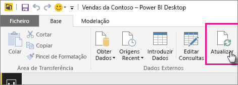

# Atualizar um conjunto de dados criado com base num ficheiro do Power BI Desktop numa unidade local

## O que tem suporte?

No Power BI, Atualizar Agora e Agendar Atualização são suportados para os conjuntos de dados criados através de ficheiros do Power BI Desktop importados de uma unidade local em que são utilizadas as opções Obter Dados/Editor de Consultas para ligar e carregar dados a partir de uma das seguintes origens de dados:

### Gateway do Power BI - Pessoal

- Todas as origens de dados online mostradas no Editor de Consultas e em Obter Dados no Power BI Desktop.
- Todas as origens de dados locais mostradas no Editor de Consultas e em Obter Dados no Power BI Desktop, exceto o ficheiro do Hadoop (HDFS) e o Microsoft Exchange.

<!-- Refresh Data sources-->
[!INCLUDE [refresh-datasources](./includes/refresh-datasources.md)]

> [!NOTE]
> Um gateway deve ser instalado e estar em execução para que o Power BI se ligue a origens de dados locais e atualize o conjunto de dados.
>
>

Pode realizar uma única atualização manual diretamente no Power BI Desktop ao selecionar **Atualizar** no friso Base. Ao selecionar **Atualizar** aqui, os dados no modelo do *ficheiro* serão atualizados com os dados atualizados da origem de dados original. Este tipo de atualização, feita totalmente na própria aplicação Power BI Desktop, é diferente da atualização manual ou agendada no Power BI e é importante compreender a diferença entre elas.

Ao importar o seu ficheiro do Power BI Desktop a partir de uma unidade local, os dados, juntamente com outras informações sobre o modelo, serão carregados para um conjunto de dados no serviço Power BI. No serviço Power BI (não o Power BI Desktop), quer atualizar os dados no conjunto de dados, visto que são nestes que os relatórios contidos no serviço Power BI se baseiam. Como as origens de dados são externas, pode atualizar manualmente o conjunto de dados através da opção **Atualizar agora** ou configurar uma atualização agendada através da opção **Agendar Atualização**.

Quando atualiza o conjunto de dados, o Power BI não se liga ao ficheiro na unidade local para consultar e verificar se há dados atualizados. Utiliza informações do conjunto de dados para ligar diretamente às origens de dados para consultar os dados atualizados e carrega-os no conjunto de dados.

> [!NOTE]
> Os dados atualizados no conjunto de dados não são sincronizados de volta para o ficheiro na unidade local.
>
>

## Como faço para agendar uma atualização?

Quando configurar uma atualização agendada, o Power BI irá ligar diretamente às origens de dados através das informações da ligação e das credenciais no conjunto de dados para consultar os dados atualizados e, em seguida, carregar os dados para o conjunto de dados. Todas as visualizações em relatórios e em dashboards baseadas nesse conjunto de dados no serviço do Power BI também são atualizadas.

Para obter detalhes sobre como configurar uma atualização agendada, veja [Configurar atualizações agendadas](refresh-scheduled-refresh.md).

## Quando acontece algo de errado

Quando ocorre algo errado, normalmente isso deve-se ao facto de o Power BI não conseguir iniciar sessão nas origens de dados ou se o conjunto de dados ligar a uma origem de dados no local, o gateway ficar offline. Certifique-se de que o Power BI consegue iniciar sessão nas origens de dados. Se uma palavra-passe que utiliza para entrar numa origem de dados for alterada ou o Power BI for desligado de uma origem de dados, certifique-se de que tenta entrar novamente nas suas origens de dados novamente nas Credenciais da Origem de Dados.

Lembre-se de deixar a opção **Enviar e-mail de notificação de falha de atualização para mim** marcada. Quer saber imediatamente de uma falha numa atualização agendada.

## Resolução de problemas

Por vezes, atualizar os dados pode não correr como esperado. Normalmente, este problema está relacionado com um gateway. Veja os artigos de resolução de problemas de gateways para ferramentas e problemas conhecidos.

- [Resolução de problemas do Gateway de dados no local](service-gateway-onprem-tshoot.md)
- [Resolver problemas do Power BI Gateway - Personal](service-admin-troubleshooting-power-bi-personal-gateway.md)

Mais perguntas? [Experimente perguntar à Comunidade do Power BI](https://community.powerbi.com/)

