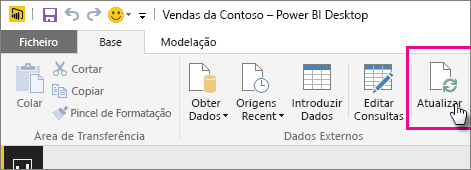
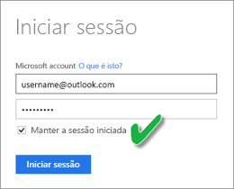

# Atualizar um conjunto de dados armazenado no OneDrive ou o SharePoint Online
Importar ficheiros do OneDrive ou SharePoint Online para o serviço Power BI é uma ótima maneira de garantir que o trabalho que está a realizar no **Power BI Desktop** permanece sincronizado com o serviço Power BI.

## Vantagens de armazenar um ficheiro do Power BI Desktop no OneDrive ou SharePoint Online
Ao armazenar um ficheiro do **Power BI Desktop** no OneDrive ou SharePoint Online, todos os dados que carregou para o modelo do ficheiro são importados no conjunto de dados e todos os relatórios que criou no ficheiro são carregados nos **Relatórios** do serviço Power BI. Ao fazer alterações no ficheiro do OneDrive ou SharePoint Online, como adicionar novas medidas, alterar nomes de coluna ou editar visualizações, depois de guardar o ficheiro, essas alterações também serão atualizadas no serviço Power BI, normalmente, em menos de uma hora.

É possível realizar uma única atualização manual diretamente no Power BI Desktop ao selecionar Atualizar no friso Base. Ao selecionar Atualização aqui, os dados no modelo *do ficheiro* serão atualizados com os dados atualizados da origem de dados original. Este tipo de atualização, feita totalmente na própria aplicação Power BI Desktop, é diferente da atualização manual ou agendada no Power BI e é importante compreender a diferença entre elas.

Quando importa o ficheiro do Power BI Desktop do OneDrive ou SharePoint Online, os dados, juntamente com outras informações sobre o modelo, são carregados para um conjunto de dados no Power BI. No serviço Power BI (não o Power BI Desktop), quer atualizar os dados no conjunto de dados, visto que são nestes que os relatórios contidos no serviço Power BI se baseiam. Como as origens de dados são externas, pode atualizar manualmente o conjunto de dados através de **Atualizar agora** ou configurar um agendamento de atualização através de **Agendar Atualização**.

Quando atualiza o conjunto de dados, o Power BI não liga ao ficheiro no OneDrive ou SharePoint Online para consultar os dados atualizados. Utiliza as informações do conjunto de dados para ligar diretamente às origens de dados para consultar os dados atualizados e, em seguida, carrega-os para o conjunto de dados. Estes dados atualizados no conjunto de dados não são sincronizados de volta para o ficheiro no OneDrive ou SharePoint Online.

## O que é suportado?
No Power BI, Atualizar Agora e Agendar Atualização são suportados para os conjuntos de dados criados através de ficheiros do Power BI Desktop importados de uma unidade local em que são utilizadas as opções Obter Dados/Editor de Consultas para ligar e carregar dados a partir de uma das seguintes origens de dados:

### Gateway do Power BI - Pessoal
* Todas as origens de dados online mostradas no Editor de Consultas e em Obter Dados no Power BI Desktop.
* Todas as origens de dados locais mostradas no Editor de Consultas e em Obter Dados no Power BI Desktop, exceto o ficheiro do Hadoop (HDFS) e o Microsoft Exchange.

<!-- Refresh Data sources-->
[!INCLUDE [refresh-datasources](./includes/refresh-datasources.md)]

> [!NOTE]
> Um gateway tem de ser instalado e estar em execução para que o Power BI ligue a origens de dados no local e atualize o conjunto de dados.
> 
> 

## OneDrive ou OneDrive para Empresas. Qual é a diferença?
Se tiver um OneDrive pessoal e um OneDrive para Empresas, é recomendado manter todos os ficheiro que quer importar para o Power BI no OneDrive para Empresas. Eis o porquê: provavelmente utiliza duas contas diferentes para iniciar sessão.

A ligação ao OneDrive para Empresas no Power BI é normalmente contínua, porque a mesma conta com a qual inicia sessão no Power BI é geralmente a mesma conta utilizada para iniciar sessão no OneDrive para Empresas. No entanto, com o OneDrive pessoal, provavelmente inicia sessão com outra [conta Microsoft](https://account.microsoft.com).

Quando iniciar sessão com a sua conta Microsoft, certifique-se de que seleciona Manter sessão iniciada. O Power BI pode então sincronizar as atualizações feitas no ficheiro do Power BI Desktop com os conjuntos de dados no Power BI  
    

Se fizer alterações ao ficheiro no OneDrive que não podem ser sincronizadas com o conjunto de dados ou os relatórios no Power BI devido à possibilidade de as credenciais da conta Microsoft terem sido alteradas, tem de ligar e importar o ficheiro novamente a partir do seu OneDrive pessoal.

## Como agendo uma atualização?
Quando configurar um agendamento de atualização, o Power BI ligará diretamente às origens de dados através das informações de ligação e das credenciais no conjunto de dados para consultar os dados atualizados e, em seguida, carregará os dados atualizados para o conjunto de dados. Todas as visualizações em relatórios e em dashboards baseadas nesse conjunto de dados no serviço do Power BI também são atualizadas.

Para obter detalhes sobre como configurar a atualização de agendamento, veja [Configurar uma atualização agendada](refresh-scheduled-refresh.md).

## Quando acontece algo de errado
Quando ocorre algo errado, normalmente isso deve-se ao facto de o Power BI não conseguir iniciar sessão nas origens de dados ou se o conjunto de dados ligar a uma origem de dados no local, o gateway ficar offline. Certifique-se de que o Power BI consegue iniciar sessão nas origens de dados. Se uma palavra-passe que utiliza para iniciar sessão numa origem de dados for alterada ou a sessão do Power BI for terminada numa origem de dados, certifique-se de que tenta iniciar sessão novamente nas origens de dados em Credenciais da Origem de Dados.

Se fizer alterações ao ficheiro do Power BI Desktop no OneDrive e o guardar, e se essas alterações não forem refletidas no Power BI dentro de aproximadamente uma hora, pode dever-se ao facto de o Power BI não conseguir ligar ao OneDrive. Tente ligar novamente ao ficheiro no OneDrive. Se lhe for pedido para iniciar sessão, certifique-se de que seleciona Manter sessão iniciada. Como o Power BI não conseguiu ligar ao seu OneDrive para sincronizar com o ficheiro, terá de importar novamente o ficheiro.

Certifique-se de que deixa a opção **Enviar-me notificação de falha de atualização por e-mail** selecionada. Quer saber imediatamente de uma falha numa atualização agendada.

## Resolução de problemas
Por vezes, atualizar os dados pode não correr como esperado. Normalmente, este problema está ligado a um gateway. Veja os artigos de resolução de problemas de gateways para ferramentas e problemas conhecidos.

[Resolução de problemas do Gateway de dados no local](service-gateway-onprem-tshoot.md)

[Resolver problemas do Power BI Gateway - Personal](service-admin-troubleshooting-power-bi-personal-gateway.md)

Mais perguntas? [Experimente perguntar à Comunidade do Power BI](http://community.powerbi.com/)

