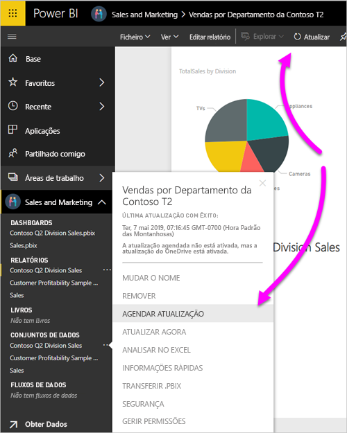

# Atualizar um conjunto de dados armazenado no OneDrive ou o SharePoint Online
Importar ficheiros do OneDrive ou do SharePoint Online para o serviço Power BI é uma ótima maneira de garantir que o seu trabalho no Power BI Desktop permanece sincronizado com o serviço Power BI.

## Vantagens de armazenar um ficheiro do Power BI Desktop no OneDrive ou SharePoint Online
Ao armazenar um ficheiro do Power BI Desktop no OneDrive ou no SharePoint Online, todos os dados que carregou para o modelo do ficheiro são importados para o conjunto de dados. Todos os relatórios que criou no ficheiro são carregados nos **Relatórios** no serviço Power BI. Digamos que faz alterações ao ficheiro no OneDrive ou SharePoint Online. Estas alterações podem incluir a adição de novas medidas, a alteração dos nomes das colunas ou a edição das visualizações. Depois de guardar o ficheiro, o serviço Power BI também sincroniza essas alterações, normalmente, no espaço de uma hora.

Pode realizar uma atualização única manual diretamente no Power BI Desktop ao selecionar **Atualizar** no friso **Base**. Ao selecionar **Atualizar**, atualiza o modelo do ficheiro com os dados atualizados da origem de dados original. Este tipo de atualização ocorre totalmente na própria aplicação Power BI Desktop. É diferente de uma atualização manual ou agendada no Power BI, pelo que é importante que compreenda a diferença.

Quando importa o ficheiro do Power BI Desktop do OneDrive ou do SharePoint Online, carrega os dados e as informações do modelo para um conjunto de dados no Power BI. Recomenda-se a atualização do conjunto de dados no serviço Power BI, uma vez que este serve de base para os relatórios. Como as origens de dados são externas, pode atualizar manualmente o conjunto de dados com a opção **Atualizar agora** ou configurar uma atualização agendada com a opção **Agendar Atualização**. 

Quando atualiza o conjunto de dados, o Power BI não se liga ao ficheiro no OneDrive ou no SharePoint Online para consultar os dados atualizados. O Power BI utiliza as informações do conjunto de dados para se ligar diretamente às origens de dados e consultar os dados atualizados. Em seguida, carrega os dados no conjunto de dados. Estes dados atualizados no conjunto de dados não são sincronizados de volta para o ficheiro no OneDrive ou no SharePoint Online.

## O que tem suporte?
O Power BI suporta as opções **Atualizar** e **Agendar Atualização** para os conjuntos de dados criados através dos ficheiros do Power BI Desktop importados de uma unidade local onde utiliza as opções **Obter Dados** ou **Editor de Consultas** para se ligar e carregar dados a partir das seguintes origens de dados.

### Gateway do Power BI - Pessoal
* Todas as origens de dados online apresentadas nas opções **Obter Dados** e **Editor de Consultas** do Power BI Desktop.
* Todas as origens de dados locais apresentadas nas opções **Obter Dados** e **Editor de Consultas** do Power BI Desktop, exceto o Ficheiro Hadoop (HDFS) e o Microsoft Exchange.

<!-- Refresh Data sources-->
[!INCLUDE [refresh-datasources](./includes/refresh-datasources.md)]

> [!NOTE]
> Um gateway deve ser instalado e estar em execução para que o Power BI se ligue a origens de dados locais e atualize o conjunto de dados.
> 
> 

## OneDrive ou OneDrive para Empresas. Qual é a diferença?
Se tiver um OneDrive pessoal e um OneDrive para Empresas, deverá manter todos os ficheiros que quer importar para o Power BI no OneDrive para Empresas. Eis o porquê: Provavelmente utiliza duas contas diferentes para iniciar sessão.

Quando se ligar ao OneDrive para Empresas no Power BI, a ligação será facilitada porque a sua conta do Power BI é, muitas vezes, a mesma conta do OneDrive para Empresas. Com o OneDrive pessoal, normalmente inicia sessão com outra [conta Microsoft](https://account.microsoft.com).

Ao iniciar sessão com a sua conta Microsoft, confirme que seleciona a opção **Manter sessão iniciada**. Assim, o Power BI pode sincronizar as atualizações feitas no ficheiro no Power BI Desktop com os conjuntos de dados no Power BI.

Se tiver alterado as credenciais da Microsoft, não poderá sincronizar as alterações entre o ficheiro no OneDrive e o conjunto de dados no Power BI. Será necessário ligar-se e importar novamente o ficheiro do OneDrive.

## Como faço para agendar uma atualização?
Quando configura uma atualização agendada, o Power BI liga-se diretamente às origens de dados. O Power BI utiliza informações e credenciais de ligação no conjunto de dados para consultar os dados atualizados. Em seguida, o Power BI carrega os dados atualizados no conjunto de dados. Por fim, atualiza todas as visualizações de relatórios e dashboards baseados nesse conjunto de dados no serviço do Power BI.

Para obter detalhes sobre como configurar uma atualização agendada, veja [Configurar atualização agendada](refresh-scheduled-refresh.md).

## Quando acontece algo de errado
Quando as coisas correm mal, normalmente deve-se à incapacidade do Power BI de iniciar sessão nas origens de dados. Também poderá ocorrer um erro se o conjunto de dados tentar ligar a uma origem de dados no local, mas o gateway estiver offline. Para evitar estes problemas, confirme que o Power BI consegue iniciar sessão nas origens de dados. Experimente iniciar sessão nas suas origens de dados nas **Credenciais da Origem de Dados**. Por vezes, a palavra-passe que utiliza para iniciar sessão numa origem de dados é alterada ou a sessão do Power BI na origem de dados termina.

Quando guarda as alterações no ficheiro do Power BI Desktop no OneDrive mas não vê essas mesmas alterações no Power BI dentro de aproximadamente uma hora, tal pode dever-se ao facto de o Power BI não conseguir ligar ao OneDrive. Tente ligar novamente ao ficheiro no OneDrive. Se lhe for pedido para iniciar sessão, confirme que seleciona **Manter sessão iniciada**. Como o Power BI não conseguiu ligar ao OneDrive para sincronizar com o ficheiro, terá de importar novamente o ficheiro.

Certifique-se de que deixa a opção **Enviar-me notificação de falha de atualização por e-mail** selecionada. Quer saber imediatamente de uma falha numa atualização agendada.

## Resolução de problemas
Por vezes, atualizar os dados pode não correr como esperado. Normalmente, vai encontrar problemas de atualização de dados quando está ligado com um gateway. Veja os artigos de resolução de problemas de gateways para ferramentas e problemas conhecidos.

[Resolução de problemas do Gateway de dados no local](service-gateway-onprem-tshoot.md)

[Resolver problemas do Power BI Gateway - Personal](service-admin-troubleshooting-power-bi-personal-gateway.md)

Mais perguntas? Experimente perguntar à [Comunidade do Power BI](https://community.powerbi.com/).

