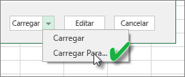
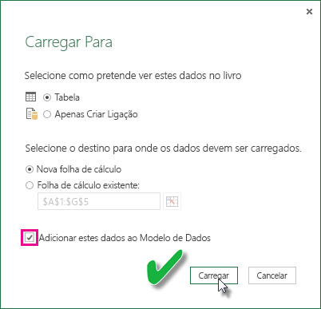

# Atualizar um conjunto de dados criado com base numa pasta do Excel numa unidade local
## O que é suportado?
No Power BI, há suporte para os recursos Atualizar Agora e Agendar Atualização para os conjuntos de dados criados por meio de pastas de trabalho do Excel importadas de uma unidade local em que o Power Query (Obter e Transformar dados no Excel 2016) ou o Power Pivot é usado para se conectar a qualquer uma das seguintes origens de dados e carregar dados no modelo de dados do Excel:  

### Power BI Gateway - Personal
* Todas as origens de dados online mostradas no Power Query.
* Todas as origens de dados locais apresentadas no Power Query, exceto o ficheiro do Hadoop (HDFS) e o Microsoft Exchange.
* Todas as origens de dados online mostradas no Power Pivot.\*
* Todas as origens de dados locais mostradas no Power Pivot, exceto o ficheiro do Hadoop (HDFS) e o Microsoft Exchange.

<!-- Refresh Data sources-->
[!INCLUDE [refresh-datasources](./includes/refresh-datasources.md)]

> **Observações:**  
> 
> * Um gateway tem de ser instalado e estar em execução para que o Power BI se ligue a origens de dados locais e atualize o conjunto de dados.
> * Ao utilizar o Excel 2013, certifique-se de que atualizou o Power Query para a versão mais recente.
> * Não há suporte para a atualização para pastas de trabalho do Excel importadas de uma unidade local em que os dados existem somente em planilhas ou tabelas vinculadas. Há suporte para a atualização para dados de folha de cálculo se eles forem armazenados e importados do OneDrive. Para saber mais, veja [Atualizar um conjunto de dados criado com base numa pasta de trabalho do Excel no OneDrive ou SharePoint Online](refresh-excel-file-onedrive.md).
> * Quando atualiza um conjunto de dados criado através de uma pasta de trabalho do Excel importada de uma unidade local, apenas os dados consultados das origens de dados são atualizados. Se alterar a estrutura do modelo de dados no Excel ou no Power Pivot, por exemplo, criar uma nova medida ou alterar o nome de uma coluna, essas alterações não serão copiadas no conjunto de dados. Se fizer essas alterações, precisa de carregar ou publicar novamente a pasta de trabalho. Se pretende fazer alterações regulares na estrutura da pasta de trabalho e quiser que elas sejam refletidas no conjunto de dados no Power BI sem a necessidade de carregar novamente, considere colocar a sua pasta de trabalho no OneDrive. O Power BI atualiza automaticamente a estrutura e os dados de planilha das pastas de trabalho armazenadas e importadas do OneDrive.
> 
> 

## Como me certifico de que os dados são carregados no modelo de dados do Excel?
Quando usa o Power Query (Obter e Transformar dados no Excel 2016) para se ligar a uma origem de dados, tem várias opções de onde carregar os dados. Para se certificar de que carrega os dados no modelo de dados, tem de selecionar a opção **Adicionar estes dados ao Modelo de Dados** na caixa de diálogo **Carregar para**.

> [!NOTE]
> As presentes imagens mostram o Excel 2016.
> 
> 

Em **Navegador**, clique em **Carregar para...**  
    

Ou então, se clicar em **Editar** no Navegador, abrirá o Editor de Consultas. Aí é possível clicar em **Fechar e Carregar para...**  
    

Em seguida, em **Carregar para**, certifique-se de que selecionou **Adicionar estes dados ao Modelo de Dados**.  
    

### E se eu usar o recurso Obter Dados Externos no Power Pivot?
Sem problemas. Sempre que usa o Power Pivot para se ligar e consultar dados de uma origem de dados local ou online, os dados são carregados automaticamente no modelo de dados.

## Como faço para agendar uma atualização?
Quando configurar um agendamento de atualização, o Power BI ligará diretamente às origens de dados através das informações de ligação e das credenciais no conjunto de dados para consultar os dados atualizados e, em seguida, carregará os dados atualizados para o conjunto de dados. Todas as visualizações em relatórios e em dashboards baseadas nesse conjunto de dados no serviço do Power BI também são atualizadas.

Para obter detalhes sobre como configurar a atualização de agendamento, veja [Configurar uma atualização agendada](refresh-scheduled-refresh.md).

## Quando acontece algo de errado
Quando ocorre algo errado, normalmente isso deve-se ao facto de o Power BI não conseguir iniciar sessão nas origens de dados ou se o conjunto de dados ligar a uma origem de dados no local, o gateway ficar offline. Certifique-se de que o Power BI consegue iniciar sessão nas origens de dados. Se uma palavra-passe que utiliza para entrar numa origem de dados for alterada ou o Power BI for desligado de uma origem de dados, certifique-se de que se inscreve novamente nas suas origens de dados nas Credenciais da Origem de Dados.

Lembre-se de deixar marcada a opção **Enviar-me e-mail de notificação de falha de atualização**. Quer saber imediatamente de uma falha numa atualização agendada.

>[!IMPORTANT]
>Não é suportada a atualização de feeds OData ligados e consultados do Power Pivot. Ao utilizar um feed OData como uma origem de dados, utilize o Power Query.

## Resolução de problemas
Por vezes, atualizar os dados pode não correr como esperado. Normalmente, este problema está ligado a um gateway. Veja os artigos de resolução de problemas de gateways para ferramentas e problemas conhecidos.

[Resolução de problemas do Gateway de dados no local](service-gateway-onprem-tshoot.md)

[Resolver problemas do Power BI Gateway - Personal](service-admin-troubleshooting-power-bi-personal-gateway.md)

## Próximos passos
Mais perguntas? [Pergunte à Comunidade do Power BI](http://community.powerbi.com/)

