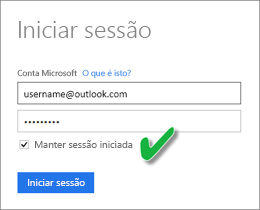
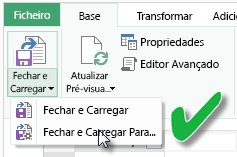

# Atualizar um conjunto de dados criado a partir de um livro do Excel no OneDrive ou SharePoint Online
Pode importar livros do Excel que estão armazenados na máquina local ou no armazenamento na cloud, como o OneDrive para Empresas ou o SharePoint Online. Abordaremos as vantagens de utilizar o armazenamento na cloud para os ficheiros do excel. Para obter mais informações sobre como importar os ficheiros do Excel para o Power BI, veja [Obter dados de ficheiros de livro do Excel](service-excel-workbook-files.md).

## Quais são as vantagens?
Importar ficheiros do OneDrive ou SharePoint Online é uma ótima maneira de garantir que o trabalho que está a fazer no Excel permanece sincronizado com o serviço Power BI. Todos os dados que carregou no modelo do ficheiro são importados para o conjunto de dados e todos os relatórios que criou no ficheiro são carregados nos Relatórios do Power BI. Caso faça alterações no ficheiro do OneDrive ou SharePoint Online, como adicionar novas medidas, alterar nomes de coluna ou editar visualizações, depois de guardá-las, essas alterações também serão atualizadas no Power BI, normalmente, em menos de uma hora.

Quando importa um livro do Excel do OneDrive pessoal, todos os dados no livro, como tabelas em folhas de cálculo e/ou dados que são carregados no modelo de dados do Excel, bem como a estrutura do modelo de dados, são importados para um novo conjunto de dados no Power BI. Quaisquer visualizações do Power View são recriadas em Relatórios. O Power BI liga-se automaticamente ao livro no OneDrive ou SharePoint Online em intervalos aproximados de sessenta minutos para verificar se há atualizações. Se o livro tiver sido alterado, o Power BI atualizará o conjunto de dados e os relatórios no serviço Power BI.

Pode atualizar o conjunto de dados no serviço Power BI. Quando atualiza manualmente ou agenda a atualização no conjunto de dados, o Power BI liga-se diretamente às origens de dados externas para consultar os dados atualizados e carrega-os no conjunto de dados. A atualização de um conjunto de dados no Power BI não atualiza os dados no livro no OneDrive ou SharePoint Online. 

## O que é suportado?
No Power BI, Atualizar Agora e Agendar Atualização são suportados para os conjuntos de dados criados através de ficheiros do Power BI Desktop importados de uma unidade local em que são utilizadas as opções Obter Dados/Editor de Consultas para ligar e carregar dados a partir de uma das seguintes origens de dados:  

### Gateway do Power BI - Pessoal
* Todas as origens de dados online mostradas no Editor de Consultas e em Obter Dados no Power BI Desktop.
* Todas as origens de dados locais mostradas no Editor de Consultas e em Obter Dados no Power BI Desktop, exceto o ficheiro do Hadoop (HDFS) e o Microsoft Exchange.

<!-- Refresh Data sources-->
[!INCLUDE [refresh-datasources](./includes/refresh-datasources.md)]

> [!NOTE]
> Um gateway tem de ser instalado e estar em execução para que o Power BI ligue a origens de dados no local e atualize o conjunto de dados.
> 
> 

## OneDrive ou OneDrive para Empresas. Qual é a diferença?
Se tiver um OneDrive pessoal e um OneDrive para Empresas, é recomendado manter todos os ficheiro que quer importar para o Power BI no OneDrive para Empresas. Eis o porquê: provavelmente utiliza duas contas diferentes para iniciar sessão.

A ligação ao OneDrive para Empresas no Power BI é normalmente contínua, porque a mesma conta com a qual inicia sessão no Power BI é geralmente a mesma conta utilizada para iniciar sessão no OneDrive para Empresas. No entanto, com o OneDrive pessoal, provavelmente inicia sessão com outra [conta Microsoft](https://account.microsoft.com).

Quando iniciar sessão com a sua conta Microsoft, certifique-se de que seleciona Manter sessão iniciada. O Power BI pode então sincronizar as atualizações feitas no ficheiro do Power BI Desktop com os conjuntos de dados no Power BI  
    

Se fizer alterações no ficheiro no OneDrive que não podem ser sincronizadas com o conjunto de dados ou relatórios no Power BI por as suas credenciais de conta Microsoft terem sido alteradas, terá de se ligar e importar o ficheiro novamente do OneDrive pessoal.

## Opções de ligação ao ficheiro do Excel
Quando se liga a um livro do Excel no OneDrive para Empresas ou SharePoint Online, terá duas opções sobre como inserir o conteúdo do seu livro no Power BI.

[**Importar dados do Excel no Power BI**](service-excel-workbook-files.md#import-or-connect-to-an-excel-workbook-from-power-bi) – Ao importar um livro do Excel através do OneDrive para Empresas ou SharePoint Online, este funcionará da forma descrita acima.

[**Ligar, gerir e visualizar o Excel no Power BI**](service-excel-workbook-files.md#one-excel-workbook--two-ways-to-use-it) – Ao usar esta opção, cria uma ligação direta do Power BI ao seu livro no OneDrive para Empresas ou SharePoint Online.

Quando se liga a um livro do Excel dessa forma, não é criado um conjunto de dados no Power BI. No entanto, o livro irá aparecer no serviço Power BI em Relatórios com um ícone do Excel junto ao nome. Ao contrário do Excel Online, quando se liga ao livro do Power BI, caso existam neste ligações a origens de dados externas que carregam dados no modelo de dados do Excel, é possível configurar um agendamento de atualização.

Quando configura um agendamento de atualização dessa forma, a única diferença é que os dados atualizados são inseridos no modelo de dados do livro no OneDrive ou SharePoint Online, em vez de um conjunto de dados no Power BI.

## Como me certifico de que os dados são carregados no modelo de dados do Excel?
Quando usa o Power Query (Obter e Transformar dados no Excel 2016) para se ligar a uma origem de dados, tem várias opções de onde carregar os dados. Para se certificar de que carrega os dados no modelo de dados, tem de selecionar a opção **Adicionar estes dados ao Modelo de Dados** na caixa de diálogo **Carregar para**.

> [!NOTE]
> As presentes imagens mostram o Excel 2016.
> 
> 

Em **Navegador**, clique em **Carregar para...**  
    

Ou então, se clicar em **Editar** no Navegador, abrirá o Editor de Consultas. Aí é possível clicar em **Fechar e Carregar para...**  
    

Em seguida, em **Carregar para**, certifique-se de que selecionou **Adicionar estes dados ao Modelo de Dados**.  
    

### E se eu usar o recurso Obter Dados Externos no Power Pivot?
Sem problemas. Sempre que usa o Power Pivot para se ligar e consultar dados de uma origem de dados local ou online, os dados são carregados automaticamente no modelo de dados.

## Como faço para agendar uma atualização?
Quando configurar um agendamento de atualização, o Power BI ligará diretamente às origens de dados através das informações de ligação e das credenciais no conjunto de dados para consultar os dados atualizados e, em seguida, carregará os dados atualizados para o conjunto de dados. Todas as visualizações em relatórios e em dashboards baseadas nesse conjunto de dados no serviço do Power BI também são atualizadas.

Para obter detalhes sobre como configurar a atualização de agendamento, veja [Configurar uma atualização agendada](refresh-scheduled-refresh.md).

## Quando acontece algo de errado
Quando ocorre algo errado, normalmente isso deve-se ao facto de o Power BI não conseguir iniciar sessão nas origens de dados ou se o conjunto de dados ligar a uma origem de dados no local, o gateway ficar offline. Certifique-se de que o Power BI consegue iniciar sessão nas origens de dados. Se uma palavra-passe que utiliza para entrar numa origem de dados for alterada ou o Power BI for desligado de uma origem de dados, certifique-se de que se inscreve novamente nas suas origens de dados nas Credenciais da Origem de Dados.

Lembre-se de deixar marcada a opção **Enviar-me e-mail de notificação de falha de atualização**. Irá querer saber de imediato sobre uma falha de uma atualização agendada.

## Notas importantes
\*Não há suporte para a atualização de feeds OData ligados ao Power Pivot e consultados por meio do mesmo. Ao utilizar um feed OData como uma origem de dados, utilize o Power Query.

## Resolução de problemas
Por vezes, atualizar os dados pode não correr como esperado. Normalmente, este problema está ligado a um gateway. Veja os artigos de resolução de problemas de gateways para ferramentas e problemas conhecidos.

[Resolução de problemas do Gateway de dados no local](service-gateway-onprem-tshoot.md)

[Resolver problemas do Power BI Gateway - Personal](service-admin-troubleshooting-power-bi-personal-gateway.md)

Mais perguntas? [Pergunte à Comunidade do Power BI](http://community.powerbi.com/)

