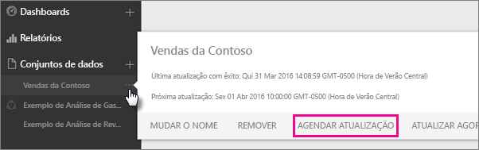
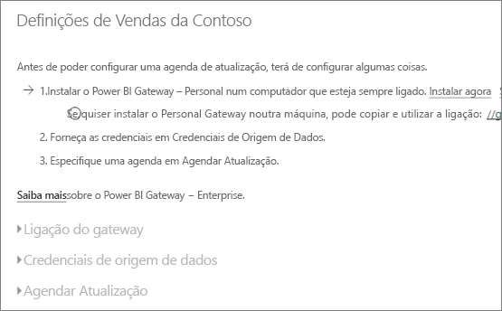
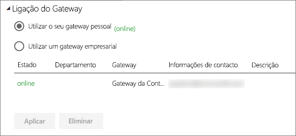
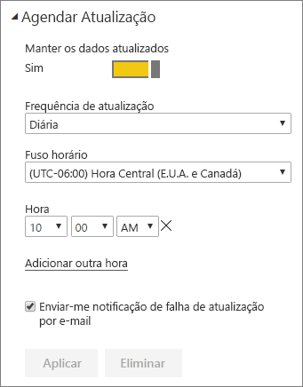

# Configurar a atualização agendada

>[!NOTE]
>Após dois meses de inatividade, a atualização agendada no conjunto de dados é colocada em pausa. Para obter mais informações, veja [*Atualização agendada*](#scheduled-refresh) mais à frente neste artigo.

Este artigo descreve as opções disponíveis para a atualização agendada do [Gateway de dados no local (modo pessoal)](service-gateway-personal-mode.md) e do [Gateway de dados no local](service-gateway-onprem.md). Irá especificar opções de atualização nas seguintes áreas do serviço Power BI: **Ligação do gateway**, **Credenciais de origem de dados** e **Atualização agendada**. Analisaremos cada uma destas áreas individualmente. Para obter mais informações sobre a atualização de dados, incluindo as limitações no agendamento de atualizações, veja [Atualização de dados](refresh-data.md#data-refresh).

Para aceder ao ecrã **Atualização agendada**:

1. No painel de navegação, em **Conjuntos de dados**, selecione **Mais opções** (...) junto a um conjunto de dados listado.
2. Selecione **Agendar Atualização**.

    

## Ligação do gateway

Aqui verá diferentes opções, dependendo de se tem um gateway pessoal ou empresarial, online e disponível.

Se nenhum gateway estiver disponível, a opção **Ligação do gateway** estará desativada. Também verá uma mensagem a indicar como instalar o gateway pessoal.

Se tiver um gateway pessoal configurado, este estará disponível para seleção, caso esteja online. Será apresentado offline caso não esteja disponível.

Também poderá selecionar o gateway empresarial, se houver um disponível. Só verá um gateway empresarial disponível se a sua conta estiver listada no separador **Utilizadores** da origem de dados configurada para determinado gateway.

## Credenciais da origem de dados

### Gateway do Power BI - Pessoal

Se estiver a utilizar o gateway pessoal para atualizar os dados, terá de fornecer as credenciais para ligar-se à origem de dados de back-end. Se estiver ligado a um pacote de conteúdos de um serviço online, as credenciais introduzidas para ligar-se serão transferidas para a atualização agendada.

Só terá de iniciar sessão numa origem de dados na primeira vez que utilizar a atualização nesse conjunto de dados. Uma vez introduzidas, essas credenciais são mantidas com o conjunto de dados.

> [!NOTE]
> Para alguns métodos de autenticação, se a palavra-passe utilizada para iniciar sessão numa origem de dados expirar ou for alterada, também terá de alterá-la para a origem de dados em **Credenciais de origem de dados**.

Quando ocorre algum erro, o problema geralmente tem algo a ver com o gateway estar offline porque não foi possível iniciar sessão no Windows e iniciar o serviço ou o Power BI não conseguiu ligar-se às origens de dados para consultar dados atualizados. Se a atualização falhar, verifique as configurações do conjunto de dados. Se o serviço de gateway estiver offline, verá o erro em **Estado**. Se o Power BI não conseguir iniciar sessão nas origens de dados, será apresentado um erro em Credenciais da Origem de Dados.

### Gateway de dados no local

Se estiver a utilizar o Gateway de dados no local para atualizar os dados, não será necessário fornecer credenciais, uma vez que são definidas para a origem de dados pelo administrador do gateway.

> [!NOTE]
> Ao ligar ao SharePoint no local para a atualização de dados, o Power BI suporta apenas os mecanismos de autenticação *Anónimo*, *Básico* e *Windows (NTLM/Kerberos)*. O Power BI não suporta *ADFS* nem nenhum mecanismo *Autenticação Baseada em Formulários* de atualização de dados de origens de dados do SharePoint no local.

## Atualização agendada

A secção **Atualização agendada** é o local onde define a frequência e os intervalos de tempo para atualizar o conjunto de dados. Algumas origens de dados não precisam que um gateway seja configurável para a atualização, mas outras origens de dados precisam de um gateway.

Defina o controlo de deslize **Manter os dados atualizados** para **Ativado** para configurar as definições.

> [!NOTE]
> O objetivo é iniciar a atualização no espaço de 15 minutos do intervalo de tempo agendado, mas pode ocorrer um atraso de até uma hora, se o serviço não conseguir alocar os recursos necessários mais cedo.

> [!NOTE]
> Após dois meses de inatividade, a atualização agendada no conjunto de dados é colocada em pausa. Um conjunto de dados é considerado inativo quando nenhum utilizador tiver visitado qualquer dashboard ou relatório incorporado no conjunto de dados. Nessa altura, é enviado um e-mail ao proprietário do conjunto de dados, a indicar que a atualização agendada foi interrompida. O agendamento de atualizações do conjunto de dados apresentará o estado **desativado**. Para retomar a atualização agendada, basta visitar novamente qualquer dashboard ou relatório incorporado no conjunto de dados.

## O que tem suporte?

Alguns conjuntos de dados são suportados em gateways diferentes para a atualização agendada. Aqui está uma referência para entender o que está disponível.

### Gateway do Power BI - Pessoal

**Power BI Desktop**

* Todas as origens de dados online apresentadas no Editor de Consultas e em **Obter Dados** no Power BI Desktop.
* Todas as origens de dados locais apresentadas no Editor de Consultas e em **Obter Dados** no Power BI Desktop, exceto o ficheiro do Hadoop (HDFS) e o Microsoft Exchange.

**Excel**

* Todas as origens de dados online mostradas no Power Query.
* Todas as origens de dados locais apresentadas no Power Query, exceto o ficheiro do Hadoop (HDFS) e o Microsoft Exchange.
* Todas as origens de dados online apresentadas no Power Pivot.
* Todas as origens de dados locais apresentadas no Power Pivot, exceto o ficheiro do Hadoop (HDFS) e o Microsoft Exchange.

> [!NOTE]
> No Excel 2016 e posterior, o Power Query é agora listado na secção **Dados** do friso, em **Obter e Transformar Dados**.

### Power BI Gateway

Para obter informações sobre as origens de dados suportadas, veja [Origens de dados do Power BI](power-bi-data-sources.md).

## Resolução de problemas
Por vezes, atualizar os dados pode não correr como esperado. Normalmente, este problema está ligado a um gateway. Veja os artigos de resolução de problemas de gateways para ferramentas e problemas conhecidos.

- [Resolução de problemas do Gateway de dados no local](service-gateway-onprem-tshoot.md)
- [Resolver problemas do Power BI Gateway - Personal](service-admin-troubleshooting-power-bi-personal-gateway.md)

## Próximos passos

- [Atualização de dados no Power BI](refresh-data.md)  
- [Power BI Gateway - Personal](service-gateway-personal-mode.md)  
- [Gateway de dados no local (modo pessoal)](service-gateway-onprem.md)  
- [Resolução de problemas do Gateway de dados no local](service-gateway-onprem-tshoot.md)  
- [Resolver problemas do Power BI Gateway - Personal](service-admin-troubleshooting-power-bi-personal-gateway.md)  

Mais perguntas? [Experimente perguntar à Comunidade do Power BI](https://community.powerbi.com/)