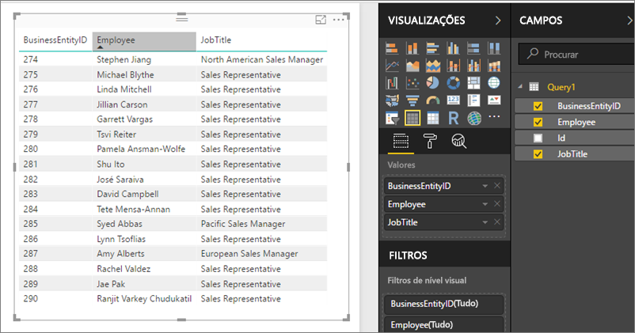

# Aceder a conjuntos de dados partilhados como feeds OData no Power BI Report Server
Pode aceder a conjuntos de dados partilhados a partir do Power BI Desktop com um feed do OData.

1. Com o URL de feed OData, estabelece a ligação à origem do OData.
   
    
2. Depois de levar os dados para o Power BI Desktop, pode modificá-los no Editor de Consultas.
   
    
3. Agora, pode utilizar os dados na conceção de relatórios.
   
    

Certifique-se de que utiliza as **Opções Avançadas** para que possa ativar as Colunas de Tipo Aberto e formatar as colunas corretamente no Power Query para satisfazer as suas necessidades.

Leia mais sobre [como se ligar aos feeds OData no Power BI Desktop](../desktop-connect-odata.md).

Mais perguntas? [Experimente perguntar à Comunidade do Power BI](https://community.powerbi.com/)

