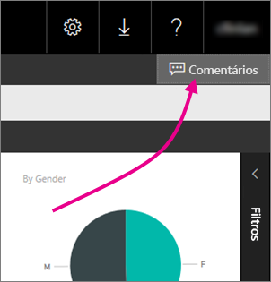
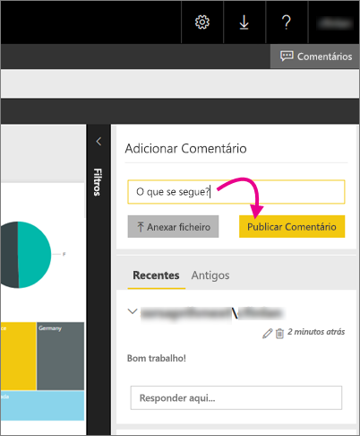

# Adicionar comentários a um relatório no servidor de relatórios - Power BI Report Server
Pode adicionar comentários a relatórios, incluindo relatórios do Power BI, no portal Web de um servidor de relatórios. Os comentários permanecem no relatório, e qualquer pessoa com as permissões corretas pode ver os comentários do relatório. Veja a secção [Permissões](#permissions) abaixo para obter detalhes.

## Adicionar ou ver os comentários
1. Abra um relatório paginado ou do Power BI num servidor de relatórios.
2. No canto superior direito, selecione **Comentários**.
   
    
   
    No painel Comentários, pode ver quaisquer comentários existentes.
3. Escreva o seu comentário e selecione **Publicar Comentário**.
   
    
   
    Mostra o comentário no painel do portal Web, com quaisquer comentários anteriores. Não são apresentados com o relatório nas aplicações móveis do Power BI.
   
   > [!TIP]
   > Sabia que? Pode [anotar relatórios do Power BI nas aplicações móveis do Power BI](../consumer/mobile/mobile-annotate-and-share-a-tile-from-the-mobile-apps.md) e partilhar os relatórios anotados com outras pessoas.
   > 
   > 

## Permissões
Consoante as suas permissões, pode:

* Não ver os comentários.
* Ver todos os comentários e publicar, editar e eliminar os seus comentários.
* Ver todos os comentários; publicar, editar e eliminar os seus próprios comentários; e eliminar os comentários de outras pessoas.

## Passos seguintes
* [O que é o Power BI Report Server?](get-started.md)  

Mais perguntas? [Experimente perguntar à Comunidade do Power BI](https://community.powerbi.com/)

