# <a name="configure-power-bi-report-server-with-azure-application-proxy"></a>Configurar o Power BI Report Server com o Proxy de Aplicações do Azure

Este artigo aborda a utilização do Proxy de Aplicações do Azure Active Directory para se ligar ao Power BI Report Server e ao SQL Server Reporting Services (SSRS) 2016 e posterior. Através desta integração, os utilizadores que estão fora da rede empresarial podem aceder aos relatórios Reporting Services e do Power BI Report Server a partir dos browsers cliente e estar protegidos pelo Azure Active Directory (AAD). Leia mais sobre o acesso remoto às aplicações no local através do [Proxy de Aplicações do Azure Active Directory](/azure/active-directory/manage-apps/application-proxy).

## <a name="environment-details"></a>Detalhes do ambiente

Utilizámos estes valores no exemplo que criámos. 

- Domínio: umacontoso.com
- Power BI Report Server: PBIRSAZUREAPP.umacontoso.com
- Origem de Dados do SQL Server: SQLSERVERAZURE.umacontoso.com

## <a name="configure-power-bi-report-server"></a>Configurar o Power BI Report Server

Depois de instalar o Power BI Report Server (por exemplo, numa VM do Azure), configure o serviço Web do Power BI Report Server e os URLs do portal Web com os passos seguintes:

1. Crie regras de entrada e de saída na firewall da VM para a Porta 80 (Porta 443 se tiver URLs https configurados). Além disso, crie regras de entrada e de saída para a VM do Azure no portal do Azure para o protocolo TCP – Porta 80.
2. O nome DNS configurado para a VM no nosso ambiente é `pbirsazureapp.eastus.cloudapp.azure.com`.
3. Configure o serviço Web externo e o URL do portal Web do Power BI Report Service ao selecionar o separador **Avançado** > botão **Adicionar** > **Escolher Nome de Cabeçalho do Anfitrião** e adicionar o nome do anfitrião (nome DNS) conforme aqui mostrado.

    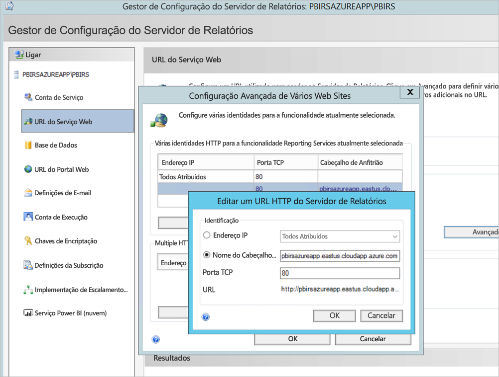

1. Executámos o passo anterior para as secções do serviço Web e do portal Web e obtivemos os URLs registados no Gestor de Configuração do Servidor de Relatórios:

    - `https://pbirsazureapp.eastus.cloudapp.azure.com/ReportServer`
    - `https://pbirsazureapp.eastus.cloudapp.azure.com/Reports`

2. No portal do Azure, vemos dois endereços IP para a VM na secção de rede 

    - **IP Público**. 
    - **IP Privado**. 
    
    O endereço IP Público é utilizado para o acesso a partir de fora da máquina virtual.

3. Por isso, adicionámos a entrada do ficheiro anfitrião à VM (Power BI Report Server) para incluir o endereço IP Público e o nome de anfitrião `pbirsazureapp.eastus.cloudapp.azure.com`.
4. Note que ao reiniciar a VM, o endereço IP dinâmico poderá mudar e poderá ter de adicionar o endereço IP correto novamente no ficheiro anfitrião. Para evitar isso, pode definir o endereço IP Público como estático no portal do Azure.
5. Deverá conseguir aceder com êxito aos URLs do serviço Web e do portal Web após fazer as alterações mencionadas acima.
6. Ao acedermos ao URL `https://pbirsazureapp.eastus.cloudapp.azure.com/ReportServer` no servidor, são-nos pedidas as credenciais três vezes e aparece um ecrã vazio.
7. Adicione a seguinte entrada de registo:

    Chave do registo `HKEY\_LOCAL\_MACHINE \SYSTEM\CurrentControlset\Control \Lsa\ MSV1\_0`

1. Adicione uma nova regra `BackConnectionHostNames`, um valor de cadeias múltiplas e indique o nome do anfitrião `pbirsazureapp.eastus.cloudapp.azure.com`.

Depois disso, podemos também aceder aos URLs no servidor.

## <a name="configure-power-bi-report-server-to-work-with-kerberos"></a>Configurar o Power BI Report Server para funcionar com Kerberos

### <a name="1-configure-the-authentication-type"></a>1. Configurar o tipo de autenticação

É necessário configurar o tipo de autenticação do servidor de relatórios para permitir a delegação restrita de Kerberos. Esta configuração é feita no ficheiro **rsreportserver.config**.

No ficheiro rsreportserver.config, localize a secção **Autenticação/AuthenticationTypes**.

Queremos garantir que RSWindowsNegotiate está listado e que é a primeira opção na lista de tipos de autenticação. Deverá ser semelhante ao seguinte.

```
<AuthenticationTypes>

    <RSWindowsNegotiate/>

</AuthenticationTypes>
```

Se tiver de alterar o ficheiro de configuração, **feche e reinicie o serviço do servidor de relatórios** no Gestor de Configuração do Servidor de Relatórios para garantir que as alterações entram em vigor.

### <a name="2-register-service-principal-names-spns"></a>2. Registar os nomes do principal do serviço (SPNs)

Abra a linha de comandos como administrador e execute os seguintes passos.

Registe os seguintes SPNs na **Conta de serviço do Power BI Report Server** com os seguintes comandos

```
setspn -s http/ Netbios name\_of\_Power BI Report Server\_server<space> Power BI Report Server\_ServiceAccount

setspn -s http/ FQDN\_of Power BI Report Server\_server<space> Power BI Report Server\_ServiceAccount
```

Registe os seguintes SPNs na conta de serviço do SQL Server com os seguintes comandos (para uma instância predefinida do SQL Server):

```
setspn -s MSSQLSVC/FQDN\_of\_SQL\_Server: 1433 (PortNumber) <SQL service service account>

setspn -s MSSQLSVC/FQDN\_of\_SQL\_Server<SQL service service account>
```

### <a name="3-configure-delegation-settings"></a>3. Configurar as definições de delegação

Temos de configurar as definições de delegação na conta de serviço do servidor de relatórios.

1. Abra Utilizadores e Computadores do Active Directory.
2. Abra as Propriedades da conta de serviço do servidor de relatórios em Utilizadores e Computadores do Active Directory.
3. Queremos configurar a delegação restrita com trânsito de protocolo. Com a delegação restrita, temos de ser explícitos em relação aos serviços que queremos delegar.
4. Clique com o botão direito do rato na **conta de serviço do servidor de relatórios** e selecione **Propriedades**.
5. Selecione o separador **Delegação**.
6. Selecione **Confiar neste utilizador para delegação apenas para serviços especificados**.
7. Selecione **Utilizar qualquer protocolo de autenticação**.
8. Em **Serviços aos quais esta conta pode apresentar credenciais delegadas**: selecione **Adicionar**.
9. Na nova caixa de diálogo, selecione **Utilizadores ou Computadores**.
10. Introduza a **conta de serviço do SQL Server** e selecione **OK**.

    Começa por MSSQLSVC.

1. Adicione os SPNs.
2. Selecione **OK**. Agora, deverá ver o SPN na lista.

Estes passos ajudam a configurar o Power BI Report Server para que funcione com o mecanismo de autenticação Kerberos e a estabelecer a ligação de teste à origem de dados no computador local.

## <a name="configure-azure-application-proxy-connector"></a>Configurar o conector do Proxy de Aplicações do Azure

Veja o artigo para obter a [configuração relacionada com o conector do Proxy de Aplicações](/azure/active-directory/manage-apps/application-proxy-add-on-premises-application#add-an-on-premises-app-to-azure-ad)

Instalámos o conector do Proxy de Aplicações no Power BI Report Server, mas pode configurá-lo num servidor em separado e garantir que a delegação é configurada adequadamente.

### <a name="ensure-the-connector-is-trusted-for-delegation"></a>Garantir que o Conector é fidedigno para delegação

Garanta que o Conector é fidedigno para delegação no SPN adicionado à conta do conjunto aplicacional do servidor de relatórios.

Configure a Delegação Restrita de Kerberos (KCD) para que o serviço do Proxy de Aplicações do Azure Active Directory possa delegar as identidades de utilizador à conta do conjunto aplicacional do servidor de relatórios. Configure a KCD ao ativar o conector do Proxy de Aplicações para obter permissões Kerberos para os utilizadores que foram autenticados no Azure Active Directory. Em seguida, esse servidor passa o contexto para a aplicação de destino ou, neste caso, para o Power BI Report Server.

Para configurar a KCD, repita os seguintes passos para cada computador do conector.

1. Inicie sessão num controlador de domínio como administrador de domínio e, em seguida, abra **Utilizadores e Computadores do Active Directory**.
2. Localize o computador onde o conector está a ser executado.
3. Faça duplo clique no computador e selecione o separador **Delegação**.
4. Configure as definições de delegação como **Confiar neste computador para delegação apenas aos serviços especificados**. Em seguida, selecione **Utilizar qualquer protocolo de autenticação**.
5. Selecione **Adicionar** e, em seguida, **Utilizadores ou Computadores**.
6. Introduza a conta de serviço que está a utilizar para o Power BI Report Server. Esta é a conta à qual adicionou o SPN na configuração do servidor de relatórios.
7. Clique em **OK**. 
8. Para guardar as alterações, clique novamente em **OK**.

## <a name="publish-through-azure-ad-application-proxy"></a>Publicar através do Proxy de Aplicações do Azure Active Directory

Agora está pronto para configurar o Proxy de Aplicações do Azure Active Directory.

Publique o Power BI Report Server através do Proxy de Aplicações com as seguintes definições. Para obter as instruções passo a passo sobre como publicar uma aplicação através do Proxy de Aplicações, veja [Publicar aplicações com o Proxy de Aplicações do Azure Active Directory](/azure/active-directory/manage-apps/application-proxy-add-on-premises-application#add-an-on-premises-app-to-azure-ad).

- **URL interno**: introduza o URL do servidor de relatórios ao qual o conector pode aceder na rede da empresa. Confirme que este URL está acessível a partir do servidor no qual está instalado o conector. Uma das melhores práticas consiste em utilizar um domínio de nível superior como o `https://servername/` para evitar problemas com os subcaminhos publicados através do Proxy de Aplicações. Por exemplo, utilize `https://servername/` e não `https://servername/reports/` ou `https://servername/reportserver/`. Configurámos o nosso ambiente com `https://pbirsazureapp.eastus.cloudapp.azure.com/`.

    > [!NOTE]
    > Recomendamos que utilize uma ligação HTTPS segura ao servidor de relatórios. Para obter informações sobre os procedimentos, veja [Configurar as ligações SSL num servidor de relatórios no modo nativo](/sql/reporting-services/security/configure-ssl-connections-on-a-native-mode-report-server).

- **URL externo**: introduza o URL público ao qual a aplicação móvel do Power BI se ligará. Por exemplo, pode ser semelhante a `https://reports.contoso.com` caso um domínio personalizado esteja a ser utilizado. Para utilizar um domínio personalizado, carregue um certificado para o domínio e aponte um registo DNS para o domínio msappproxy.net predefinido da aplicação. Para obter os passos detalhados, veja [Trabalhar com domínios personalizados no Proxy de Aplicações do Azure Active Directory](/azure/active-directory/manage-apps/application-proxy-configure-custom-domain).

Configurámos o URL externo como `https://pbirsazureapp-umacontoso2410.msappproxy.net/` para o nosso ambiente.

- **Método de Pré-autenticação**: Azure Active Directory.
- **Grupo de Conectores:** Predefinição.

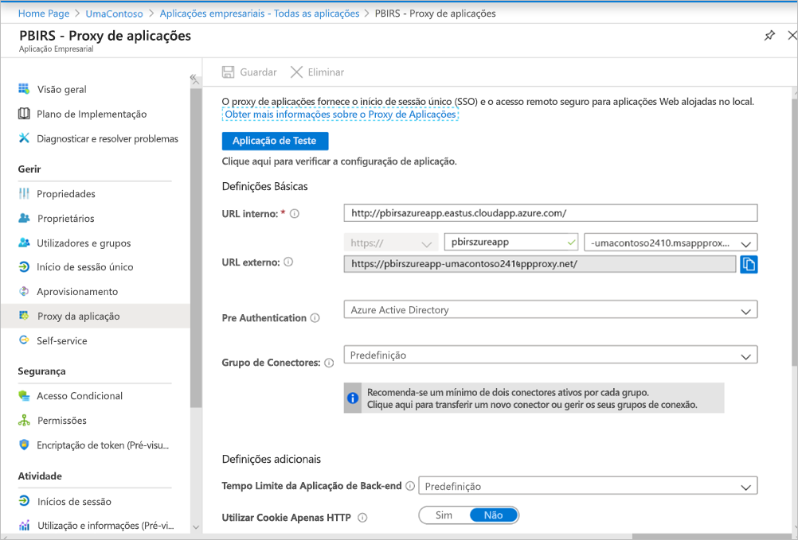

Não fizemos alterações na secção **Definições Adicionais**. Está configurada para funcionar com as opções predefinidas.

> [!IMPORTANT]
> Ao configurar o proxy da aplicação, tenha em atenção que a propriedade **Tempo Limite da Aplicação de Back-end** está definida como **Predefinição** (85 segundos). Se tiver relatórios cuja execução demora mais de 85 segundos, defina esta propriedade como **Longo** (180 segundos), que é o valor de tempo limite mais elevado possível. Quando configurados com a propriedade definida como **Longo**, todos os relatórios têm de ser concluídos dentro de 180 segundos, caso contrário excedem o limite de tempo e resultam num erro.


### <a name="configure-single-sign-on"></a>Configurar o início de sessão único

Uma vez publicada a aplicação, configure as definições de início de sessão único com estes passos:

1. Na página da aplicação no portal, selecione **Início de sessão único**.
2. Em **Modo de Início de Sessão Único**, selecione **Autenticação Integrada do Windows**.
3. Defina **SPN da Aplicação Interna** para o valor que definiu anteriormente. Pode identificar este valor com estes passos:

    - Experimente executar um relatório ou uma ligação de teste à origem de dados para que seja criada uma permissão Kerberos.
    - Depois de executar com êxito o relatório/ligação de teste, abra a linha de comandos e execute o comando: `klist`. Na secção de resultados, deverá ver uma permissão com o SPN `http/`. Se for igual ao SPN que configurou com o Power BI Report Server, utilize esse SPN nesta secção.

1. Escolha a **Identidade Delegada de Início de Sessão** do conector para utilizar em nome dos utilizadores. Para obter mais informações, veja [Trabalhar com identidades no local e na cloud diferentes](/azure/active-directory/manage-apps/application-proxy-configure-single-sign-on-with-kcd#working-with-different-on-premises-and-cloud-identities).

    Recomendamos utilizar o nome Principal de Utilizador. No nosso exemplo, configurámo-lo para funcionar com a opção **Nome Principal de Utilizador**:

    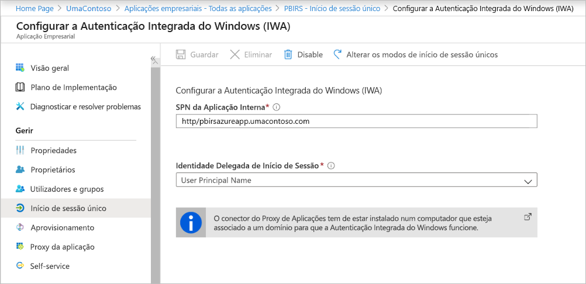

1. Clique em **Guardar** para guardar as alterações.

### <a name="finish-setting-up-your-application"></a>Terminar a configuração da aplicação

Para terminar a configuração da aplicação, aceda à secção **Utilizadores e grupos** e atribua os utilizadores que poderão aceder a esta aplicação.

1. Configure a secção **Autenticação** do Registo de aplicações da aplicação Power BI Report Server como se segue para **URLs de redirecionamento** e **Definições avançadas**:

    - Crie um novo URL de Redirecionamento e configure-o com **Tipo** = **Web** e **URI de Redirecionamento** = `https://pbirsazureapp-umacontoso2410.msappproxy.net/`
    - Na secção **Definições Avançadas**, configure o **URL de Fim de Sessão** como `https://pbirsazureapp-umacontoso2410.msappproxy.net/?Appproxy=logout`

    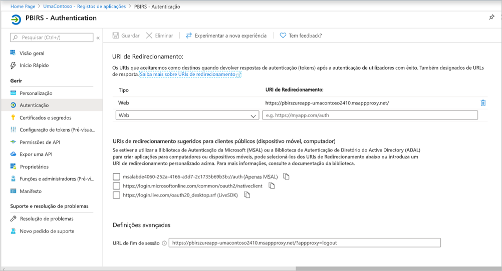

1. Continue a configurar a secção **Autenticação** do Registo de aplicações da aplicação Power BI Report Server como se segue para **Concessão implícita**, **Tipo de cliente predefinido** e **Tipos de conta suportados**:

    - Defina **Concessão implícita** como **Tokens de ID**.
    - Defina **Tipo de cliente predefinido** como **Não**.
    - Defina **Tipos de conta suportados** como **Contas apenas neste diretório organizacional (apenas UmaContoso – Inquilino único)** .

    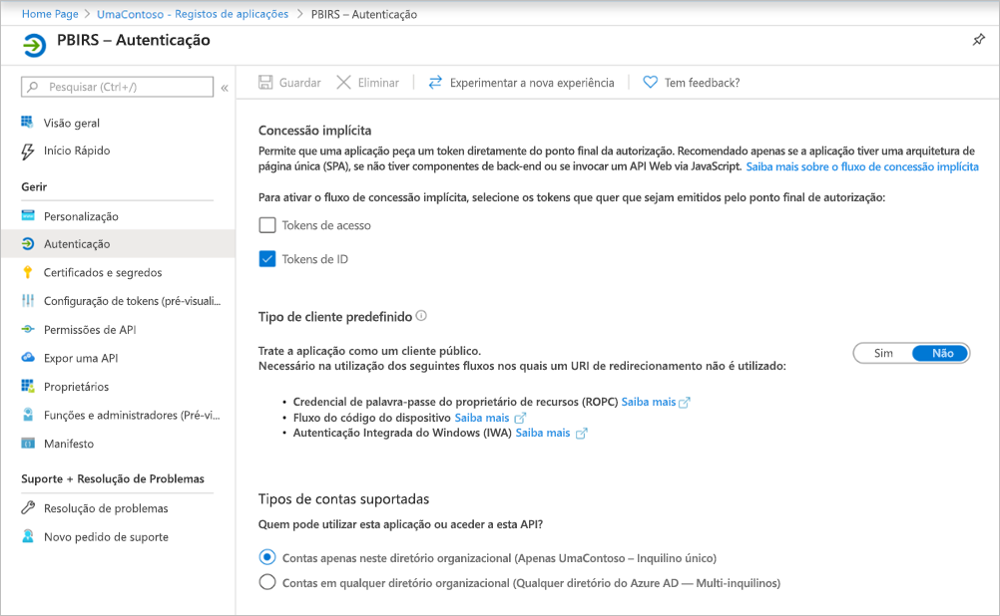

1. Após ter configurado o início de sessão único e o URL `https://pbirsazureapp-umacontoso2410.msappproxy.net` estar a funcionar, temos de garantir que a conta em que iniciamos sessão está sincronizada com a conta que tem as permissões no Power BI Report Server.

1. Primeiro, temos de configurar o domínio personalizado que planeamos utilizar no início de sessão e, em seguida, deve ser verificado.
2. Neste caso, comprámos um domínio chamado umacontoso.com e configurámos a zona DNS com as entradas. Também pode experimentar utilizar o domínio `onmicrosoft.com` e sincronizá-lo com o AD no local.

    Veja o artigo [Tutorial: Mapear um nome DNS personalizado já existente para o Serviço de Aplicações do Azure](/Azure/app-service/app-service-web-tutorial-custom-domain) para referência.

1. Depois de verificar com êxito a entrada DNS do domínio personalizado, deverá ver o estado como **Verificado**, correspondente ao domínio no portal.

    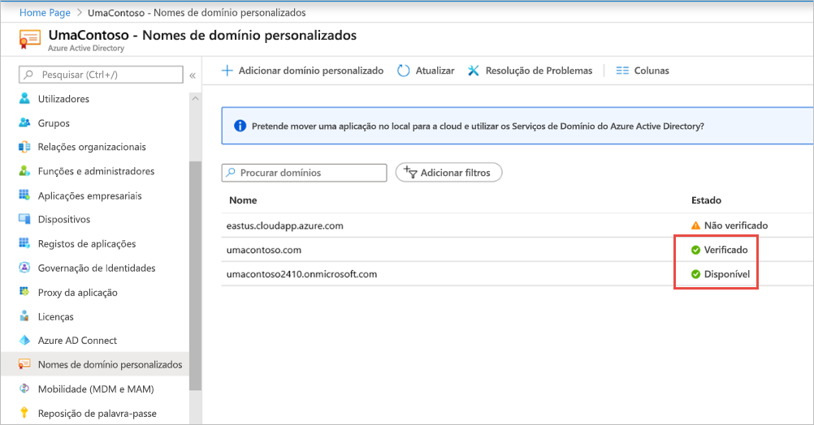

1. Instale o Microsoft Azure AD Connect no servidor do controlador de domínio e configure-o para se sincronizar com o Azure Active Directory.

    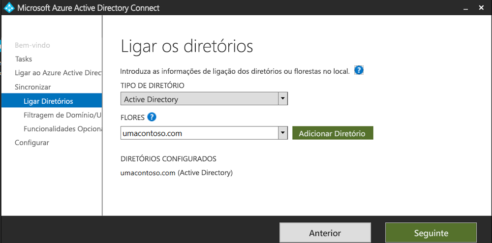

1. Quando o Azure Active Directory estiver sincronizado com o AD no local, poderá ver o seguinte estado no portal do Azure:

    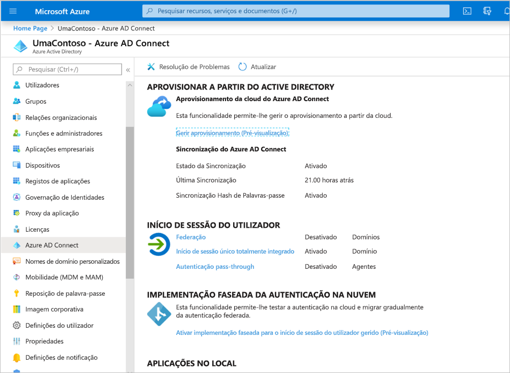

1. Uma vez concluída a sincronização, abra os domínios e as confianças do AD no Controlador de domínio. Clique com o botão direito em Domínios e Confianças do Active Directory > Propriedades e adicione o UPN. No nosso ambiente, `umacontoso.com` é o domínio personalizado que comprámos.

1. Depois de adicionar o UPN, deverá ser capaz de configurar as contas de utilizador com o UPN para que a conta do Azure Active Directory e a conta do AD no local sejam ligadas e para que o token seja reconhecido durante a autenticação.

    O nome de domínio do AD é listado na lista pendente da secção **Nome de início de sessão do utilizador** depois de completar o passo anterior. Configure o nome de utilizador e selecione o domínio na lista pendente na secção **Nome de início de sessão do utilizador** das propriedades de utilizador do AD.

    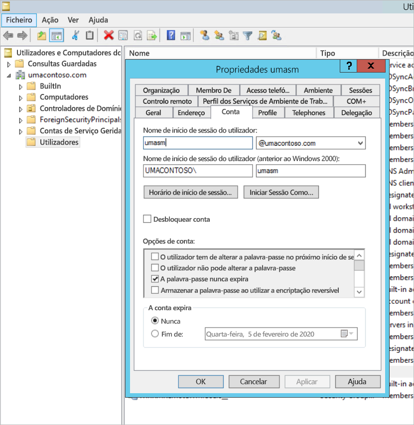

1. Uma vez concluída a sincronização do AD, poderá ver a conta do AD no local no portal do Azure na secção **Utilizadores e Grupos** da aplicação. A origem da conta é o **Windows Server AD**.
2. Iniciar sessão com `umasm@umacontoso.com` será equivalente a utilizar as credenciais `Umacontoso\umasm` do Windows.

    Os passos anteriores serão aplicáveis se tiver o AD no local configurado e se estiver a planear sincronizá-lo com o Azure Active Directory.

    Início de sessão com êxito depois de implementar os passos acima:

    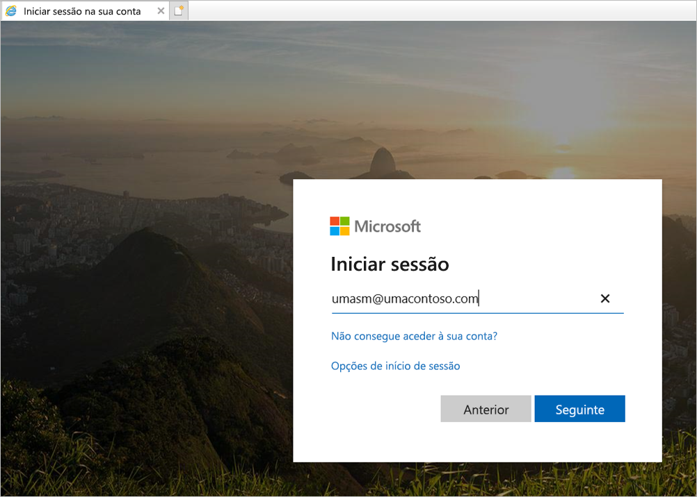

    Em seguida, é apresentado o portal Web:

    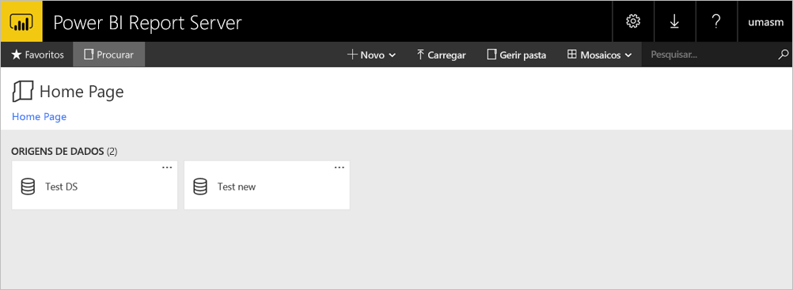

    Com uma ligação de teste estabelecida com êxito à origem de dados com Kerberos como autenticação:

    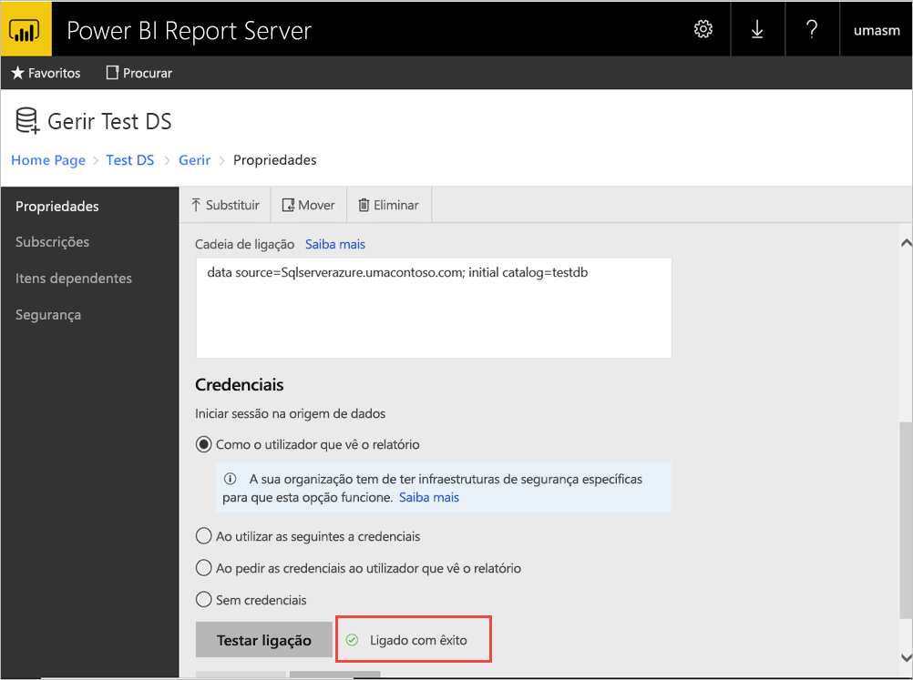

## <a name="access-from-power-bi-mobile-apps"></a>Aceder a partir de aplicações móveis do Power BI

### <a name="configure-the-application-registration"></a>Configurar o registo de aplicação

Para poder ligar a aplicação móvel do Power BI e aceder ao Power BI Report Server, tem de configurar o registo de aplicação que foi criado automaticamente na secção [Publicar através do Proxy de Aplicações do Azure Active Directory](#publish-through-azure-ad-application-proxy) deste artigo.

> [!NOTE]
> Se utilizar políticas de acesso condicional que exijam que a aplicação móvel do Power BI seja uma aplicação cliente aprovada, não poderá utilizar o Proxy de Aplicações do Azure Active Directory para ligar a aplicação móvel do Power BI ao Power BI Report Server.

1. Na página **Descrição geral** do Azure Active Directory, selecione **Registos de aplicações**.
2. No separador **Todas as aplicações**, procure a aplicação que criou para o Power BI Report Server.
3. Selecione a aplicação e, em seguida, **Autenticação**.
4. Adicione os seguintes URIs de Redirecionamento com base na plataforma que está a utilizar.

    Quando estiver a configurar a aplicação do Power BI Mobile para **iOS**, adicione os seguintes URIs de Redirecionamento do tipo Cliente Público (Dispositivos Móveis e Ambiente de Trabalho):

    - `msauth://code/mspbi-adal%3a%2f%2fcom.microsoft.powerbimobile`
    - `msauth://code/mspbi-adalms%3a%2f%2fcom.microsoft.powerbimobilems`
    - `mspbi-adal://com.microsoft.powerbimobile`
    - `mspbi-adalms://com.microsoft.powerbimobilems`

    Quando estiver a configurar a aplicação do Power BI Mobile para **Android**, adicione os seguintes URIs de Redirecionamento do tipo Cliente Público (Dispositivos Móveis e Ambiente de Trabalho):

    - `urn:ietf:wg:oauth:2.0:oob`
    - `mspbi-adal://com.microsoft.powerbimobile`
    - `msauth://com.microsoft.powerbim/g79ekQEgXBL5foHfTlO2TPawrbI%3D`
    - `msauth://com.microsoft.powerbim/izba1HXNWrSmQ7ZvMXgqeZPtNEU%3D`

    Quando estiver a configurar a aplicação do Power BI Mobile para iOS e para Android, adicione os seguintes URIs de Redirecionamento do tipo Cliente Público (Dispositivos Móveis e Ambiente de Trabalho) à lista de URIs de Redirecionamento configurados para iOS:

    - `urn:ietf:wg:oauth:2.0:oob`

    > [!IMPORTANT]
    > Os URIs de Redirecionamento têm de ser adicionados para que a aplicação possa funcionar corretamente.

### <a name="connect-from-the-power-bi-mobile-apps"></a>Ligar-se a partir das aplicações móveis do Power BI

1. Na aplicação móvel do Power BI, ligue-se à instância do servidor de relatórios. Para se ligar, introduza o **URL Externo** da aplicação que publicou através do Proxy de Aplicações.
2. Selecione **Ligar**. Será direcionado para a página de início de sessão do Azure Active Directory.
3. Introduza as credenciais válidas do utilizador e selecione **Iniciar sessão**. Verá os elementos do servidor de relatórios.

## <a name="next-steps"></a>Próximos passos

[Ativar o acesso remoto ao Power BI Mobile com o Proxy de Aplicações do Azure Active Directory](/azure/active-directory/manage-apps/application-proxy-integrate-with-power-bi)

Mais perguntas? [Experimente perguntar à Comunidade do Power BI](https://community.powerbi.com/)
