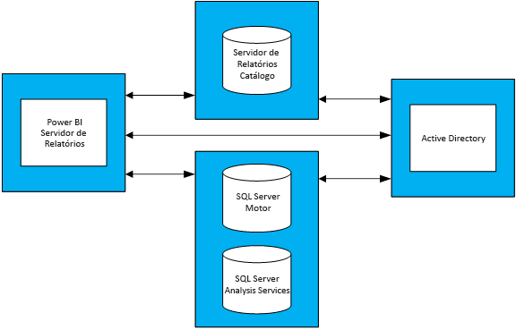

# Orientações de planeamento de capacidade do Power BI Report Server
Power BI Report Server é uma solução personalizada de relatórios empresariais que os clientes podem implementar no seu local, por trás da firewall. Combina a capacidade de relatórios interativos do Power BI Desktop com a plataforma de servidor no local do SQL Server Reporting Services. Com uma utilização intensa e crescente de análises e relatórios nas empresas, a orçamentação das licenças de software e da infraestrutura de hardware necessárias para dimensionar uma base de utilizadores da empresa pode ser um desafio. Este documento destina-se a oferecer orientação sobre o planeamento da capacidade do Power BI Report Server ao partilhar resultados de numerosas execuções do teste de carga das várias cargas de trabalho em relação a um servidor de relatório. Enquanto os relatórios, as consultas e os padrões de utilização das organizações variam bastante, os resultados apresentados neste documento, juntamente com os testes reais utilizados e uma descrição detalhada de como foram executados, servem como um ponto de referência para todas as pessoas no processo de planeamento antecipado do Power BI Report Server.

## Resumo executivo
Executámos dois tipos diferentes de cargas de trabalho em relação ao Power BI Report Server; cada carga de trabalho consistiu na composição de diferentes tipos de relatórios, bem como efetuar várias operações do portal web. 

* Numa carga de trabalho "Relatório Pesada do Power BI", a operação mais frequentemente executada (ou seja, a operação foi executada 60% das vezes) foi compor relatórios do Power BI.
* Numa carga de trabalho "Relatório Paginado Pesado", a operação mais frequentemente executada foi compor relatórios paginados.

Sob uma topologia de quatro servidores do Power BI Report Server e as expectativas que não mais de 5% dos utilizadores irá aceder a um servidor de relatórios num dado momento, a tabela seguinte descreve o número máximo de utilizadores do Power BI Report Server pode processar com, pelo menos, 99% de fiabilidade. 

| Carga de trabalho | 8 core/32 GB de RAM | 16 core/64 GB de RAM |
| --- | --- | --- |
| **Relatório Pesado do Power BI** (>60%) |1.000 utilizadores |3.000 utilizadores |
| **Relatório Paginado Pesado (RDL)** (>60%) |2.000 utilizadores |3.200 utilizadores |

Em cada execução, o recurso mais sobrecarregado foi a CPU. Devido a isto, o aumento do número de núcleos do Power BI Report Server produziria ganhos superiores na fiabilidade do sistema do que aumentar a quantidade de espaço de memória ou disco rígido. 

## Metodologia de teste
A topologia de teste utilizada baseou-se em Máquinas Virtuais do Microsoft Azure em vez de hardware físico específico ao fornecedor. Todas as máquinas foram alojadas nas regiões do EUA. Isto reflete a tendência geral da virtualização de hardware no local e na cloud pública. 

### Topologia do Power BI Report Server
A implementação do Power BI Report Server consistiu nas seguintes máquinas virtuais:

* Controlador de Domínio do Active Directory: foi necessário pelo SQL Server Database Engine, SQL Server Analysis Services e Power BI Report Server para autenticar em segurança todos os pedidos.
* O motor de base de dados do SQL Server e SQL Server Analysis Services: foi onde armazenamos todas as bases de dados dos relatórios a consumir depois de serem compostos.
* Power BI Report Server
* Base de dados do Power BI Report Server. A base de dados do servidor de relatórios está alojada numa máquina diferente do Power BI Report Server, para que não seja necessário competir com o SQL Server Database Engine por memória, CPU, rede e recursos de disco.

Consulte o Apêndice 1.1 Topologia do Power BI Report Server e Apêndice 1.2 Configuração da Máquina Virtual do Servidor do Power BI Report para saber qual a configuração de cada máquina virtual utilizada na topologia.

### Testes
Os testes utilizados nas execuções do teste de carga estão publicamente disponíveis num projeto GitHub chamado Reporting Services LoadTest (consulte https://github.com/Microsoft/Reporting-Services-LoadTest). Esta ferramenta permite aos utilizadores estudarem o desempenho, fiabilidade, escalabilidade e características de capacidade de recuperação do SQL Server Reporting Services e Power BI Report Server. Este projeto é constituído por quatro grupos de casos de teste:

* Testes de simulação de composição de relatórios de Power BI,
* Testes de simulação de composição de relatórios móveis,
* Testes de simulação de composição de relatórios paginados pequenos e grandes e 
* Testes de simulação de execução de vários tipos de operações do portal web. 

Todos os testes foram escritos para efetuar uma operação de ponto a ponto (tais como a composição de um relatório, criação de uma nova origem de dados, etc.). Tal é efetuado através da execução de um ou mais pedidos web para o servidor de relatórios (através de APIs). No mundo real, um utilizador poderá ter de efetuar algumas operações intermédias para concluir uma destas operações de ponto a ponto. Por exemplo, para compor um relatório um utilizador terá de ir ao portal web, navegar para a pasta onde está o relatório e clicar no relatório para o compor. Enquanto os testes não efetuam todas as operações necessárias para realizar uma tarefa de ponto a ponto, ainda impõem a maioria da carga do Power BI Report Server. Pode obter mais informações sobre os diferentes tipos de relatórios utilizados, bem como as diversas operações executadas ao explorar o projeto do GitHub.

### Cargas de trabalho
Existem 2 perfis de carga de trabalho utilizados nos testes: Relatório Pesada do Power BI e Relatório Paginado Pesado. A tabela abaixo descreve a distribuição de pedidos executados em relação ao Report Server.

| Atividade | Relatório Pesado do Power BI, Frequência de ocorrência | Relatório Paginado Pesado, Frequência da ocorrência |
| --- | --- | --- |
| **Compor relatórios do Power BI** |60% |10% |
| **Compor relatórios paginados (RDL)** |30% |60% |
| **Compor relatórios móveis** |5% |20% |
| **Operações do portal Web** |5% |10% |

### Carregamento do utilizador
Para cada execução de teste, os testes foram executados com base numa frequência especificada numa de duas cargas de trabalho. Os testes começaram com 20 pedidos simultâneos de utilizador do servidor do relatório. Em seguida, o carregamento de utilizador aumentou gradualmente até a fiabilidade diminuir abaixo dos 99% do valor de destino.

## Resultados
### Capacidade simultânea de utilizador
Tal como mencionado anteriormente, os testes começaram com 20 utilizadores em simultâneo com pedidos ao servidor de relatório. Em seguida, o número de utilizadores em simultâneo foi aumentando gradualmente até 1% de todos os pedidos falharem. Os resultados na seguinte tabela indicam o número de pedidos de utilizador em simultâneo que o servidor seria capaz de lidar num pico de carga com uma taxa de falha de menos de 1%.

| Carga de trabalho | 8 núcleos/32 GB | 16 núcleos/64 GB |
| --- | --- | --- |
| **Servidor de Relatório do Power BI** |50 utilizadores em simultâneo |150 utilizadores em simultâneo |
| **Relatório Paginado Pesado** |100 utilizadores em simultâneo |160 utilizadores em simultâneo |

### Capacidade total do utilizador
Na Microsoft, temos uma implementação de produção do Power BI Report Server que várias equipas utilizam. Quando analisamos a utilização real deste ambiente, observamos que o número de utilizadores em simultâneo num dado momento (mesmo durante as horas de pico de carga diárias) não tende a exceder os 5% da base total de utilizadores. Ao utilizar este rácio de simultaneidade de 5% como um benchmark, concluímos a base total de utilizadores que o Power BI Report Server pode gerir com fiabilidade de 99%.

| Carga de trabalho | 8 núcleos/32 GB | 16 núcleos/64 GB |
| --- | --- | --- |
| **Servidor de Relatório do Power BI** |1.000 utilizadores |3.000 utilizadores |
| **Relatório Paginado Pesado** |2.000 utilizadores |3.200 utilizadores |

### Ver resultados
Selecione um relatório para ver os resultados do teste de carga.

| Carga de trabalho | 8 núcleos/32 GB | 16 núcleos/64 GB |
| --- | --- | --- |
| **Servidor de Relatório do Power BI** |[Vista - 8 núcleos](https://msit.powerbi.com/view?r=eyJrIjoiMDhhNGY4NGQtNGRhYy00Yzk4LTk2MzAtYzFlNWI5NjBkMGFiIiwidCI6IjcyZjk4OGJmLTg2ZjEtNDFhZi05MWFiLTJkN2NkMDExZGI0NyIsImMiOjV9) |[Vista - 16 núcleos](https://msit.powerbi.com/view?r=eyJrIjoiNDBiODk1OGUtYTAyOC00MzVhLThmZmYtNzVjNTFjNzMwYzkwIiwidCI6IjcyZjk4OGJmLTg2ZjEtNDFhZi05MWFiLTJkN2NkMDExZGI0NyIsImMiOjV9) |
| **Relatório Paginado Pesado** |[Vista - 8 núcleos](https://msit.powerbi.com/view?r=eyJrIjoiNDFiZWYzMTktZGIxNS00MzcwLThjODQtMmJkMGRiZWEzNjhlIiwidCI6IjcyZjk4OGJmLTg2ZjEtNDFhZi05MWFiLTJkN2NkMDExZGI0NyIsImMiOjV9) |[Vista - 16 núcleos](https://msit.powerbi.com/view?r=eyJrIjoiOTU0YjJkYTgtNDg4Yy00NzlhLWIwMGYtMzg4YWI2MjNmOTZjIiwidCI6IjcyZjk4OGJmLTg2ZjEtNDFhZi05MWFiLTJkN2NkMDExZGI0NyIsImMiOjV9) |

<iframe width="640" height="360" src="https://msit.powerbi.com/view?r=eyJrIjoiMDhhNGY4NGQtNGRhYy00Yzk4LTk2MzAtYzFlNWI5NjBkMGFiIiwidCI6IjcyZjk4OGJmLTg2ZjEtNDFhZi05MWFiLTJkN2NkMDExZGI0NyIsImMiOjV9" frameborder="0" allowFullScreen="true"></iframe>

<iframe width="640" height="360" src="https://msit.powerbi.com/view?r=eyJrIjoiNDBiODk1OGUtYTAyOC00MzVhLThmZmYtNzVjNTFjNzMwYzkwIiwidCI6IjcyZjk4OGJmLTg2ZjEtNDFhZi05MWFiLTJkN2NkMDExZGI0NyIsImMiOjV9" frameborder="0" allowFullScreen="true"></iframe>

<iframe width="640" height="360" src="https://msit.powerbi.com/view?r=eyJrIjoiNDFiZWYzMTktZGIxNS00MzcwLThjODQtMmJkMGRiZWEzNjhlIiwidCI6IjcyZjk4OGJmLTg2ZjEtNDFhZi05MWFiLTJkN2NkMDExZGI0NyIsImMiOjV9" frameborder="0" allowFullScreen="true"></iframe>

<iframe width="640" height="360" src="https://msit.powerbi.com/view?r=eyJrIjoiOTU0YjJkYTgtNDg4Yy00NzlhLWIwMGYtMzg4YWI2MjNmOTZjIiwidCI6IjcyZjk4OGJmLTg2ZjEtNDFhZi05MWFiLTJkN2NkMDExZGI0NyIsImMiOjV9" frameborder="0" allowFullScreen="true"></iframe>

## Resumo
Para cada execução de teste de carga, a CPU foi o recurso mais sobrecarregado no momento do pico de carga na máquina do Power BI Report Server. Devido a esta situação, o primeiro recurso que deve ser aumentado é o número de núcleos. Em alternativa, pode considerar aumentar adicionando mais servidores que alojam o Power BI Report Server na sua topologia.

Os resultados apresentados neste documento têm origem na execução de um conjunto específico de relatórios que consumem um conjunto específico de dados, repetidos de uma forma específica. É um ponto de referência útil, mas tenha em atenção que a utilização dependerá dos relatórios, consultas, padrões de utilização e implementação do seu Power BI Report Server.

## Apêndice
### 1 Topologia
**1.1 Topologia do Power BI Report Server**

Ao concentrar-se apenas no comportamento do Power BI Report Server em diferentes configurações, a configuração de VM para cada tipo de máquina (exceto para a máquina que aloja o Power BI Report Server) foi corrigida. Cada máquina foi aprovisionada, de acordo com as máquinas de série de D de segunda geração (v2) com Discos de Armazenamento Premium. Pode encontrar informações detalhadas sobre cada tamanho da VM na secção "Fins Gerais" no https://azure.microsoft.com/en-us/pricing/details/virtual-machines/windows/.

| Tipo de Máquina Virtual | Processador | Memória | Tamanho da VM do Azure |
| --- | --- | --- | --- |
| **Controlador de Domínio do Active Directory** |2 núcleos |7 GB |Standard_DS2_v2 |
| **Servidores de Análise e Motor da Base de Dados do SQL Server** |16 núcleos |56 GB |Standard_DS5_v2 |
| **Base de Dados do Servidor de Relatórios** |16 núcleos |56 GB |Standard_DS5_v2 |

**Configuração da Máquina Virtual do Power BI Report Server 1.2** 

Foram utilizadas diferentes configurações do processador e memória da Máquina Virtual que aloja o Power BI Report Server. A contrário de outras VMs, cada máquina foi aprovisionada, de acordo com as máquinas de série de D de terceira geração (v3) com Discos de Armazenamento Premium. Pode encontrar informações detalhadas sobre este tamanho de VM na secção "Fins Gerais" no https://azure.microsoft.com/en-us/pricing/details/virtual-machines/windows/.

| Máquina Virtual | Processador | Memória | Tamanho da VM do Azure |
| --- | --- | --- | --- |
| **Power BI Report Server (Pequeno)** |8 núcleos |32 GB |Standard_D8S_v3 |
| **Power BI Report Server (Grande)** |16 núcleos |64 GB |vStandard_D16S_v3 |

### 2 Execute a ferramenta LoadTest
Se pretender executar a ferramenta Reporting Services LoadTest em relação à sua ou a uma implementação do Microsoft Azure do Power BI Report Server, siga estes passos.

1. Clone o projeto Reporting Services LoadTest a partir do GitHub (https://github.com/Microsoft/Reporting-Services-LoadTest).
2. No diretório do projeto, irá encontrar um ficheiro de solução chamado RSLoadTests.sln. Abra este ficheiro no Visual Studio 2015 ou posterior.
3. Determine se pretende executar esta ferramenta em relação à implementação do Power BI Report Server ou em relação a uma implementação do Power BI Report Server no Microsoft Azure. Se pretender executá-lo em relação à sua própria implementação, vá para o passo 5.
4. Siga as instruções indicadas no https://github.com/Microsoft/Reporting-Services-LoadTest#create-a-sql-server-reporting-services-load-environment-in-azure para criar um ambiente de Power BI Report Server no Azure.
5. Depois de concluir a implementação do ambiente, siga as instruções indicadas no https://github.com/Microsoft/Reporting-Services-LoadTest#load-test-execution para executar os testes.

Mais perguntas? [Experimente perguntar à Comunidade do Power BI](https://community.powerbi.com/)

