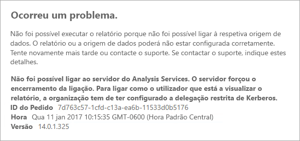
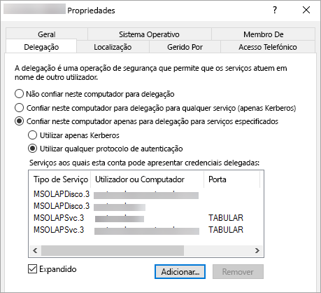

# <a name="configure-kerberos-to-use-power-bi-reports"></a>Configure o Kerberos para usar relatórios do Power BI
<iframe width="640" height="360" src="https://www.youtube.com/embed/vCH8Fa3OpQ0?showinfo=0" frameborder="0" allowfullscreen></iframe>

Saiba como configurar o servidor de relatórios para a autenticação Kerberos das origens de dados utilizadas nos seus relatórios do Power BI para obter um ambiente distribuído.

O Power BI Report Server inclui a capacidade de alojar relatórios do Power BI. Várias origens de dados são suportadas pelo seu servidor de relatórios. Embora este artigo incida especificamente no SQL Server Analysis Services, pode utilizar os conceitos e aplicar isso a outras origens de dados como o SQL Server.

Pode instalar o Power BI Report Server, o SQL Server e os Analysis Services num único computador, não sendo necessário configuração adicional. Isto é excelente para um ambiente de teste. Podem aparecer erros se estes serviços tiverem sido instalados em computadores diferentes. Isto é aquilo que se apelida de ambiente distribuído. Neste ambiente, tem de utilizar a autenticação Kerberos. É necessário configuração para implementar isto. 

Especificamente, terá de configurar a delegação restrita. Pode ter Kerberos configurado no seu ambiente, mas não pode ser configurado para a delegação restrita.

## <a name="error-running-report"></a>Erro ao executar o relatório
Se o servidor de relatórios não está configurado corretamente, vai aparecer o seguinte erro.

    Something went wrong.

    We couldn’t run the report because we couldn’t connect to its data source. The report or data source might not be configured correctly. 

Em Detalhes técnicos, verá a mensagem seguinte.

    We couldn’t connect to the Analysis Services server. The server forcibly closed the connection. To connect as the user viewing the report, your organization must have configured Kerberos constrained delegation.



## <a name="configuring-kerberos-constrained-delegation"></a>Configurar a delegação restrita do Kerberos
Há vários itens que têm de ser configurados para que a delegação restrita do Kerberos funcione. Isto inclui Nomes do Principal do Serviço (SPN) e as definições de delegação em contas de serviço.

> [!NOTE]
> Para configurar os SPN e as definições de delegação, terá de ser administrador de domínio.
> 
> 

Temos de configurar ou validar o seguinte.

1. Tipo de autenticação nos SPN de configuração
2. do servidor de relatórios da conta de serviço do servidor de relatório.
3. SPN do serviço do Analysis Services.
4. SPN do serviço SQL Browser no computador do Analysis Services. Isto é para apenas as instâncias nomeadas.
5. As definições de delegação na conta do serviço do servidor de relatórios.

## <a name="authentication-type-within-report-server-configuration"></a>Tipo de autenticação na configuração do servidor de relatórios
É necessário configurar o tipo de autenticação do servidor de relatórios para permitir a delegação restrita de Kerberos. Isto é efetuado no ficheiro **rsreportserver.config**. A localização predefinida deste ficheiro é `C:\Program Files\Microsoft Power BI Report Server\PBIRS\ReportServer`.

No ficheiro rsreportserver.config, terá de ajustar a secção **Authentication/AuthenticationTypes**.

Queremos certificar-se de que RSWindowsNegotiate está listado e que é a primeira opção na lista de tipos de autenticação. Deverá ser semelhante ao seguinte.

```
<AuthenticationTypes>
    <RSWindowsNegotiate/>
    <RSWindowsNTLM/>
</AuthenticationTypes>
```

Se tiver de alterar o ficheiro de configuração, deve parar e iniciar o servidor de relatórios para certificar-se de que as alterações têm efeito.

Para obter mais informações, consulte [Configurar a autenticação do Windows no servidor de relatórios](https://docs.microsoft.com/sql/reporting-services/security/configure-windows-authentication-on-the-report-server).

## <a name="spns-for-the-report-server-service-account"></a>SPN da conta de serviço do servidor de relatórios
Em seguida, temos de certificar-nos de que o servidor de relatórios tem SPN válidos disponíveis. Isto baseia-se na conta de serviço configurada para o servidor de relatórios.

### <a name="virtual-service-account-or-network-service"></a>Conta de Serviço Virtual ou Serviço de Rede
Se o servidor de relatórios estiver configurado para a Conta de Serviço Virtual ou para a Conta de Serviço de Rede, não deve fazer nada. Estes estão no contexto da conta do computador. Por predefinição, a conta do computador terá SPN HOST por predefinição. Estes vão abranger o serviço HTTP e serão utilizados pelo servidor de relatórios.

Se utilizar um nome de servidor virtual, que não seja igual à conta do computador, as entradas HOST não irão abrangê-lo e terá de adicionar manualmente os SPN ao nome de anfitrião do servidor virtual.

### <a name="domain-user-account"></a>Conta de utilizador de domínio
Se o servidor de relatórios estiver configurado para utilizar uma conta de utilizador de domínio, terá de criar manualmente SPN HTTP nessa conta. Isto pode ser feito utilizando a ferramenta setspn fornecida com o Windows.

> [!NOTE]
> Precisa de direitos de administrador de domínio para criar o SPN.
> 
> 

É recomendado para criar dois SPN. Um com o nome NetBIOS e os outros com o nome de domínio completamente qualificado (FQDN). O SPN aparece no seguinte formato.

    <Service>/<Host>:<port>

O Power BI Report Server utiliza um serviço de HTTP. Para os SPN HTTP não vai listar uma porta. Neste caso, o serviço que nos interessa é HTTP. O anfitrião do SPN é o nome que utiliza num URL. Normalmente, é o nome do computador. Se estiver atrás de um balanceador de carga, isto pode ser um nome virtual.

> [!NOTE]
> Pode verificar o URL procurando o que pretende introduzir na barra de endereços do browser ou pode consultar o Report Server Configuration Manager no separador URL do Portal Web.
> 
> 

Se o nome do computador for ContosoRS, os SPN seriam o seguintes:

| Tipo SPN | SPN |
| --- | --- |
| Nome de domínio completamente qualificado (FQDN) |HTTP/ContosoRS.contoso.com |
| NetBIOS |HTTP/ContosoRS |

### <a name="location-of-spn"></a>Localização do SPN
Por isso, onde deve ser colocado o SPN? O SPN vai ser colocado no que estiver a utilizar para a sua conta de serviço. Se estiver a utilizar a Conta de Serviço Virtual ou o Serviço de Rede, esta será a conta do computador. Apesar de termos referido anteriormente, só deve fazê-lo para um URL virtual. Se estiver a utilizar um utilizador de domínio para a conta de serviço do servidor de relatórios, terá de colocar o SPN nessa conta de utilizador de domínio.

Por exemplo, se está a utilizar a conta de serviço de rede e o nome do nosso computador for ContosoRS, colocaríamos o SPN no ContosoRS.

Se estamos a utilizar uma conta de utilizador de domínio do RSService, colocaríamos o SPN no RSService.

### <a name="using-setspn-to-add-the-spn"></a>Utilizar o SetSPN para adicionar o SPN
Podemos utilizar a ferramenta SetSPN para adicionar o SPN. Vamos seguir o exemplo indicado acima com a conta do computador e a conta de utilizador de domínio.

Colocar o SPN numa conta de computador, tanto o FQDN como para o NetBIOS SPN, seria semelhante ao seguinte se estivéssemos a utilizar um URL virtual de contosoreports.

      Setspn -a HTTP/contosoreports.contoso.com ContosoRS
      Setspn -a HTTP/contosoreports ContosoRS

Colocar o SPN numa conta de utilizador de domínio, tanto para o FQDN como para o NetBIOS SPN, seria semelhante ao seguinte se utilizasse o nome do computador para o anfitrião do SPN.

      Setspn -a HTTP/ContosoRS.contoso.com RSService
      Setspn -a HTTP/ContosoRS RSService

## <a name="spns-for-the-analysis-services-service"></a>SPN do serviço do Analysis Services
Os SPN do Analysis Services são semelhantes aos que fizemos com o Power BI Report Server. O formato do SPN é ligeiramente diferente se tiver uma instância nomeada.

Para o Analysis Services, utilizamos um serviço de MSOLAPSvc.3. Vamos especificar o nome de instância para a localização de porta no SPN. A parte de anfitrião do SPN vai ser o nome do computador ou o nome virtual do Cluster.

Um exemplo de um SPN de Azure Analysis Services deve ter o seguinte aspeto.

| Tipo | Format |
| --- | --- |
| Instância predefinida |MSOLAPSvc.3/ContosoAS.contoso.com<br>MSOLAPSvc.3/ContosoAS |
| Instância com nome |MSOLAPSvc.3/ContosoAS.contoso.com:INSTANCENAME<br>MSOLAPSvc.3/ContosoAS:INSTANCENAME |

O posicionamento do SPN também é semelhante ao que foi mencionado com o Power BI Report Server. Baseia-se na conta de serviço.  Se estiver a utilizar o Sistema Local ou o Serviço de Rede, estará no contexto da conta de computador. Se estiver a utilizar uma conta de utilizador de domínio para a instância do Analysis Services, terá de colocar o SPN na conta de utilizador de domínio.

### <a name="using-setspn-to-add-the-spn"></a>Utilizar o SetSPN para adicionar o SPN
Podemos utilizar a ferramenta SetSPN para adicionar o SPN. Neste exemplo, o nome do computador será ContosoAS.

Colocar o SPN numa conta de computador, tanto para o FQDN como para o NetBIOS SPN, seria semelhante ao seguinte.

    Setspn -a MSOLAPSvc.3/ContosoAS.contoso.com ContosoAS
    Setspn -a MSOLAPSvc.3/ContosoAS ContosoAS

Colocar o SPN numa conta de utilizador de domínio, tanto para o FQDN como para o NetBIOS SPN, seria semelhante ao seguinte.

    Setspn -a MSOLAPSvc.3/ContosoAS.contoso.com OLAPService
    Setspn -a MSOLAPSvc.3/ContosoAS OLAPService

## <a name="spns-for-the-sql-browser-service"></a>SPN para o serviço SQL Browser
Se tiver uma instância nomeada do Analysis Services, terá também de certificar-se de que tem um SPN para o serviço de browser. Isto é exclusivo para o Analysis Services.

Os SPN do SQL Browser são semelhantes aos que fizemos com o Power BI Report Server.

Para o SQL Browser, utilizamos um serviço do MSOLAPDisco.3. Vamos especificar o nome de instância para a localização de porta no SPN. A parte de anfitrião do SPN vai ser o nome do computador ou o nome virtual do Cluster.
Não é necessário especificar nada para o nome da instância ou a porta.

Um exemplo de um SPN de Azure Analysis Services deve ter o seguinte aspeto.

    MSOLAPDisco.3/ContosoAS.contoso.com
    MSOLAPDisco.3/ContosoAS

O posicionamento do SPN também é semelhante ao que foi mencionado com o Power BI Report Server. A diferença aqui é que o SQL Browser é sempre executado na conta do Sistema Local. Isto significa que os SPN vão passar sempre na conta de computador. 

### <a name="using-setspn-to-add-the-spn"></a>Utilizar o SetSPN para adicionar o SPN
Podemos utilizar a ferramenta SetSPN para adicionar o SPN. Neste exemplo, o nome do computador será ContosoAS.

Colocar o SPN numa conta de computador, tanto para o FQDN como para o NetBIOS SPN, seria semelhante ao seguinte.

    Setspn -a MSOLAPDisco.3/ContosoAS.contoso.com ContosoAS
    Setspn -a MSOLAPDisco.3/ContosoAS ContosoAS

Para obter mais informações, consulte [É necessário um SPN para o serviço SQL Server Browser](https://support.microsoft.com/kb/950599).

## <a name="delegation-settings-on-the-report-server-service-account"></a>Definições de delegação na conta do serviço do servidor de relatórios
A última parte que temos de configurar são as definições de delegação na conta de serviço do servidor de relatórios. Pode utilizar ferramentas diferentes para executar estes passos. Para efeitos deste documento, vamos concentrar-nos nos Utilizadores e Computadores do Active Directory.

Terá de começar por aceder às propriedades da conta de serviço de servidor de relatório em Utilizadores e Computadores do Active Directory. Será a conta de computador, se utilizou a Conta de Serviço Virtual ou o Serviço de rede, ou será uma conta de utilizador de domínio.

Queremos configurar a delegação restrita com trânsito de protocolo. Com a delegação restrita, tem de ser explícito em relação aos serviços que pretende que deleguemos. Vamos adicionar o SPN do serviço Analysis Services e o SPN do SQL Server à lista para a qual o Power BI Report Server pode delegar.

1. Clique com o botão direito do rato na conta de serviço do servidor de relatório e selecione **Propriedades**.
2. Selecione o separador **Delegação**.
3. Selecione **Confiar no computador p/ delegação apenas p/ serviços especificados**.
4. Selecione **Utilizar qualquer protocolo de autenticação**.
5. Em **Serviços aos quais esta conta pode apresentar credenciais delegadas**: selecione **Adicionar**.
6. Na nova caixa de diálogo, selecione **Utilizadores ou Computadores**.
7. Introduza a conta de serviço do serviço do Analysis Services e selecione **OK**.
8. Selecione o SPN que criou. Começa com `MSOLAPSvc.3`. Se adicionou o FQDN e o SPN NetBIOS, irá selecionar ambos. Só poderá ver um.
9. Selecione **OK**.  Verá o SPN na lista.
10. Como opção, pode selecionar **Expandido** para mostrar o FQDN e o SPN NetBIOS na lista.
11. Selecione **Adicionar** novamente. Agora vamos adicionar o SPN do SQL Browser.
12. Na nova caixa de diálogo, selecione **Utilizadores ou Computadores**.
13. Introduza o nome do computador onde o serviço SQL Browser está ativo e selecione **OK**.
14. Selecione o SPN que criou. Começa com `MSOLAPDisco.3`. Se adicionou o FQDN e o SPN NetBIOS, irá selecionar ambos. Só poderá ver um.
15. Selecione **OK**. Se tiver selecionado **Expandido**, a caixa de diálogo deve ter um aspeto semelhante ao seguinte.
    
    
16. Selecione **OK**.
17. Reinicie o Power BI Report Server.

## <a name="running-a-power-bi-report"></a>Executar um Power BI Report
Depois de todas as configurações acima estarem implementadas, o relatório deve ser apresentar corretamente. 


Embora esta configuração funcione na maioria dos casos, no caso do Kerberos, pode haver uma configuração diferente consoante o seu ambiente. Se mesmo assim o relatório não for carregado, é melhor contactar o seu administrador de domínio para uma investigação posterior ou contacte o suporte.

## <a name="next-steps"></a>Próximos passos
[Descrição geral para administradores](admin-handbook-overview.md)  
[Instalar o Power BI Report Server](install-report-server.md)  

Mais perguntas? [Experimente perguntar à Comunidade do Power BI](https://community.powerbi.com/)

