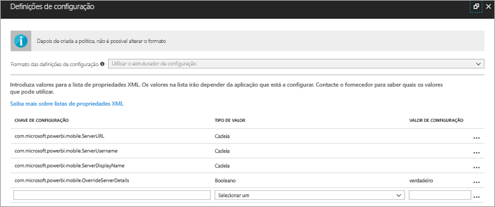
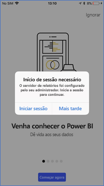
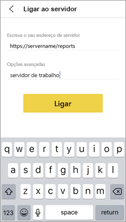
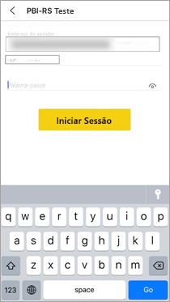

# Configurar o acesso da aplicação móvel do Power BI para um Servidor de Relatórios remotamente

Aplica-se a:

|  |  |
|:--- |:--- |
| iOS |Android |

Neste artigo, saiba como utilizar a ferramenta MDM da sua organização para configurar o acesso da aplicação móvel do Power BI para um Servidor de Relatórios. Para configurar esta opção, os administradores de TI criam uma política de configuração da aplicação com as informações necessárias para serem enviadas para a aplicação. 

 Com a ligação do Servidor de Relatórios já configurada, os utilizadores da aplicação móvel do Power BI podem ligar-se ao Servidor de Relatórios da organização mais facilmente. 

## Criar a política de configuração da aplicação na ferramenta MDM 

Enquanto administrador, eis os passos que tem de seguir no Microsoft Intune para criar a política de configuração da aplicação. Os passos e a experiência de criação da política de configuração da aplicação podem ser diferentes noutras ferramentas MDM. 

1. Ligue a sua ferramenta MDM. 
2. Crie e dê um nome a uma nova política de configuração da aplicação. 
3. Escolha os utilizadores pelos quais pretende distribuir esta política de configuração da aplicação. 
4. Crie pares chave-valor. 

A seguinte tabela enuncia os pares.

|Chave  |Tipo  |Descrição  |
|---------|---------|---------|
| com.microsoft.powerbi.mobile.ServerURL | Cadeia | URL do Servidor de Relatórios   Deve começar por http/https |
| com.microsoft.powerbi.mobile.ServerUsername | Cadeia | [opcional]   O nome de utilizador a utilizar para ligar o servidor.   Se não existir, a aplicação pedirá ao utilizador para escrever o nome de utilizador para a ligação.| 
| com.microsoft.powerbi.mobile.ServerDisplayName | Cadeia | [opcional]   O valor predefinido é "Servidor de relatórios"   Um nome amigável utilizado na aplicação para representar o servidor | 
| com.microsoft.powerbi.mobile.OverrideServerDetails | Booleano | O valor predefinido é Verdadeiro  Quando definido como "True", substitui todas as definições do Servidor de Relatórios já existente no dispositivo móvel. Os servidores existentes que já estiverem configurados serão eliminados.   Quando a substituição está definida como Verdadeiro, isto impede também que o utilizador remova essa configuração.   Se estiver definido como "Falso", adicionará os valores emitidos, mantendo as definições existentes.   Se o mesmo URL do servidor já estiver configurado na aplicação móvel, esta manterá essa configuração tal como está. A aplicação não pedirá ao utilizador para voltar a autenticar para o mesmo servidor. |

Eis um exemplo de definição da política de configuração com o Intune.

## Ligação dos utilizadores finais a um Servidor de Relatórios

 Imaginemos que publica a política de configuração da aplicação para uma lista de distribuição. Quando os utilizadores e os dispositivos nessa lista de distribuição iniciarem a aplicação móvel, terão a seguinte experiência. 

1. Verão uma mensagem a informar que a aplicação móvel está configurada com um Servidor de Relatórios e deverão tocar em **Iniciar sessão**.

    

2.  Na página **Ligar ao servidor**, os detalhes do servidor de relatórios já estão preenchidos. Tocam em **Ligar**.

    

3. Escrevem uma palavra-passe para autenticar e, em seguida, tocam em **Iniciar sessão**. 

    

Agora, podem ver e interagir com os KPIs e os relatórios do Power BI armazenados no Servidor de Relatórios.

## Próximas etapas

- [Ativar o acesso remoto ao Power BI Mobile com o Proxy de Aplicações do Azure Active Directory](/azure/active-directory/manage-apps/application-proxy-integrate-with-power-bi)
- [Descrição geral para administradores](admin-handbook-overview.md)  
- [Instalar o Power BI Report Server](install-report-server.md)  

Mais perguntas? [Experimente perguntar à Comunidade do Power BI](https://community.powerbi.com/)