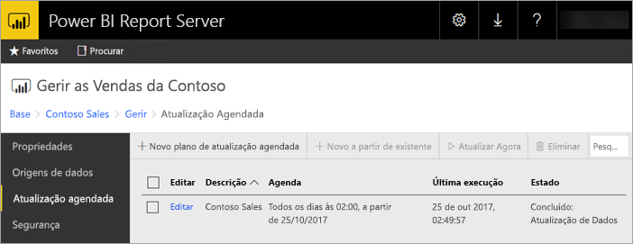
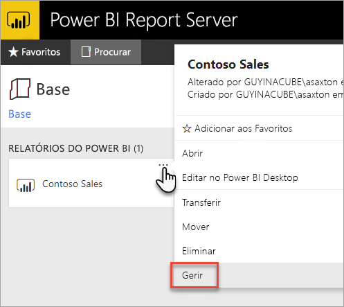
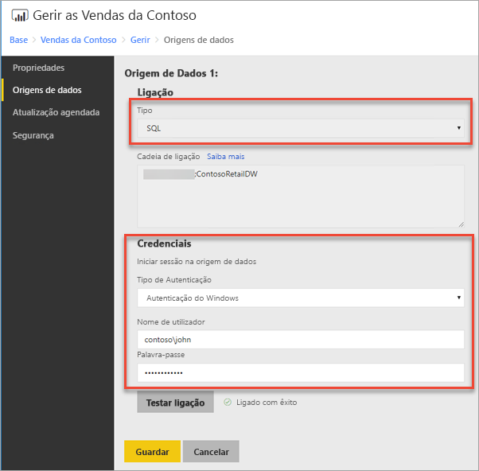
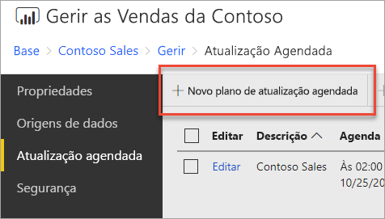
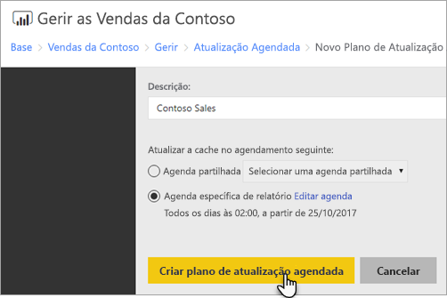
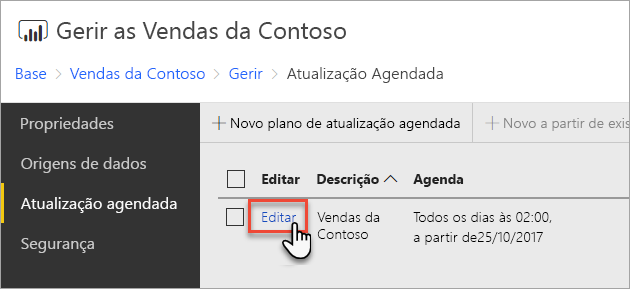
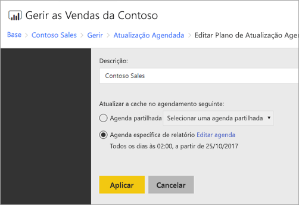

# Como configurar a atualização agendada de relatórios do Power BI
Para atualizar os dados no seu relatório do Power BI, é necessário criar um plano de atualização agendada. Deve fazê-lo na área *Gerir* de um relatório do Power BI.

## Configurar credenciais de origens de dados
Antes de criar um plano de atualização de dados agendada, tem de definir as credenciais para **cada origem de dados** utilizada no seu relatório do Power BI.

1. No portal Web, clique com o botão direito do rato no relatório do Power BI e selecione **Gerir**.
   
    
2. No menu à esquerda, selecione o separador **Origens de dados**.
3. Para cada tipo de origem de dados apresentado, selecione o tipo de autenticação a utilizar ao ligar-se a essa origem de dados. Introduza as credenciais adequadas.
   
    

## Criar um Plano de Atualização Agendada
Siga estes passos para criar um plano de atualização agendada.

1. No portal Web, clique com o botão direito do rato no relatório do Power BI e selecione **Gerir**.
   
    
2. No menu à esquerda, selecione o separador **Atualização agendada**.
3. Na página **Atualização agendada**, selecione **Novo plano de atualização agendada**.
   
    
4. Na página **Novo Plano de Atualização Agendada**, introduza uma descrição e defina uma agenda para quando pretende que o seu modelo de dados seja atualizado.
5. Quando concluir, selecione **Criar plano de atualização agendada**.
   
    

## Modificar um Plano de Atualização Agendada
Modificar um plano de atualização agendada é semelhante a criar um.

1. No portal Web, clique com o botão direito do rato no relatório do Power BI e selecione **Gerir**.
   
    
2. No menu à esquerda, selecione o separador **Atualização agendada**.
3. Na página **Atualização agendada**, selecione **Editar** ao lado do plano de atualização que pretende gerir.
   
    
4. Na página **Editar Plano de Atualização Agendada**, introduza uma descrição e defina uma agenda para quando pretende que o seu modelo de dados seja atualizado.
5. Selecione **Aplicar** quando concluir.
   
    

## Ver o estado do Plano de Atualização Agendada
Veja o estado de um plano de atualização agendada no portal Web.

1. No portal Web, clique com o botão direito do rato no relatório do Power BI e selecione **Gerir**.
   
    
2. No menu à esquerda, selecione o separador **Atualização agendada**.
3. Na página de **Atualização agendada**, a coluna mais à direita apresenta o estado de um plano.
   
   | **Estado** | **Descrição** |
   | --- | --- |
   | Novo Plano de Atualização Agendada |O plano foi criado, mas ainda não foi executado. |
   | A atualizar |O processo de atualização começou. |
   | A transmitir modelo para o Analysis Server |A copiar o modelo da base de dados do catálogo do servidor de relatórios para a instância alojada do Analysis Services. |
   | A atualizar dados |A atualizar os dados no modelo. |
   | A remover credenciais do modelo |Foram removidas as credenciais utilizadas para ligar à origem de dados do modelo. |
   | A guardar modelo no catálogo |A atualização dos dados foi concluída e o modelo atualizado está a ser guardado novamente na base de dados do catálogo do servidor de relatórios. |
   | Concluído: Atualização de Dados |A atualização está concluída. |
   | Erro: |Ocorreu um erro durante a atualização, que é apresentado. |

A página Web tem de ser atualizada para ver o estado atual. O estado não será alterado automaticamente.

## Próximos passos
Para saber mais sobre criar e modificar agendas, consulte [Criar, modificar e eliminar agendas](https://docs.microsoft.com/sql/reporting-services/subscriptions/create-modify-and-delete-schedules).

Para obter informações sobre como resolver problemas de atualização agendada, consulte [Resolução de problemas da atualização agendada no Power BI Report Server](scheduled-refresh-troubleshoot.md).

Mais perguntas? [Experimente perguntar à Comunidade do Power BI](https://community.powerbi.com/)

