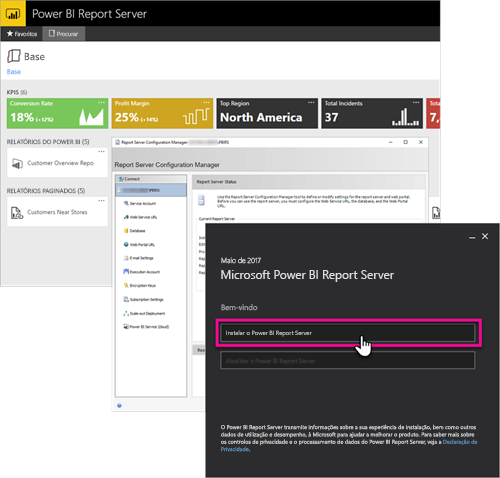

# <a name="developer-handbook-overview-power-bi-report-server"></a>Descrição geral do manual de programador, Power BI Report Server

Bem-vindo ao manual de programador para o Power BI Report Server, uma localização no local para armazenar e gerir os relatórios móveis e paginados do Power BI.



Este manual realça as opções disponíveis, como programador, para trabalhar no Power BI Report Server.

## <a name="embedding"></a>Incorporação

Para qualquer relatório do Power BI Report Server, pode incorporar numa iFrame, ao adicionar o parâmetro de cadeia de consulta `?rs:Embed=true` ao URL. Esta técnica funciona com relatórios do Power BI, bem como outros tipos de relatório.

### <a name="report-viewer-control"></a>Controlo do Visualizador de Relatórios

Para obter relatórios paginados, pode tirar partido do Controlo do Visualizador de Relatórios. Com o mesmo, pode colocar o controlo dentro do Windows .NET ou aplicação Web. Para obter mais informações, veja [Introdução ao Controlo do Visualizador de Relatórios](/sql/reporting-services/application-integration/integrating-reporting-services-using-reportviewer-controls-get-started).

## <a name="apis"></a>APIs

Existem várias opções de API para interagir com o Power BI Report Server. Esta técnica inclui o seguinte.

* [APIs REST](rest-api.md)
* [Acesso por URL](/sql/reporting-services/url-access-ssrs)
* [Fornecedor de WMI](/sql/reporting-services/wmi-provider-library-reference/reporting-services-wmi-provider-library-reference-ssrs)

Também pode utilizar os [utilitários do PowerShell](https://github.com/Microsoft/ReportingServicesTools) open source para gerir o servidor de relatórios.

> [!NOTE]
> Os utilitários do PowerShell suportam os ficheiros do Power BI Desktop (.pbix) através dos comandos -RsRest*.

Execute o seguinte comando para localizar que comandos no módulo ReportingServicesTools do PowerShell suportam ficheiros do Power BI Desktop (.pbix).

```powershell
Get-Command -Module ReportingServicesTools -Noun RsRest*
```

## <a name="custom-extensions"></a>Extensões personalizadas

A biblioteca de extensões é um conjunto de classes, interfaces e tipos de valores que estão incluídos no Power BI Report Server. Esta biblioteca fornece acesso à funcionalidade do sistema e foi concebida para ser a base na qual as aplicações Microsoft .NET Framework podem ser utilizadas para expandir os componentes do Power BI Report Server.

Pode criar vários tipos de extensões.

* Extensões de processamento de dados
* Extensão de entrega
* Extensões de composição para relatórios paginados
* Extensões de segurança

Para obter mais informações, veja [Biblioteca de extensões](/sql/reporting-services/extensions/reporting-services-extension-library).

## <a name="next-steps"></a>Passos seguintes

[Introdução ao Controlo do Visualizador de Relatórios](/sql/reporting-services/application-integration/integrating-reporting-services-using-reportviewer-controls-get-started)  
[Criar Aplicações com o Serviço Web e o .NET Framework](/sql/reporting-services/report-server-web-service/net-framework/building-applications-using-the-web-service-and-the-net-framework)  
[URL Access (Acesso por URL)](/sql/reporting-services/url-access-ssrs)  
[Biblioteca de extensões](/sql/reporting-services/extensions/reporting-services-extension-library)  
[Fornecedor de WMI](/sql/reporting-services/wmi-provider-library-reference/reporting-services-wmi-provider-library-reference-ssrs)

Mais perguntas? [Experimente perguntar à Comunidade do Power BI](https://community.powerbi.com/)
