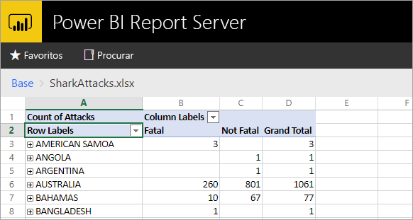
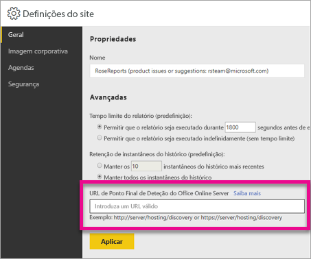

# <a name="configure-your-report-server-to-host-excel-workbooks-using-office-online-server-oos"></a>Configure o servidor de relatórios para alojar livros do Excel com o Office Online Server (OOS)
Além de visualizar relatórios do Power BI no portal Web, o Power BI Report Server pode alojar livros do Excel através do [Office Online Server](https://docs.microsoft.com/officeonlineserver/office-online-server-overview) (OOS). O servidor de relatórios torna-se uma localização única para publicar e visualizar o conteúdo do Microsoft BI com gestão personalizada.



## <a name="prepare-server-to-run-office-online-server"></a>Preparar o servidor para executar o Office Online Server
Execute estes procedimentos no servidor que irá executar o Office Online Server. Este servidor tem de ser o Windows Server 2012 R2 ou o Windows Server 2016. O Windows Server 2016 necessita do Office Online Server Abril de 2017 ou posterior.

### <a name="install-prerequisite-software-for-office-online-server"></a>Instalar software de pré-requisitos para o Office Online Server
1. Abra a linha de comandos do Windows PowerShell como administrador e execute este comando para instalar as funções e os serviços precisos.
   
    **Windows Server 2012 R2:**
   
    ```
    Add-WindowsFeature Web-Server,Web-Mgmt-Tools,Web-Mgmt-Console,Web-WebServer,Web-Common-Http,Web-Default-Doc,Web-Static-Content,Web-Performance,Web-Stat-Compression,Web-Dyn-Compression,Web-Security,Web-Filtering,Web-Windows-Auth,Web-App-Dev,Web-Net-Ext45,Web-Asp-Net45,Web-ISAPI-Ext,Web-ISAPI-Filter,Web-Includes,InkandHandwritingServices,NET-Framework-Features,NET-Framework-Core,NET-HTTP-Activation,NET-Non-HTTP-Activ,NET-WCF-HTTP-Activation45,Windows-Identity-Foundation,Server-Media-Foundation
    ```
   
    **Windows Server 2016:**
   
    ```
    Add-WindowsFeature Web-Server,Web-Mgmt-Tools,Web-Mgmt-Console,Web-WebServer,Web-Common-Http,Web-Default-Doc,Web-Static-Content,Web-Performance,Web-Stat-Compression,Web-Dyn-Compression,Web-Security,Web-Filtering,Web-Windows-Auth,Web-App-Dev,Web-Net-Ext45,Web-Asp-Net45,Web-ISAPI-Ext,Web-ISAPI-Filter,Web-Includes,NET-Framework-Features,NET-Framework-45-Features,NET-Framework-Core,NET-Framework-45-Core,NET-HTTP-Activation,NET-Non-HTTP-Activ,NET-WCF-HTTP-Activation45,Windows-Identity-Foundation,Server-Media-Foundation
    ```
   
    Se lhe for pedido, reinicie o servidor.
2. Instale o seguinte software:
   
   * [.NET Framework 4.5.2](https://go.microsoft.com/fwlink/p/?LinkId=510096)
   * [Visual C++ Redistributable Packages para Visual Studio 2013](https://www.microsoft.com/download/details.aspx?id=40784)
   * [Visual C++ Redistributable para Visual Studio 2015](https://go.microsoft.com/fwlink/p/?LinkId=620071)
   * [Microsoft.IdentityModel.Extention.dll](https://go.microsoft.com/fwlink/p/?LinkId=620072)

### <a name="install-office-online-server"></a>Instalar o Office Online Server
Se pretende utilizar quaisquer funcionalidades do Excel Online que utilizam o acesso a dados externos (como o Power Pivot), tenha em atenção que o Office Online Server tem de residir na mesma floresta do Active Directory que os utilizadores, bem como quaisquer origens de dados externos que pretende aceder com a autenticação baseada em Windows.

1. Transfira o Office Online Server a partir do [Volume Licensing Service Center (VLSC)](http://go.microsoft.com/fwlink/p/?LinkId=256561). A transferência está localizada nesses produtos do Office no portal do VLSC. Para fins de desenvolvimento, pode transferir o OOS a partir de transferências de subscritor do MSDN.
2. Execute o Setup.exe.
3. Na página **Leia os Termos de Licenciamento de Software Microsoft**, selecione **Aceito os termos deste contrato** e selecione **Continuar**.
4. Na página **Escolha uma localização de ficheiro**, selecione a pasta onde pretende que os ficheiros do Office Online Server sejam instalados (por exemplo,*C:\Program Files\Microsoft Office Web Apps*) e selecione **Instalar Agora**. Se a pasta que especificou não existir, a Configuração cria a mesma por si.
   
    Recomendamos que instale o Office Online Server na unidade do sistema.
5. Quando a Configuração terminar de instalar o Office Online Server, selecione **Fechar**.

### <a name="install-language-packs-for-office-web-apps-server-optional"></a>Instalar pacotes de idiomas para o Office Web Apps Server (opcional)
Os Pacotes de Idiomas do Office Online permitem que os utilizadores visualizem ficheiros do Office baseados na Web em vários idiomas.

Para instalar os pacotes de idiomas, siga estes passos.

1. Transfira os Pacotes de Idiomas do Office Online Server a partir do [Centro de Transferências da Microsoft](http://go.microsoft.com/fwlink/p/?LinkId=798136).
2. Execute **wacserverlanguagepack.exe**.
3. No Assistente do Pacote de Idiomas do Office Online Server, na página **Leia os Termos de Licenciamento de Software Microsoft**, selecione **Aceito os termos deste contrato** e selecione **Continuar**.
4. Quando a Configuração terminar de instalar o Office Online Server, selecione **Fechar**.

## <a name="deploy-office-online-server"></a>Implementar o Office Online Server
### <a name="create-the-office-online-server-farm-https"></a>Criar o farm do Office Online Server (HTTPS)
Utilize o comando New-OfficeWebAppsFarm para criar um novo farm do Office Online Server, que consiste num único servidor, conforme mostrado no exemplo seguinte.

```
New-OfficeWebAppsFarm -InternalUrl "https://server.contoso.com" -ExternalUrl "https://wacweb01.contoso.com" -CertificateName "OfficeWebApps Certificate"
```

**Parâmetros**

* **–InternalURL** é o nome de domínio completamente qualificado (FQDN) do servidor que executa o Office Online Server, tal como http://servername.contoso.com.
* **–ExternalURL** é o FQDN que pode ser acedido na Internet.
* **–CertificateName** é o nome amigável do certificado.

### <a name="create-the-office-online-server-farm-http"></a>Criar o farm do Office Online Server (HTTP)
Utilize o comando New-OfficeWebAppsFarm para criar um novo farm do Office Online Server, que consiste num único servidor, conforme mostrado no exemplo seguinte.

```
New-OfficeWebAppsFarm -InternalURL "http://servername" -AllowHttp
```

**Parâmetros**

* **–InternalURL** é o nome do servidor que executa o Office Online Server, tal como http://servername.
* **–AllowHttp** configura o farm para utilizar HTTP.

### <a name="verify-that-the-office-online-server-farm-was-created-successfully"></a>Certifique-se de que o farm do Office Online Server foi criado com êxito
Depois de o farm estar criado, são apresentados os detalhes sobre o farm na linha de comandos do Windows PowerShell. Para verificar que o Office Online Server está instalado e configurado corretamente, utilize um browser para aceder ao URL de deteção do Office Online Server, conforme mostrado no exemplo seguinte. O URL de deteção é o parâmetro *InternalUrl* que especificou quando configurou o seu farm do Office Online Server, seguido de */alojamento/deteção*, por exemplo:

```
<InternalUrl>/hosting/discovery
```

Se o Office Online Server funcionar conforme esperado, deverá ver um ficheiro XML de deteção de Protocolo de Interface de Plataforma Aberta de Aplicação Web (WOPI) no seu browser. As primeiras linhas desse ficheiro devem assemelhar-se ao seguinte exemplo:

```
<?xml version="1.0" encoding="utf-8" ?> 
- <wopi-discovery>
- <net-zone name="internal-http">
- <app name="Excel" favIconUrl="<InternalUrl>/x/_layouts/images/FavIcon_Excel.ico" checkLicense="true">
<action name="view" ext="ods" default="true" urlsrc="<InternalUrl>/x/_layouts/xlviewerinternal.aspx?<ui=UI_LLCC&><rs=DC_LLCC&>" /> 
<action name="view" ext="xls" default="true" urlsrc="<InternalUrl>/x/_layouts/xlviewerinternal.aspx?<ui=UI_LLCC&><rs=DC_LLCC&>" /> 
<action name="view" ext="xlsb" default="true" urlsrc="<InternalUrl>/x/_layouts/xlviewerinternal.aspx?<ui=UI_LLCC&><rs=DC_LLCC&>" /> 
<action name="view" ext="xlsm" default="true" urlsrc="<InternalUrl>/x/_layouts/xlviewerinternal.aspx?<ui=UI_LLCC&><rs=DC_LLCC&>" /> 
```

### <a name="configure-excel-workbook-maximum-size"></a>Configurar o tamanho máximo do livro do Excel
O tamanho máximo de todos os ficheiros no Power BI Report Server é de 100 MB. Para estar sincronizado com o mesmo, tem de definir esta opção manualmente no OOS.

```
Set-OfficeWebAppsFarm -ExcelWorkbookSizeMax 100
```

## <a name="using-effectiveusername-with-analysis-services"></a>Utilizar o EffectiveUserName com o Analysis Services
Para permitir ligações em direto ao Analysis Services, para ligações num livro do Excel que utiliza o EffectiveUserName. Para o OOS utilizar o EffectiveUserName, terá de adicionar a conta de computador do servidor OOS como um administrador para a instância do Analysis Services. O Management Studio para o SQL Server 2016 ou posterior é preciso para realizar este procedimento.

Apenas as ligações incorporadas do Analysis Services são atualmente suportadas num livro do Excel. A conta de utilizador tem de ter permissão para ligar ao Analysis Services, uma vez que a capacidade de suportar o utilizador com proxy não está disponível.

Execute os seguintes comandos do PowerShell no Servidor do OOS.

```
Set-OfficeWebAppsFarm -ExcelUseEffectiveUserName:$true
Set-OfficeWebAppsFarm -ExcelAllowExternalData:$true
Set-OfficeWebAppsFarm -ExcelWarnOnDataRefresh:$false
```

## <a name="configure-a-power-pivot-instance-for-data-models"></a>Configure uma instância do Power Pivot para modelos de dados
Instalar uma instância do modo do Analysis Services Power Pivot permite-lhe trabalhar com livros do Excel que estão a utilizar o Power Pivot. Certifique-se de que o nome da instância é *POWERPIVOT*. Adicione a conta de computador do servidor OOS como um administrador, para a instância de modo do Power Pivot do Analysis Services. O Management Studio para o SQL Server 2016 ou posterior é preciso para realizar este procedimento.

Para o OOS utilizar a instância de modo do Power Pivot, execute o seguinte comando.

```
New-OfficeWebAppsExcelBIServer -ServerId <server_name>\POWERPIVOT
```

Se ainda não permitiu dados externos, a partir do passo do Analysis Services acima, execute o seguinte comando.

```
Set-OfficeWebAppsFarm -ExcelAllowExternalData:$true
```

### <a name="firewall-considerations"></a>Considerações sobre Firewall
Para evitar problemas de firewall, poderá ter de abrir as portas 2382 e 2383. Também pode adicionar o *msmdsrv.exe*, para a instância do Power Pivot, como uma política de parede de firewall de aplicação.

## <a name="configure-power-bi-report-server-to-use-the-oos-server"></a>Configurar o Power BI Report Server para utilizar o Servidor de OOS
Na página **Geral** das **Definições de site**, introduza o URL de deteção de OOS. O URL de deteção de OOS é o *InternalUrl*, utilizado ao implementar o servidor do OOS, seguido de */alojamento/deteção*. Por exemplo, `http://servername/hosting/discovery`, para HTTP. E, `https://server.contoso.com/hosting/discovery` para HTTPS.

Para obter as **Definições do site**, selecione o **ícone de ferramentas** no canto superior direito e selecione **Definições do site**.

Apenas um utilizador com a função **Administrador de Sistema** verá a definição de URL de deteção do Office Online Server.



Depois de introduzir o URL de deteção e selecionar **Aplicar**, selecionar um livro do Excel, no portal da Web, deve apresentar o livro no mesmo.

## <a name="limitations-and-considerations"></a>Limitações e considerações
* A capacidade de ver os livros do Excel no Power BI Report Server está atualmente em pré-visualização.
* Terá apenas a capacidade de leitura nos livros.

## <a name="next-steps"></a>Passos seguintes
[Manual do administrador](admin-handbook-overview.md)  
[Instalar o Power BI Report Server](install-report-server.md)  
[Instalar o Report Builder](https://docs.microsoft.com/sql/reporting-services/install-windows/install-report-builder)  
[Transferir o SQL Server Data Tools (SSDT)](http://go.microsoft.com/fwlink/?LinkID=616714)

Mais perguntas? [Experimente perguntar à Comunidade do Power BI](https://community.powerbi.com/)

