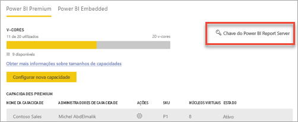
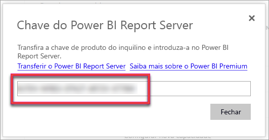
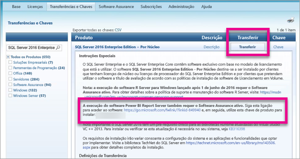

# Como localizar a chave de produto do servidor de relatórios
Saiba como pode encontrar a chave de produto do Microsoft Power BI Report Server para instalar o servidor num ambiente de produção.

<iframe width="640" height="360" src="https://www.youtube.com/embed/6CQnf-NGtpU?rel=0&amp;showinfo=0" frameborder="0" allowfullscreen></iframe>

Transferiu o Power BI Report Server e tem um contrato SQL Server Enterprise Software Assurance. Ou comprou o Premium do Power BI. Quer instalar o servidor num ambiente de produção, mas precisa de uma chave de produto para fazê-lo. Onde está a chave de produto? 

A chave de produto estará num de dois lugares, consoante o que comprou.

## Adquiri o Power BI Premium
Se adquiriu o Power BI Premium, no separador **Definições de capacidade** do portal de administração do Power BI, terá acesso à sua chave de produto do Power BI Report Server. Esta opção estará apenas disponível para Administradores Globais ou utilizadores com a função de administrador de serviço do Power BI atribuída.

Ao selecionar **chave do Power BI Report Server**, será apresentada uma caixa de diálogo com a sua chave de produto. Pode copiá-la e utilizá-la na instalação.

## Celebrei o contrato Software Assurance
Se tem um contrato do SQL Server Enterprise SA, pode obter a sua chave de produto no [Centro de Serviços de Licenciamento de Volume](https://www.microsoft.com/Licensing/servicecenter/). Procure no service pack mais recente para a versão mais recente do SQL Server. Se não encontrar aí a chave, procure na versão RTM da versão mais recente do SQL Server.

> [!NOTE]
> Terá de procurar na secção de transferências. Não na secção de chaves.
> 
> 

## Próximos passos
[Instalar o Power BI Report Server](install-report-server.md)  
[Instalar o Power BI Desktop otimizado para o Power BI Report Server](install-powerbi-desktop.md)  
[Instalar o Report Builder](https://docs.microsoft.com/sql/reporting-services/install-windows/install-report-builder)  
[Transferir o SQL Server Data Tools (SSDT)](http://go.microsoft.com/fwlink/?LinkID=616714)

Mais perguntas? [Experimente perguntar à Comunidade do Power BI](https://community.powerbi.com/)

