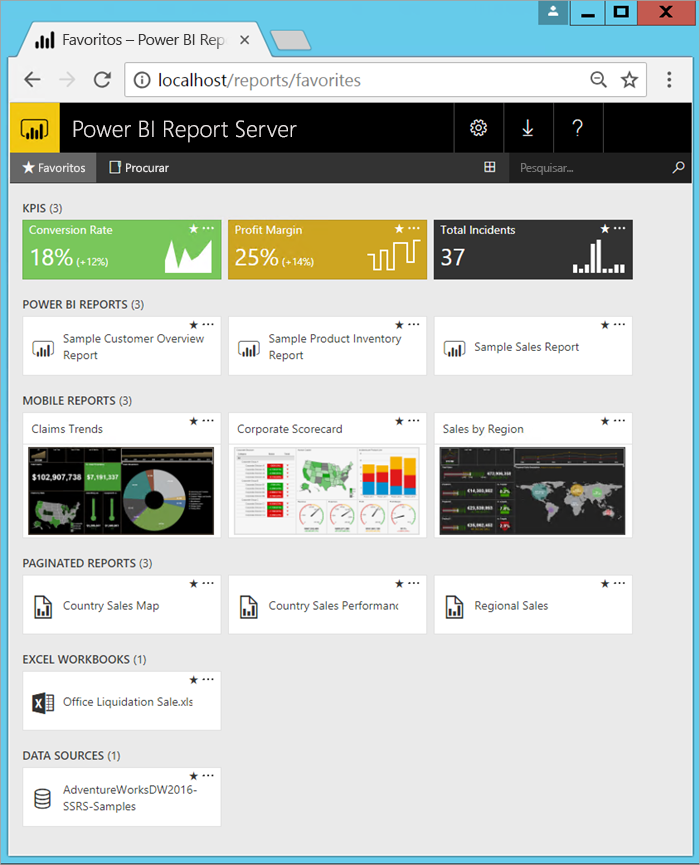

# O que é o Power BI Report Server?

O Power BI Report Server é um servidor de relatórios no local com um portal Web no qual apresenta e gere relatórios e KPIs, juntamente com as ferramentas para criar relatórios, relatórios paginados, relatórios móveis e KPIs do Power BI. Os seus utilizadores podem aceder a esses relatórios de várias formas: visualizá-los num browser ou num dispositivo móvel, ou como uma mensagem de e-mail na caixa de entrada.

## Comparar o Power BI Report Server 
O Power BI Report Server é semelhante ao SQL Server Reporting Services e ao serviço online Power BI, mas de formas diferentes. À semelhança do serviço Power BI, o Power BI Report Server aloja relatórios do Power BI (.PBIX) e ficheiros do Excel. À semelhança do Reporting Services, o Power BI Report Server é local e aloja relatórios paginados (.RDL). O Power BI Report Server é um superconjunto do Reporting Services: tudo o que pode fazer no Reporting Services, pode fazê-lo com o Power BI Report Server e ainda mais, com a adição de suporte para relatórios do Power BI. Veja [Comparar o Power BI Report Server e o serviço Power BI](compare-report-server-service.md) para saber os detalhes.

## Licenciar o Power BI Report Server
O Power BI Report Server está disponível através de duas licenças diferentes: [Power BI Premium](../service-premium.md) e [SQL Server Enterprise Edition](https://www.microsoft.com/sql-server/sql-server-2017-editions) com Software Assurance. Com uma licença Power BI Premium, pode criar uma implementação híbrida (ao combinar cloud e no local).  

## Portal Web
O ponto de entrada do Power BI Report Server é um portal Web seguro que pode ver em qualquer browser moderno. Aqui, pode aceder a todos os seus relatórios e KPIs. O conteúdo no portal Web é organizado numa hierarquia de pastas tradicional. Nas suas pastas, o conteúdo é agrupado por tipo: relatórios do Power BI, relatórios móveis, relatórios paginados, KPIs e livros do Excel, além de conjuntos de dados partilhados e origens de dados partilhadas para utilizar como blocos de criação dos seus relatórios. Pode etiquetar favoritos para os visualizar numa única pasta. Pode também criar KPIs diretamente no portal Web. 

Consoante as suas permissões, pode gerir o conteúdo no portal Web. Pode agendar o processamento de relatórios, aceder a relatórios a pedido e subscrever os relatórios publicados. Também pode aplicar a sua [imagem corporativa](https://docs.microsoft.com/sql/reporting-services/branding-the-web-portal) personalizada ao seu portal Web. 

Mais sobre o [Portal Web do Power BI Report Server](https://docs.microsoft.com/sql/reporting-services/web-portal-ssrs-native-mode).

## Relatórios do Power BI
Pode criar relatórios do Power BI (.PBIX) com a versão do Power BI Desktop otimizada para o servidor de relatórios. Em seguida, publica-os e visualiza-os no portal Web no seu próprio ambiente.

Um relatório do Power BI é uma vista de várias perspetivas sobre um modelo de dados, com visualizações que representam diferentes achados e informações desse modelo de dados.  Um relatório pode ter uma única visualização ou páginas cheias de visualizações. Consoante a sua função, pode ler e explorar relatórios, ou pode criá-los para outras pessoas.

Instale o [Power BI Desktop otimizado para o Power BI Report Server](quickstart-create-powerbi-report.md).

## Relatórios paginados
Os relatórios paginados (.RDL) são relatórios num estilo de documento com visualizações, em que as tabelas se expandem horizontal e verticalmente para apresentar todos os dados, e continuam de página para página, conforme seja necessário. São ótimos para gerar documentos com esquema fixo e aspeto perfeito, otimizados para impressão, como ficheiros PDF e Word.

Pode criar relatórios com aspeto moderno através do [Report Builder](https://docs.microsoft.com/sql/reporting-services/report-builder/report-builder-in-sql-server-2016) ou do Report Designer no [SQL Server Data Tools (SSDT)](https://docs.microsoft.com/sql/reporting-services/tools/reporting-services-in-sql-server-data-tools-ssdt).

## Relatórios móveis do Reporting Services
Os relatórios móveis ligam-se aos dados no local e têm um esquema responsivo que se adapta aos diferentes dispositivos e formas de os segurar. São criados com o SQL Server Mobile Report Publisher.

Mais sobre os [Relatórios móveis do Reporting Services](https://docs.microsoft.com/sql/reporting-services/mobile-reports/create-mobile-reports-with-sql-server-mobile-report-publisher). 

## Funcionalidades de programação do Report Server
Tire partido das funcionalidades de programação do Power BI Report Server para alargar e personalizar o seu funcionamento de relatórios, com APIs para integrar ou expandir dados e processamento de relatórios em aplicações personalizadas.

Mais [documentação para programadores do Report Server](https://docs.microsoft.com/sql/reporting-services/reporting-services-developer-documentation).

## Próximos passos
[Instalar o Power BI Report Server](install-report-server.md)  
[Instalar o Report Builder](https://docs.microsoft.com/sql/reporting-services/install-windows/install-report-builder)  

Mais perguntas? [Experimente perguntar à Comunidade do Power BI](https://community.powerbi.com/)

