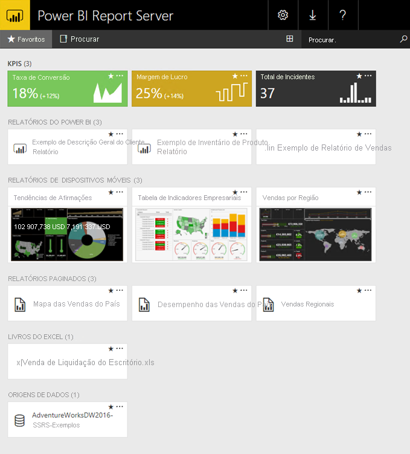

# O que é o Power BI Report Server?

O Power BI Report Server é um servidor de relatórios no local com um portal Web em que pode apresentar e gerir relatórios e indicadores chave de desempenho. Inclui ferramentas para criar relatórios do Power BI, relatórios paginados, relatórios móveis e indicadores chave de desempenho. Os seus utilizadores podem aceder a esses relatórios de várias formas: visualizá-los num browser ou num dispositivo móvel, ou como uma mensagem de e-mail na caixa de entrada.

## Comparar o Power BI Report Server 
O Power BI Report Server é semelhante ao SQL Server Reporting Services e ao serviço online Power BI, mas de formas diferentes. À semelhança do serviço Power BI, o Power BI Report Server aloja relatórios do Power BI (.pbix), ficheiros do Excel e relatórios paginados (.rdl). À semelhança do Reporting Services, o Power BI Report Server é local. As funcionalidades do Power BI Report Server são um superconjunto do Reporting Services: tudo o que pode fazer no Reporting Services, pode fazê-lo com o Power BI Report Server, que também tem suporte para relatórios do Power BI. Veja [Comparar o Power BI Report Server e o serviço Power BI](compare-report-server-service.md) para saber os detalhes.

## Licenciar o Power BI Report Server
O Power BI Report Server está disponível através de duas licenças diferentes: [Power BI Premium](../admin/service-premium-what-is.md) e SQL Server Enterprise Edition com Software Assurance. Veja o [Licenciamento em Volume da Microsoft](https://www.microsoftvolumelicensing.com/DocumentSearch.aspx?Mode=3&DocumentTypeId=1&ShowArchived=True) para obter detalhes. Com uma licença Power BI Premium, pode criar uma implementação híbrida (ao combinar cloud e no local).

Se publicar relatórios do Power BI no Power BI Report Server, também precisa de uma licença do Power BI Pro. Não precisa de uma licença do Power BI Pro para ver e interagir com relatórios do Power BI no Power BI Report Server.

> [!NOTE]
> No Power BI Premium, o Power BI Report Server só é incluído com os P SKUs. Não é incluído com os EM SKUs.

## Portal Web
O ponto de entrada do Power BI Report Server é um portal Web seguro que pode ver em qualquer browser moderno. Aqui pode aceder a todos os seus relatórios e indicadores chave de desempenho. O conteúdo no portal Web é organizado numa hierarquia de pastas tradicional. Nas suas pastas, o conteúdo é agrupado por tipo: relatórios do Power BI, relatórios móveis, relatórios paginados, indicadores chave de desempenho e livros do Excel. Os conjuntos de dados partilhados e as origens de dados partilhadas estão nas suas próprias pastas, para serem utilizados como elementos dos seus relatórios. Pode etiquetar favoritos para os ver numa única pasta. Também pode criar indicadores chave de desempenho diretamente no portal Web. 

Consoante as suas permissões, pode gerir o conteúdo no portal Web. Pode agendar o processamento de relatórios, aceder a relatórios a pedido e subscrever os relatórios publicados. Também pode aplicar a sua [imagem corporativa](/sql/reporting-services/branding-the-web-portal) personalizada ao seu portal Web. 

Mais sobre o [Portal Web do Power BI Report Server](/sql/reporting-services/web-portal-ssrs-native-mode).

## Relatórios do Power BI
Pode criar relatórios do Power BI (.pbix) com a versão do Power BI Desktop otimizada para o servidor de relatórios. Em seguida, pode publicar e vê-los no portal Web no seu próprio ambiente.

Um relatório do Power BI é uma vista de várias perspetivas sobre um modelo de dados, com visualizações que representam diferentes achados e informações desse modelo de dados.  Um relatório pode ter uma única visualização ou páginas cheias de visualizações. Consoante a sua função, pode ler e explorar relatórios, ou pode criá-los para outras pessoas.

Saiba mais sobre [instalar o Microsoft Power BI Desktop](install-powerbi-desktop.md).

## Relatórios paginados
Os relatórios paginados (.rdl) são relatórios num estilo de documento com visualizações, em que as tabelas se expandem horizontal e verticalmente para apresentar todos os dados, e continuam de página para página, conforme seja necessário. São ótimos para gerar documentos com um esquema fixo e aspeto perfeito, otimizados para impressão, como ficheiros PDF e Word. 

Pode criar relatórios paginados através do [Report Builder](/sql/reporting-services/report-builder/report-builder-in-sql-server-2016) ou do Report Designer no [SQL Server Data Tools (SSDT)](/sql/reporting-services/tools/reporting-services-in-sql-server-data-tools-ssdt).

## Relatórios móveis do Reporting Services
Os relatórios móveis ligam-se aos dados no local e têm um esquema responsivo que se adapta aos diferentes dispositivos e formas de os segurar. São criados com o SQL Server Mobile Report Publisher.

Mais sobre os [Relatórios móveis do Reporting Services](/sql/reporting-services/mobile-reports/create-mobile-reports-with-sql-server-mobile-report-publisher). 

## Funcionalidades de programação do Report Server
Tire partido das funcionalidades de programação do Power BI Report Server para expandir e personalizar os seus relatórios, com APIs para integrar ou expandir dados e processamento de relatórios em aplicações personalizadas.

Mais [documentação para programadores do Report Server](/sql/reporting-services/reporting-services-developer-documentation).

## Próximos passos
[Instalar o Power BI Report Server](install-report-server.md)  
[Transferir o Report Builder](https://www.microsoft.com/download/details.aspx?id=53613)  

Mais perguntas? [Experimente perguntar à Comunidade do Power BI](https://community.powerbi.com/)