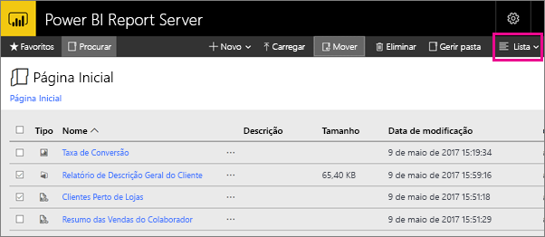

# Navegar no portal Web do Power BI Report Server
O portal Web do Power BI Report Server é uma localização no local para ver, armazenar e gerir relatórios móveis paginados do Power BI e KPIs.

Pode ver o portal Web em qualquer browser moderno. No portal Web, os relatórios e os KPIs estão organizados em pastas e pode marcá-los como favoritos. Pode também armazenar livros do Excel. No portal Web, pode iniciar as ferramentas necessárias para criar relatórios:

* **Relatórios do Power BI** criados com o Power BI Desktop: visualize-os no portal Web e nas aplicações móveis do Power BI.
* **Relatórios paginados** criados no Report Builder: documentos modernos de esquema fixo otimizados para impressão.
* **KPIs** criados diretamente no portal Web.

No portal Web, pode procurar as pastas do servidor de relatórios ou relatórios específicos. Pode ver um relatório, as respetivas propriedades gerais e cópias anteriores do relatório capturadas no histórico de relatórios. Consoante as suas permissões, poderá também subscrever relatórios para entrega na caixa de entrada do seu e-mail ou numa pasta partilhada no sistema de ficheiros.

## Tarefas do portal Web
Pode utilizar o portal Web para várias tarefas, incluindo as seguintes:

* Ver, procurar, imprimir e subscrever relatórios.
* Criar, proteger e manter a hierarquia de pastas para organizar os itens no servidor.
* Configurar as propriedades de execução, o histórico e os parâmetros dos relatórios.
* Criar agendas e origens de dados partilhadas para facilitar a gestão das ligações a agendas e origens de dados.
* Criar subscrições condicionadas por dados para implementar relatórios numa lista de destinatários de grandes dimensões.
* Criar relatórios ligados para reutilizar um relatório existente de diferentes formas.
* Transferir e abrir ferramentas comuns, como o Power BI Desktop (Report Server), o Report Builder e o Mobile Report Publisher.
* [Criar KPIs](https://docs.microsoft.com/sql/reporting-services/working-with-kpis-in-reporting-services).
* Enviar comentários ou efetuar pedidos de funcionalidades.
* [Criar uma imagem corporativa para o portal Web](https://docs.microsoft.com/sql/reporting-services/branding-the-web-portal)
* [Trabalhar com KPIs](https://docs.microsoft.com/sql/reporting-services/working-with-kpis-in-reporting-services)
* [Trabalhar com conjuntos de dados partilhados](https://docs.microsoft.com/sql/reporting-services/work-with-shared-datasets-web-portal)

## Funções e permissões do portal Web
O portal Web é uma aplicação Web executada num browser. Quando inicia o portal Web, as páginas, ligações e opções visualizadas variam com base nas suas permissões no servidor de relatórios. Se estiver atribuído a uma função com todas as permissões, tem acesso ao conjunto completo de menus e páginas de aplicação para gerir um servidor de relatórios. Se estiver atribuído a uma função com permissões para ver e executar relatórios, vê apenas os menus e as páginas de que precisa para essas atividades. Pode ter atribuições de funções diferentes para vários servidores de relatórios ou mesmo para os vários relatórios e pastas num único servidor de relatórios.

## Iniciar o portal Web
1. Abra o browser.
   
    Veja esta lista de [versões e browsers suportados](browser-support.md).
2. Na barra de endereço, escreva o URL do portal Web.
   
    Por predefinição, o URL é *http://[NomedoComputador]/reports*.
   
    O servidor de relatórios pode ser configurado para utilizar uma porta específica. Por exemplo, *http://[NomedoComputador]:80/reports* ou *http://[NomedoComputador]:8080/reports*
   
    Verá que o portal Web agrupa os itens nestas categorias:
   
   * KPIs
   * Relatórios móveis
   * Relatórios paginados
   * Relatórios do Power BI Desktop
   * Livros do Excel
   * Conjuntos de dados
   * Origens de dados
   * Recursos

## Criar e editar relatórios do Power BI Desktop (ficheiros .pbix)
Pode ver, carregar, criar, organizar e gerir as permissões para relatórios do Power BI Desktop no portal Web.

### Criar um relatório do Power BI Desktop
1. Selecione **Novo** > **Relatório do Power BI**.
   
    
   
    É aberta a aplicação Power BI Desktop.
   
    
2. Crie o seu relatório do Power BI. Veja [Início rápido: relatórios do Power BI](quickstart-create-powerbi-report.md) para obter detalhes.
3. Carregue o relatório para o servidor de relatório.

### Editar um relatório do Power BI Desktop existente
1. Selecione as reticências (**...**) no canto superior direito do mosaico do relatório > **Editar no Power BI Desktop**.
   
    
   
    É aberta a aplicação Power BI Desktop.
2. Efetue as alterações e guarde... [como?]

## Criar e editar relatórios paginados (ficheiros .rdl)
Pode ver, carregar, criar, organizar e gerir as permissões para relatórios paginados no portal Web.

### Criar um relatório paginado
1. Selecione **Novo** > **Relatório Paginado**.
   
    É aberta a aplicação Report Builder.
   
    
2. Crie o relatório paginado. Veja [Início rápido: relatórios paginados](quickstart-create-paginated-report.md) para obter detalhes.
3. Carregue o relatório para o servidor de relatório.

### Editar um relatório paginado existente
1. Selecione as reticências (...) no canto superior direito do mosaico do relatório > **Editar no Report Builder**.
   
    
   
    É aberta a aplicação Report Builder.
2. Efetue as alterações e guarde.

## Carregar e organizar livros do Excel
Pode carregar, organizar e gerir as permissões para relatórios do Power BI Desktop e livros do Excel. Estes serão agrupados no portal Web.

Os livros são armazenados no Power BI Report Server, semelhante a outros ficheiros de recursos. Selecionar um dos livros transfere-o localmente para o seu ambiente de trabalho. Pode guardar as alterações efetuadas ao carregá-lo novamente para o servidor de relatórios.

## Gerir itens no portal Web
O Power BI Report Server disponibiliza um controlo detalhado dos itens que armazena no portal Web. Por exemplo, pode configurar subscrições, a colocação em cache, instantâneos e a segurança em relatórios paginados individuais.

1. Selecione as reticências (...) no canto superior direito de um item e, em seguida, selecione **Gerir**.
   
    
2. Escolha a propriedade ou outra funcionalidade que queira definir.
   
    
3. Selecione **Aplicar**.

Leia mais sobre [Trabalhar com subscrições no portal Web](https://docs.microsoft.com/sql/reporting-services/working-with-subscriptions-web-portal).

## Etiquetar relatórios e KPIs favoritos
Pode etiquetar os relatórios e KPIs que quer que sejam favoritos. São mais fáceis de localizar porque estão todos numa única pasta Favoritos, tanto no portal Web como nas aplicações móveis do Power BI. 

1. Selecione as reticências (**...**) no canto superior direito do KPI ou relatório que quer tornar um favorito e selecione **Adicionar aos Favoritos**.
   
    
2. Selecione **Favoritos** no friso do portal Web para vê-lo juntamente com os outros favoritos na página Favoritos no portal Web.
   
    
   
    Agora, nas aplicações móveis do Power BI, pode ver estes favoritos juntamente com os seus dashboards favoritos do serviço Power BI.
   
    

## Ocultar ou ver itens no portal Web
Pode ocultar os itens no portal Web e pode optar por ver os itens ocultos.

### Ocultar um item
1. Selecione as reticências (...) no canto superior direito de um item e, em seguida, selecione **Gerir**.
   
    
2. Selecione **Ocultar este item**.
   
    
3. Selecione **Aplicar**.

### Ver itens ocultos
1. Selecione **Mosaicos** (ou **Lista**) no canto superior direito > **Mostrar itens ocultos**.
   
    Os itens são apresentados. Estão desativados, mas ainda consegue abri-los e editá-los.
   
    

## Procurar itens
Pode introduzir um termo de pesquisa e verá tudo aquilo a que pode aceder. Os resultados são categorizados em KPIs, relatórios, conjuntos de dados e outros itens. Em seguida, pode interagir com os resultados e adicioná-los aos favoritos.  

## Mover ou eliminar itens na vista Lista
Por predefinição, o portal Web apresenta o conteúdo na vista Mosaico.

Pode mudar para a vista Lista, onde é fácil mover ou eliminar vários itens em simultâneo. 

1. Selecione **Mosaicos** > **Lista**.
   
    
2. Selecione os itens e, em seguida, selecione **Mover** ou **Eliminar**.

## Passos seguintes
[Manual do utilizador](user-handbook-overview.md)  
[Início rápido: relatórios paginados](quickstart-create-paginated-report.md)  
[Início rápido: relatórios do Power BI](quickstart-create-powerbi-report.md)

Mais perguntas? [Experimente perguntar à Comunidade do Power BI](https://community.powerbi.com/)

