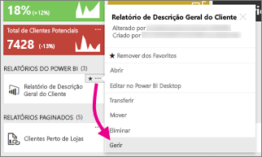

# Gerir conteúdo no portal Web 
O portal Web do Power BI Report Server é uma localização no local para ver, armazenar e gerir relatórios móveis paginados do Power BI e KPIs.

Pode ver o portal Web em qualquer browser moderno. No portal Web, os relatórios e os KPIs estão organizados em pastas e pode marcá-los como favoritos. Também pode armazenar livros do Excel. No portal Web, pode iniciar as ferramentas necessárias para criar relatórios:

* **Relatórios do Power BI** criados com o Power BI Desktop: visualize-os no portal Web e nas aplicações móveis do Power BI.
* **Relatórios paginados** criados no Report Builder: documentos modernos de esquema fixo otimizados para impressão.
* **KPIs** criados diretamente no portal Web.

No portal Web, pode procurar as pastas do servidor de relatórios ou relatórios específicos. Pode ver um relatório, as respetivas propriedades gerais e cópias anteriores do relatório capturadas no histórico de relatórios. Consoante as suas permissões, poderá também subscrever relatórios para entrega na caixa de entrada do seu e-mail ou numa pasta partilhada no sistema de ficheiros.

## Funções e permissões do portal Web
A aplicação portal Web é executada num browser. Quando inicia o portal Web, as páginas, ligações e opções visualizadas variam com base nas suas permissões no servidor de relatórios. Se estiver atribuído a uma função com todas as permissões, tem acesso ao conjunto completo de menus e páginas de aplicação para gerir um servidor de relatórios. Se estiver atribuído a uma função com permissões para ver e executar relatórios, vê apenas os menus e as páginas de que precisa para essas atividades. Pode ter atribuições de funções diferentes para vários servidores de relatórios ou mesmo para os vários relatórios e pastas num único servidor de relatórios.

## Iniciar o portal Web
1. Abra o browser.
   
    Veja esta lista de [versões e browsers suportados](browser-support.md).
2. Na barra de endereço, escreva o URL do portal Web.
   
    Por predefinição, o URL é <em>https://[NomedoComputador]/reports</em>.
   
    O servidor de relatórios pode ser configurado para utilizar uma porta específica. Por exemplo, <em>https://[NomedoComputador]:80/reports</em> ou <em>https://[NomedoComputador]:8080/reports</em>
   
    Verá que o portal Web agrupa os itens nestas categorias:
   
   * KPIs
   * Relatórios móveis
   * Relatórios paginados
   * Relatórios do Power BI Desktop
   * Livros do Excel
   * Conjuntos de dados
   * Data sources
   * Resources (Recursos)

## Gerir itens no portal Web
O Power BI Report Server disponibiliza um controlo detalhado dos itens que armazena no portal Web. Por exemplo, pode configurar subscrições, a colocação em cache, instantâneos e a segurança em relatórios paginados individuais.

1. Selecione **Mais opções** (...) no canto superior direito de um item e, em seguida, selecione **Gerir**.
   
    
2. Escolha a propriedade ou outra funcionalidade que queira definir.
   
    
3. Selecione **Aplicar**.

Leia mais sobre [Trabalhar com subscrições no portal Web](https://docs.microsoft.com/sql/reporting-services/working-with-subscriptions-web-portal).

## Próximas etapas
[O que é o Power BI Report Server?](get-started.md)

Mais perguntas? [Experimente perguntar à Comunidade do Power BI](https://community.powerbi.com/)

