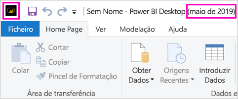

# Instalar o Power BI Desktop otimizado para o Power BI Report Server

Para criar relatórios do Power BI para o Power BI Report Server, tem de transferir e instalar o Power BI Desktop otimizado para o Power BI Report Server. Esta versão é diferente da do Power BI Desktop utilizada no serviço Power BI. Por exemplo, a versão do Power BI Desktop do serviço Power BI inclui funcionalidades de pré-visualização que não serão incluídas na versão do Power BI Report Server até serem lançadas. A utilização desta versão garante que o servidor de relatórios pode interagir com uma versão conhecida dos relatórios e do modelo. 

A boa notícia é que pode instalar o Power BI Desktop e o Power BI Desktop otimizado para o Power BI Report Server paralelamente no mesmo computador.

## Transferir e instalar o Power BI Desktop

A forma mais fácil de garantir que tem a versão mais atualizada do Power BI Desktop otimizado para o Power BI Report Server é começar a partir do portal web do seu servidor de relatórios.

1. No portal Web do Report Server, selecione a seta **Transferir** > **Power BI Desktop**.

    

    Ou aceda diretamente à [Microsoft Power BI Desktop](https://www.microsoft.com/download/details.aspx?id=56723) (otimizado para o Power BI Report Server – Maio de 2019) no Microsoft Download Center.

2. Na página do Centro de Transferências, selecione **Transferir**.

3. Consoante o seu computador, selecione: 

    - **PBIDesktopRS.msi** (a versão de 32 bits) ou

    - **PBIDesktopRS_x64.msi** (a versão de 64 bits).

1. Depois de transferir o instalador, execute o Assistente de configuração do Power BI Desktop (Maio de 2019).

2. No final da instalação, selecione **iniciar o Power BI Desktop**.

    Este inicia automaticamente e está pronto para começar.

## Confirmar que está a utilizar a versão correta
É fácil verificar se está a utilizar a versão correta do Power BI Desktop: observe o ecrã inicial ou a barra de título no Power BI Desktop. A barra de título indica o mês e o ano da versão. Além disso, as cores do logótipo do Power BI estão invertidas: o logótipo surge a amarelo sobre um fundo preto em vez de aparecer a preto sobre um fundo amarelo.

A versão do Power BI Desktop para o serviço Power BI não tem o mês e ano na barra de título.

## Associação de extensões de ficheiros
Se instalar o Power BI Desktop e o Power BI Desktop otimizado para o Power BI Report Server no mesmo computador, a instalação do Power BI Desktop mais recente será associada a ficheiros .pbix. Por conseguinte, ao fazer duplo clique num ficheiro .pbix, este irá iniciar a versão do Power BI Desktop que instalou mais recentemente.

Se tiver o Power BI Desktop e, em seguida, instalar o Power BI Desktop otimizado para o Power BI Report Server, todos os ficheiros .pbix serão abertos no Power BI Desktop otimizado para o Power BI Report Server por predefinição. Se preferir que o Power BI Desktop seja iniciado por predefinição ao abrir um ficheiro pbix, reinstale o [Power BI Desktop a partir da Microsoft Store](http://aka.ms/pbidesktopstore).

Pode sempre começar por abrir a versão do Power BI Desktop que pretende utilizar. Em seguida, abra o ficheiro no Power BI Desktop.

Editar um relatório do Power BI a partir do Power BI Report Server, ou criar um novo relatório do Power BI a partir do web portal, sempre abre-se a versão correta do Power BI Desktop.

## Considerações e limitações

Os relatórios do Power BI no Power BI Report Server, no serviço Power BI (http://app.powerbi.com) e nas aplicações móveis do Power BI têm um comportamento quase igual, mas com algumas diferenças em funcionalidades.

### Num browser

Os relatórios do Power BI Report Server suportam quase todas as visualizações, incluindo os elementos visuais personalizados. Os relatórios do Power BI Report Server não suportam:

* Visuais R
* Mapas ArcGIS
* Trilhos
* Funcionalidades de pré-visualização do Power BI Desktop

### Nas aplicações móveis do Power BI

Os relatórios do Power BI Report Server suportam todas as funcionalidades básicas nas [aplicações móveis do Power BI](../consumer/mobile/mobile-apps-for-mobile-devices.md), incluindo:

* [Esquema de relatório de telemóvel](../desktop-create-phone-report.md): pode otimizar um relatório para as aplicações móveis do Power BI. No telemóvel, os relatórios otimizados têm um ícone  e um esquema especiais.
  
    

Os relatórios do Power BI Report Server não suportam estas funcionalidades nas aplicações móveis do Power BI:

* Visuais R
* Mapas ArcGIS
* Elementos visuais personalizados
* Trilhos
* Códigos de barra ou filtragem geográfica

## Power BI Desktop para versões anteriores do Power BI Report Server

Se o seu servidor de relatórios se encontrar numa versão anterior, irá precisar da versão correspondente do Power BI Desktop. Aqui está o link para baixar a versão anterior.

- Microsoft Power BI Desktop ([otimizado para o Power BI Report Server – Janeiro de 2019](https://go.microsoft.com/fwlink/?linkid=2055039))

## Próximos passos

Agora que o Power BI Desktop está instalado, pode começar a criar relatórios do Power BI.

[Criar um relatório do Power BI para o Power BI Report Server](quickstart-create-powerbi-report.md)  
[O que é o Power BI Report Server?](get-started.md)

Mais perguntas? [Experimente perguntar à Comunidade do Power BI](https://community.powerbi.com/)
