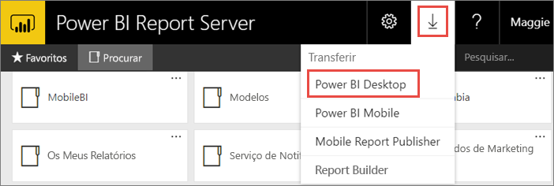
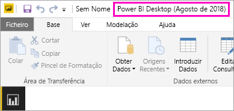
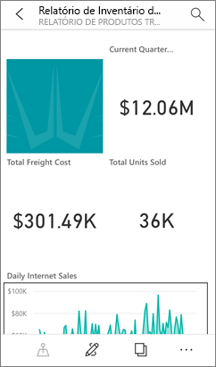

# Instalar o Power BI Desktop otimizado para o Power BI Report Server
Saiba como instalar o Power BI Desktop otimizado para o Power BI Report Server.

Para criar relatórios do Power BI para o Power BI Report Server, tem de transferir e instalar o Power BI Desktop otimizado para o Power BI Report Server. Esta versão é diferente da do Power BI Desktop utilizada no serviço Power BI. Por exemplo, a versão do Power BI Desktop para o serviço Power BI inclui funcionalidades de pré-visualização que não estão disponíveis na versão do Power BI Report Server até depois de terem sido lançadas. A utilização desta versão garante que o servidor de relatórios pode interagir com uma versão conhecida dos relatórios e do modelo. 

A boa notícia é que pode instalar o Power BI Desktop e o Power BI Desktop otimizado para o Power BI Report Server paralelamente no mesmo computador.

## Transferir e instalar o Power BI Desktop

A forma mais fácil de garantir que tem a versão mais atualizada do Power BI Desktop otimizado para o Power BI Report Server é começar a partir do portal web do seu servidor de relatórios.

1. No portal Web do Report Server, selecione a seta **Transferir** > **Power BI Desktop**.

    

    Em alternativa, pode aceder diretamente ao [Microsoft Power BI Desktop](https://www.microsoft.com/en-us/download/details.aspx?id=57271) (Otimizado para o Power BI Report Server – agosto de 2018) no Centro de Transferências da Microsoft.

2. Na página do Centro de Transferências, selecione **Transferir**.

3. Consoante o seu computador, selecione: 

    - **PBIDesktopRS.msi** (a versão de 32 bits) ou

    - **PBIDesktopRS_x64.msi** (a versão de 64 bits).

1. Após transferir o instalador, execute o Assistente de Configuração do Power BI Desktop (agosto de 2018).

2. No final da instalação, selecione a opção **Iniciar o Power BI Desktop agora**.
   
    Este inicia automaticamente e está pronto para começar.

## Certificar-se de que está a utilizar a versão correta
Pode garantir que está a utilizar a versão correta do Power BI Desktop ao ver o ecrã inicial ou a barra de título no Power BI Desktop. A barra de título indica o mês e o ano da versão.

A versão do Power BI Desktop para o serviço Power BI não tem o mês e ano na barra de título.

## Associação de extensões de ficheiros
Se instalou o Power BI Desktop e o Power BI Desktop otimizado para o Power BI Report Server no mesmo computador, a última instalação do Power BI Desktop terá a associação de ficheiro a .pbix. Significa que, sempre que fizer duplo clique num ficheiro pbix, será iniciado o último Power BI Desktop a ser instalado.

Se tinha o Power BI Desktop e, posteriormente, instalou o Power BI Desktop otimizado para o Power BI Report Server, todos os ficheiros pbix serão abertos no Power BI Desktop otimizado para o Power BI Report Server por predefinição. Se prefere que o Power BI Desktop seja iniciado por predefinição ao abrir um ficheiro pbix, reinstale o Power BI Desktop a partir do serviço Power BI.

Pode sempre começar por abrir a versão do Power BI Desktop que pretende utilizar. Em seguida, abra o ficheiro no Power BI Desktop.

Editar um relatório do Power BI a partir do Power BI Report Server, ou criar um novo relatório do Power BI a partir do portal Web, irá sempre abrir a versão correta do Power BI Desktop.

## Considerações e limitações
Os relatórios do Power BI no Power BI Report Server, no serviço Power BI (http://app.powerbi.com) e nas aplicações móveis do Power BI têm um comportamento quase igual, mas com algumas diferenças em funcionalidades.

### Num browser
Os relatórios do Power BI Report Server suportam todas as visualizações, incluindo:

* Elementos visuais personalizados

Os relatórios do Power BI Report Server não suportam:

* Visuais R
* Mapas ArcGIS
* Trilhos
* Funcionalidades de pré-visualização do Power BI Desktop

### Nas aplicações móveis do Power BI
Os relatórios do Power BI Report Server suportam todas as funcionalidades básicas nas [aplicações móveis do Power BI](../consumer/mobile/mobile-apps-for-mobile-devices.md), incluindo:

* [Esquema de relatório em telemóvel](../desktop-create-phone-report.md): Pode otimizar um relatório para as aplicações móveis do Power BI. No telemóvel, os relatórios otimizados têm um ícone  e um esquema especiais.
  
    

Os relatórios do Power BI Report Server não suportam estas funcionalidades nas aplicações móveis do Power BI:

* Visuais R
* Mapas ArcGIS
* Elementos visuais personalizados
* Trilhos
* Geofiltragem em códigos de barras

## Power BI Desktop para versões anteriores do Power BI Report Server

Se o seu servidor de relatórios se encontrar numa versão anterior, irá precisar da versão correspondente do Power BI Desktop. Eis as duas versões anteriores.

- Microsoft Power BI Desktop ([Otimizado para o Power BI Report Server – outubro de 2017](https://www.microsoft.com/download/details.aspx?id=56136))
- Microsoft Power BI Desktop ([Otimizado para o Power BI Report Server – junho de 2017](https://www.microsoft.com/download/details.aspx?id=55330))

## Próximos passos
Agora que o Power BI Desktop está instalado, pode começar a criar relatórios do Power BI.

[Criar um relatório do Power BI para o Power BI Report Server](quickstart-create-powerbi-report.md)  
[O que é o Power BI Report Server?](get-started.md)

Mais perguntas? [Experimente perguntar à Comunidade do Power BI](https://community.powerbi.com/)

