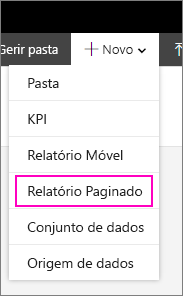

# Instalar o Report Builder – Power BI Report Server

O Report Builder é uma aplicação autónoma instalada no seu computador por si ou por um administrador. Pode instalar a partir do Centro de Transferências da Microsoft ou do Power BI Report Server.  

Está à procura de ajuda com a instalação do Report Builder do serviço Power BI? Veja [Power BI Report Builder](../paginated-reports/report-builder-power-bi.md).
  
Normalmente, um administrador instala e configura o Power BI Report Server, concede permissão para transferir o Report Builder a partir do portal Web e gere pastas e permissões para relatórios e conjuntos de dados partilhados no Report Server. Para obter mais informações sobre a administração do Power BI Report Server, veja [Descrição geral de administração, Power BI Report Server](admin-handbook-overview.md).  
  
## Requisitos do sistema
  
 Veja a secção **Requisitos do sistema** da [página de transferência do Report Builder](https://go.microsoft.com/fwlink/?LinkID=734968) no Centro de Transferências da Microsoft.
 
## Instalar o Report Builder a partir de um portal Web
  
Pode instalar o Report Builder a partir de um portal Web do Power BI Report Server. Pode já ter instalado o Report Builder para criar relatórios para um servidor SSRS. Pode utilizar a mesma versão ou o Report Builder para criar relatórios para o Power BI Report Server. Se ainda não o instalou, o processo é simples.

1. No portal Web do Power BI Report Server, selecione **Novo** > **Relatório Paginado**.
   
    
   
    Se ainda não tiver o Report Builder instalado, o Assistente do Microsoft Report Builder é iniciado.  
  
3.  Aceite os termos no contrato de licença > **Seguinte**.  
 
5.  Selecione **Instalar** para concluir a instalação do Report Builder.  

2. Após ser instalado, o Report Builder é aberto no ecrã **Novo Relatório ou Conjunto de Dados**.
   
    
 

##   Instalar o Report Builder a partir do Centro de Transferências  
  
1.  Na [página Report Builder do Centro de Transferências da Microsoft](https://go.microsoft.com/fwlink/?LinkID=734968), selecione **Transferir**.  
  
2.  Depois de transferir o Report Builder, selecione **Executar**.  
  
     O Assistente do Microsoft Report Builder é iniciado.  
  
3.  Aceite os termos no contrato de licença > **Seguinte**.  
 
5.  Selecione **Instalar** para concluir a instalação do Report Builder.  
 

## Próximas etapas

[O que é o Power BI Report Server?](get-started.md)
