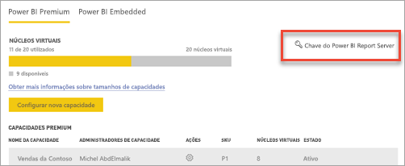
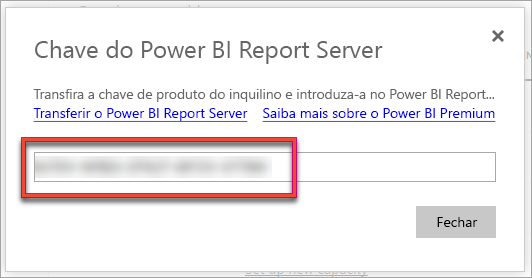
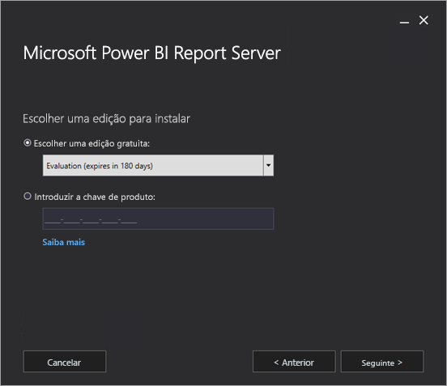
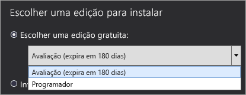
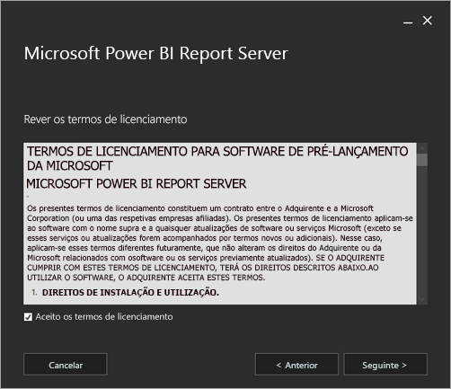
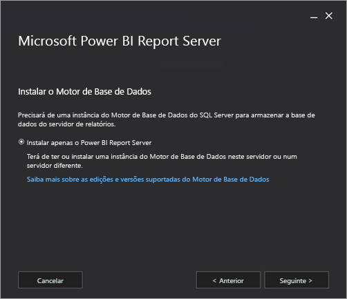
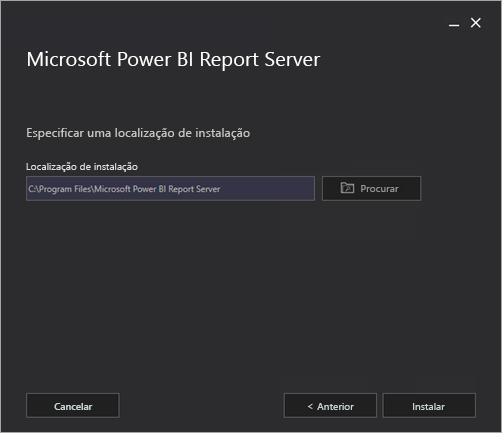
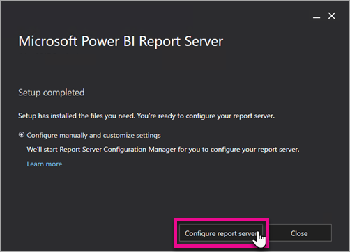
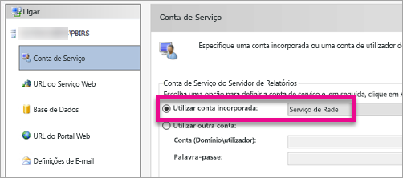
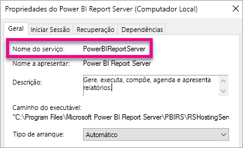

# Instalar o Power BI Report Server

Saiba como instalar o Power BI Report Server.

## Transferir o Power BI Report Server

Na página [Relatórios no local com o Power BI Report Server](https://powerbi.microsoft.com/report-server/), selecione **Transferir avaliação gratuita**.

Ao executar o ficheiro PowerBIReportServer.exe, selecione a versão de avaliação gratuita ou introduza a sua chave de produto. Continue a ler para obter mais informações.

## Antes da instalação

Antes de instalar o Power BI Report Server, recomendamos que veja os [Requisitos de Software e Hardware para instalar o Power BI Report Server](system-requirements.md).

 > [!IMPORTANT]
 > Embora possa instalá-lo num ambiente com um Controlador de Domínio Só de Leitura (RODC), o Power BI Report Server requer acesso a um Controlador de Domínio de Leitura/Escrita para funcionar devidamente. Se o Power BI Report Server tiver acesso apenas a um RODC, poderá encontrar erros ao tentar administrar o serviço.

### Chave de produto do Power BI Report Server

Pode obter a chave de produto do Power BI Report Server a partir de duas origens diferentes:

- Power BI Premium
- SQL Server Enterprise Software Assurance (SA)

Continue a ler para obter mais informações.

#### Power BI Premium

Se tiver adquirido o Power BI Premium, no separador **Definições premium** do portal de administração do Power BI, terá acesso à sua chave de produto do Power BI Report Server. O portal de administração está disponível apenas para Administradores Globais ou utilizadores com a função de administrador de serviço do Power BI atribuída.

Ao selecionar **chave do Power BI Report Server**, é apresentada uma caixa de diálogo que contém a sua chave de produto. Pode copiá-la e utilizá-la na instalação.

#### SQL Server Enterprise Software Assurance (SA)

Se tem um contrato do SQL Server Enterprise SA, pode obter a sua chave de produto no [Centro de Serviços de Licenciamento de Volume](https://www.microsoft.com/Licensing/servicecenter/).

## Instalar o servidor de relatório

É simples instalar o Power BI Report Server. Bastam alguns passos para instalar os ficheiros.

Não precisa de um servidor de Motor de Base de Dados do SQL Server aquando da instalação. Precisará de um para configurar o Reporting Services após a instalação.

1. Procure a localização do ficheiro PowerBIReportServer.exe e inicie o instalador.

2. Selecione **Instalar o Power BI Report Server**.

    
3. Selecione uma edição para instalar e, em seguida, selecione **Seguinte**.

    

    Selecione a edição de Avaliação ou de Programador.

    

    Em alternativa, introduza a chave de produto que obteve no serviço Power BI ou no Centro de Serviços de Licenciamento em Volume. Para obter mais informações sobre como obter a sua chave de produto, veja a secção [Antes da instalação](#before-you-install) apresentada acima.
4. Leia e aceite os termos e condições de licenciamento e, em seguida, selecione **Seguinte**.

    
5. Precisa de um Motor de Base de Dados disponível para armazenar a base de dados do servidor de relatórios. Selecione **Seguinte** para instalar apenas o servidor de relatório.

    
6. Especifique a localização de instalação para o servidor de relatório. Selecione **Instalar** para continuar.

    

    O caminho predefinido é C:\Program Files\Microsoft Power BI Report Server.

7. Após configurar com êxito, selecione **Configurar Report Server** para iniciar o Gestor de Configuração do Reporting Services.

    

## Configurar o seu servidor de relatórios

Após selecionar **Configurar Servidor de Relatórios** na configuração, é-lhe apresentado o Gestor de Configuração do Reporting Services. Para obter mais informações, consulte [Reporting Services Configuration Manager (Gestor de Configuração do Reporting Services - em inglês)](https://docs.microsoft.com/sql/reporting-services/install-windows/reporting-services-configuration-manager-native-mode).

Para concluir a configuração inicial do Reporting Services, [crie uma base de dados do servidor de relatórios](https://docs.microsoft.com/sql/reporting-services/install-windows/ssrs-report-server-create-a-report-server-database). É necessário um servidor de Base de dados do SQL Server para concluir este passo.

### Criar uma base de dados num servidor diferente

Se estiver a criar a base de dados do servidor de relatórios num servidor de base de dados num computador diferente, altere a conta de serviço do servidor de relatórios para uma credencial que seja reconhecida no servidor de base de dados. 

Por predefinição, o servidor de relatório utiliza a conta de serviços virtuais. Se tentar criar uma base de dados num servidor diferente, poderá receber o seguinte erro no passo Aplicar direitos de ligação.

`System.Data.SqlClient.SqlException (0x80131904): Windows NT user or group '(null)' not found. Check the name again.`

Para contornar este erro, pode alterar a conta de serviço para uma conta de domínio ou Serviço de Rede. Alterar a conta de serviço para Serviço de Rede aplica os direitos no contexto da conta de computador para o servidor de relatório.

Para obter mais informações, consulte [Configure the report server service account (Configurar a conta de serviço do servidor de relatório - em inglês)](https://docs.microsoft.com/sql/reporting-services/install-windows/configure-the-report-server-service-account-ssrs-configuration-manager).

## Serviço Windows

Um serviço Windows é criado como parte da instalação. É apresentado como **Power BI Report Server**. O nome de serviço é **PowerBIReportServer**.

## Reservas de URL predefinidas

As reservas de URL contêm um prefixo, nome de anfitrião, porta e diretório virtual:

| Parte | Descrição |
| --- | --- |
| Prefixo |O prefixo predefinido é HTTP. Se instalou anteriormente um certificado Secure Sockets Layer (SSL), a Configuração tenta criar reservas de URL que utilizem o prefixo HTTPS. |
| Nome do anfitrião |O nome de anfitrião predefinido é um caráter universal forte (+). Especifica que o servidor de relatório aceita qualquer pedido HTTP na porta designada para qualquer nome de anfitrião que resolva para o computador, incluindo `https://<computername>/reportserver`, `https://localhost/reportserver` ou `https://<IPAddress>/reportserver.` |
| Port |A porta predefinida é 80. Se utilizar uma porta que não a 80, tem de adicioná-la explicitamente ao URL quando abrir o portal Web numa janela do browser. |
| Diretório virtual |Por predefinição, os diretórios virtuais são criados no formato de ReportServer para o serviço Web do Report Server e Relatórios para o portal Web. Para o serviço Web do Report Server, o diretório virtual predefinido é **reportserver**. No portal Web, o diretório virtual predefinido é **reports**. |

Eis um exemplo da cadeia de URL completa:

* `https://+:80/reportserver` fornece acesso ao servidor de relatório.
* `https://+:80/reports` fornece acesso ao portal Web.

## Firewall

Se estiver a aceder a um servidor de relatórios num computador remoto, certifique-se de que configurou regras para a firewall, caso esta exista.

Abra a porta TCP que configurou para o seu URL de Serviço Web e URL do Portal Web. Por predefinição, estão configurados na porta TCP 80.

## Configuração adicional

* Para configurar a integração com o serviço Power BI para poder afixar itens de relatório a um dashboard do Power BI, consulte [Integrate with the Power BI service (Integração com o serviço Power BI - em inglês)](https://docs.microsoft.com/sql/reporting-services/install-windows/power-bi-report-server-integration-configuration-manager).
* Para configurar o e-mail para o processamento de subscrições, consulte [Definições de e-mails](https://docs.microsoft.com/sql/reporting-services/install-windows/e-mail-settings-reporting-services-native-mode-configuration-manager) e [Entrega de e-mails num servidor de relatório](https://docs.microsoft.com/sql/reporting-services/subscriptions/e-mail-delivery-in-reporting-services).
* Para configurar o portal Web para que possa aceder ao mesmo num computador de relatório para ver e gerir relatórios, consulte [Configurar uma firewall para acesso ao servidor de relatórios](https://docs.microsoft.com/sql/reporting-services/report-server/configure-a-firewall-for-report-server-access) e [Configurar um servidor de relatórios para administração remota](https://docs.microsoft.com/sql/reporting-services/report-server/configure-a-report-server-for-remote-administration).
* Para obter detalhes sobre como definir as propriedades do sistema do servidor de relatório no SQL Server Management Studio, veja [Server Properties Advanced Page](https://docs.microsoft.com/sql/reporting-services/tools/server-properties-advanced-page-reporting-services) (Página das Propriedades Avançadas do Servidor). A menos que seja especificado o contrário, as opções aplicam-se tanto ao Power BI Report Server como ao SQL Server Reporting Service.

## Próximas etapas

[Descrição geral para administradores](admin-handbook-overview.md)  
[Como encontrar a sua chave de produto de servidor de relatório](find-product-key.md)  
[Instalar o Power BI Desktop otimizado para o Power BI Report Server](install-powerbi-desktop.md)  
[Verify a Reporting Services installation](https://docs.microsoft.com/sql/reporting-services/install-windows/verify-a-reporting-services-installation) (Verificar uma instalação do Reporting Services)  
[Configurar a conta de serviço do servidor de relatórios](https://docs.microsoft.com/sql/reporting-services/install-windows/configure-the-report-server-service-account-ssrs-configuration-manager)  
[Configurar URLs do servidor de relatórios](https://docs.microsoft.com/sql/reporting-services/install-windows/configure-report-server-urls-ssrs-configuration-manager)  
[Configurar uma ligação à base de dados do servidor de relatórios](https://docs.microsoft.com/sql/reporting-services/install-windows/configure-a-report-server-database-connection-ssrs-configuration-manager)  
[Inicializar um servidor de relatórios](https://docs.microsoft.com/sql/reporting-services/install-windows/ssrs-encryption-keys-initialize-a-report-server)  
[Configurar ligações SSL num servidor de relatório](https://docs.microsoft.com/sql/reporting-services/security/configure-ssl-connections-on-a-native-mode-report-server)  
[Configurar permissões e contas de serviço Windows](https://docs.microsoft.com/sql/database-engine/configure-windows/configure-windows-service-accounts-and-permissions)  
[Suporte do browser para o Power BI Report Server](browser-support.md)

Mais perguntas? [Experimente perguntar à Comunidade do Power BI](https://community.powerbi.com/)