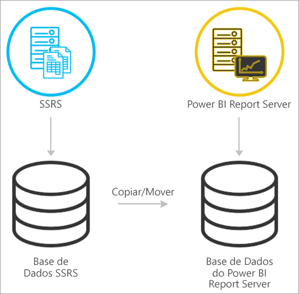
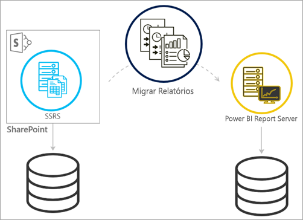
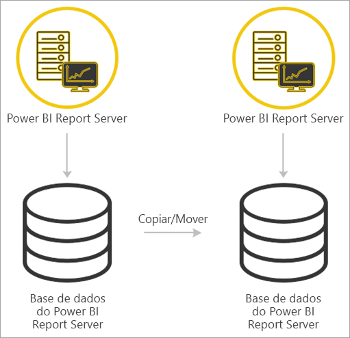

# <a name="migrate-a-report-server-installation"></a>Migrar uma instalação do servidor de relatórios

Saiba como migrar a sua instância existente do SQL Server Reporting Services (SSRS) para uma instância do Power BI Report Server.

A migração define-se como mover ficheiros de dados de aplicações para uma nova instância do Power BI Report Server. Seguem-se motivos comuns para migrar a sua instalação:

* Pretende mover do SQL Server Reporting Services para o Power BI Report Server
  
  > [!NOTE]
  > Não existe uma atualização implementada do SQL Server Reporting Services para o Power BI Report Server. É necessária uma migração.

* Tem requisitos de atualização ou implementação em larga escala
* Está a mudar o hardware ou a topologia da sua instalação
* Encontrou um problema impeditivo da atualização

## <a name="migrating-to-power-bi-report-server-from-ssrs-native-mode"></a>Migrar do SSRS para o Power BI Report Server (Modo nativo)

Migrar de uma instância do SSRS (Modo nativo) para o Power BI Report Server consiste em poucos espaços.



> [!NOTE]
> O SQL Server 2008 Reporting Services e posteriores são suportados para migração.

* Criar uma cópia de segurança da base de dados, da aplicação e dos ficheiros de configuração
* Criar cópia de segurança da chave de encriptação
* Clonar a base de dados do servidor de relatórios que aloja os seus relatórios
* Instalar o Power BI Report Server. Se estiver a utilizar o mesmo hardware, pode instalar o Power BI Report Server no mesmo servidor que a instância do SSRS. Para saber mais sobre instalar o Power BI Report Server, consulte [Instalar o Power BI Report Server](install-report-server.md).

> [!NOTE]
> O nome de instância do Power BI Report Server será *PBIRS*.

* Configure o servidor de relatórios ao utilizar o Gestor de Configuração do Servidor de Relatórios e ligar-se à base de dados clonada.
* Efetue a limpeza necessária para a instância do SSRS (Modo nativo)

## <a name="migration-to-power-bi-report-server-from-ssrs-sharepoint-integrated-mode"></a>Migração do SSRS para o Power BI Report Server (modo integrado no SharePoint)

Migrar de um SSRS (modo integrado no SharePoint) para o Power BI Report Server não é um processo tão simples como no modo nativo. Apesar de estes passos lhe darem alguma orientação, é possível que tenha outros ficheiros e recursos no SharePoint que têm de ser geridos fora destes passos.



Tem de migrar os conteúdos específicos do servidor de relatórios do SharePoint para o Power BI Report Server. Tem de ter o Power BI Report Server instalado no seu ambiente. Para saber mais sobre instalar o Power BI Report Server, consulte [Instalar o Power BI Report Server](install-report-server.md).

Se quiser copiar os conteúdos do servidor de relatórios do seu ambiente do SharePoint para o Power BI Report Server, tem de utilizar ferramentas como o **rs.exe** para copiar os conteúdos. Segue-se um exemplo do aspeto do script para copiar conteúdos do servidor de relatórios do SharePoint para o Power BI Report Server.

> [!NOTE]
> Este script de exemplo deverá ser compatível com o SharePoint 2010 e posterior e com o SQL Server 2008 Reporting Services e posterior.

### <a name="sample-script"></a>Script de exemplo

```
Sample Script
rs.exe
-i ssrs_migration.rss -e Mgmt2010
-s http://SourceServer/_vti_bin/reportserver
-v st="sites/bi" -v f="Shared Documents“
-u Domain\User1 -p Password
-v ts=http://TargetServer/reportserver
-v tu="Domain\User" -v tp="Password"
```

## <a name="migrating-from-one-power-bi-report-server-to-another"></a>Migrar de um servidor do Power BI Report Server para outro

Migrar de um servidor do Power BI Report Server é um processo idêntico a migrar do SSRS (Modo nativo).



* Criar uma cópia de segurança da base de dados, da aplicação e dos ficheiros de configuração
* Criar cópia de segurança da chave de encriptação
* Clonar a base de dados do servidor de relatórios que aloja os seus relatórios
* Instalar o Power BI Report Server. *Não* pode instalar o Power BI Report Server no mesmo servidor a partir do qual está a migrar. Para saber mais sobre instalar o Power BI Report Server, consulte [Instalar o Power BI Report Server](install-report-server.md).

> [!NOTE]
> O nome de instância do Power BI Report Server será *PBIRS*.

* Configure o servidor de relatórios ao utilizar o Gestor de Configuração do Servidor de Relatórios e ligar-se à base de dados clonada.
* Efetue as limpezas necessárias para a instalação do Power BI Report Server antigo.

## <a name="next-steps"></a>Próximos passos

[Descrição geral para administradores](admin-handbook-overview.md)  
[Instalar o Power BI Report Server](install-report-server.md)  
[Script com Utilitário rs.exe e o Serviço Web](https://docs.microsoft.com/sql/reporting-services/tools/script-with-the-rs-exe-utility-and-the-web-service)

Mais perguntas? [Experimente perguntar à Comunidade do Power BI](https://community.powerbi.com/)