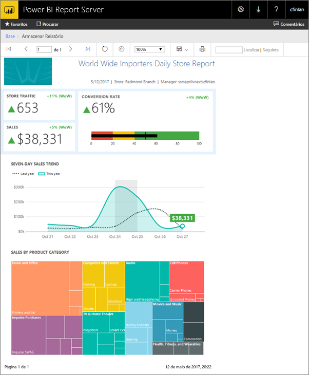
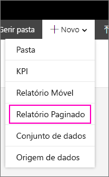
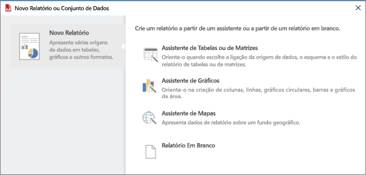
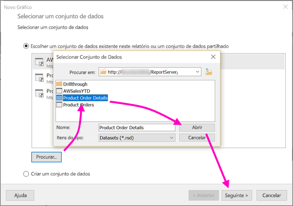
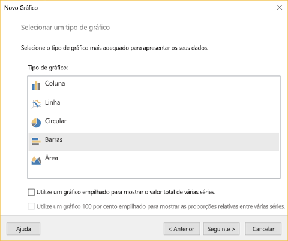
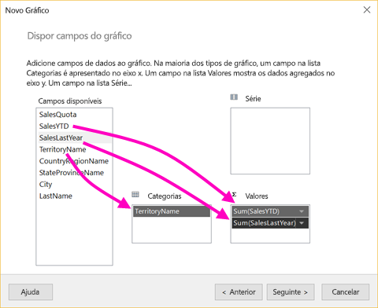
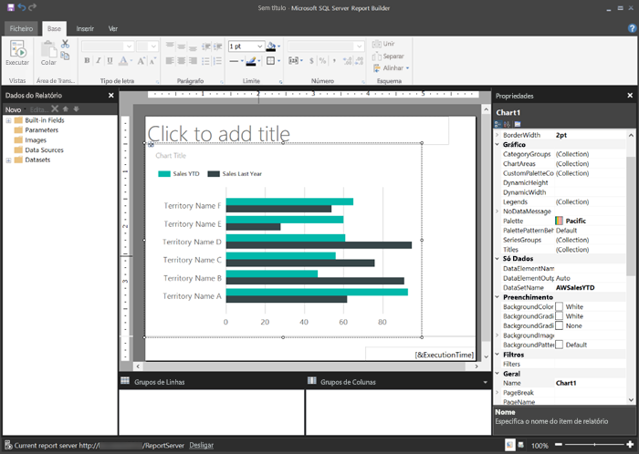
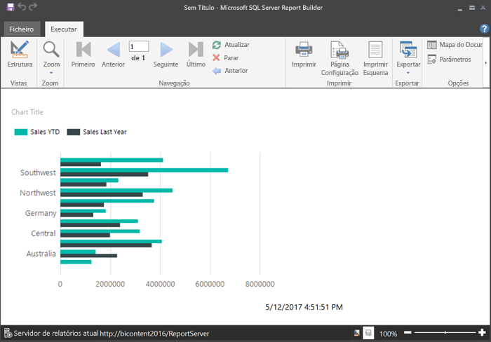
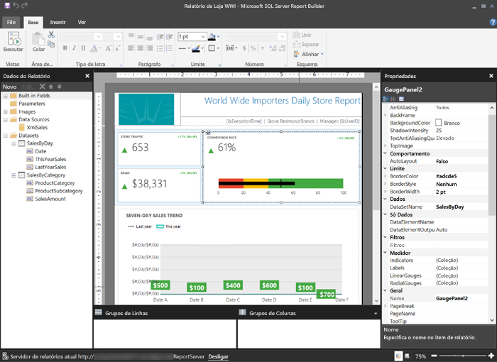

# Criar um relatório paginado para o Power BI Report Server
Neste artigo, vai criar um relatório paginado para o Power BI Report Server em poucos passos simples.

Está à procura de ajuda com a criação de relatórios paginados no Report Builder do serviço Power BI? Veja [Report Builder Paginado do Power BI](../report-builder-power-bi.md).

Como o nome indica, os relatórios paginados podem ocupar muitas páginas. Estão dispostos num formato fixo e oferecem uma personalização precisa. Os relatórios paginados são ficheiros .rdl.

Pode armazenar e gerir relatórios paginados no portal Web do Power BI Report Server, tal como pode fazê-lo no portal Web do SQL Server Reporting Services (SSRS). Pode criar e editá-los no Report Builder ou Report Designer no SQL Server Data Tools (SSDT) e, em seguida, publicá-los através do portal Web. Depois, os leitores de relatórios na sua organização podem visualizá-los num browser ou numa aplicação móvel do Power BI, no respetivo dispositivo móvel.

Se já criou relatórios paginados no Report Builder ou no Report Designer, está pronto para criar relatórios paginados para o Power BI Report Server. Se não o fez, eis alguns passos rápidos para começar.

## Passo 1: Iniciar o Report Builder
Pode já ter instalado o Report Builder para criar relatórios para um servidor SSRS. Pode utilizar a mesma versão ou o Report Builder para criar relatórios para o Power BI Report Server. Se ainda não o instalou, o processo é simples.

1. No portal Web do Power BI Report Server, selecione **Novo** > **Relatório Paginado**.
   
    
   
    Se não ainda não tiver o Report Builder instalado, será agora orientado pelo processo de instalação.
2. Após ser instalado, o Report Builder é aberto no ecrã **Novo Relatório ou Conjunto de Dados**.
   
    
3. Selecione o assistente correspondente ao tipo de relatório que pretende criar:
   
   * Tabela ou matriz
   * Gráfico
   * Mapa
   * Vazio
4. Comecemos pelo assistente de Gráfico.
   
    O assistente de Gráfico orienta-o pelos passos de criação de um gráfico básico num relatório. A partir daí, pode personalizar o seu relatório praticamente sem limites.

## Passo 2: Percorrer o Assistente de gráficos
O assistente de Gráfico orienta-o nos passos básicos de criação de uma visualização num relatório.

Os relatórios paginados podem ligar a diversas origens de dados, desde o Microsoft SQL Server e a Base de Dados SQL do Microsoft Azure ao Oracle, Hyperion e muitos mais. Saiba mais sobre [origens de dados suportadas por relatórios paginados](connect-data-sources.md).

Na primeira página do assistente de Gráfico, **Selecione um conjunto de dados**, pode criar um conjunto de dados ou selecionar um conjunto de dados partilhado num servidor. Os *Conjuntos de dados* devolvem dados de relatórios de uma consulta numa origem de dados externa.

1. Selecione **Procurar** > selecionar um conjunto de dados partilhado num servidor > **Abrir** > **Seguinte**.
   
    
   
     Precisa de criar um conjunto de dados? Consulte [Criar um conjunto de dados partilhado ou incorporado](https://docs.microsoft.com/sql/reporting-services/report-data/create-a-shared-dataset-or-embedded-dataset-report-builder-and-ssrs).
2. Selecione um tipo de gráfico (neste caso, um gráfico de barras).
   
    
3. Disponha os campos ao arrastá-los para as caixas **Categorias**, **Séries** e **Valores**.
   
    
4. Selecione **Seguinte** > **Concluir**.

## Passo 3: Criar o relatório
Agora, está na vista de Estrutura do Relatório. Repare que os dados são apenas marcadores de posição, não os seus dados.

* Para ver os seus dados, selecione **Executar**.
  
     
* Para regressar à vista de Estrutura, selecione **Estrutura**.

Pode modificar o gráfico que acabou de criar, alterando o esquema, os valores, a legenda... na verdade, quase tudo.

Pode também adicionar muitas outras visualizações: medidores, tabelas, matrizes, tabelas, mapas e muito mais. Pode adicionar cabeçalhos e rodapés a múltiplas páginas. Consulte os [tutoriais do Report Builder](https://docs.microsoft.com/sql/reporting-services/report-builder-tutorials) para experimentar.

## Step 4: Guardar o relatório no servidor de relatórios
Quando o seu relatório estiver pronto, guarde-o no Power BI Report Server.

1. No menu **Ficheiro**, selecione **Guardar como** e guarde-o no servidor de relatório. 
2. Agora, pode vê-lo no browser.
   
    

## Próximos passos
Existem muitos recursos excelentes para estruturar relatórios no Report Builder e no Report Designer no SQL Server Data Tools. Os tutoriais do Report Builder são um bom local para começar.

* [Tutoriais do Report Builder](https://docs.microsoft.com/sql/reporting-services/report-builder-tutorials)
* [O que é o Power BI Report Server?](get-started.md)  

Mais perguntas? [Experimente perguntar à Comunidade do Power BI](https://community.powerbi.com/)

