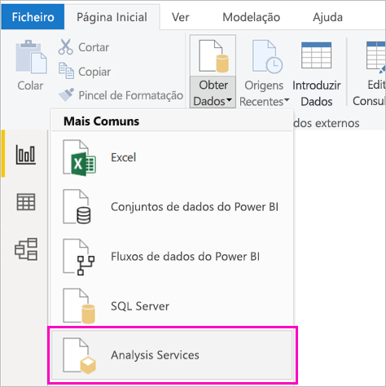

# Criar um relatório do Power BI para o Power BI Report Server
Pode armazenar e gerir relatórios do Power BI no local no portal Web do Power BI Report Server, tal como pode armazenar relatórios do Power BI na cloud no serviço Power BI (https://powerbi.com). Pode criar e editar relatórios no Power BI Desktop e publicá-los no portal Web. Depois, os leitores de relatórios na sua organização podem visualizá-los num browser ou numa aplicação móvel do Power BI, num dispositivo móvel.

Eis quatro passos rápidos para começar.

## Passo 1: Instalar o power BI desktop para o servidor de relatório de bi de energia

Se já criou relatórios do Power BI no Power BI Desktop, está quase pronto para criar relatórios do Power BI para o Power BI Report Server. Recomendamos a instalação da versão do Power BI Desktop para Power BI Report Server para que saiba que o servidor e a aplicação estão sempre sincronizados. Pode ter ambas as versões do Power BI Desktop no mesmo computador.

1. No portal Web do Report Server, selecione a seta **Transferir** > **Power BI Desktop**.

    

    Em alternativa, aceda à home page do [Power BI Report Server](https://powerbi.microsoft.com/report-server/) e selecione **Opções de transferência avançadas**.

2. Na página do Centro de Transferências, selecione **Transferir**.

3. Consoante o seu computador, selecione:

    - **PBIDesktopRS.msi** (a versão de 32 bits) ou

    - **PBIDesktopRS_x64.msi** (a versão de 64 bits).

4. Após transferir o instalador, execute o Assistente de Configuração do Power BI Desktop.

2. No final da instalação, selecione a opção **Iniciar o Power BI Desktop agora**.
   
    Este inicia automaticamente e está pronto para começar. Pode dizer-se que tem a versão certa porque **o Power BI Desktop (janeiro de 2021)** está na barra de títulos.

    

3. Se não estiver familiarizado com o Power BI Desktop, considere ver os vídeos no ecrã de boas-vindas.
   
    

## Passo 2: Selecionar uma origem de dados
Pode ligar a diversas origens de dados. Saiba mais sobre [ligar a origens de dados](connect-data-sources.md).

1. No ecrã de boas-vindas, selecione **Obter Dados**.
   
    Em alternativa, no separador **Base**, selecione **Obter Dados**.
2. Selecione a sua origem de dados. Neste exemplo, **Analysis Services**.
   
    
3. Preencha **Servidor** e, opcionalmente, **Base de Dados**. Certifique-se de que **Ligar em direto** está selecionado > **OK**.
   
    
4. Selecione o servidor de relatório onde irá guardar os seus relatórios.
   
    

## Passo 3: Criar o relatório
Eis a melhor parte: pode criar elementos visuais que ilustrem os seus dados.

Por exemplo, pode criar um gráfico de funil com clientes e agrupar os valores por rendimento anual.

1. Em **Visualizações**, selecione **Gráfico de funil**.
2. Arraste o campo a ser contado para o well **Valores**. Se não for um campo numérico, o Power BI Desktop torna-o automaticamente uma *Contagem do* valor.
3. Arraste o campo para o grupo no well **Grupo**.

Saiba mais sobre [estruturar um relatório do Power BI](../create-reports/desktop-report-view.md).

## Step 4: Guardar o relatório no servidor de relatórios
Quando o seu relatório estiver pronto, deve guardá-lo no Power BI Report Server que selecionou no passo 2.

1. No menu **Ficheiro**, selecione **Guardar como** > **Power BI Report Server**.
   
    
2. Agora, pode vê-lo no portal Web.
   
    
    
> [!NOTE]
> Se optar por editar o relatório no futuro, os dados do relatório que vê no ambiente de trabalho serão sempre os dados em cache do momento em que o relatório foi inicialmente criado.  Para ver os dados mais recentes ao editar o relatório, tem de atualizar os dados na sua aplicação Power BI Desktop.

## Próximos passos
### Power BI Desktop
Existem muitos excelentes recursos para criar relatórios no Power BI Desktop. Esta ligação é um bom ponto de partida.

* [Introdução ao Power BI Desktop](../fundamentals/desktop-getting-started.md)
* Aprendizagem interativa: [Explorar o Power BI Desktop](/learn/modules/get-data-power-bi/2-getting-started-power-bi-desktop)

### Power BI Report Server
* [Instale power BI desktop para power bi report server](install-powerbi-desktop.md)  
* [O que é o Power BI Report Server?](get-started.md)  

Mais perguntas? [Experimente perguntar à Comunidade do Power BI](https://community.powerbi.com/)
