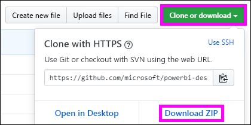
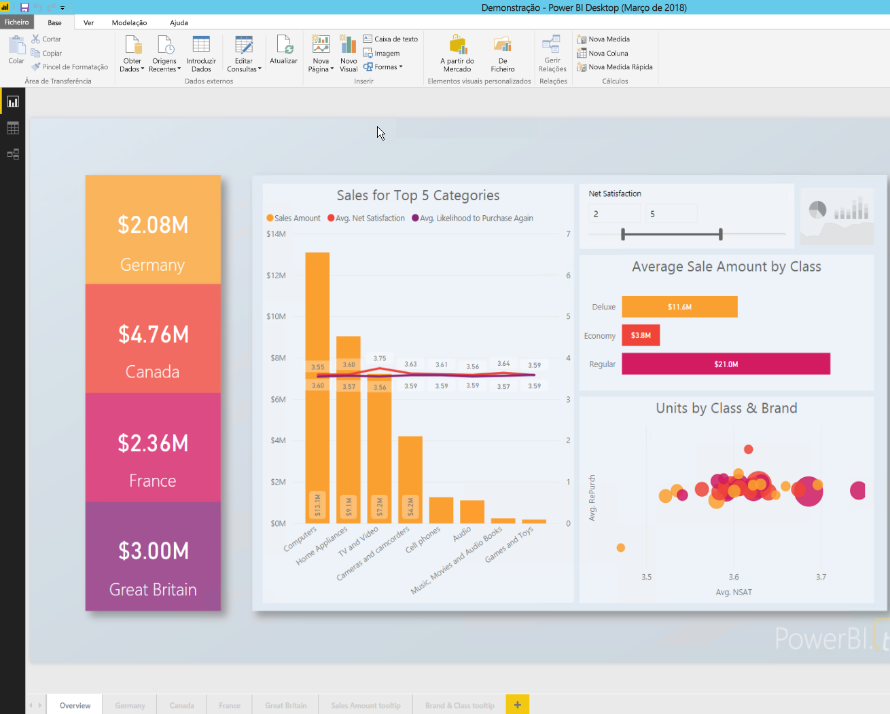

# <a name="quickstart-embed-a-power-bi-report-server-report-using-an-iframe-in-sharepoint-server"></a>Início Rápido: incorporar um relatório do Power BI Report Server com um iFrame no SharePoint Server

Neste manual de início rápido vai aprender a incorporar um relatório do Power BI Report Server com um iFrame numa página do SharePoint. Se estiver a trabalhar com o SharePoint Online, o Power BI Report Server tem de estar acessível publicamente. No SharePoint Online, a Peça Web do Power BI que funciona com o serviço Power BI não funciona com o Power BI Report Server. 


## <a name="prerequisites"></a>Pré-requisitos
* Tem de ter o [Power BI Report Server](https://powerbi.microsoft.com/en-us/report-server/) instalado e configurado.
* Terá de ter o [Power BI Desktop otimizado para o Power BI Report Server](install-powerbi-desktop.md) instalado.
* Terá de ter um ambiente do [SharePoint](https://docs.microsoft.com/sharepoint/install/install) instalado e configurado.

## <a name="creating-the-power-bi-report-server-report-url"></a>Criar o URL do relatório do Power BI Report Server

1. Transferir o exemplo a partir do GitHub – [Demonstração no Blogue](https://github.com/Microsoft/powerbi-desktop-samples).

    

2. Abra o ficheiro PBIX de exemplo a partir do GitHub no **Power BI Desktop otimizado para o Power BI Report Server**.

    

3. Guarde o relatório no **Power BI Report Server**. 

    

4. Ver o relatório no **Portal Web**.

    

### <a name="capturing-the-url-parameter"></a>Capturar o parâmetro de URL

Após ter o seu URL, pode criar um iFrame numa página do SharePoint para alojar o relatório. Para qualquer URL de relatório do Power BI Report Server, pode adicionar um parâmetro de cadeia de consulta de `?rs:embed=true` para incorporar o relatório num iFrame. 

   Por exemplo:
    ``` 
    http://myserver/reports/powerbi/Sales?rs:embed=true
    ```
## <a name="embedding-a-power-bi-report-server-report-in-a-sharepoint-iframe"></a>Incorporar um relatório do Power BI Report Server num iFrame do SharePoint

1. Navegue para uma página de **Conteúdo do Site** do SharePoint.

    

2. Escolha a página onde pretende adicionar o relatório.

    

3. Selecione a roda dentada no canto superior direito e selecione **Editar Página**.

    

4. Selecione **Adicionar Peça Web**.

    

5. Em **Categorias** selecione **Suportes de Dados e Conteúdo**, em **Peças**, selecione **Editor de Conteúdo** e, em seguida, selecione **Adicionar**.

     

6. Selecione **Clique aqui para adicionar novo conteúdo**.

    

7. No friso, selecione o separador **Formatar Texto** e, em seguida, selecione **Editar Origem**.

     

8. Na janela Editar Origem, cole o código de iFrame e selecione OK.

    

     Por exemplo:
     ```
     <iframe width="800" height="600" src="http://myserver/reports/powerbi/Sales?rs:embed=true" frameborder="0" allowFullScreen="true"></iframe>
     ```

9. No friso, selecione o separador **Página** e selecione **Parar Edição**.

    

10. Agora deverá ver o relatório na página.

    

## <a name="next-steps"></a>Próximos passos

[Início rápido: Criar um relatório do Power BI para o Power BI Report Server](quickstart-create-powerbi-report.md)  
[Início rápido: Criar um relatório paginado para o Power BI Report Server](quickstart-create-paginated-report.md)  

Mais perguntas? [Experimente perguntar à Comunidade do Power BI](https://community.powerbi.com/) 