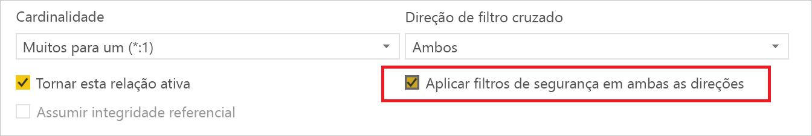
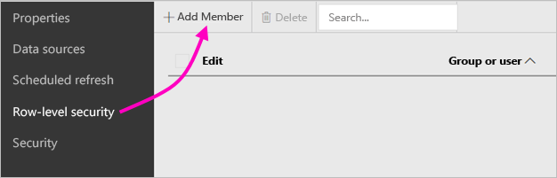
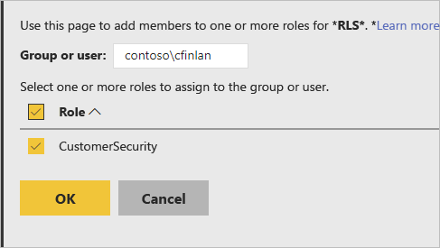
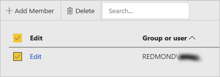

# Segurança ao nível da linha (RLS) no Power BI Report Server

A configuração da segurança ao nível da linha (RLS) com o Power BI Report Server pode restringir o acesso a dados para determinados utilizadores. Os filtros restringem o acesso aos dados ao nível da linha e pode definir filtros nas funções.  Se estiver a utilizar as permissões predefinidas no Power BI Report Server, qualquer utilizador com permissões de Publicador ou Gestor de Conteúdos no relatório do Power BI poderá atribuir membros às funções do mesmo.    

Pode configurar a RLS para relatórios importados no Power BI com o Power BI Desktop. Também pode configurar a RLS em relatórios que utilizem o DirectQuery, como o SQL Server.  Tenha em atenção que a RLS não será respeitada se a sua ligação do DirectQuery utilizar autenticação integrada para leitores de relatórios. Para as ligações em direto dos Analysis Services, configure a segurança ao nível da linha no modelo no local. A opção de segurança não é apresentada para conjuntos de dados de ligação em direto. 

[!INCLUDE [rls-desktop-define-roles](../includes/rls-desktop-define-roles.md)]

## Filtragem cruzada bidirecional

Por predefinição, a filtragem de segurança ao nível da linha utiliza filtros unidirecionais, independentemente de as relações estarem definidas como unidirecionais ou bidirecionais. Pode ativar a filtragem cruzada bidirecional manualmente com a segurança ao nível da linha.

- Selecione a relação e selecione a caixa de verificação **Aplicar filtros de segurança em ambas as direções**. 

    

Selecione esta caixa de verificação ao implementar a [segurança dinâmica ao nível da linha](https://docs.microsoft.com/sql/analysis-services/supplemental-lesson-implement-dynamic-security-by-using-row-filters) com base no nome de utilizador ou ID de início de sessão. 

Para obter mais informações, veja [Filtragem cruzada bidirecional ao utilizar o DirectQuery no Power BI Desktop](../desktop-bidirectional-filtering.md) e o documento técnico [Securing the Tabular BI Semantic Model](http://download.microsoft.com/download/D/2/0/D20E1C5F-72EA-4505-9F26-FEF9550EFD44/Securing%20the%20Tabular%20BI%20Semantic%20Model.docx) (Proteger o Modelo Semântico de BI em Tabela).

[!INCLUDE [rls-desktop-view-as-roles](../includes/rls-desktop-view-as-roles.md)]

## Adicionar membros a funções 

Após guardar o seu relatório no Power BI Report Server, irá gerir a segurança e adicionar ou remover membros no servidor. Apenas os utilizadores com permissões de Publicador ou Gestor de Conteúdos no relatório têm a opção de segurança ao nível da linha disponível, sem aparecer a cinzento.

 Se o relatório não tiver as funções necessárias, terá de o abrir no Power BI Desktop, adicionar ou modificar funções e, em seguida, guardá-lo novamente no Power BI Report Server. 

1. No Power BI Desktop, guarde o relatório no Power BI Report Server. Terá de utilizar a versão do Power BI Desktop otimizada para o Power BI Report Server.
2. No Power BI Report Server, selecione as reticências (**…**) junto ao relatório. 

3. Selecione **Gerir** > **Segurança ao nível da linha**. 

     

    Na página **Segurança ao nível da linha**, poderá adicionar membros a uma função que criou no Power BI Desktop.

5. Para adicionar um membro, selecione **Adicionar Membro**.

1. Introduza o utilizador ou grupo na caixa de texto no formato de Nome de Utilizador (DOMÍNIO\utilizador) e selecione as funções que pretende atribuir ao mesmo. O membro tem de estar na sua organização.   

    

    Neste passo, conforme a sua configuração do Active Directory Domain Services, a introdução do Nome Principal de Utilizador também poderá funcionar. Neste caso, o Report Server mostra o nome de utilizador correspondente na lista.

1. Clique em **OK** para aplicar.   

8. Para remover membros, selecione a caixa de verificação junto aos nomes e selecione **Eliminar**.  Pode eliminar múltiplos membros de uma só vez. 

    

## username() e userprincipalname()

Pode tirar partido das funções DAX username() ou userprincipalname() dentro do conjunto de dados. Pode utilizá-las nas expressões no Power BI Desktop. Quando publicar o seu modelo, o Power BI Report Server irá utilizá-las.

No Power BI Desktop, username() devolve um utilizador no formato DOMÍNIO\Utilizador e userprincipalname() devolve um utilizador no formato user@contoso.com.

No Power BI Report Server, username() e userprincipalname() devolvem o Nome Principal de Utilizador (UPN) do utilizador, que é semelhante a um endereço de e-mail.

Se estiver a utilizar a autenticação personalizada no Power BI Report Server, estas funções irão devolver o formato de nome de utilizador que configurou para os utilizadores.  

## Limitações 

Seguem-se as limitações atuais da segurança ao nível de linha nos modelos do Power BI. 

Os utilizadores que tinham relatórios com a função DAX username() irão agora observar um novo comportamento, em que o Nome Principal de Utilizador (UPN) será devolvido, EXCETO ao utilizar o DirectQuery com segurança integrada.  Como a RLS não é respeitada neste cenário, o comportamento deste não é alterado.

Só pode definir a RLS em conjuntos de dados criados com o Power BI Desktop. Para ativar a RLS para os conjuntos de dados criados com o Excel, primeiro tem de converter os seus ficheiros em ficheiros do Power BI Desktop (PBIX). Obtenha mais informações sobre a [conversão de ficheiros do Excel](../desktop-import-excel-workbooks.md).

Só são suportadas as ligações de Extração, Transformação e Carregamento (ETL) e do DirectQuery com credenciais armazenadas. As ligações em direto ao Analysis Services e as ligações do DirectQuery que utilizam autenticação integrada são processadas na origem de dados subjacente. 

Se estiver a utilizar a segurança integrada com o DirectQuery, os utilizadores poderão observar que:
- A RLS está desativada e todos os dados foram devolvidos.
- Não conseguem atualizar as suas atribuições de funções e recebem uma mensagem de erro na página Gerir da RLS.
- Para a função DAX de nome de utilizador, irá continuar a receber o nome de utilizador como DOMÍNIO\UTILIZADOR. 

Os autores de relatórios só terão acesso aos dados dos mesmos no Power BI Report Server após carregarem os relatórios e atribuírem funções a si próprios. 

 

## PERGUNTAS FREQUENTES 

### Posso criar estas funções para origens de dados do Analysis Services? 

Se tiver importado os dados para o Power BI Desktop, pode fazê-lo. Se estiver a utilizar uma ligação em direto, não pode configurar a RLS no serviço Power BI. A RLS é definida no modelo do Analysis Services no local. 

### Posso utilizar a RLS para limitar as colunas ou medidas acessíveis pelos meus utilizadores? 

Não. Se um utilizador tiver acesso a uma linha de dados específica, pode ver todas as colunas de dados dessa linha. 

### A RLS permite-me ocultar dados detalhados, mas dar acesso a dados resumidos nos elementos visuais? 

Não. Pode proteger linhas individuais de dados, mas os utilizadores poderão sempre ver os detalhes ou os dados resumidos. 

### Posso adicionar novas funções no Power BI Desktop, se já tiver funções existentes e membros atribuídos? 

Sim. Se já tiver funções existentes definidas e membros atribuídos no Power BI Report Server, pode criar funções adicionais e publicar novamente o seu relatório sem afetar as suas atribuições atuais. 
 

## Próximos passos

[O que é o Power BI Report Server?](get-started.md) 
[Manual do administrador](admin-handbook-overview.md)  

Mais perguntas? [Experimente perguntar à Comunidade do Power BI](https://community.powerbi.com/)
