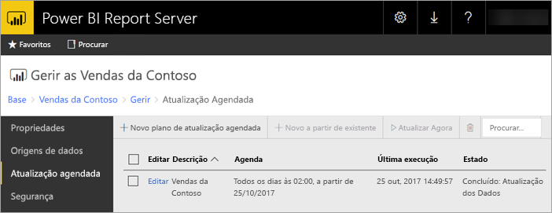

# Atualização agendada para relatórios do Power BI no Power BI Report Server
A atualização agendada para relatórios do Power BI permite que os dados de um relatório fiquem atualizados.

A atualização agendada é específica dos relatórios do Power BI com um modelo incorporado. Isto significa que importou dados para o relatório em vez de utilizar uma ligação em direto ou DirectQuery. Ao importar os dados, estes são desassociados da origem de dados original e precisam de ser atualizados para manter os dados atuais. A atualização agendada é a forma de manter os seus dados em dia.

A atualização agendada é configurada na secção de gestão de um relatório. Para obter mais informações sobre como configurar a atualização agendada, consulte [Como configurar a atualização agendada de relatórios do Power BI](configure-scheduled-refresh.md).

## Como funciona
Vários componentes estão envolvidos na atualização agendada dos seus relatórios do Power BI.

* O SQL Server Agent funciona como um temporizador para gerar eventos agendados.
* As tarefas agendadas são adicionadas a uma fila de eventos e notificações na base de dados do servidor de relatórios. Numa implementação de aumento, a fila é partilhada em todos os servidores de relatórios na implementação.
* Todo o processamento de relatórios que ocorre devido a um evento agendado é efetuado em segundo plano.
* O modelo de dados é carregado como uma instância do Analysis Services.
* Em algumas origens de dados, o motor de aplicação híbrida do Power Query é utilizado para ligar a origens de dados e transformar os dados. Outras origens de dados podem ser ligadas diretamente a partir de um serviço do Analysis Services utilizado para alojar os modelos de dados para o Power BI Report Server.
* Os novos dados são carregados no modelo de dados no Analysis Services.
* Numa configuração de escalamento horizontal, o modelo de dados pode ser replicado pelos nós.
* O Analysis Services processa os dados e executa os cálculos necessários.

O Power BI Report Server mantém uma fila de eventos para todas as operações agendadas. Consulta a fila em intervalos regulares para verificar se existem novos eventos. Por predefinição, a fila é analisada em intervalos de 10 segundos. Pode alterar o intervalo modificando as definições de configuração **PollingInterval**, **IsNotificationService** e **IsEventService** no ficheiro RSReportServer.config. Também se pode utilizar **IsDataModelRefreshService** para definir se um servidor de relatórios processa eventos agendados.

### Analysis Services
Compor um relatório do Power BI, bem como efetuar uma atualização agendada, requer carregar o modelo de dados do relatório do Power BI no Analysis Services. Um processo do Analysis Services estará em execução com o Power BI Report Server.

## Considerações e limitações
### Quando não se pode utilizar a atualização agendada
Nem todos os Relatórios do Power BI podem ter um plano de atualização agendada criado. Segue-se uma lista de Relatórios do Power BI para os quais não pode criar um plano de atualização agendada.

* O seu relatório contém uma ou mais origens de dados do Analysis Services que utilizam uma ligação em direto.
* O seu relatório contém uma ou mais origens de dados que utilizam o DirectQuery.
* O seu relatório não contém origens de dados. Por exemplo, os dados são manualmente introduzidos através de *Introduzir Dados* ou um relatório contém apenas conteúdos estáticos como imagens, texto, etc.

Além da lista anterior, existem cenários específicos com origens de dados no modo de *importação*, para os quais não pode criar planos de atualização.

* Se uma origem de dados de *Ficheiro* ou *Pasta* for utilizada e o caminho de ficheiros for um caminho local (como C:\Utilizadores\utilizador\Documentos), não pode ser criado um plano de atualização. O caminho tem de ser um caminho ao qual o servidor de relatórios se possa ligar, como uma partilha de rede. Por exemplo, *\\myshare\Documentos*.
* Se uma origem de dados puder ser ligada apenas através de OAuth (por exemplo, Facebook, Google Analytics, Salesforce, etc.), o plano de atualização de cache não poderá ser criado. Atualmente, o RS não suporta a autenticação OAuth para qualquer origem de dados, seja para relatórios do Power BI, paginados ou móveis.

### Limites de memória
A carga de trabalho tradicional para um servidor de relatórios tem sido semelhante a uma aplicação Web. A capacidade de carregar relatórios com dados importados ou o DirectQuery e a capacidade de efetuar atualizações agendadas servem-se de uma instância do Analysis Services alojada juntamente com o servidor de relatórios. Consequentemente, tal pode originar uma pressão de memória inesperada no servidor. Planeie a sua implementação de servidor adequadamente, tendo em conta que o Analysis Services pode estar a consumir memória juntamente com o servidor de relatórios.

Para obter informações sobre como monitorizar uma instância do Analysis Services, veja [Monitorizar uma Instância do Analysis Services](/sql/analysis-services/instances/monitor-an-analysis-services-instance).

Para obter informações sobre as definições de memória no Analysis Services, veja [Propriedades de Memória](/sql/analysis-services/server-properties/memory-properties).

### Limite de tamanho do modelo de dados
O modelo de dados carregado no motor interno do Analysis Services durante uma atualização agendada tem um tamanho máximo de 2000 MB (2 GB). Este tamanho máximo não pode ser configurado. Se o seu modelo de dados tiver mais do que 2 GB, irá receber o erro de atualização, "O comprimento do resultado excede o limite de comprimento (2 GB) do tipo grande de destino." Nesse caso, recomendamos que aloje o modelo numa instância do Analysis Services e utilize uma ligação em direto ao modelo no relatório.

## Próximas etapas
Configure a [atualização agendada](configure-scheduled-refresh.md) num relatório do Power BI.

Mais perguntas? [Experimente perguntar à Comunidade do Power BI](https://community.powerbi.com/)