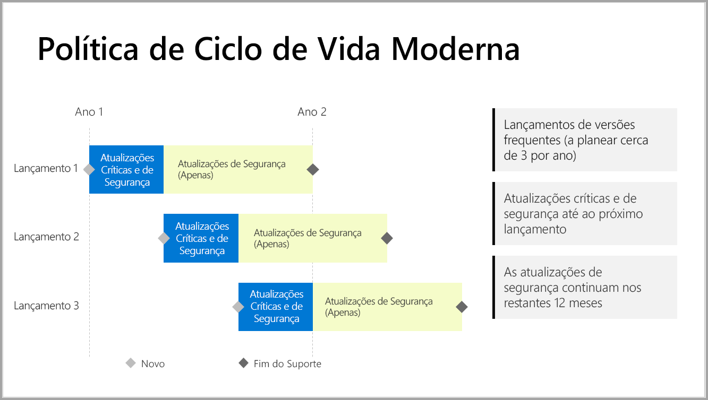

# Linha cronológica de suporte para o Power BI Report Server

O Power BI Report Server é lançado algumas vezes por ano. As atualizações de segurança e críticas estão disponíveis até que a versão seguinte fique em disponibilidade geral (GA). Após a versão seguinte, a versão anterior continua a receber atualizações de segurança durante o restante período de tempo de 12 meses.

Esta política de suporte permite-nos disponibilizar inovação aos clientes rapidamente ao fornecer a flexibilidade necessária para adotarem a inovação ao seu próprio ritmo.

* Fase de manutenção das Atualizações de Segurança e Críticas – ao executar a versão atual mais recente do Power BI Report Server, recebe atualizações de Segurança e Críticas.
* Fase de manutenção das Atualizações de Segurança (Apenas) – após o lançamento de uma nova versão, o suporte de versões mais antigas fica reduzido apenas às atualizações de Segurança do ciclo de vida de suporte de 12 meses restante (mostrado na figura 1).

    

## Histórico de versões

| **Versão** | **Data de disponibilidade** | **Data de fim do suporte** |
| --- | --- | --- |
| Junho de 2017 |12 de junho de 2017 |Sem suporte |
| Outubro de 2017 |31 de outubro de 2017 | Sem suporte |
| Março de 2018 | 19 de março de 2018 | 19 de março de 2019 |
| Agosto de 2018 | 15 de agosto de 2018 | 15 de agosto de 2019 |
| Janeiro de 2019 | 23 de janeiro de 2019 | 23 de janeiro de 2020 |

Para transferir o Power BI Report Server e o Power BI Desktop otimizado para o Power BI Report Server, aceda a [Relatórios no local com o Power BI Report Server](https://powerbi.microsoft.com/report-server/).

## Próximos passos
[Novidades no Power BI Report Server](whats-new.md)  
[O que é o Power BI Report Server?](get-started.md)
[Descrição geral para administradores](admin-handbook-overview.md)  
[Instalar o Power BI Report Server](install-report-server.md)  

Mais perguntas? [Experimente perguntar à Comunidade do Power BI](https://community.powerbi.com/)