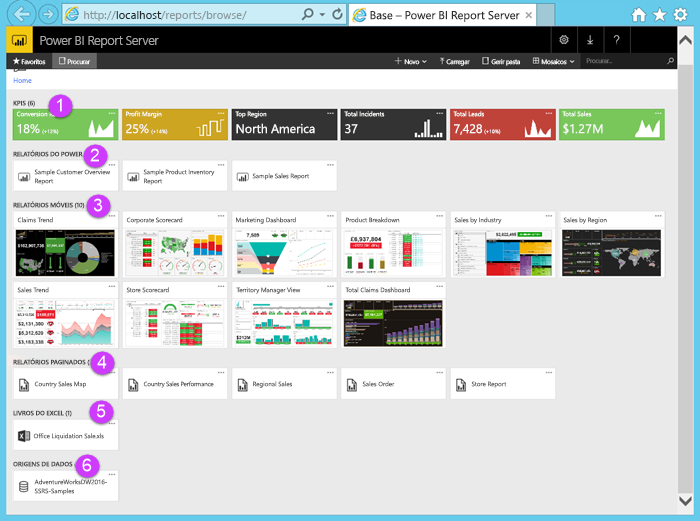

# Tutorial: Explorar o portal Web do Power BI Report Server numa VM
Neste tutorial, vai criar uma máquina virtual do Azure com o Power BI Report Server já instalado, para poder experimentar a visualização, edição e gestão de relatórios paginados e do Power BI de exemplo, e KPIs.

Seguem-se as tarefas que vai desempenhar neste tutorial:

> [!div class="checklist"]
> * Criar e ligar-se a uma VM
> * Iniciar e explorar o portal Web do Power BI Report Server
> * Etiquetar um item favorito
> * Ver e editar um relatório do Power BI
> * Ver, gerir e editar um relatório paginado
> * Ver um livro do Excel no Excel Online

Para este tutorial, precisa de uma subscrição do Azure. Se não tiver uma subscrição, crie uma [conta gratuita](https://azure.microsoft.com/free/?WT.mc_id=A261C142F) antes de começar.

## Criar uma VM do Power BI Report Server

Felizmente, a equipa do Power BI criou uma VM que inclui um Power BI Report Server já instalado.

1. No Azure Marketplace, selecione Power BI Report Server. Esta ligação abre-o diretamente: [Power BI Report Server](https://azuremarketplace.microsoft.com/marketplace/apps/reportingservices.technical-preview?tab=Overview).  

2. Selecione **Obter agora**.
3. Para aceitar os Termos de Utilização e a Política de Privacidade do fornecedor, selecione **Continuar**.

4. Selecione **Criar**.

    

5. No **Passo 1 Noções Básicas**, para **Nome da VM**, atribua-lhe o nome **reportservervm**.

    O nome da VM Power BI Report Server não pode conter travessões.

5. Crie um nome de utilizador e uma palavra-passe.

6. Para **Grupo de recursos**, selecione **Criar novo** e atribua-lhe o nome **reportserverresourcegroup** > **OK**.

    Se seguir o tutorial mais do que uma vez, tem de dar um nome diferente do que deu na vez anterior ao grupo de recursos. Não pode utilizar o mesmo nome de grupo de recursos duas vezes na mesma subscrição. 

    

7. Mantenha as outras predefinições > **OK**.

8. No **Passo 2 Definições**, mantenha as predefinições > **OK**.
 
    Os valores da **Conta de Armazenamento do SQL** e da **Conta de armazenamento de diagnósticos** também devem ser exclusivos. Se seguir o tutorial mais do que uma vez, tem de dar-lhes nomes diferentes.

9. No **Passo 3 Resumo**, reveja as suas seleções > **OK**.

10. No **Passo 4 Comprar**, reveja os Termos de Utilização e a Política de Privacidade > **Criar**.

    O processo de **Submissão de implementação para o Power BI Report Server** pode demorar vários minutos.

## Ligar-se à sua máquina virtual

1. No painel de navegação do Azure, selecione **Máquinas virtuais**. 

2. Na caixa **Filtrar por nome**, introduza “relatório”. 

3. Selecione a VM com o nome **REPORTSERVERVM**.

    

4. Em Máquina virtual REPORTSERVERVM, selecione **Ligar**.

    

5. No painel **Ligar à máquina virtual**, mantenha as predefinições e selecione **Transferir Ficheiro RDP**.

1. Na caixa de diálogo **Ligação do Ambiente de Trabalho Remoto**, selecione **Ligar**.

6. Introduza o nome e a palavra-passe que criou para a VM > **OK**.

7. A caixa de diálogo seguinte indica **Não se pode identificar a identidade do computador remoto**. Selecionar **Sim**.

   E já está: a sua nova VM é aberta.

## Power BI Report Server na VM

Quando abre a sua VM, estes são os itens que aparecem no ambiente de trabalho.

|Número  |O que é  |
|---------|---------|
| | Relatórios (.PBIX) do Power BI de exemplo |
| | Ligações a documentação do Power BI Report Server |
| | Inicia o Power BI Desktop otimizado para o Power BI Report Server (janeiro de 2019) |
| | Abre o portal Web do Power BI Report Server no browser |
| | Inicia o SQL Server Data Tools para criar relatórios paginados (.RDL) |

Faça duplo clique no ícone **Portal Web do Report Server**. O browser abre `https://localhost/reports/browse`. No portal Web, pode ver vários ficheiros agrupados por tipo. 

|Número  |O que é  |
|---------|---------|
| | KPIs criados no portal Web |
| |  Relatórios (.PBIX) do Power BI  |
| | Relatórios móveis criados no SQL Server Mobile Report Publisher  |
| |  Relatórios paginated criados no Report Builder ou SQL Server Data Tools  |
| | Livros do Excel   | 
| | Origens de dados de relatórios paginados | 

## Etiquetar os favoritos
Pode etiquetar os relatórios e KPIs que quer que sejam favoritos. São mais fáceis de localizar porque estão todos numa única pasta Favoritos, tanto no portal Web como nas aplicações móveis do Power BI. 

1. Selecione as reticências ( **…** ) no canto superior direito da **Margem de Lucro** KPI > **Adicionar aos Favoritos**.
   
    
2. Selecione **Favoritos** no friso do portal Web para vê-lo juntamente com os outros favoritos na página Favoritos no portal Web.
   
    

3. Selecione **Procurar** para voltar para o portal Web.
   
## Ver itens na vista Lista
Por predefinição, o portal Web apresenta o conteúdo na vista Mosaico.

Pode mudar para a vista Lista, onde é fácil mover ou eliminar vários itens em simultâneo. 

1. Selecione **Mosaicos** > **Lista**.
   
    

2. Regresse à vista Mosaicos: selecione **Lista** > **Mosaicos**.

## Relatórios do Power BI

Pode ver e interagir com relatórios do Power BI no portal Web, bem como iniciar o Power BI Desktop a partir do portal Web.

### Ver relatórios do Power BI

1. No portal Web em **Relatórios do Power BI**, selecione **Relatório de Descrição Geral de Cliente de Exemplo**. O relatório abre-se no browser.

1. Selecione o bloco dos Estados Unidos no mapa de árvore para ver como destaca os valores relacionados nos outros elementos visuais.

    

### Editar no Power BI Desktop

1. Selecione **Editar no Power BI Desktop**.

1. Selecione **Permitir** para permitir que este site abra um programa no seu computador. 

     O relatório abre-se no Power BI Desktop. Tome nota do nome na barra superior, “Power BI Desktop (janeiro de 2019)”. Esta é a versão otimizada para o Power BI Report Server.

    Utilize a versão do Power BI Desktop que está instalada na VM. Não pode mudar de domínios para carregar um relatório.

3. No painel Campos, expanda a tabela Clientes e arraste o campo Ocupação para Filtros de nível de relatório.

    

1. Guarde o relatório.

1. Volte para o relatório no browser e selecione o ícone **Atualizar** do browser.

    

8. Expanda o painel **Filtros** à direita para ver o filtro **Ocupação** que adicionou. Selecione **Professional**.

    

3. Selecione **Procurar** para voltar para o portal Web.

## Relatórios paginados (.RDL)

Pode ver e gerir relatórios paginados e iniciar o Report Builder no portal Web.

### Gerir um relatório paginado

1. No portal Web em **Relatórios paginados**, selecione **Mais opções** (...) junto a **Nota de Vendas** > **Gerir**.

1. Selecione **Parâmetros**, altere o valor predefinido para **SalesOrderNumber** para **SO50689** > **Aplicar**.

   

3. Selecione **Procurar** para voltar para o portal Web.

### Ver um relatório paginado

1. Selecione **Nota de Vendas** no portal Web.
 
3.  Pode vê-la aberta no parâmetro **Nota** definido, **SO50689**. 

    

    Pode alterar esse parâmetro aqui, juntamente com os outros parâmetros, sem alterar as predefinições.

1. Selecione **Encomenda** **SO48339** > **Ver Relatório**.

4. Pode ver que se trata da página 1 de 2. Selecione a seta para a direita para ver a segunda página. A tabela continua nessa página.

    

5. Selecione **Procurar** para voltar para o portal Web.

### Editar um relatório paginado

Pode editar relatórios paginados no Report Builder e pode iniciar o Report Builder diretamente no browser.

1. No portal Web, selecione **Mais opções** (...) junto a **Nota de Vendas** > **Editar no Report Builder**.

1. Selecione **Permitir** para permitir que este site abra um programa no seu computador.

1. O relatório da Nota de Vendas abre-se na Vista de Estrutura no Report Builder.

    

1. Selecione **Executar** para pré-visualizar o relatório.

    

5. Feche o Report Builder e volte ao browser.

## Ver livros do Excel

Pode ver e interagir com os livros do Excel no Excel Online, no Power BI Report Server. 

1. Selecione o livro do Excel **Office Liquidation Sale.xlsx**. Pode solicitar credenciais. Selecione **Cancelar**. 
    Abre-se no portal Web.
1. Selecione **Aplicação** na segmentação de dados.

    

1. Selecione **Procurar** para voltar para o portal Web.

## Limpar recursos

Agora que concluiu este tutorial, elimine o grupo de recursos, a máquina virtual e todos os recursos relacionados. 

- Para tal, selecione o grupo de recursos para a VM e selecione **Eliminar**.

## Próximos passos

Neste tutorial, criou uma VM com o Power BI Report Server. Experimentou algumas das funcionalidades do portal Web e abriu um relatório do Power BI e um relatório paginado nos respetivos editores. Esta VM tem origens de dados do SQL Server Analysis Services, pelo que pode experimentar criar os seus próprios relatórios paginados e do Power BI com essas mesmas origens de dados. 

Para saber mais sobre a criação de relatórios para o Power BI Report Server, continue.

> [!div class="nextstepaction"]
> [Criar um relatório do Power BI para o Power BI Report Server](./quickstart-create-powerbi-report.md)

