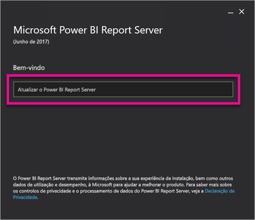
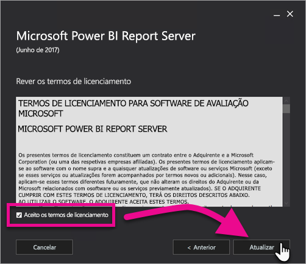
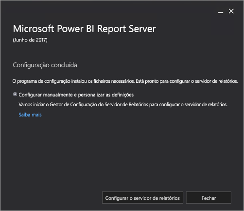

# Atualizar o Power BI Report Server
Saiba como atualizar o Power BI Report Server.

 **Transferir** 

Para transferir o Power BI Report Server e o Power BI Desktop otimizado para o Power BI Report Server, aceda a [Relatórios no local com o Power BI Report Server](https://powerbi.microsoft.com/report-server/).

## Antes de começar
Antes de atualizar um servidor de relatórios, recomendamos que siga os passos seguintes para criar uma cópia de segurança do seu servidor de relatórios.

### Criar cópia de segurança das chaves de encriptação
Deverá criar uma cópia de segurança das chaves de encriptação quando configurar uma instalação do servidor de relatórios pela primeira vez. Deverá também criar uma cópia de segurança das chaves sempre que alterar a identidade das contas de serviço ou mudar o nome do computador. Para obter mais informações, consulte [Back Up and Restore Reporting Services Encryption Keys (Criar Cópia de Segurança e Restaurar Chaves de Encriptação do Reporting Services - em inglês)](https://docs.microsoft.com/sql/reporting-services/install-windows/ssrs-encryption-keys-back-up-and-restore-encryption-keys).

### Criar cópia de segurança das bases de dados do servidor de relatórios
Uma vez que um servidor de relatórios é um servidor sem monitorização de estado, todos os dados de aplicação são armazenados nas bases de dados **reportserver** e **reportservertempdb** que são executadas numa instância do Motor de Base de Dados do SQL Server. Pode criar cópias de segurança das bases de dados **reportserver** e **reportservertempdb** através de um dos métodos suportados para criar cópias de segurança de bases de dados do SQL Server. Eis algumas das recomendações específicas para bases de dados do servidor de relatórios:

* Utilize o modelo de recuperação total para criar uma cópia de segurança da base de dados **reportserver**.
* Utilize o modelo de recuperação simples para criar uma cópia de segurança da base de dados **reportservertempdb**.
* Pode utilizar agendas de cópia de segurança diferentes para cada base de dados. O único motivo para criar uma cópia de segurança de **reportservertempdb** é evitar ter de a criar novamente em caso de falha de hardware. Em caso de falha de hardware, não é necessário recuperar os dados em **reportservertempdb**, mas precisa da estrutura de tabelas. Se perder a base de dados **reportservertempdb**, a única forma de a recuperar será recriar a base de dados do servidor de relatórios. Se recriar a base de dados **reportservertempdb**, é importante que esta tenha o mesmo nome da base de dados principal do servidor de relatórios.

Para obter mais informações sobre a cópia de segurança e recuperação de bases de dados relacionais do SQL Server, consulte [Back Up and Restore of SQL Server Databases (Cópia de Segurança e Restauro de Bases de Dados do SQL Server - em inglês)](https://docs.microsoft.com/sql/relational-databases/backup-restore/back-up-and-restore-of-sql-server-databases).

### Criar cópia de segurança dos ficheiros de configuração
O Power BI Report Server utiliza ficheiros de configuração para armazenar definições de aplicações. Deve criar uma cópia de segurança dos ficheiros na primeira vez que configurar o servidor e após implementar extensões personalizadas. Ficheiros a incluir na cópia de segurança:

* config.json
* RSHostingService.exe.config
* Rsreportserver.config
* Rssvrpolicy.config
* Reportingservicesservice.exe.config
* Web.config para aplicações ASP.NET do Report Server
* Machine.config para ASP.NET

## Atualizar o servidor de relatórios
Atualizar o Power BI Report Server é simples. Bastam alguns passos para instalar os ficheiros.

1. Procure a localização do ficheiro PowerBIReportServer.exe e inicie o instalador.
2. Selecione **Atualizar o Power BI Report Server**.
   
    
3. Leia e aceite os termos e condições da licença e, em seguida, selecione **Atualizar**.
   
    
4. Após atualizar com êxito, selecione **Configurar o Report Server** para iniciar o Reporting Services Configuration Manager, ou selecione **Fechar** para sair do instalador.
   
    

## Atualizar o Power BI Desktop
Após o servidor de relatórios ser atualizado, deverá certificar-se de que os autores de relatórios do Power BI atualizam para a versão do Power BI Desktop otimizada para o Power BI Report Server que corresponde ao servidor.

## Próximos passos
[Descrição geral para administradores](admin-handbook-overview.md)  
[Instalar o Power BI Desktop otimizado para o Power BI Report Server](install-powerbi-desktop.md)  
[Verificar uma instalação do Reporting Services](https://docs.microsoft.com/sql/reporting-services/install-windows/verify-a-reporting-services-installation)  
[Configurar a conta de serviço do servidor de relatórios](https://docs.microsoft.com/sql/reporting-services/install-windows/configure-the-report-server-service-account-ssrs-configuration-manager)  
[Configurar URLs do servidor de relatórios](https://docs.microsoft.com/sql/reporting-services/install-windows/configure-report-server-urls-ssrs-configuration-manager)  
[Configurar uma ligação à base de dados do servidor de relatórios](https://docs.microsoft.com/sql/reporting-services/install-windows/configure-a-report-server-database-connection-ssrs-configuration-manager)  
[Inicializar um servidor de relatórios](https://docs.microsoft.com/sql/reporting-services/install-windows/ssrs-encryption-keys-initialize-a-report-server)  
[Configurar ligações SSL num servidor de relatório](https://docs.microsoft.com/sql/reporting-services/security/configure-ssl-connections-on-a-native-mode-report-server)  
[Configurar permissões e contas de serviço Windows](https://docs.microsoft.com/sql/database-engine/configure-windows/configure-windows-service-accounts-and-permissions)  
[Suporte de browser para o Power BI Report Server](browser-support.md)

Mais perguntas? [Experimente perguntar à Comunidade do Power BI](https://community.powerbi.com/)

