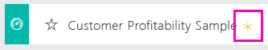

# Exemplo de Rentabilidade do Cliente para o Power BI: faça um tour

## Visão geral do exemplo de Rentabilidade do Cliente
O pacote de conteúdo "Exemplo de Lucro do Cliente" contém um dashboard, o relatório e o conjunto de dados para uma empresa que fabrica materiais de marketing. Este dashboard foi criado por um diretor financeiro para ver as métricas chave sobre os 5 gerentes de unidade comercial (também conhecidos como executivos), produtos, clientes e margens brutas (GM). Ela pode ver rapidamente que fatores têm impacto sobre o lucro.

Este exemplo faz parte de uma série que ilustra a forma como pode utilizar o Power BI com dados, relatórios e dashboards orientados para negócios. Os exemplos são dados reais de obviEnce ([www.obvience.com](http://www.obvience.com/)) que foram mantidos anónimos. Os dados estão disponíveis em vários formatos: pacote/aplicação de conteúdos, livro do Excel ou ficheiro .pbix do Power BI Desktop. Veja [Conjuntos de dados de exemplo](sample-datasets.md).

## Pré-requisitos
Quer acompanhar? Este tutorial utiliza o serviço Power BI e o pacote de conteúdos de exemplo “Rentabilidade do Cliente”.  Uma vez que as experiências do relatório são muito semelhantes, pode também acompanhar com o Power BI Desktop e o ficheiro PBIX de exemplo. Pode encontrar abaixo as instruções para se ligar ao pacote de conteúdos e ao ficheiro PBIX.

### Obter o pacote de conteúdos para este exemplo

1. Abra o serviço Power BI (app.powerbi.com) e inicie sessão.
2. No canto inferior esquerdo, selecione **Obter dados**.

    
3. Na página Obter Dados que aparece, selecione **Exemplos**.

   
4. Selecione o **Exemplo de Rentabilidade do Cliente** e, em seguida, escolha **Ligar**.  

   
5. O Power BI importa o pacote de conteúdos e adiciona um novo dashboard, relatório e conjunto de dados para a sua área de trabalho atual. O novo conteúdo é assinalado com um asterisco amarelo. Utilize os exemplos para testar o Power BI.  

   

### Obter o ficheiro .pbix para este exemplo

Em alternativa, pode transferir o exemplo como um ficheiro .pbix, que foi concebido para utilização com o Power BI Desktop.
[Exemplo de Rentabilidade do Cliente](http://download.microsoft.com/download/6/A/9/6A93FD6E-CBA5-40BD-B42E-4DCAE8CDD059/Customer-Profitability-Sample-PBIX.pbix)

### Obter o livro do Excel para este exemplo

Se quiser investigar a origem de dados deste exemplo, também estará disponível como um [(livro do Excel)](http://go.microsoft.com/fwlink/?LinkId=529781). O livro contém as folhas do Power View que pode ver e modificar. Para ver os dados não processados, selecione **Power Pivot > Gerir**.

## O que nos diz o nosso dashboard?

Em **A Minha Área de Trabalho**, encontre o dashboard para o exemplo de Rentabilidade do Cliente:

### Mosaicos de dashboard de toda a empresa
1. Abra o dashboard no serviço Power BI. Os mosaicos do dashboard dão à nossa diretora financeira as métricas da empresa de alto nível que ela considera importantes.  Quando vê algo interessante, pode selecionar um mosaico para explorar os dados.

2. Consulte os mosaicos à esquerda do dashboard.

    

- A margem bruta da nossa empresa é de 42,5%.
- Temos 80 clientes.
- Vendemos 5 produtos diferentes.
- Tivemos nossa menor % de variação de receita para o orçamento de fevereiro, seguida da nossa maior alta em março.
- A maioria da nossa receita é proveniente das regiões leste e norte. A margem bruta nunca excedeu o orçamento, com ER-0 e MA-0 exigindo mais investigações.
- A receita total para o ano é quase o orçamento.

### Mosaicos do dashboard específico do gerente
Os mosaicos à direita do dashboard fornecem uma tabela de indicadores da equipa. O diretor financeiro deve manter o controlo dos gerentes e esses mosaicos apresentam uma visão geral de alto nível do lucro – utilizando GM %. Se a tendência de % GM é inesperada para qualquer gestor, poderá investigar mais.

- Todos os executivos, exceto Carlos, já excederam os objetivos de vendas. Contudo, as vendas reais de Carlos apresentam o valor mais elevado.
- A % de Margem Bruta de Annelie é a mais baixa, mas podemos ver um aumento gradual desde março.
- Valery, por outro lado, teve uma queda na % de GM significante.
- E Andrew teve um ano volátil.

## Explorar os dados subjacentes do dashboard
Este dashboard possui mosaicos com ligação a um relatório e a um livro do Excel.

### Abrir a origem de dados do Excel Online
Dois mosaicos neste dashboard, “Objetivo vs Real” e “Crescimento de Receita ao Longo dos Anos”, foram afixados a partir de um livro do Excel. Por esse motivo, quando seleciona um destes mosaicos, o Power BI abre a origem de dados, neste caso, o Excel Online.

1. Selecione um dos mosaicos afixados a partir do Excel. O Excel Online abre com o serviço Power BI.
2. Tenha em atenção que o livro possui três separadores com dados. Abra o separador “Receita”.
3. Vamos ver por que motivo Carlos ainda não atingiu o objetivo.  
    a. No controlo de deslize “Executivo”, selecione **Carlos Grilo**.   
    b. A primeira Tabela Dinâmica indica-nos que as receitas de Carlos referentes ao seu Produto principal, Primus, estão 152% abaixo em relação ao ano anterior. Adicionalmente, o gráfico da receita ao longo dos anos mostra-nos que ele esteve abaixo do orçamento durante a maioria dos meses.  

    

    

4. Continue a explorar e, se encontrar algo interessante, selecione **Afixar** , no canto superior direito, para [afixá-lo num dashboard](service-dashboard-pin-tile-from-excel.md).

5. Utilize a seta para trás do browser para regressar ao dashboard.

### Abrir o relatório subjacente do Power BI
A maioria dos mosaicos no dashboard no exemplo de Rentabilidade do Cliente foram afixados a partir do relatório de exemplo subjacente da Rentabilidade do Cliente.

1. Selecione um destes mosaicos para abrir o relatório na Vista de leitura.

2. O relatório tem três páginas. Cada separador na parte inferior do relatório representa uma página.

    

    * "Tabela de Indicadores da Equipa" centra-se no desempenho dos 5 gestores e dos respetivos "livros de negócio".
    * "Análise de Margem do Setor" fornece uma forma de analisar a rentabilidade em comparação com o que se passa em todo o setor.
    * "Tabela de Indicadores de Executivos" fornece uma vista de cada um dos gestores formatada para visualização no Cortana.

### Página de pontuação da equipa

Vejamos os dois membros da equipa em detalhes e que informações podem ser obtidas. Na segmentação à esquerda, selecione o nome de Andrew para filtrar a página de relatório para apresentar apenas os dados dele.

* Para um KPI rápido, veja o **Estado da Receita** de Andrew; está verde. Está a ter um bom desempenho.
* O gráfico de área "% de Variação da Receita do Orçamento por Mês” mostra a exceção para uma queda em fevereiro e Andrew está a ter um desempenho global muito bom. A região dominante é leste e ele manipula 49 clientes e 5 (de 7) produtos. A % de Margem Bruta não é a mais alta nem a mais baixa.
* O "Total da Receita e % de Variação da Receita do Orçamento por Mês" mostra um histórico de lucros estável, mas ao filtrar ao clicar no quadrado **Central** na região treemap, vemos que Andrew apenas tem receita em março e no Indiana. Isto é intencional ou é algo que temos de examinar?

Agora, com Valery. Na segmentação, selecione o nome de Valery para filtrar a página do relatório para exibir apenas os dados sobre ela.  

* Observe o KPI vermelho para **Estado do Total da Receita**. Isto necessita, definitivamente, mais investigação.
* A variação de receita também pinta uma imagem preocupante – ela não atende as margens de receita.
* Valery tem apenas 9 clientes, manipula apenas 2 produtos e funciona quase exclusivamente com os clientes da região norte. Esta especialização poderia explicar as amplas flutuações na métrica.
* Ao selecionar o quadrado **Norte** no treemap mostra que a margem bruta de Valery na região norte é consistente com a respetiva margem geral.
* Ao selecionar os outros quadrados **Região** vemos uma história interessante: a % de Margem Bruta varia entre 23% e 79% e os números de receita, em todas as regiões, exceto no Norte, são extremamente sazonais.

Continue a ler para descobrir por que a área de Valery não apresenta um bom desempenho. Examine as regiões, unidades de negócios e a próxima página do relatório – "Análise de Margem do Setor".

### Análise de Margem do Setor
Esta página de relatório fornece uma secção diferente dos dados. Examina a margem bruta para todo o setor, dividido por segmento. O diretor financeiro utiliza essa página para comparar as métricas de unidade da empresa e comercial para métricas do setor para ajudar a explicar tendências e lucro. Deve estar a imaginar por que o gráfico de área "Margem Bruta por Mês e Nome de Executivo” está nesta página, já que é específico de uma equipa. Tê-lo aqui permite-nos filtrar a página pelo gerente da unidade de negócios.  

Como varia o lucro por setor? Como se os produtos e clientes dividem por setor? Selecione um ou mais setores na parte superior esquerda. (iniciar no setor CPG) Para limpar o filtro, selecione o ícone de borracha.

No gráfico de bolhas, o CFO procura as bolhas maiores visto que são as que têm o maior impacto na receita. Filtrar a página por gerente clicando nos nomes no gráfico de área torna fácil ver cada impacto de gerente por segmento do setor.

* A área de influência de Andrew abrange vários setores diferentes com diferentes amplamente % GM (a maioria do lado positivo) e % Var.
* O gráfico de Annelie é semelhante, exceto que ela apenas se concentra em alguns segmentos de mercado com um foco no segmento Federal e um foco no produto Gladius.
* Carlos tem um foco claro no segmento de serviços, com bom lucro. Ele aumentou bastante a % de variação para o segmento de Alta Tecnologia e um novo segmento para ele, Industrial, executado muito bem em relação ao orçamento.
* Tina trabalha com alguns segmentos e tem % GM mais alta, mas o tamanho pequeno em grande parte das suas bolhas mostra que o impacto sobre o resultado da empresa é mínimo.
* Valery, que é responsável por apenas um produto, trabalha apenas com 5 segmentos de mercado. A influência do setor é sazonal, mas produz sempre uma grande bolha, que indicta um impacto significativo sobre o resultado da empresa. O setor explicar o desempenho negativo?

### Tabela de Indicadores de Executivos
Esta página está formatada como um Cartão de Resposta do Cortana. Para obter mais informações, veja [Criar Cartões de Resposta do Cortana](service-cortana-answer-cards.md)

## Investigue os dados fazendo perguntas em Perguntas e Respostas
Para a nossa análise, seria útil determinar que setor gera a maior parte da receita para Valery. Vamos usar Perguntas e Respostas.

1. Abra o relatório na Vista de edição ao selecionar **Editar relatório**. A Vista de edição só estará disponível se o utilizador for o “proprietário” do relatório, por vezes, denominado como modo **criador**. Por sua vez, se este relatório tiver sido partilhado consigo, não conseguirá abri-lo na Vista de edição.

2.  Na barra de menus superior, selecione **Colocar uma questão** para abrir a caixa de Perguntas e Respostas.

    

3. Introduza **receita total por setor de Valery**. Veja como a visualização é atualizada à medida que escreve a pergunta.

    

   A distribuição é a maior área de receita para Valery.

### Aprofunde adicionando filtros
Vamos analisar o setor de *Distribuição*.  

1. Abra a página do relatório “Análise de Margem do Setor”.
2. Sem selecionar nenhuma visualização na página de relatório, expanda o painel de filtros à direita (se ainda não estiver expandido). O painel Filtros deve apresentar apenas filtros ao nível da página.  

   
3. Localize o filtro para **Setor** e selecione a seta para expandir a lista. Vamos adicionar um filtro de página para o setor de Distribuição. Primeiro, desmarque todas as seleções ao desmarcar a caixa de seleção**Selecionar Tudo**. Em seguida, selecione apenas **Distribuição**.  

   
4. O gráfico de área "Margem bruta por Mês e o Nome do Executivo" informa que apenas Valery e Tina têm clientes neste setor e Valery só trabalhou com o setor de junho a novembro.   
5. Selecione **Tina** e **Valery** na legenda do gráfico de área "Margem Bruta por Mês e Executivo". Observe a parte de Tina "Receita Total por Produto" é muito pequeno se comparada a Valery.
6. Para ver a receita real, utilize as Perguntas e Respostas para pedir a **receita total por executivo da distribuição por cenário**.  

     

    Podemos explorar de forma semelhante a outros setores e até mesmo adicionar clientes aos nossos visuais para compreender as causas para o desempenho de Valery.

Este é um ambiente seguro para experimentar. Pode optar por não guardar as alterações. No entanto, se as guardar, pode sempre aceder a **Obter Dados** para obter uma nova cópia deste exemplo.

Também é possível [transferir apenas o conjunto de dados (livro do Excel) para este exemplo](http://go.microsoft.com/fwlink/?LinkId=529781).

## Próximos passos: ligar-se aos seus dados
Esperamos que esta tour tenha mostrado como os dashoards do Power BI, perguntas e respostas, e os relatórios podem fornecer informações sobre dados do cliente. Agora é a sua vez, ligue-se aos seus próprios dados. Com o Power BI, pode ligar-se a uma grande variedade de origens de dados. Saiba mais sobre como [começar a utilizar o Power BI](service-get-started.md).

[Voltar aos Exemplos no Power BI](sample-datasets.md)  
