# Exemplo de Rentabilidade do Cliente do Power BI: veja uma apresentação

## Visão geral do exemplo de Rentabilidade do Cliente
O pacote de conteúdos de exemplo Rentabilidade do Cliente contém um dashboard, um relatório e um conjunto de dados para uma empresa que fabrica materiais de marketing. Este dashboard foi criado por uma diretora financeira para ver as principais métricas sobre os seus cinco gestores (executivos) de unidade de negócio, produtos, clientes e margens brutas (GM). Desta forma, pode ver rapidamente que fatores têm impacto na rentabilidade.

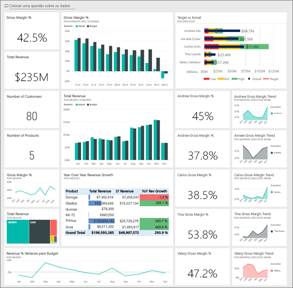

Este exemplo faz parte de uma série que mostra como pode utilizar o Power BI com dados, relatórios e dashboards orientados para negócios. Foi criado com dados reais anónimos da [obviEnce](http://www.obvience.com/), que foram mantidos anónimos. Os dados estão disponíveis em vários formatos: pacote/aplicação de conteúdos, ficheiro .pbix do Power BI Desktop ou livro do Excel. Veja [Samples for Power BI](sample-datasets.md) (Exemplos para o Power BI). 

Este tutorial utiliza o serviço Power BI e o pacote de conteúdos de exemplo Rentabilidade do Cliente. Uma vez que as experiências do relatório são muito semelhantes, também pode acompanhar com o Power BI Desktop e o ficheiro .pbix de exemplo. 

## Pré-requisitos

Para poder utilizar o exemplo, primeiro tem de transferi-lo como um [pacote de conteúdos](#get-the-content-pack-for-this-sample), um [ficheiro .pbix](#get-the-pbix-file-for-this-sample) ou um [livro do Excel](#get-the-excel-workbook-for-this-sample).

### Obter o pacote de conteúdos para este exemplo

1. Abra o serviço Power BI (app.powerbi.com), inicie sessão e abra a área de trabalho onde quer guardar o exemplo.

2. No canto inferior esquerdo, selecione **Obter Dados**.

   
3. Na página **Obter Dados** apresentada, selecione **Exemplos**.

4. Selecione **Exemplo de Rentabilidade do Cliente** e, em seguida, **Ligar**.  

    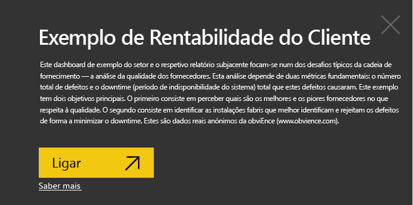
5. O Power BI importa o pacote de conteúdos e adiciona um novo dashboard, relatório e conjunto de dados à sua área de trabalho atual.

    

### Obter o ficheiro .pbix para este exemplo

Em alternativa, pode transferir o exemplo Rentabilidade do Cliente como um [ficheiro .pbix](http://download.microsoft.com/download/6/A/9/6A93FD6E-CBA5-40BD-B42E-4DCAE8CDD059/Customer%20Profitability%20Sample%20PBIX.pbix), que foi concebido para ser utilizado com o Power BI Desktop.

### Obter o livro do Excel para este exemplo

Se quiser ver a origem de dados deste exemplo, também está disponível como um [livro do Excel](http://go.microsoft.com/fwlink/?LinkId=529781). O livro contém as folhas do Power View que pode ver e modificar. Para ver os dados não processados, ative os suplementos de Análise de Dados e, em seguida, selecione **Power Pivot > Gerir**. Para ativar os suplementos Power View e Power Pivot, veja [Observe os exemplos de Excel a partir do interior do próprio Excel](sample-datasets.md#optional-take-a-look-at-the-excel-samples-from-inside-excel-itself) para obter detalhes.

## O que nos diz o nosso dashboard?

Na área de trabalho onde guardou o exemplo, procure o dashboard Rentabilidade do Cliente e selecione-o:

### Mosaicos de dashboard de toda a empresa
1. Abra o dashboard no serviço Power BI. Os mosaicos do dashboard dão à nossa diretora financeira as métricas da empresa de alto nível que ela considera importantes. Quando vê algo interessante, pode selecionar um mosaico para explorar os dados.

2. Consulte os mosaicos à esquerda do dashboard.

    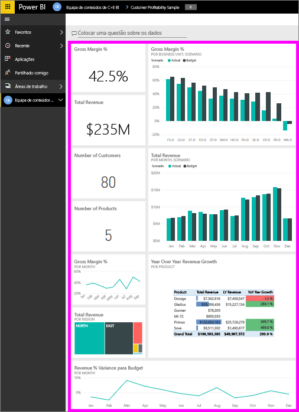

   Repare nos seguintes detalhes:
   - A margem bruta da empresa é de 42,5%.
   - Tem 80 clientes.
   - Vende cinco produtos diferentes.
   - Teve a menor % de variação da receita do orçamento em fevereiro, seguida da mais alta em março.
   - A maioria da nossa receita é proveniente das regiões leste e norte. A margem bruta nunca excedeu o orçamento, com as unidades de negócio ER-0 e MA-0 a exigirem mais investigação.
   - A receita total para o ano é quase o orçamento.

### Mosaicos do dashboard específico do gerente
Os mosaicos à direita do dashboard fornecem uma tabela de indicadores da equipa. A diretora financeira necessita de manter o controlo dos seus gestores e estes mosaicos apresentam uma descrição geral resumida do lucro ao utilizar a % de GM. Se a tendência de % GM é inesperada para qualquer gestor, poderá investigar mais.

Ao analisar os mosaicos do dashboard específicos dos gestores, podemos fazer as seguintes observações:

- Todos os executivos, exceto Carlos, já excederam os objetivos de vendas. Contudo, as vendas reais de Carlos apresentam o valor mais elevado.
- A % de Margem Bruta de Annelie é a mais baixa, mas podemos ver um aumento gradual desde março.
- Valery, por outro lado, teve uma queda na % de GM significante.
- Andrew teve um ano volátil.

## Explorar os dados subjacentes do dashboard
Este dashboard possui mosaicos com ligação a um relatório e a um livro do Excel.

### Abrir a origem de dados do Excel Online
Dois mosaicos neste dashboard, **Target vs Actual** (Objetivo vs. Real) e **Year Over Year Revenue Growth** (Crescimento da Receita ao Longo dos Anos), foram afixados a partir de um livro do Excel. Ao selecionar um destes mosaicos, o Power BI abre a origem de dados, neste caso, o Excel Online.

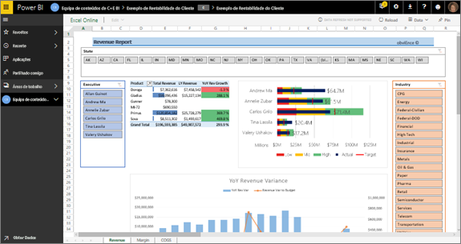

1. Selecione um dos mosaicos afixados a partir do Excel. O Excel Online é aberto no serviço Power BI.
2. Tenha em atenção que o livro tem três separadores de dados. Abra **Revenue** (Receita).
3. Vejamos porque é que Carlos ainda não atingiu o objetivo:  

    a. No controlo de deslize **Executive** (Executivo), selecione **Carlos Grilo**.   

    b. A primeira tabela dinâmica indica-nos que o crescimento da receita de Carlos referente ao seu produto principal, Primus, é 152% inferior ao do ano anterior. O gráfico **YoY Revenue Variance** (Variação da Receita ao Longo dos Anos) mostra-nos que esteve abaixo do orçamento durante a maioria dos meses.  

    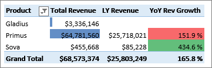

    

4. Continue a explorar. Se encontrar algo interessante, selecione **Afixar** , no canto superior direito, para o [afixar num dashboard](service-dashboard-pin-tile-from-excel.md).

5. Utilize a seta para trás do browser para regressar ao dashboard.

### Abrir o relatório subjacente do Power BI
Muitos dos mosaicos no dashboard no exemplo de Rentabilidade do Cliente foram afixados do relatório de exemplo Rentabilidade do Cliente subjacente.

1. Selecione um destes mosaicos para abrir o relatório na Vista de leitura.

   Se o mosaico tiver sido criado em Perguntas e Respostas, selecioná-lo irá abrir a janela Perguntas e Respostas. Selecione **Sair das Perguntas e Respostas** para voltar ao dashboard e experimentar um mosaico diferente.

2. O relatório tem três páginas. Cada separador na parte inferior do relatório representa uma página diferente.

    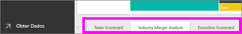

    * **Team Scorecard** (Tabela de Indicadores da Equipa) centra-se no desempenho dos cinco gestores e dos respetivos livros de negócio.
    * **Industry Margin Analysis** (Análise de Margem do Setor) fornece uma forma de analisar a rentabilidade em comparação com o que se passa em todo o setor.
    * **Executive Scorecard** (Tabela de Indicadores de Executivos) fornece uma vista de cada um dos gestores formatada para visualização na Cortana.

### Página de pontuação da equipa

Vejamos dois dos membros da equipa ao detalhe e que informações podem ser obtidas: 

1. Na segmentação de dados **Executive** (Executivos) à esquerda, selecione o nome do Andrew para filtrar a página do relatório e ver apenas os dados dele:

   * Para um KPI rápido, analise o **Revenue Status (Total Year)** (Estado da Receita [Total do Ano]) de Andrew. É apresentado a verde, o que significa que Andrew está a ter um bom desempenho.
   * O gráfico **Revenue % Variance to Budget by Month and Executive** (% de Variação da Receita do Orçamento por Mês e Executivo) mostra que, com exceção de uma queda em fevereiro, Andrew está a ter um bom desempenho geral. A sua região dominante é o leste e lida com 49 clientes e com 5 de 7 produtos. A sua % de GM não é a mais alta nem a mais baixa.
   * O gráfico**RevenueTY and Revenue % Var to Budget by Month** (Total da Receita do Ano e % de Variação da Receita do Orçamento por Mês) mostra um histórico de lucros contínuo e equilibrado. No entanto, se filtrar ao selecionar o quadrado para **Central** no mapa de árvore da região, irá descobrir que Andrew só tem receitas em Março e no Indiana. Isto é intencional ou é algo que tem de ser analisado?

2. Agora, com Valery. Na segmentação de dados**Executive** (Executivos), selecione o nome da Valery para filtrar a página do relatório e ver apenas os dados dela. 

   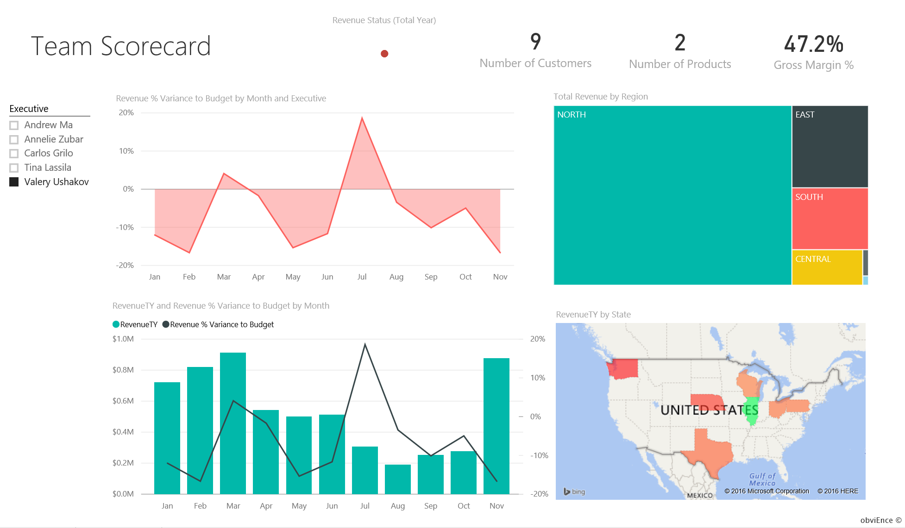

   * Observe o KPI a vermelho para **Revenue Status (Total Year)** (Estado da Receita [Total do Ano]). Este item necessita definitivamente de mais investigação.
   * A variação da receita também revela algo preocupante – Valery não está a cumprir as margens de receita.
   * Valery só tem nove clientes, lida apenas com dois produtos e trabalha quase exclusivamente com clientes na região norte. Esta especialização poderá explicar as grandes oscilações nas suas métricas.
   * Se selecionar o quadrado **North** (Norte) no mapa de árvore, o mesmo mostra que a margem bruta de Valery na região norte é consistente com a sua margem geral.
   * Ao selecionar cada um dos outros quadrados **Total Revenue by Region** (Receita Total por Região), vemos dados interessantes: a % de GM varia entre 23% e 79%. Os seus números de receita, em todas as regiões, exceto na região norte, são extremamente sazonais.

3. Continue a explorar para descobrir porque é que a área de Valery não apresenta um bom desempenho. Analise as regiões, as outras unidades de negócios e a próxima página do relatório: **Análise de Margem do Setor**.

### Análise de Margem da Indústria
Esta página de relatório fornece uma secção diferente dos dados. Examina a margem bruta para todo o setor, dividido por segmento. O diretor financeiro utiliza essa página para comparar as métricas de unidade da empresa e comercial para métricas do setor para ajudar a explicar tendências e lucro. Poderá estar a questionar-se por que motivo o gráfico **Gross Margin % by Month and Executive** (Margem Bruta por Mês e Executivo) está nesta página, uma vez que é específico de uma equipa. Tê-lo aqui permite-nos filtrar a página pelo gerente da unidade de negócios.  

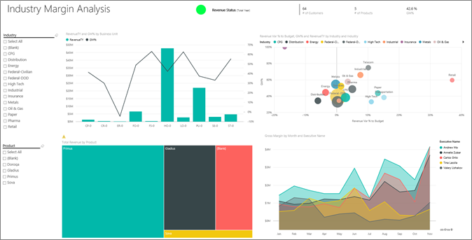

1. Como varia o lucro por setor? Como se os produtos e clientes dividem por setor? Para responder a estas perguntas, selecione um ou mais setores no canto superior esquerdo (comece com o setor de CPG). Para limpar o filtro, selecione o ícone de borracha.

2. No gráfico de bolhas **Revenue Var % to Budget, GM%, and RevenueTY by Industry** (% de Variação da Receita do Orçamento, % de GM e Total da Receita do Ano por Setor), a diretora financeira procura as bolhas maiores, uma vez que têm o maior impacto na receita. Para ver facilmente o impacto de cada gestor por segmento do setor, filtre a página ao selecionar o nome de cada gestor no gráfico de área.

3. À medida que seleciona cada gestor no gráfico, repare nos seguintes detalhes:
   * A área de influência de Andrew abrange vários setores diferentes com diferentes amplamente % GM (a maioria do lado positivo) e % Var.
   * O gráfico de Annelie é semelhante, exceto que a mesma apenas se concentra em alguns segmentos do setor, com um foco no segmento Federal e outro no produto Gladius.
   * Carlos tem um foco claro no segmento de serviços, com um bom lucro. Aumentou bastante a % de variação para o segmento Alta Tecnologia, e um novo segmento para ele, Industrial, teve um excelente desempenho em relação ao orçamento.
   * Tina trabalha com alguns segmentos e tem % GM mais alta, mas o tamanho pequeno em grande parte das suas bolhas mostra que o impacto sobre o resultado da empresa é mínimo.
   * Valery, que é responsável por apenas um produto, só trabalha com cinco segmentos do setor. A influência do setor é sazonal, mas produz sempre uma grande bolha, que indicta um impacto significativo sobre o resultado da empresa. Os segmentos do setor explicam o seu desempenho negativo?

### Tabela de indicadores executiva
Esta página está formatada como uma página de resposta. Para obter mais informações, veja [Criar uma página de resposta personalizada da Cortana](service-cortana-answer-cards.md).

## Investigue os dados fazendo perguntas em Perguntas e Respostas
Para a nossa análise, poderá ser útil determinar que setor gera a maior parte da receita para Valery. Vamos usar Perguntas e Respostas.

1. Selecione **Editar relatório** para abrir o relatório na Vista de edição. A vista de Edição só está disponível se for proprietário do relatório. Esta vista é por vezes denominada modo de *criador*. Se, em vez disso, este relatório for partilhado apenas consigo, não poderá abri-lo na vista de Edição.

2.  Na parte superior do dashboard, selecione **Colocar uma questão** para abrir a caixa de Perguntas e Respostas.

    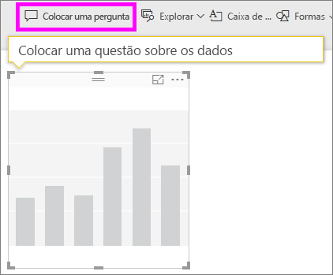

3. Escreva *receita total por setor de Valery* na caixa de perguntas. Veja como a visualização é atualizada à medida que escreve a pergunta.

    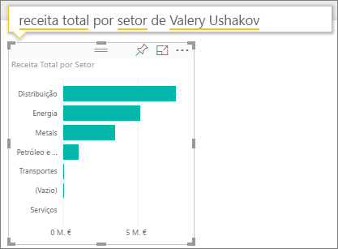

   Como pode ver, o setor de Distribuição é a maior área de receita de Valery.

### Aprofunde adicionando filtros
Analisemos o setor de Distribuição.  

1. Abra a página do relatório **Industry Margin Analysis** (Análise de Margem do Setor).
2. Sem selecionar nenhuma visualização na página de relatório, expanda o painel de filtros à direita (se ainda não estiver expandido). O painel **Filters** (Filtros) deverá apresentar apenas **Page level filters** (Filtros ao nível da página).  

   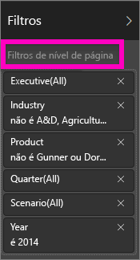
3. Localize o filtro para **Setor** e selecione a seta para expandir a lista. Vamos adicionar um filtro de página para o setor de Distribuição. Primeiro, desmarque todas as seleções ao desmarcar a caixa de seleção**Selecionar Tudo**. Em seguida, selecione apenas **Distribuição**.  

   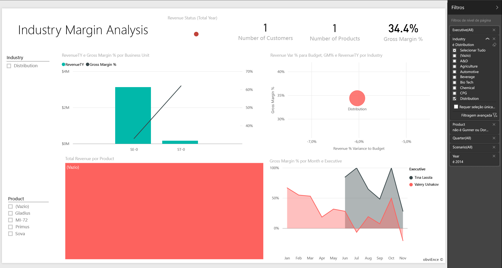
4. O gráfico **Gross Margin % by Month and Executive** (% de Margem Bruta por Mês e Executivo) indica-nos que apenas Valery e Tina têm clientes neste setor, e que Valery trabalhou com este setor apenas de junho a novembro.   
5. Selecione **Tina** e **Valery** na legenda do gráfico **Gross Margin by Month and Executive** (Margem Bruta por Mês e Executivo). Repare que a parte de Tina do gráfico **Total Revenue by Product** (Receita Total por Produto) é pequena em comparação com a de Valery.
6. Para ver a receita real, selecione a caixa Perguntas e Respostas no dashboard e introduza a *receita total para distribuição por cenário* .  

     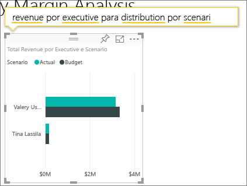

    Podemos explorar de forma semelhante a outros setores e até mesmo adicionar clientes aos nossos visuais para compreender as causas para o desempenho de Valery.

Aqui pode explorar à vontade, pois pode optar por não guardar as alterações. No entanto, se as guardar, pode sempre aceder a **Obter Dados** para obter uma nova cópia deste exemplo.

## Próximos passos: Ligar aos seus dados
Esperamos que esta tour tenha mostrado como os dashoards do Power BI, perguntas e respostas, e os relatórios podem fornecer informações sobre dados do cliente. Agora, é a sua vez: ligue-se aos seus próprios dados. Com o Power BI, pode ligar-se a uma grande variedade de origens de dados. Para saber mais, veja [Introdução ao serviço Power BI](service-get-started.md).

[Samples for Power BI](sample-datasets.md) (Exemplos para o Power BI)  
