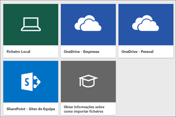
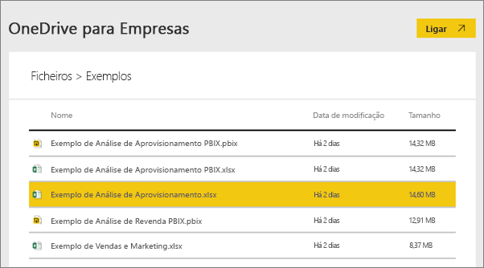
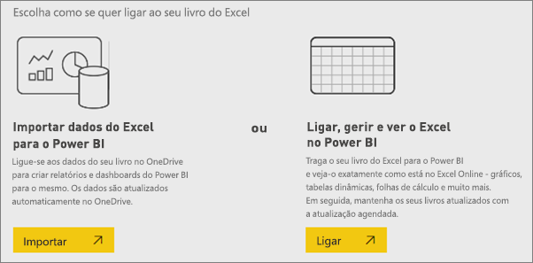
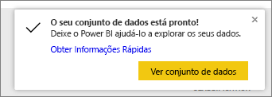
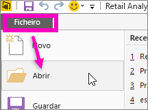

# Os dados de exemplo estão disponíveis para serem utilizados com o Power BI?
Diga que não está familiarizado com o Power BI e pretende experimentar, mas não tem quaisquer dados.  Ou talvez tem um conjunto de dados, mas como não compreende (ainda) como funciona o Power BI, preocupa-se na possibilidade de danificar o conjunto de dados?

Não é necessário preocupar-se! A obviEnce ([www.obvience.com](http://www.obvience.com/)) e a Microsoft criaram exemplos para que possa utilizar até se sentir mais familiarizado com o Power BI.  Os dados são anónimos e representam as diferentes indústrias: finanças, RH, vendas e muito mais. E à medida que lê a documentação online, irá encontrar tutoriais e exemplos que utilizam estes exemplos mesmos, o que significa que será capaz de acompanhar.      

   

Cada um destes exemplos está disponível em vários formatos: como um pacote de conteúdos, como um livro do Excel individual e como um ficheiro. pbix. Se não estiver familiarizado com estes temas ou como agir – não se preocupe. Vamos explicar-lhe tudo neste artigo. E para cada exemplo, criámos uma *apresentação* que é um tipo de artigo que indica os antecedentes do exemplo e orienta-o através de diferentes cenários. Um cenário poderá responder a questões do seu diretor, outro poderá ter informações competitivas ou criar relatórios e dashboards a partilha ou explicar uma mudança de negócio.   

Mas antes de começarmos, leia estas diretrizes legais para utilizar os exemplos. Quando terminar, vamos apresentar os exemplos e mostrar-lhe como utilizá-los.   

## Diretrizes de utilização para os livros do Excel de exemplo do Power BI
Leia estas informações antes de utilizar os exemplos do Power BI.

©2015 Microsoft Corporation. Todos os direitos reservados. Os documentos e livros são fornecidos "tal como estão." As informações e opiniões expressas nos livros, incluindo URLs e outras referências a sites, podem ser alteradas sem aviso prévio. O utilizador assume o risco de usá-las. Alguns exemplos são apenas para ilustração e são fictícios. Nenhuma associação real é pretendida ou inferida. A Microsoft não faz garantias, de forma expressa ou implícita, em relação à informação aqui apresentada.

Os livros não lhe conferem qualquer direito legal sobre nenhuma propriedade intelectual de nenhum produto da Microsoft. Pode copiar e utilizar este livro para fins internos e de referência.

Os livros e os dados relacionados são fornecidos pela obviEnce. [www.obvience.com](http://www.obvience.com)

A ObviEnce é um ISV (distribuidor independente de software) e uma incubadora de propriedade intelectual voltada para Microsoft Business Intelligence. A ObviEnce trabalha em estreita colaboração com a Microsoft para desenvolver melhores práticas e liderança elaborada para início rápido e implementação de soluções de Microsoft Business Intelligence.

Os livros e os dados são propriedade da obviEnce, LLC e foram partilhados exclusivamente com o objetivo de demonstrar a funcionalidade do Power BI com dados de exemplo do setor.

Quaisquer utilizações dos livros e/ou dados devem incluir a atribuição acima (que também está na folha de cálculo de informações que acompanha cada livro). O livro e quaisquer visualizações devem ser acompanhados da seguinte notificação relativa a direitos de autor: obviEnce ©.

Ao clicar em qualquer uma das ligações abaixo para transferir os ficheiros dos livros do Excel ou .pbix, significa que aceita os termos acima.

## Exemplos disponíveis
Estão disponíveis oito exemplos para que os posso utilizar.  Cada um representa uma industria diferente.

### Exemplo de Rentabilidade do Cliente  
[Veja uma apresentação do exemplo de Rentabilidade do Cliente](sample-customer-profitability.md)

Este exemplo do setor analisa métricas-chave de um CFO para os seus executivos, produtos e clientes. Pode investigar quais os fatores que afetam a rentabilidade da sua empresa.

### Exemplo de Recursos Humanos  
[Veja uma apresentação do exemplo de RH](sample-human-resources.md)

Este exemplo da indústria concentra-se na estratégia de contratação de uma empresa por meio da análise de novos contratados, funcionários ativos e funcionários dispensados.  Ao explorar os dados, pode encontrar tendências em separações voluntárias e desvios na estratégia de contratação.

### Exemplo de Análise de Gastos em TI 
[Veja uma apresentação do exemplo de Análise de Gastos em TI](sample-it-spend.md)

Neste exemplo do setor analisamos os custos planeados vs. os custos reais do departamento de TI de uma empresa. Esta comparação ajuda-nos a perceber em que medida a empresa planeou corretamente o seu ano e permite-nos investigar as áreas com grandes desvios em relação ao plano. Este exemplo mostra um ciclo de planeamento anual da empresa e apresenta trimestralmente uma nova Latest Estimate (Estimativa Mais Recente (LE)) para ajudar a analisar as alterações dos gastos de TI ao longo do ano fiscal.

### Exemplo de Análise de Oportunidade  
[Veja uma apresentação do exemplo de Análise de Oportunidade](sample-opportunity-analysis.md)

Este exemplo do setor explica um canal de vendas de uma empresa de software. Os gestores de vendas monitorizam os seus canais de vendas diretas e de parceiros acompanhando as oportunidades e a receita por região, tamanho da oferta e canal.

### Exemplo de Análise de Compras  
[Veja uma apresentação do exemplo de Análise de Compras](sample-procurement.md)

Este exemplo do setor analisa métricas-chave de um CFO para os seus executivos, produtos e clientes. Pode investigar quais os fatores que afetam a rentabilidade da sua empresa

### Exemplo da Análise de Retalhistas  
[veja uma apresentação do exemplo da Análise de Retalhistas](sample-retail-analysis.md)

Este exemplo do setor analisa dados de vendas de retalho dos itens vendidos em várias lojas e distritos. As métricas comparam o desempenho do ano atual com o último ano nas seguintes áreas: vendas, unidades, margem bruta e desvio, bem como a análise de novas lojas.

### Exemplo de Vendas e Marketing  
[Veja uma apresentação do exemplo de Vendas e Marketing](sample-sales-and-marketing.md)

Este exemplo do setor analisa uma empresa industrial, VanArsdel Ltd. Permite ao Diretor de Marketing uma observação do setor e da quota de mercado da VanArsdel.  Ao explorar o exemplo, pode encontrar a quota de mercado da empresa, o volume de produtos, as vendas e o sentimento.

### Exemplo de Qualidade do Fornecedor  
[Veja uma apresentação do exemplo de Qualidade do Fornecedor](sample-supplier-quality.md)

Este exemplo do setor destaca um dos desafios típicos da cadeia de fornecedores – análise de qualidade do fornecedor. Esta análise depende de duas métricas principais: o número total de defeitos e o período de indisponibilidade total que estes defeitos causaram. Este exemplo tem dois objetivos principais: perceber quais são os melhores e os piores fornecedores, no que respeita à qualidade e identificar as instalações fabris que melhor localizam e rejeitam defeitos, para minimizar o período de indisponibilidade.

Agora, sabe o que está disponível. Está na altura de conhecer estes exemplos.  

## Como obter os exemplos
Ao ler acima, os exemplos estão disponíveis em vários formatos: conteúdo de pacotes, livros do Excel e ficheiros .pbix. Vamos descrever como utilizar cada um deles, começando com pacotes de conteúdos.

## Os exemplos do Power BI como pacotes de conteúdos
Os conteúdo de pacotes são o único formato de exemplo disponível a partir do Power BI; não tem de sair do Power BI para os encontrar. Um pacote de conteúdos é, essencialmente, um pacote de um ou mais dashboard, conjunto de dados e relatório que alguém cria e que pode ser utilizado com o serviço Power BI. As pessoas criam pacotes de conteúdos para partilhar com colegas. Cada um dos pacotes de conteúdos de exemplo do Power BI inclui um conjunto de dados, o relatório e o dashboard.  Os pacotes de conteúdo não estão disponíveis para o Power BI Desktop. Se quiser obter mais informações sobre pacotes de conteúdos, leia [introdução aos pacotes de conteúdo no Power BI](service-organizational-content-pack-introduction.md).

### Obter e abrir um pacote de conteúdos de exemplo no serviço Power BI
1. Abra o serviço do Power BI (app.powerbi.com) e inicie sessão.
2. No canto inferior esquerdo, selecione **Obter dados**.

    
3. Na página Obter Dados que aparece, selecione **Exemplos**.

   
4. Selecione um dos exemplos para abrir uma descrição desse exemplo. Em seguida, escolha **Ligar**.  

   
5. O Power BI importa o pacote de conteúdos e adiciona um novo dashboard, relatório e conjunto de dados para a sua área de trabalho atual. O novo conteúdo é assinalado com um asterisco amarelo. Utilize os exemplos para testar o Power BI.  

   

Agora que tem dados, está no bom caminho.  Experimente alguns dos nossos tutoriais utilizando pacotes de conteúdos de exemplo ou basta abrir o serviço Power BI e explorar.

## Exemplos do Power BI como ficheiros Excel
Cada um dos pacotes de conteúdos de exemplo também está disponível como livro do Excel. Os livros do Excel foram concebidos para serem utilizados com o serviço Power BI.  

1. Transfira os ficheiros individualmente utilizando as ligações abaixo ou [transfira um ficheiro zip de todos os ficheiros de exemplo](http://go.microsoft.com/fwlink/?LinkId=535020). Os utilizadores avançados podem transferir os livros do Excel para explorar ou editar os modelos de dados.

   * [Exemplo de Análise de Retalho](http://go.microsoft.com/fwlink/?LinkId=529778)
   * [Exemplo de Análise de Qualidade do Fornecedor](http://go.microsoft.com/fwlink/?LinkId=529779)
   * [Exemplo de Recursos Humanos](http://go.microsoft.com/fwlink/?LinkId=529780)
   * [Exemplo de Rentabilidade do Cliente](http://go.microsoft.com/fwlink/?LinkId=529781)
   * [Exemplo de Acompanhamento de Oportunidades](http://go.microsoft.com/fwlink/?LinkId=529782)
   * [Exemplo de Análise de Gastos de TI](http://go.microsoft.com/fwlink/?LinkId=529783)
   * [Exemplo de Análise de Compras](http://go.microsoft.com/fwlink/?LinkId=529784)
   * [Exemplo de Vendas e Marketing](http://go.microsoft.com/fwlink/?LinkId=529785)
2. Guarde o ficheiro transferido. O local onde guarda o ficheiro é importante.

   *   **Local** - se guardar o ficheiro numa unidade local no computador ou noutro local na sua organização, através do Power BI, é possível importar o ficheiro para o Power BI. Na verdade, o ficheiro permanecerá na unidade local; portanto, o ficheiro completo não é, de fato, importado para o Power BI. O que realmente ocorre é que um novo conjunto de dados é criado no site do Power BI e os dados e, em alguns casos, o modelo de dados, são carregados para esse conjunto de dados. Se o ficheiro tiver relatórios, estes serão apresentados no site do Power BI em Relatórios.
   *  **OneDrive - Business** – Caso tenha o OneDrive for Business e inicie sessão com a mesma conta usada  do Power BI, essa será, sem dúvida, a forma mais eficaz de manter o seu trabalho no Excel, no Power BI ou num ficheiro .CSV em sincronização com o seu conjunto de dados, os seus relatórios e dashboards no Power BI. Visto que tanto o Power BI quanto o OneDrive ficam na cloud, o Power BI liga-se ao seu ficheiro no OneDrive em intervalos aproximados de uma hora. Caso sejam encontradas alterações, o conjunto de dados, os relatórios e os dashboards serão atualizados automaticamente no Power BI.
   *  **OneDrive - Personal** – Caso tenha guardado os ficheiros na sua própria conta do OneDrive, aproveitará vários benefícios que teria com o OneDrive for Business. A maior diferença é que, na primeira ligação ao ficheiro (ao utilizar Obter Dados > Ficheiros > OneDrive – Pessoal), tem de iniciar sessão no OneDrive com a sua conta Microsoft, a qual é normalmente diferente da utilizada para iniciar sessão no Power BI. Ao iniciar sessão no OneDrive com a sua conta Microsoft, certifique-se de que seleciona a opção Manter sessão iniciada. Dessa forma, o Power BI poderá ligar ao ficheiro em intervalos aproximados de uma hora e garantir que o conjunto de dados no Power BI está sincronizado.
   *  **SharePoint – Sites de Equipa**    Guardar os seus ficheiros do Power BI no SharePoint – Sites de Equipa é muito semelhante a guardá-los no OneDrive for Business. A maior diferença neste caso é como liga ao ficheiro do Power BI. Pode especificar um URL ou ligar à pasta raiz.
3. Abra o serviço do Power BI (app.powerbi.com) e inicie sessão.

   > [!TIP]
   > Nesta altura poderá criar um novo dashboard e dar-lhe o nome do ficheiro que pretende importar.  Caso contrário, ao importar o conjunto de dados do Excel, o Power BI não irá criar um novo dashboard com o nome do exemplo, mas em vez disso, irá adicionar um mosaico ao dashboard que esteja aberto atualmente. Ao selecionar esse mosaico acede ao relatório do conjunto de dados. Esta ação não é essencial, porque pode sempre criar um novo dashboard posteriormente, mas começar com um novo dashboard poupa-lhe um ou dois passos.
   >
   >
4. No canto inferior esquerdo, selecione **Obter dados**.

    
5. Na página Obter Dados que aparece, selecione **Ficheiros > Obter**.

     
6. Navegue até à localização onde transferiu e guardou o exemplo.

   
7. Selecione o ficheiro, neste caso **Exemplo de Análise de Compras.xlsx** que foi guardado no OneDrive for Business e escolha **Ligar**.

   
8. Escolha se pretende importar os dados ou colocar o livro no Power BI e vê-lo exatamente como no Excel online.

    
9. Se selecionar **Importar**, o Power BI importa o livro de exemplo e adiciona-o como um novo conjunto de dados com o nome **Exemplo de Análise de Compras**.  Se o livro tiver quaisquer folhas do Power View, tabelas ou intervalos ou um modelo de dados, o Power BI também cria um relatório (com o mesmo nome). E, se ainda não tiver um dashboard aberto, o Power BI cria um dashboard novo. (Se tiver um dashboard aberto quando clicou **Obter Dados**, verá um novo mosaico em branco nesse dashboard.  Clicar nesse mosaico leva-o ao relatório do conjunto de dados que acabou de adicionar). O novo conteúdo é denominado com base no exemplo e assinalado com um asterisco amarelo.
10. Quando aparece o ecrã **O conjunto de dados está pronto!** selecione **Ver conjunto de dados** ou **Obter Insights Rápidos** ou utilize simplesmente a barra de navegação esquerda do Power BI para localizar e abrir o relatório associado ou o dashboard.  

     

### (Opcional) Observe os exemplos de Excel a partir do interior do próprio Excel
Quer saber como os dados num livro do Excel são convertidos em conjuntos de dados e relatórios do Power BI? Ao abrir os exemplos de Excel ***no Excel*** e explorar as folhas de cálculo obtém algumas de respostas.

* Ao abrir um livro de exemplo no Excel pela primeira vez, verá dois avisos. O primeiro diz que o livro está em Modo de Vista Protegida. Selecione **Ativar Edição**. O segundo diz que o livro tem ligações de dados externas. Selecione **Ativar Conteúdo**.
* Cada livro contém várias folhas. Porque todos estes exemplos de Excel têm pelo menos uma folha do Power View com visualizações, ao importar o ficheiro do Excel no Power BI irá acaba por ficar com um conjunto de dados **e** um relatório.

   Poderá ter de [ativar o suplemento do Power View](https://support.office.com/article/Create-a-Power-View-sheet-in-Excel-2013-B23D768D-7586-47FE-97BD-89B80967A405#__toc328591957).
* Por isso, onde estão os dados reais? Estão no modelo de dados do Power Pivot. Para ver os dados, no separador **PowerPivot** selecione **Gerir Modelo de Dados**.

    Não vê o separador PowerPivot? [Ative o suplemento do Power Pivot](https://support.office.com/article/Start-Power-Pivot-in-Microsoft-Excel-2013-add-in-A891A66D-36E3-43FC-81E8-FC4798F39EA8).
* O separador Informações dispõe de informações sobre a obviEnce, a empresa que criou o exemplo.

## Os exemplos do Power BI como ficheiros. pbix
Cada um dos pacotes de conteúdos de exemplo também está disponível como ficheiro. pbix do Power BI. Os ficheiros .pbix são concebidos para serem utilizados com o Power BI Desktop.  

1. Transfira os ficheiros individualmente utilizando as ligações abaixo. Selecionar estas ligações guarda o ficheiro automaticamente na pasta Transferências. 

   * [Ficheiro PBIX de Exemplo de Análise de Revenda](http://download.microsoft.com/download/9/6/D/96DDC2FF-2568-491D-AAFA-AFDD6F763AE3/Retail%20Analysis%20Sample%20PBIX.pbix)
   * [Ficheiro PBIX de Exemplo de Análise de Qualidade do Fornecedor](http://download.microsoft.com/download/8/C/6/8C661638-C102-4C04-992E-9EA56A5D319B/Supplier%20Quality%20Analysis%20Sample%20PBIX.pbix)
   * [Ficheiro PBIX de Exemplo de Recursos Humanos](http://download.microsoft.com/download/6/9/5/69503155-05A5-483E-829A-F7B5F3DD5D27/Human%20Resources%20Sample%20PBIX.pbix)
   * [Ficheiro PBIX de Exemplo de Rentabilidade do Cliente](http://download.microsoft.com/download/6/A/9/6A93FD6E-CBA5-40BD-B42E-4DCAE8CDD059/Customer%20Profitability%20Sample%20PBIX.pbix)
   * [Ficheiro PBIX de Exemplo de Acompanhamento de Oportunidades](http://download.microsoft.com/download/9/1/5/915ABCFA-7125-4D85-A7BD-05645BD95BD8/Opportunity%20Analysis%20Sample%20PBIX.pbix)
   * [Ficheiro PBIX de Exemplo de Análise de Gastos de TI](http://download.microsoft.com/download/E/9/8/E98CEB6D-CEBB-41CF-BA2B-1A1D61B27D87/IT%20Spend%20Analysis%20Sample%20PBIX.pbix)
   * [Ficheiro PBIX de Exemplo de Análise de Aprovisionamento](http://download.microsoft.com/download/D/5/3/D5390069-F723-413B-8D27-5888500516EB/Procurement%20Analysis%20Sample%20PBIX.pbix)
   * [Ficheiro PBIX de Exemplo de Vendas e Marketing](http://download.microsoft.com/download/9/7/6/9767913A-29DB-40CF-8944-9AC2BC940C53/Sales%20and%20Marketing%20Sample%20PBIX.pbix)

1. A partir do Power BI Desktop, selecione **Ficheiro > Abrir** e navegue para a localização onde guardou o .pbix de exemplo.

   
4. Selecione o ficheiro .pbix para o abrir no Power BI Desktop.

## Próximos passos
[Conceitos básicos do Power BI](service-basic-concepts.md)

[Tutorial: ligar-se aos exemplos do Power BI](sample-tutorial-connect-to-the-samples.md)

[Origens de dados do Power BI](service-get-data.md)

Mais perguntas? [Pergunte à Comunidade do Power BI](http://community.powerbi.com/)
