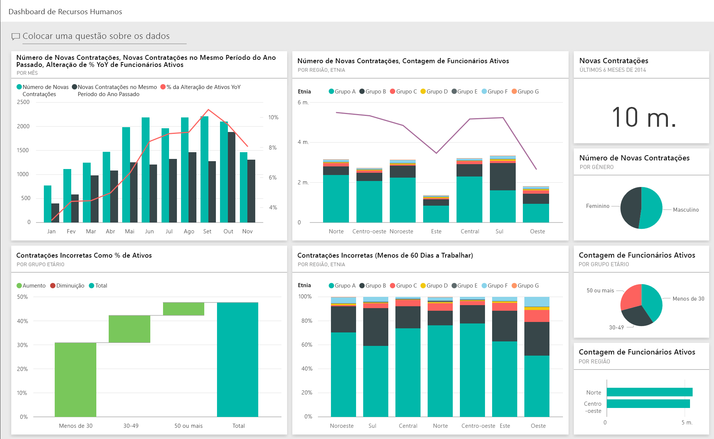
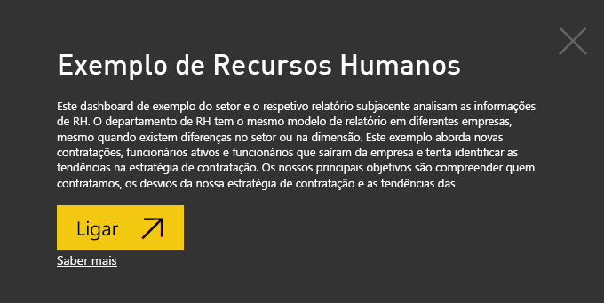
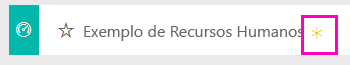
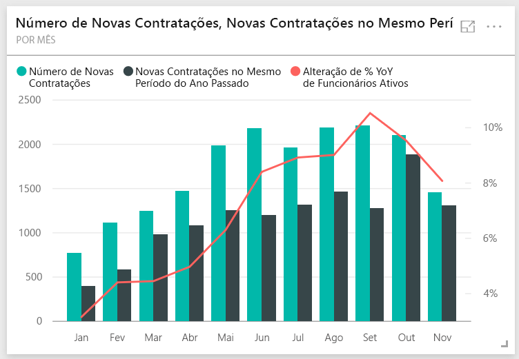
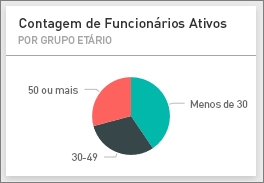
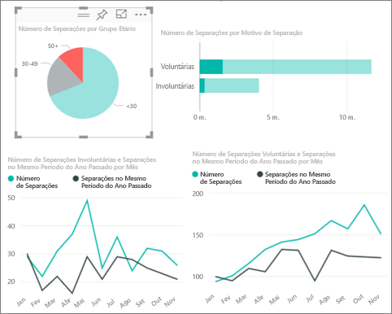
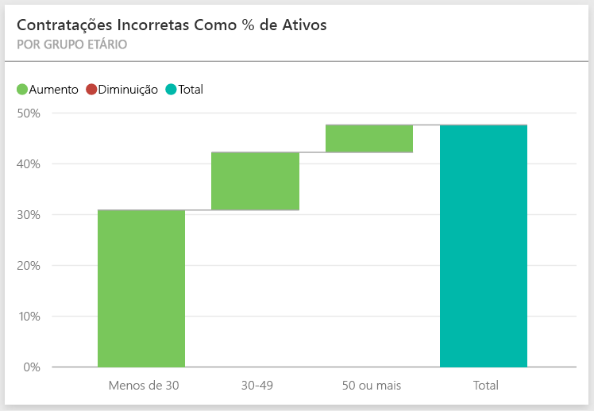
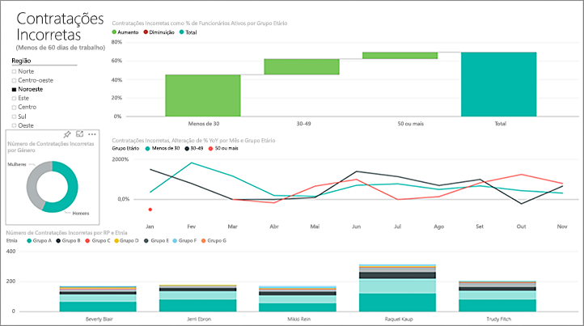
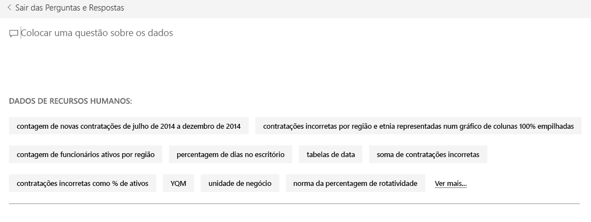
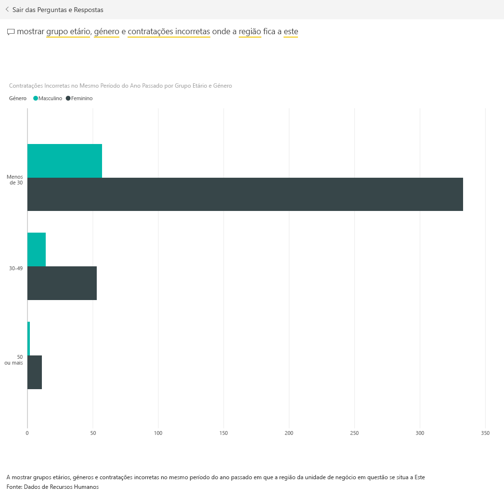

# Exemplo de Recursos Humanos para o Power BI: faça um tour

## Descrição geral de exemplo para os Recursos Humanos
O departamento de RH tem o mesmo modelo de relatório em diferentes empresas, mesmo quando diferem em setor ou tamanho. Este exemplo examina novas contratações, funcionários ativos e funcionários que saíram, e tenta descobrir tendências na estratégia de contratação. Os nossos principais objetivos devem compreender:

* Quem contratamos
* Preconceitos na nossa estratégia de contratação
* Tendências nas separações voluntárias

Este exemplo faz parte de uma série de exemplos que ilustra como o Power BI pode ser utilizado com dados, relatórios e dashboards voltados para os negócios. Os exemplos são dados reais de obviEnce ([www.obvience.com](http://www.obvience.com/)) que foram mantidos anónimos. Os dados estão disponíveis em vários formatos: pacote/aplicação de conteúdos, livro do Excel ou ficheiro .pbix do Power BI Desktop. Para obter mais informações, veja [Conjuntos de dados de exemplo](sample-datasets.md).

## Pré-requisitos

 Antes de poder utilizar o exemplo, primeiro tem de transferir, como pacote de conteúdos, um ficheiro .pbix ou um livro do Excel.

### Obter o pacote de conteúdos para este exemplo

1. Abra o serviço Power BI (app.powerbi.com) e inicie sessão.
2. No canto inferior esquerdo, selecione **Obter dados**.
   
    
3. Na página Obter Dados que aparece, selecione **Exemplos**.
   
   
4. Selecione o **Exemplo de Recursos Humanos** e em seguida, escolha **Ligar**.  
   
   
5. O Power BI importa o pacote de conteúdos e adiciona um novo dashboard, relatório e conjunto de dados para a sua área de trabalho atual. O novo conteúdo é assinalado com um asterisco amarelo. 
   
   
  
### Obter o ficheiro .pbix para este exemplo

Em alternativa, pode transferir o exemplo de como um ficheiro .pbix, que foi concebido para utilização com o Power BI Desktop. 

 * [Exemplo de Recursos Humanos](http://download.microsoft.com/download/6/9/5/69503155-05A5-483E-829A-F7B5F3DD5D27/Human Resources Sample PBIX.pbix)

### Obter o livro do Excel para este exemplo
Também pode [transferir apenas o conjunto de dados (livro do Excel)](http://go.microsoft.com/fwlink/?LinkId=529780) para este exemplo. O livro contém as folhas do Power View que pode ver e modificar. Para ver os dados não processados, selecione **Power Pivot > Gerir**.

## Novas contratações
Primeiro, vamos explorar as novas contratações.

1. Na área de trabalho, selecione o separador **Dashboards** e abrir o dashboard Recursos Humanos.
2. No dashboard, selecione o mosaico **Número de Novas Contratações, Novas Contratações no Mesmo Período do Ano Passado, Alteração de % de YoY de Funcionários Ativos** **Por Mês**.  
     

   O relatório Exemplo de Recursos Humanos é aberto na página **Novas Contratações**.  

   

Veja o seguinte:

* O gráfico de combinação **Número de Novas Contratações, Novas Contratações no Mesmo Período do Ano Passado, Alteração de % de YoY de Funcionários Ativos por Mês** mostra que contratamos mais pessoas mensalmente neste ano em comparação com o ano passado, um número significativamente superior de pessoas em alguns meses.
* No gráfico de combinação **Número de Novas Contratações e Número de Funcionários Ativos por Região e Etnia**, observe que estamos a contratar menos pessoas na região **Leste**.
* O gráfico de cascata **Var. de YoY de Novas Contratações por Grupo Etário** mostra que estamos a contratar principalmente pessoas mais jovens. Isto pode dever-se principalmente à natureza part-time dos trabalhos.
* O gráfico circular **Número de Novas Contratações por Sexo** mostra uma divisão bastante uniforme.

Pode encontrar mais ideias, por exemplo, uma região em que a divisão de género não é uniforme? Selecione diferentes faixas etárias e géneros nos gráficos para explorar as relações entre idade, género, região e grupo étnico.

Selecione o nome do dashboard a partir da barra de navegação superior para voltar ao dashboard.

## Comparar os funcionários atuais e antigos
Vamos explorar os dados de funcionários ativos atuais e funcionários que já não trabalham na empresa.

No dashboard, selecione o mosaico **Número de Funcionários Ativos por Grupo Etário**.  

O relatório de Exemplo de Recursos Humanos é aberto na página **Funcionários ativos vs. Separações**.  

**Itens de interesse**:

* Os gráficos de combinação no lado esquerdo mostraram a alteração de ano a ano dos funcionários ativos e separações. Temos mais ativos este ano devido à contratação rápida, mas também mais separações do que no ano passado.
* Em agosto tivemos mais separações em comparação com outros meses. Selecione as diferentes faixas etárias, géneros ou regiões para ver se consegue encontrar quaisquer exceções.
* Ao examinar os gráficos circulares, vemos que temos uma divisão bastante uniforme dos nossos funcionários ativos por grupos de idade e género. Selecione diferentes faixas etárias para ver que a divisão de género difere por idade. Temos uma divisão uniforme por género em cada faixa etária?

## Motivos de separação
Veja novamente o relatório no modo de Vista de Edição. Selecione **Editar relatório** no canto superior esquerdo.

Altere os gráficos circulares para mostrar os dados Separados, em vez de Ativos.

1. Selecione o gráfico circular **Número de Funcionários Ativos por Grupo Etário**.
2. Em **Campos**, selecione a seta junto a **Funcionários** para expandir a tabela Funcionários. Desmarque a caixa de verificação junto a **Número de Funcionários Ativos** para remover esse campo.
3. Selecione a caixa de verificação junto a **Número de Separação** na tabela Funcionários para adicioná-la à caixa **Valores** no painel Campo.
4. De volta à tela do relatório, selecione a barra **Voluntário** no gráfico de barras **Número de Separação por Motivo de Separação**. Isto realça os funcionários que deixaram a empresa voluntariamente nos outros elementos visuais do relatório.
5. Clique na fatia 50+ do gráfico circular de Contagem de Separações por Faixa Etária.

   Examine as Separações através do gráfico de linhas do Motivo no canto inferior direito. Este gráfico é filtrado para mostrar separações voluntárias.  
   

   Vê a tendência no grupo etário 50+? No final do ano, mais funcionários com mais de 50 anos estão a deixar a empresa voluntariamente. É uma área para investigar melhor com mais dados.
6. Também pode seguir os mesmos passos para o gráfico circular **Número de Funcionários Ativos por Sexo** ao alterá-lo para Separações em vez de Funcionários Ativos. Examine os dados de separação voluntária por género para ver se encontra quaisquer outras informações.
7. Clique em **Power BI** na barra de navegação superior para voltar ao dashboard. Pode guardar as alterações feitas no relatório ou não.

## Contratações incorretas
A última área a explorar são as más contratações. As más contratações são definidas como funcionários que não duraram mais de 60 dias. Estamos a contratar rapidamente. Estamos a contratar bons candidatos?

1. Selecione o mosaico do dashboard **Contratações Incorretas como % de Funcionários Ativos por Grupo Etário**. Isto abre o relatório na página 3, "Más Contratações".

     
2. Selecione a caixa de verificação **Noroeste** na segmentação Região à esquerda e o setor **Homens** no gráfico em anel Número de Contratações Incorretas por Sexo.  Examine outros gráficos na página "Más Contratações". Mais más contratações de homens do que mulheres, e muitas más contratações do Grupo A.
     
3. Ao observar o gráfico em anel **Contratações Incorretas por Sexo** e ao clicar na segmentação **Região**, percebemos que Leste é a Região com mais contratações incorretas de mulheres do que de homens.  
4. Selecione o nome do dashboard a partir da barra de navegação superior para voltar ao dashboard.

## Faça uma pergunta na caixa do P e R
A [caixa de Perguntas e Respostas](power-bi-tutorial-q-and-a.md) é onde introduz uma pergunta com uma linguagem natural. O P e R reconhece as palavras que escreve e descobre onde, no seu conjunto de dados, a resposta será encontrada.

1. Clique na caixa de pergunta do P e R. Veja que, antes mesmo de começar a escrever, a caixa do P e R contém sugestões:

   
2. Pode escolher uma das sugestões ou escrever: **mostrar grupo etário, sexo e contratações incorretas no mesmo período do ano passado onde a região é leste**.  

   

   Veja que a maioria das más contratações de mulheres estão abaixo de 30 anos.

Este é um ambiente seguro para experimentar. Pode optar por não guardar as alterações. Se as guardar, pode sempre aceder a **Obter Dados** para obter uma nova cópia deste exemplo.

## Próximos passos: ligar-se aos seus dados
Esperamos que este tour tenha mostrado como os dashboards, o P e R e os relatórios do Power BI podem apresentar informações sobre os dados de recursos humanos. Agora é a sua vez, ligue-se aos seus próprios dados. Com o Power BI, pode ligar-se a uma grande variedade de origens de dados. Saiba mais sobre como [começar a utilizar o Power BI](service-get-started.md).  
