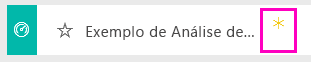

# Exemplo de Análise de Gastos de TI para o Power BI: veja uma apresentação

## Descrição geral do exemplo de Análise de Gastos em TI
O [pacote de conteúdos](service-organizational-content-pack-introduction.md) da Análise de Gastos de TI (dashboard, relatório e conjunto de dados) analisa os custos programados vs. custos reais de um departamento de TI. Esta comparação ajuda-nos a perceber em que medida a empresa planeou corretamente o seu ano e permite-nos investigar as áreas com grandes desvios em relação ao plano. Este exemplo mostra um ciclo de planeamento anual da empresa e apresenta trimestralmente uma nova Estimativa Mais Recente (LE) para ajudar a analisar as alterações dos gastos de TI ao longo do ano fiscal.

Este exemplo faz parte de uma série de exemplos que ilustra a forma como pode utilizar o Power BI com dados, relatórios e dashboards orientados para negócios. Os exemplos são dados reais do obviEnce (<http://obvience.com/>) que foram tornados anónimos.

## Pré-requisitos

 Antes de poder utilizar o exemplo, primeiro tem de transferir, como pacote de conteúdos, um ficheiro .pbix ou um livro do Excel.

### Obter o pacote de conteúdos para este exemplo

1. Abra o serviço Power BI (app.powerbi.com) e inicie sessão.
2. No canto inferior esquerdo, selecione **Obter dados**.
   
    
3. Na página Obter Dados que aparece, selecione **Exemplos**.
   
   
4. Selecione o **Exemplo de Análise de Gastos de TI** e em seguida, escolha **Ligar**.  
  
   
   
5. O Power BI importa o pacote de conteúdos e adiciona um novo dashboard, relatório e conjunto de dados para a sua área de trabalho atual. O novo conteúdo é assinalado com um asterisco amarelo. 
   
   
  
### Obter o ficheiro .pbix para este exemplo

Em alternativa, pode transferir o exemplo de como um ficheiro .pbix, que foi concebido para utilização com o Power BI Desktop. 

 * [Exemplo de Análise de Gastos de TI](http://download.microsoft.com/download/E/9/8/E98CEB6D-CEBB-41CF-BA2B-1A1D61B27D87/IT%20Spend%20Analysis%20Sample%20PBIX.pbix)

### Obter o livro do Excel para este exemplo
Também pode [transferir apenas o conjunto de dados (livro do Excel)](http://go.microsoft.com/fwlink/?LinkId=529783) para este exemplo. O livro contém as folhas do Power View que pode ver e modificar. Para ver os dados não processados, selecione **Power Pivot > Gerir**.

## Dashboard do Exemplo de Análise de Gastos de TI
Os dois mosaicos de números no dashboard, **% do Plano de variação** e **% da Estimativa mais recente da variação do 3.º trimestre**, fornecem uma visão geral do nosso desempenho em relação ao plano e à Estimativa mais recente do último trimestre (LE3 = Estimativa mais recente do 3º trimestre). Em geral, estamos cerca de 6% fora do plano. Vamos explorar a causa desta variação – quando, onde e qual categoria?

## Página "Análise das Tendências de Gastos de TI Acumulados no Ano"
A seleção do mosaico do dashboard **% do Plano de variação por região de vendas** leva-o até à página “Análise das tendências de gastos de TI” do relatório de Exemplo de análise de gastos de TI. Vemos rapidamente que temos uma variação positiva nos EUA e na Europa e uma variação negativa no Canadá, América Latina e Austrália. Os EUA tinham um variação +LE de cerca de 6% e a Austrália tem uma variação -LE de cerca de 7%.

Mas observar apenas este gráfico e tirar conclusões pode ser enganoso. Temos de analisar as quantias reais em dólares para ver tudo de forma objetiva.

1. Selecione **Austrália e NZ** no gráfico % do Plano de variação por região de vendas e observe o gráfico Plano de variação por Área de TI.

   
2. Agora ,selecione **EUA**. Ficou com a ideia: a Austrália é uma parte realmente pequena dos nossos gastos gerais em comparação com os EUA.

    Já restringimos para os EUA, agora qual o próximo passo? Vamos explorar que categoria nos EUA está a causar a variação.

## Fazer perguntas sobre os dados
1. Selecione **Exemplo de Análise de Gastos de TI** na barra de navegação superior para regressar aos Dashboards.
2. Na caixa de perguntas, escreva "mostrar gráfico de barras de % do plano de variação e % de le3 por áreas de TI".

   

   Na primeira Área de TI, **Infraestrutura**, a percentagem mudou drasticamente entre o plano de variação inicial e a estimativa mais recente do plano de variação.

## Página "Gastos Acumulados no Ano por Elementos de Custo"
Regresse ao dashboard e analise o mosaico do painel **% do Plano de variação, % de LE3 da variação**.

A infraestrutura salta com uma grande variação positiva em relação ao plano.

1. Clique neste mosaico para ir para a página "Gastos Acumulados no Ano por Elementos de Custo" do relatório Exemplo de Análise de Gastos de TI.
2. Clique na barra **Infraestrutura** no canto inferior esquerdo do gráfico “% do Plano de variação e % da LE3 da variação por Área de TI” e observe a variação ao plano em “% do Plano de variação por região de vendas” à esquerda.

    
3. Clique no nome de cada Grupo de Elementos de Custo na segmentação de dados para localizar o elemento de custo com uma grande variação.
4. Com a opção **Outros** selecionada, clique em **Infraestrutura** na Área de TI e clique nas subáreas na segmentação de dados de Subárea de TI para localizar a subárea com a maior variação.  

   Vemos uma enorme variação em **Rede**.

   Aparentemente, a empresa decidiu oferecer aos seus funcionários serviços telefónicos como benefício, mas esta mudança não estava planeada.

## Página "Análise de Variação do Plano"
Ainda no relatório, clique no separador "Análise de Variação do Plano" na parte inferior do relatório e vá para a página 3 do relatório.

No gráfico de combinação "Plano de Variação e % do Plano de Variação por Área de Negócio" à esquerda, clique na coluna Infraestrutura para realçar os valores de infraestrutura no resto da página.

Observe no gráfico "% do plano de variação por Mês e Área de Negócio" que a infraestrutura começou a ter uma variação positiva por volta de fevereiro e, em seguida, continuou a aumentar. Além disso, observe como a variação do valor do plano da infraestrutura varia por país, em comparação com o valor de todas as áreas de negócio. Utilize as segmentações de dados "Área de TI" e "Subáreas de TI" à direita para filtrar os valores no resto da página em vez de realçá-los. Clique nas diferentes Áreas de TI à direita para explorar os dados de outra forma. Também pode clicar nas Subáreas de TI e ver a variação nesse nível.

## Editar o relatório
Clique em **Editar Relatório** no canto superior esquerdo de canto e explore-o em Vista de Edição.

* Veja como as páginas são feitas – os campos em cada gráfico, filtros nas páginas
* Adicione páginas e gráficos com base nos mesmos dados
* Altere o tipo de visualização de cada gráfico
* Afixe-os no seu dasboard

Este é um ambiente seguro para experimentar. Pode sempre optar por não guardar as alterações. No entanto, se as guardar, pode sempre aceder a Obter Dados para obter uma nova cópia deste exemplo.

## Próximos passos: ligar-se aos seus dados
Esperamos que esta apresentação tenha mostrado de que forma os como os dashboards, as Perguntas e Respostas e os relatórios do Power BI podem fornecer informações sobre os dados de gastos de TI. Agora, é sua vez: ligue-se aos seus próprios dados. Com o Power BI, pode ligar-se a uma grande variedade de origens de dados. Saiba mais sobre como [começar a utilizar o Power BI](service-get-started.md).
