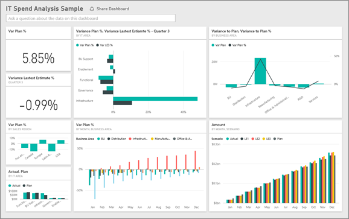
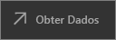
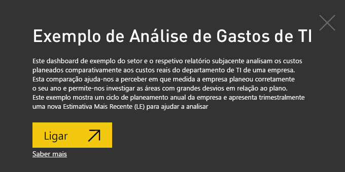
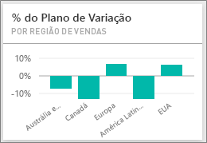
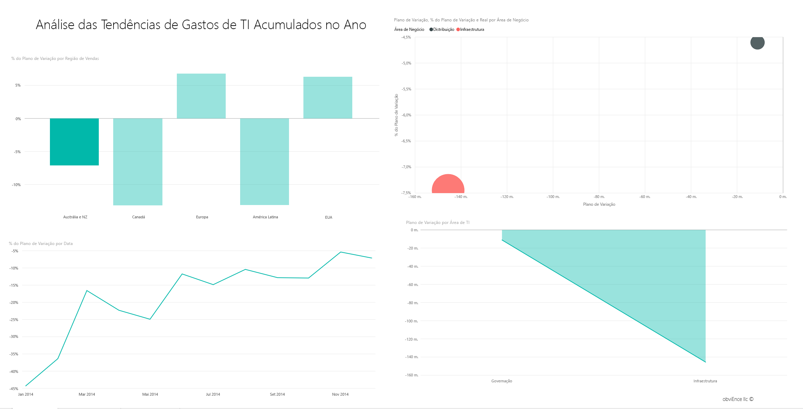
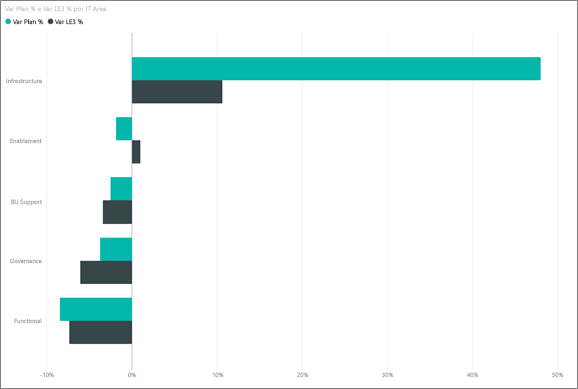
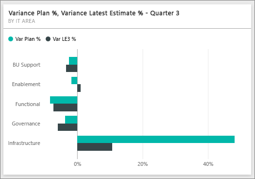
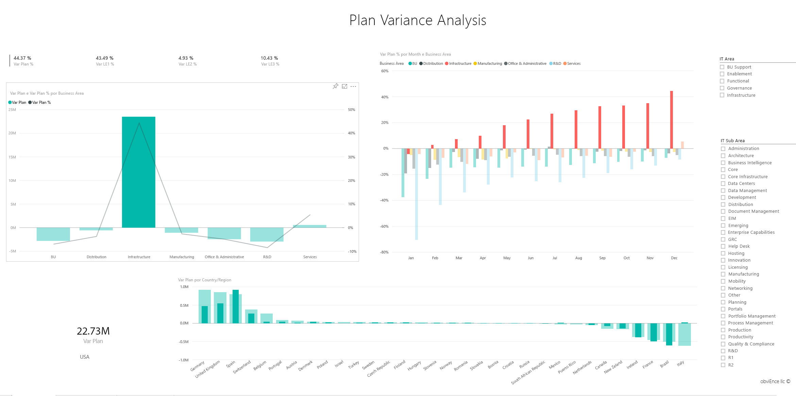

# Exemplo de Análise de Gastos de TI do Power BI: veja uma apresentação

O pacote de conteúdos de exemplo de Análise de Gastos de TI contém um dashboard, um relatório e um conjunto de dados que analisa os custos programados vs. os custos reais de um departamento de TI. Esta comparação ajuda-nos a perceber em que medida a empresa planeou corretamente o seu ano e permite-nos investigar as áreas com grandes desvios em relação ao plano. Este exemplo mostra um ciclo de planeamento anual da empresa e apresenta trimestralmente uma nova estimativa mais recente (LE) para ajudar a analisar as alterações dos gastos de TI ao longo do ano fiscal.

Este exemplo faz parte de uma série que mostra como pode utilizar o Power BI com dados, relatórios e dashboards orientados para negócios. Foi criado com dados reais da [obviEnce](http://www.obvience.com/), que foram mantidos anónimos. Os dados estão disponíveis em vários formatos: pacote/aplicação de conteúdos, ficheiro .pbix do Power BI Desktop ou livro do Excel. Veja [Exemplos do Power BI](sample-datasets.md). 

Este tutorial utiliza o serviço Power BI e o pacote de conteúdos de exemplo de Análise de Gastos de TI. Uma vez que as experiências do relatório são muito semelhantes, também pode acompanhar com o Power BI Desktop e o ficheiro .pbix de exemplo.

## Pré-requisitos

 Para poder utilizar o exemplo, primeiro tem de transferi-lo como um [pacote de conteúdos](#get-the-content-pack-for-this-sample), um [ficheiro .pbix](#get-the-pbix-file-for-this-sample) ou um [livro do Excel](#get-the-excel-workbook-for-this-sample).

### Obter o pacote de conteúdos para este exemplo

1. Abra o serviço Power BI (app.powerbi.com), inicie sessão e abra a área de trabalho onde quer guardar o exemplo.

2. No canto inferior esquerdo, selecione **Obter Dados**.
   
   
3. Na página **Obter Dados** apresentada, selecione **Exemplos**.
   
4. Selecione o **Exemplo de Análise de Gastos de TI** e, em seguida, escolha **Ligar**.  
  
   
   
5. O Power BI importa o pacote de conteúdos e adiciona um novo dashboard, um relatório e um conjunto de dados à área de trabalho atual.
   
   
  
### Obter o ficheiro .pbix para este exemplo

Em alternativa, pode transferir o exemplo de Análise de Gastos de TI como um [ficheiro .pbix](http://download.microsoft.com/download/E/9/8/E98CEB6D-CEBB-41CF-BA2B-1A1D61B27D87/IT%20Spend%20Analysis%20Sample%20PBIX.pbix), concebido para utilização com o Power BI Desktop.

### Obter o livro do Excel para este exemplo

Se quiser ver a origem de dados deste exemplo, também está disponível como um [livro do Excel](http://go.microsoft.com/fwlink/?LinkId=529783). O livro contém as folhas do Power View que pode ver e modificar. Para ver os dados não processados, ative os suplementos de Análise de Dados e, em seguida, selecione **Power Pivot > Gerir**. Para ativar os suplementos Power View e Power Pivot, veja [Observe os exemplos de Excel a partir do interior do próprio Excel](sample-datasets.md#optional-take-a-look-at-the-excel-samples-from-inside-excel-itself) para obter detalhes.

## Dashboard de Exemplo de Análise de Gastos de TI
Os dois mosaicos de números à esquerda no dashboard, **% do Plano de Variação** e **% da Estimativa mais Recente da Variação do 3.º Trimestre**, fornecem uma descrição geral do nosso desempenho em relação ao plano e à estimativa mais recente do último trimestre (LE3 = Estimativa mais recente do 3.º trimestre). No geral, estamos cerca de 6% fora do plano. Vamos explorar a causa desta variação: quando, onde e em que categoria.

## Página da Análise das Tendências de Gastos de TI do Ano Até à Data
Quando seleciona o mosaico do dashboard **% do Plano de Variação por Região de Vendas**, este apresenta a página **Análise das Tendências de Gastos de TI do Ano Até à Data** do relatório de Exemplo de Análise de Gastos de TI. Num instante, vemos que temos uma variação positiva nos Estados Unidos e na Europa e uma variação negativa no Canadá, na América Latina e na Austrália. Os Estados Unidos têm uma variação +LE de cerca de 6% e a Austrália tem uma variação -LE de cerca de 7%.

Porém, observar apenas este gráfico e tirar conclusões pode ser enganoso. Temos de analisar as quantias reais em dólares para ver tudo de forma objetiva.

1. Selecione **AU e NZ** no gráfico **% do Plano de Variação por Região de Vendas** e, em seguida, observe o gráfico **Plano de Variação por Área de TI**.

   
2. Agora, selecione **USA**. Tenha em atenção que a Austrália e a Nova Zelândia são uma parte muito pequena dos nossos gastos gerais em comparação com os Estados Unidos.

    A seguir, vamos explorar que categoria nos EUA está a causar a variação.

## Fazer perguntas sobre os dados
1. Selecione **Exemplo de Análise de Gastos de TI** na barra de navegação superior para regressar ao dashboard de exemplo.
2. Selecione **Fazer uma pergunta sobre os dados**.
3. Na lista **Perguntas para começar** no lado esquerdo, selecione **qual é o plano por área de TI**.

   

4. Na caixa Perguntas e Respostas, limpe a entrada anterior e introduza *mostrar gráfico de barras da % do plano de variação, da % da le3 da variação e das áreas de TI*.

   

   Na primeira Área de TI, **Infraestrutura**, observe que a percentagem mudou significativamente entre o plano de variação inicial e a estimativa mais recente do plano de variação.

## Página Gastos do Ano Até à Data por Elementos de Custo

1. Regresse ao dashboard e examine o mosaico do dashboard **% do Plano de Variação, % da Estimativa mais Recente da Variação – 3.º Trimestre**.

   

   Tenha em atenção que a área Infraestrutura destaca-se com uma grande variação positiva no plano.

1. Selecione este mosaico para abrir o relatório e ver a página **Gastos do Ano Até à Data por Elementos de Custo**.
2. Selecione a barra **Infraestrutura** no gráfico **% do Plano de Variação e % da LE3 da Variação por Área de TI** no canto inferior esquerdo e observe os valores da variação para o plano no gráfico **% do Plano de Variação por Região de Vendas** no canto inferior esquerdo.

    
3. Selecione um nome de cada vez na segmentação de dados **Grupo de Elementos de Custo** para localizar o elemento de custo com a maior variação.
4. Com a opção **Outros** marcada, selecione **Infraestrutura** na segmentação de dados **Área de TI** e, em seguida, selecione as subáreas na segmentação de dados **Subárea de TI** para localizar a subárea com a maior variação.  

   Observe a grande variação para **Redes**. Aparentemente, a empresa decidiu oferecer aos seus funcionários serviços telefónicos como benefício, apesar de esta mudança não estar planeada.

## Página Análise de Variação do Plano

1. Selecione o separador **Análise de Variação do Plano** na parte inferior da página.

2. No gráfico **Plano de Variação e % do Plano de Variação por Área de Negócio** à esquerda, selecione a coluna **Infraestrutura** para realçar os valores de área de negócios da infraestrutura no resto da página.

    

   Observe no gráfico **% do plano de variação por Mês e Área de Negócio** que a área de negócio da infraestrutura iniciou uma variação positiva em fevereiro. Além disso, observe como o valor da variação para o plano da área de negócios varia por país, em comparação com o valor de todas as áreas de negócio. 

3. Utilize as segmentações de dados **Área de TI** e **Subárea de TI** à direita para filtrar os valores no resto da página e explorar os dados. 

## Editar o relatório
Selecione **Editar Relatório** no canto superior esquerdo para explorar na Vista de edição:

* Veja como as páginas são constituídas, os campos em cada gráfico e os filtros nas páginas.
* Adicione páginas e gráficos com base nos mesmos dados.
* Altere o tipo de visualização de cada gráfico.
* Afixe gráficos de interesse ao dashboard.

## Próximos passos: Ligar aos seus dados
Aqui pode explorar à vontade, pois pode optar por não guardar as alterações. No entanto, se as guardar, pode sempre aceder a **Obter Dados** para obter uma nova cópia deste exemplo.

Esperamos que esta apresentação tenha mostrado de que forma os como os dashboards, as Perguntas e Respostas e os relatórios do Power BI podem fornecer informações sobre os dados de gastos de TI. Agora, é a sua vez: ligue-se aos seus próprios dados. Com o Power BI, pode ligar-se a uma grande variedade de origens de dados. Para saber mais, veja [Introdução ao serviço Power BI](service-get-started.md).
