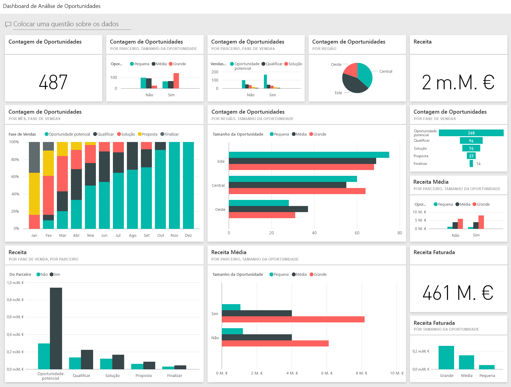
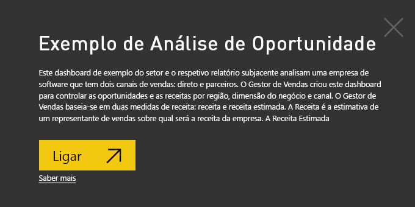
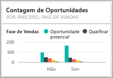

# Exemplo de Análise de Oportunidade para o Power BI: faça uma visita

## Descrição geral do exemplo de Análise de Oportunidade
O **Exemplo de Análise de Oportunidade** contém um dashboard (e relatório associado) para uma empresa de software que tem 2 canais de vendas: *direta* e *parceiro*. O Gestor de Vendas criou este dashboard para monitorizar as oportunidades e a receita por região, dimensão do negócio e canal.

O Gestor de Vendas baseia-se em duas medidas de receita:

* **Receita** – esta é uma estimativa por vendedor sobre o que este acredita que será a receita da empresa.
* **Receita de Fatores** – esta é calculada como a percentagem (%) entre a Receita x Probabilidade e é normalmente aceite como sendo uma previsão mais precisa da receita de vendas real. A probabilidade é determinada pelo ***Nível de Vendas*** atual do negócio.
  * Cliente potencial – 10%  
  * Qualificar – 20%  
  * Solução – 40%  
  * Proposta — 60%  
  * Finalizar – 80%

  

Este exemplo faz parte de uma série que ilustra a forma como pode utilizar o Power BI com dados, relatórios e dashboards orientados para negócios. Os exemplos são dados reais de obviEnce ([www.obvience.com](http://www.obvience.com/)) que foram mantidos anónimos.

## Pré-requisitos

 Antes de poder utilizar o exemplo, primeiro tem de transferir, como pacote de conteúdos, um ficheiro .pbix ou um livro do Excel.

### Obter o pacote de conteúdos para este exemplo

1. Abra o serviço Power BI (app.powerbi.com) e inicie sessão.
2. No canto inferior esquerdo, selecione **Obter dados**.
   
    
3. Na página Obter Dados que aparece, selecione **Exemplos**.
   
   
4. Selecione o **Exemplo da Análise de Oportunidade** e, em seguida, escolha **Ligar**.  
  
   
   
5. O Power BI importa o pacote de conteúdos e adiciona um novo dashboard, relatório e conjunto de dados para a sua área de trabalho atual. O novo conteúdo é assinalado com um asterisco amarelo. 
   
   
  
### Obter o ficheiro .pbix para este exemplo

Em alternativa, pode transferir o exemplo de como um ficheiro .pbix, que foi concebido para utilização com o Power BI Desktop. 

 * [Exemplo de Análise de Oportunidade](http://download.microsoft.com/download/9/1/5/915ABCFA-7125-4D85-A7BD-05645BD95BD8/Opportunity%20Analysis%20Sample%20PBIX.pbix)

### Obter o livro do Excel para este exemplo
Também pode [transferir apenas o conjunto de dados (livro do Excel)](http://go.microsoft.com/fwlink/?LinkId=529782) para este exemplo. O livro contém as folhas do Power View que pode ver e modificar. Para ver os dados não processados, selecione **Power Pivot > Gerir**.

## O que nos diz o nosso dashboard?
A nossa Gestora de Vendas criou um dashboard para monitorizar as métricas mais importantes para ela. Quando vê algo interessante, pode selecionar um mosaico para explorar os dados.

1. A receita da empresa é de 2 mil milhões de USD e a receita faturada de 461 milhões de USD.
2. A contagem de oportunidades e a receita seguem um padrão de funil familiar, com totais que diminuem em cada fase subsequente.
3. A maioria de nossas oportunidades são na região leste.
4. As grandes oportunidades geram uma receita maior do que as oportunidades pequenas ou médias.
5. Grandes ofertas de parceiros geram mais receita: 8 milhões de USD em média contra 6 milhões de USD de vendas diretas.

Uma vez que o esforço necessário para firmar um negócio é o mesmo independentemente de o negócio ser classificado como grande, médio ou pequeno, a nossa empresa deve examinar os dados para saber mais sobre grandes oportunidades.

Selecione o mosaico **Contagem de Oportunidades por Parceiro e Nível de Vendas** para abrir a página 1 do relatório.  

## Explorar as páginas do relatório
### A página 1 do nosso relatório é intitulada "Descrição Geral das Contagem de Oportunidades.”

* Leste é a nossa região maior em termos de contagem de oportunidades.  
* No gráfico circular, selecione uma região de cada vez para filtrar a página. Para cada região, os parceiros procuram significativamente mais oportunidades grandes.   
* O gráfico de colunas de contagem de oportunidades controladas por parceiro e tamanho da oportunidade mostra claramente que a maioria das grandes oportunidades são controladas por parceiro e mais pequenas e médias oportunidades não são controladas por parceiro.
* Selecione cada Nível de Vendas no gráfico de barras na parte inferior esquerda para ver a diferença na contagem regional e observe que, embora leste seja a nossa região maior em termos de contagens, nos níveis de Solução, Proposta e Finalizar, as 3 regiões têm contagens comparáveis. Isso significa que podemos fechar uma percentagem maior de negócios na região central e oeste.

### A página 2 do nosso relatório é intitulada "Visão Geral da Receita".
Esta página examina de modo semelhante os dados, mas numa perspetiva de receita em vez de contagem.  

* O leste também é a nossa maior região não apenas na contagem de oportunidades, mas na receita.  
* A filtragem por Parceiro (selecione **Sim** na legenda no canto superior direito) revela uma receita de 1,5 mil milhões e 294 milhões de USD. Compare isto com 644 mil milhões e 166 milhões de USD para receitas de não parceiros.  
* A receita média para contas grandes é maior (8M) se as oportunidades forem controladas por parceiros em comparação com 6M relativos a empresas não parceiras.  
* Para parceiros comerciais, a receita média para grandes oportunidades é quase o dobro da das oportunidades de empresas médias (4M).  
* A receita média relativa a pequenas e médias empresas é comparável com parceiros e não parceiros comerciais.   

Claramente, os nossos parceiros estão a fazer um melhor trabalho de venda aos clientes.  Poderá fazer sentido canalizar mais negócios através dos nossos parceiros.

### A página 3 do nosso relatório é intitulada "Contagens de Nível de Região"
Esta página analisa dados semelhantes, mas divide-os por região e nível.  

* Ao filtrar a região leste (selecione **Leste** no gráfico circular) revela que as oportunidades na região leste são divididas quase iguais entre parceiros e não parceiros.
* As grandes oportunidades são mais comuns na região central, as pequenas oportunidades são mais comuns na região leste e as médias oportunidades são mais comuns na região oeste.

### A página 4 do nosso relatório é intitulada "Oportunidades Futuras"
Uma vez mais, estamos a analisar fatores semelhantes, mas desta vez numa perspetiva de data/hora.  

A nossa CFO usa esta página para gerir a carga de trabalho. Ao examinar as oportunidades de receita por mês e o nível de vendas, ela pode efetuar o devido planeamento.

* A receita média para o nível Finalizar é a mais alta. Fechar estes negócios são a prioridade maior.
* Filtrar por mês (selecionando o nome do mês na segmentação de dados à esquerda) mostra que janeiro tem uma grande quantidade de negócios grandes no nível Finalizar com receita faturada de 75 milhões de USD. Fevereiro, por outro lado, tem principalmente negócios médios no nível de Proposta e Solução.
* Em geral, os números de receita faturada flutuam com base no nível de vendas, no número de oportunidades e no tamanho do negócio. Adicione filtros (usando o painel de filtro à direita) para esses fatores descobrirem mais informações.

Este é um ambiente seguro para experimentar. Pode optar por não guardar as alterações. No entanto, se as guardar, pode sempre aceder a **Obter Dados** para obter uma nova cópia deste exemplo.

## Próximos passos: ligar-se aos seus dados
Esperamos que esta visita tenha mostrado como os dashboards, as Perguntas e Respostas e os relatórios do Power BI podem fornecer informações sobre os dados de monitorização de oportunidades. Agora é a sua vez — ligue-se aos seus próprios dados. Com o Power BI, pode ligar-se a uma grande variedade de origens de dados. Saiba mais sobre como [começar a usar o Power BI](service-get-started.md).

[Transferir exemplos](sample-datasets.md)  
