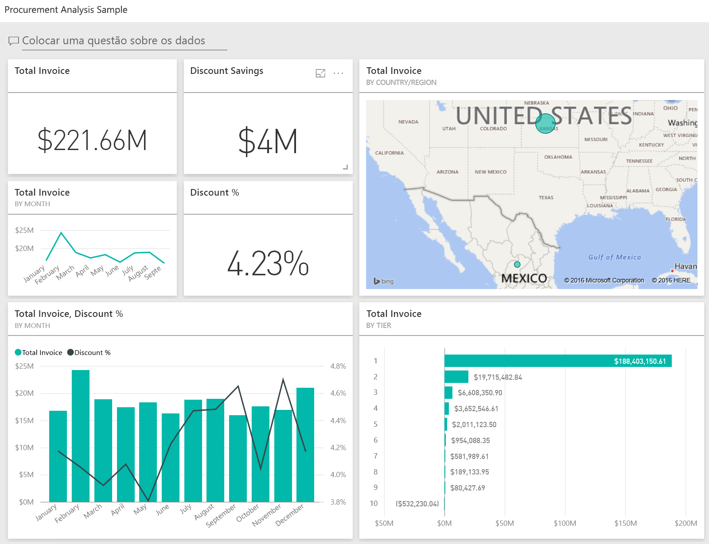
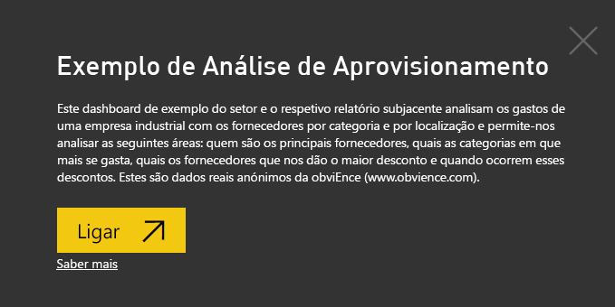
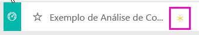
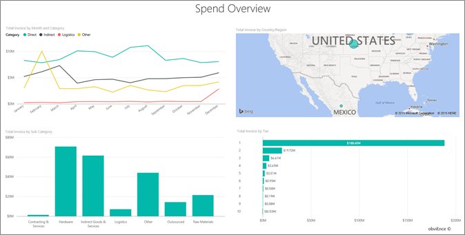
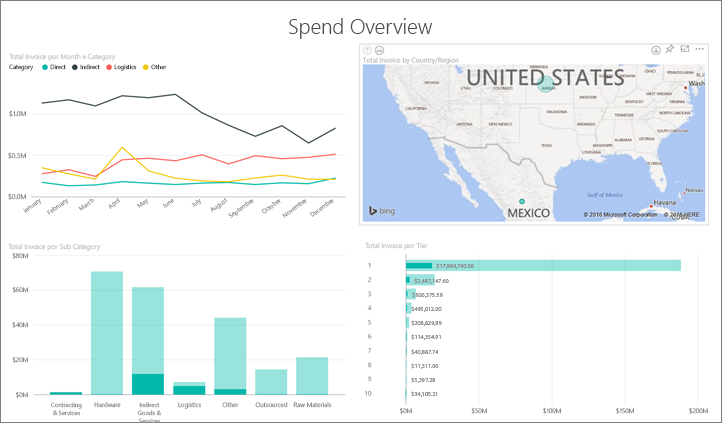
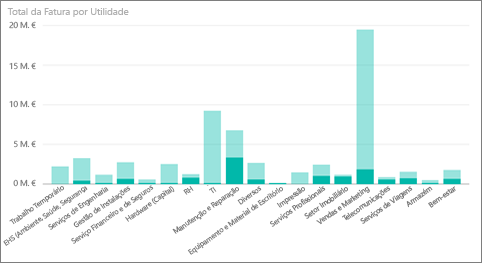
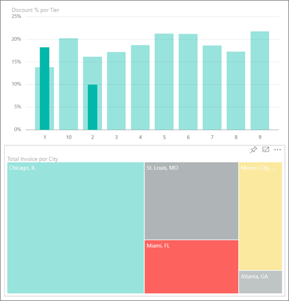
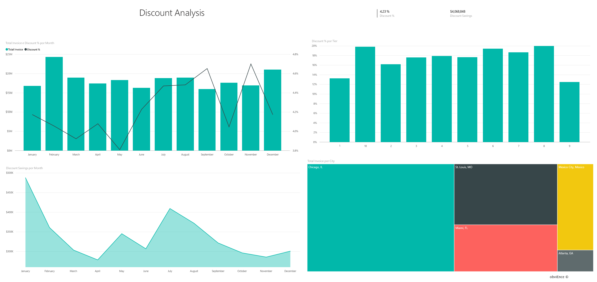
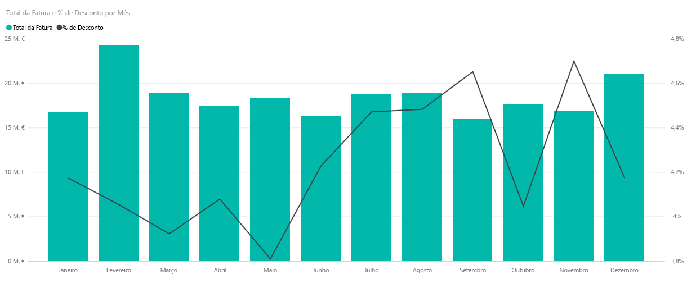
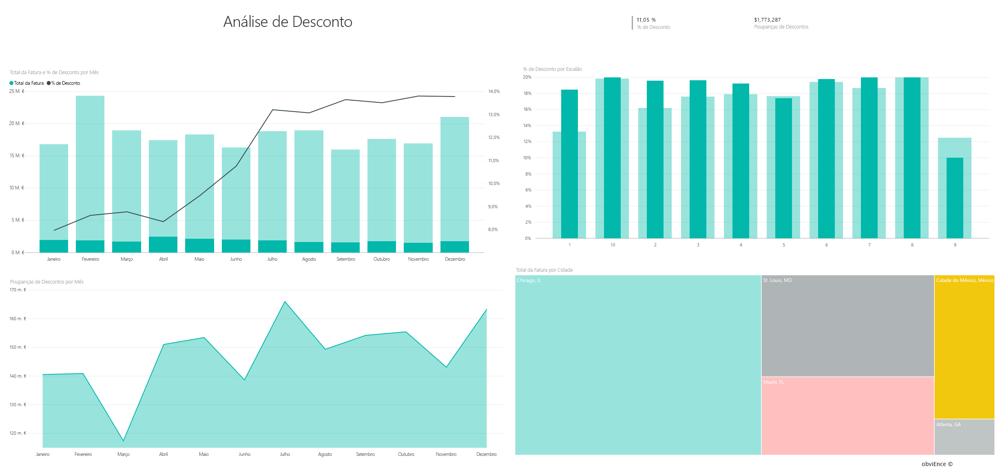

# Exemplo de Análise de Compras para o Power BI: faça um tour

## Descrição geral do exemplo de Análise de Compras
Este dashboard de exemplo do setor e relatório subjacente analisam as despesas da empresa fabricante com fornecedores por categoria e local. No exemplo, exploraremos estas áreas:

* Quem são os principais fornecedores
* Em que categorias ocorrem a maioria das despesas
* Que fornecedores nos oferecem o desconto mais alto e quando

Este exemplo faz parte de uma série de exemplos que ilustra como o Power BI pode ser utilizado com dados, relatórios e dashboards orientados para os negócios. Os exemplos são dados reais de obviEnce ([www.obvience.com](http://www.obvience.com/)) que foram mantidos anónimos.

## Pré-requisitos

 Antes de poder utilizar o exemplo, primeiro tem de transferir, como pacote de conteúdos, um ficheiro .pbix ou um livro do Excel.

### Obter o pacote de conteúdos para este exemplo

1. Abra o serviço Power BI (app.powerbi.com) e inicie sessão.
2. No canto inferior esquerdo, selecione **Obter dados**.
   
    
3. Na página Obter Dados que aparece, selecione **Exemplos**.
   
   
4. Selecione o **Exemplo de Análise de Aprovisionamento** e em seguida, escolha **Ligar**.  
  
   
   
5. O Power BI importa o pacote de conteúdos e adiciona um novo dashboard, relatório e conjunto de dados para a sua área de trabalho atual. O novo conteúdo é assinalado com um asterisco amarelo. 
   
   
  
### Obter o ficheiro .pbix para este exemplo

Em alternativa, pode transferir o exemplo de como um ficheiro .pbix, que foi concebido para utilização com o Power BI Desktop. 

 * [Exemplo de Análise de Compras](http://download.microsoft.com/download/D/5/3/D5390069-F723-413B-8D27-5888500516EB/Procurement%20Analysis%20Sample%20PBIX.pbix)

### Obter o livro do Excel para este exemplo
Também pode [transferir apenas o conjunto de dados (livro do Excel)](http://go.microsoft.com/fwlink/?LinkId=529784) para este exemplo. O livro contém as folhas do Power View que pode ver e modificar. Para ver os dados não processados, selecione **Power Pivot > Gerir**.

## Tendências de gastos
Primeiro, vamos analisar as tendências de gastos por categoria e local.  

1. A partir da área de trabalho, abra o separador **Dashboards** e selecione o dashboard de Análise de Aprovisionamento.
2. Selecione o mosaico do dashboard **Total da fatura por país/região**. Abre a página "Visão Geral de Gastos" do relatório "Exemplo de Análise de Compras".

    

Veja algumas coisas:

* No gráfico de linhas **Total da fatura por mês e categoria**: a categoria **Direta** apresenta gastos bastante consistentes, a categoria **Logística** apresenta um pico em dezembro e a categoria **Outros** apresenta um aumento em fevereiro.
* No mapa **Total da fatura por país/região**: a maioria dos nossos gastos dá-se nos EUA.
* No gráfico de colunas **Total da fatura por subcategoria**: **Hardware** e **Serviços e produtos indiretos** são as categorias que apresentam os maiores gastos.
* No gráfico de barras Total da Fatura por Camada: a maioria dos nossos negócios é feita com os nossos fornecedores da Camada 1 (os 10 primeiros). Isto ajuda a gerir melhor os relacionamentos com o fornecedor.

## Gastos no México
Vamos explorar as áreas de gastos no México.

1. No gráfico circular, selecione a bolha do **México** no mapa. Note que, no gráfico de colunas “Total da fatura por subcategoria”, a maior parte dos gastos está concentrada na subcategoria **Serviços e produtos indiretos**.

   
2. Desagregue a coluna **Serviços e produtos indiretos**:

   * Selecione a seta de busca detalhada  no canto superior direito do gráfico.
   * Selecione a coluna **Serviços e produtos indiretos**.

      Por uma grande margem de diferença, os maiores gastos nesta categoria geral são os de Vendas e marketing.
   * Selecione **México** no mapa novamente.

      Os maiores gastos nesta categoria no México são os de Manutenção e Reparo.

      
3. Selecione a seta para cima no canto superior esquerdo do gráfico para voltar para cima.
4. Selecione a seta novamente para desativar os detalhes.  
5. Selecione **Power BI** na barra de navegação superior para regressar à área de trabalho.

## Avaliar cidades diferentes
Podemos utilizar o realce para avaliar cidades diferentes.

1. Selecione o mosaico do dashboard **Total da fatura, % de desconto por mês**. O relatório abre na página de "Análise de Desconto".
2. Selecione as diferentes cidades no gráfico treemap **Total da fatura por cidade** para ver a comparação entre elas. Quase todas as faturas de Miami são provenientes de fornecedores da Camada 1.

   

## Descontos de fornecedores
Também vamos explorar os descontos disponíveis de fornecedores e os períodos de tempo quando obtemos a maioria dos descontos.

Especificamente, estas perguntas:

* Os descontos são diferentes ou iguais a cada mês?
* Algumas cidades têm mais descontos do que outras?

### Desconto por mês
Observando o gráfico de combinação **Total da fatura e % de desconto por mês**, podemos ver que **fevereiro** é o mês mais movimentado e que **Setembro** é o menos movimentado. Agora examine a percentagem de desconto durante esses meses.
Veja que quando o volume aumenta, o desconto é reduzido e quando o volume está baixo, o desconto aumenta. Quanto mais precisarmos de desconto, pior é a negociação.

### Desconto por cidade
Outra área a explorar é o desconto por cidade. Selecione cada cidade no treemap e veja como os outros gráficos são alterados.

* St. Louis, MO tinha um grande aumento no total da fatura em fevereiro e bastantes poupanças de descontos em abril.
* A Cidade do México no México tem a maior percentagem de desconto (11,05%) e Atlanta, GA tem a mais pequena (0,08%).

### Editar o relatório
Selecione **Editar relatório** no canto superior esquerdo e explore em Vista de edição.

* Veja como as páginas são feitas
* Adicione páginas e gráficos com base nos mesmos dados
* Altere o tipo de visualização de um gráfico – por exemplo, altere o gráfico treemap para um gráfico em anel
* Afixe-os no seu dasboard

Este é um ambiente seguro para experimentar. Pode optar por não guardar as alterações. Se as guardar, pode sempre aceder a **Obter Dados** para obter uma nova cópia deste exemplo.

## Próximos passos: ligar-se aos seus dados
Esperamos que este tour tenha mostrado como os dashboards e os relatórios do Power BI podem apresentar informações sobre os dados de compras. Agora é a sua vez &#151; ligue-se aos seus próprios dados. Com o Power BI, pode ligar-se a uma grande variedade de origens de dados. Saiba mais sobre como [começar a utilizar o Power BI](service-get-started.md).
