# Exemplo de Análise de Revenda para o Power BI: veja uma apresentação

Este dashboard de exemplo do setor, juntamente com o relatório subjacente, analisam dados de vendas de revenda de itens vendidos em várias lojas e distritos. As métricas comparam o desempenho deste ano ao do ano passado nas seguintes áreas: vendas, unidades, margem bruta e variação, bem como uma análise de novas lojas. Os exemplos são dados reais de obviEnce ([www.obvience.com](http://www.obvience.com)) que foram mantidos anónimos.

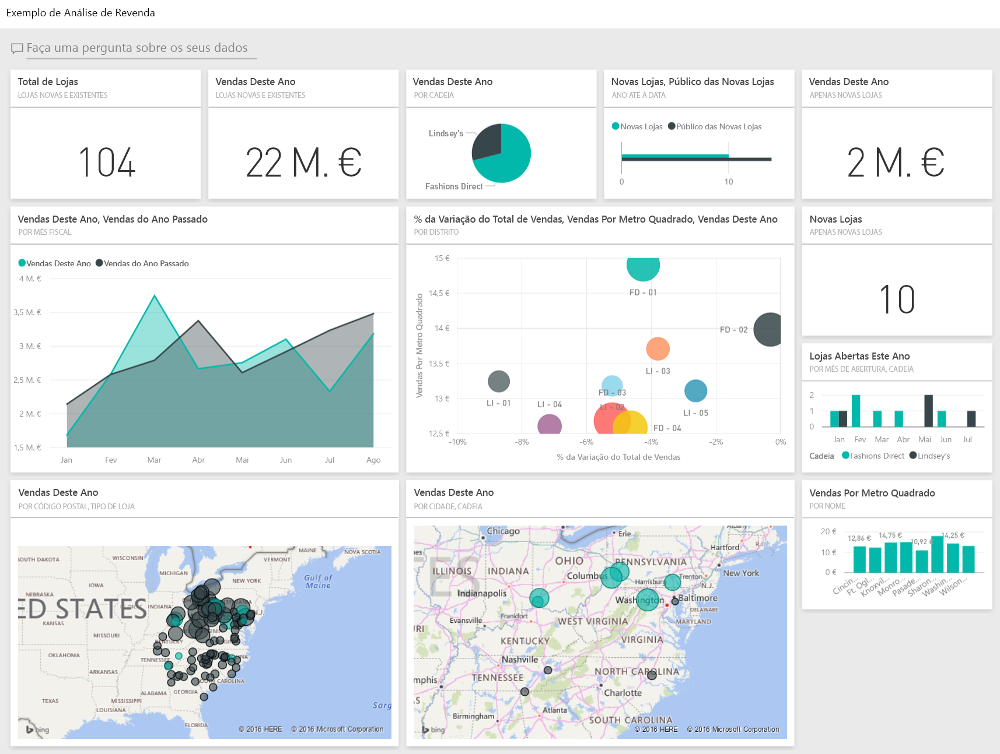

## Pré-requisitos

 Para poder utilizar o exemplo, primeiro tem de transferi-lo como um [pacote de conteúdos](https://docs.microsoft.com/en-us/power-bi/sample-datasets#get-and-open-a-sample-content-pack-in-power-bi-service), um [ficheiro .pbix](http://download.microsoft.com/download/9/6/D/96DDC2FF-2568-491D-AAFA-AFDD6F763AE3/Retail%20Analysis%20Sample%20PBIX.pbix) ou um [livro do Excel](http://go.microsoft.com/fwlink/?LinkId=529778).

### Obter o pacote de conteúdos para este exemplo

1. Abra o serviço Power BI (app.powerbi.com) e inicie sessão.
2. No canto inferior esquerdo, selecione **Obter dados**.
   
    
3. Na página Obter Dados que aparece, selecione **Exemplos**.
   
   
4. Selecione o **Exemplo de Análise de Revenda** e então selecione **Ligar**.  
  
   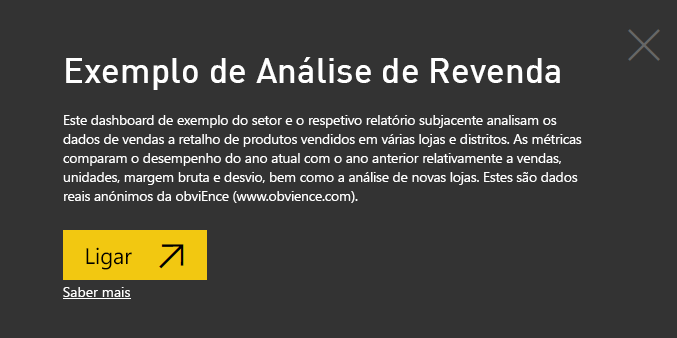
   
5. O Power BI importa o pacote de conteúdos e adiciona um novo dashboard, relatório e conjunto de dados para a sua área de trabalho atual. O novo conteúdo é assinalado com um asterisco amarelo. 
   
   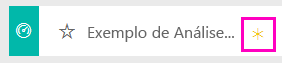
  
### Obter o ficheiro .pbix para este exemplo

Em alternativa, pode transferir o exemplo de como um ficheiro .pbix, que foi concebido para utilização com o Power BI Desktop. 

 * [Exemplo de Análise de Retalho](http://download.microsoft.com/download/9/6/D/96DDC2FF-2568-491D-AAFA-AFDD6F763AE3/Retail%20Analysis%20Sample%20PBIX.pbix)

### Obter o livro do Excel para este exemplo
Também pode [transferir apenas o conjunto de dados (livro do Excel)](http://go.microsoft.com/fwlink/?LinkId=529778) para este exemplo. O livro contém as folhas do Power View que pode ver e modificar. Para ver os dados não processados, selecione **Power Pivot > Gerir**.

## Iniciar no dashboard e abrir o relatório
1. No dashboard, selecione o mosaico "Total de Lojas":

   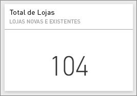  

   É direcionado para a página "Descrição Geral das Vendas da Loja" no relatório. Veja que temos 104 lojas no total, sendo que 10 delas são novas. Temos duas cadeias, Fashions Direct e Lindseys. Em média, as lojas Fashions Direct são maiores.
2. No gráfico circular, selecione **Fashions Direct**.

   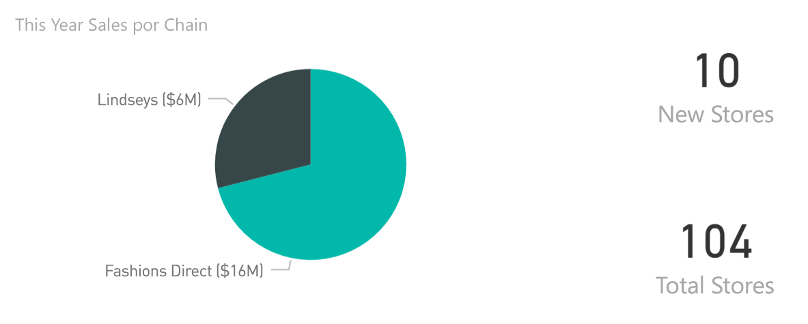  

   Observe o resultado no gráfico de bolhas:

   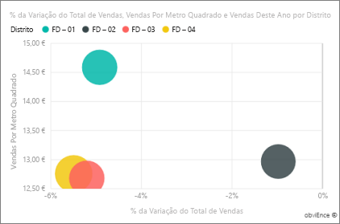  

   O distrito FD-01 tem a maior Média de Vendas por Metro Quadrado, FD-02 tem a menor Variação em Vendas em comparação com o ano passado, FD-03 e FD-04 têm os piores desempenhos gerais.
3. Selecione algumas das bolhas individuais ou outros gráficos para ver o realce cruzado e revelar o impacto das suas seleções.
4. Para regressar ao dashboard, selecione o nome na barra de navegação superior (navegação estrutural).

   
5. No dashboard, selecione o mosaico que contém "Vendas Deste Ano".

   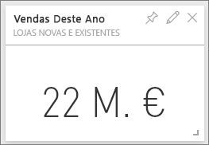

   Isto é equivalente a escrever "Vendas deste ano" na caixa de perguntas.

   Verá este ecrã:

   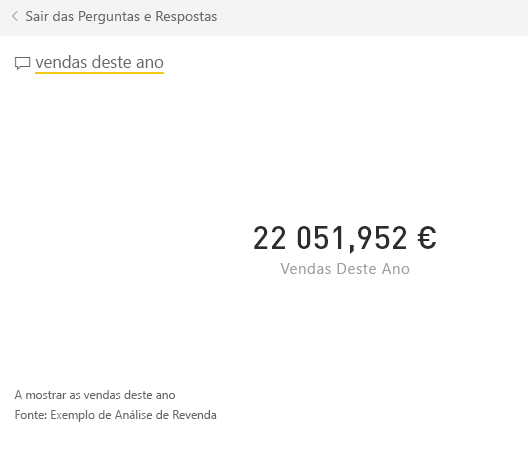

## Rever um mosaico criado com as Perguntas e Respostas do Power BI
Vamos analisar mais detalhadamente.

1. Adicione “vendas deste ano **por distrito**” à pergunta. Observe o resultado: a resposta é colocada automaticamente num gráfico de barras e são sugeridas outras frases:

   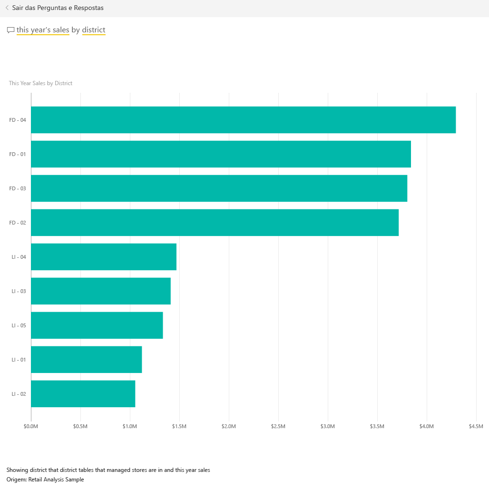
2. Agora, altere a pergunta para “vendas deste ano **por código postal e cadeia**”.

   Observe como a pergunta é respondida à medida que escreve nos gráficos adequados.
3. Experimente com mais perguntas e veja que tipo de resultados são obtidos.
4. Quando estiver pronto, regresse ao dashboard.

## Aprofundar os dados
Agora, vamos explorar num nível mais detalhado e analisar os desempenhos dos distritos.

1. No dashboard, selecione o mosaico que compara as vendas deste ano às vendas do ano passado.

   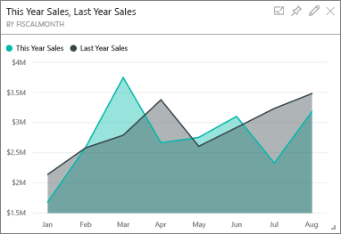

   Observe a grande variabilidade na % de Variação em relação ao ano passado, com janeiro, abril e julho a ter um mau desempenho.

   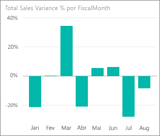

   Vamos ver se podemos chegar até onde os problemas podem estar.
2. Selecione o gráfico de bolhas e escolha **020-Mens**.

   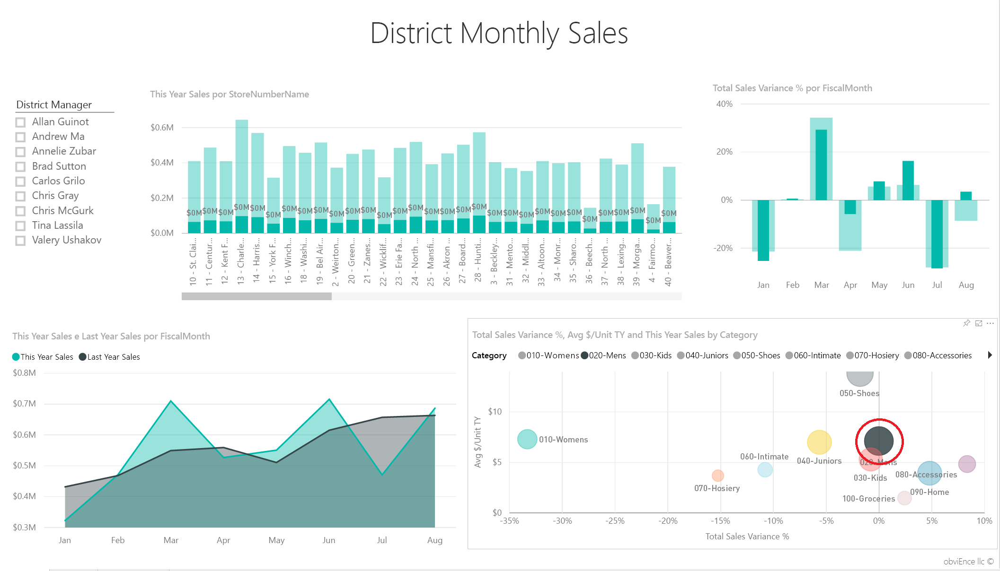  

   Observe que a categoria Masculino não foi tão prejudicada em abril como os negócios em geral, mas janeiro e julho ainda foram meses com problemas.
3. Agora, selecione a **bolha 010-Womens**.

   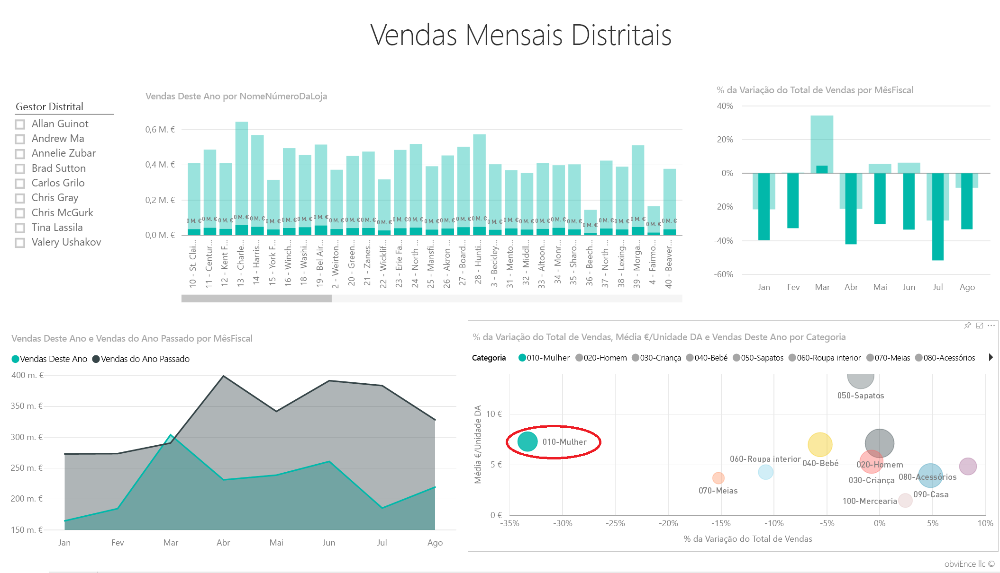

   Observe que a categoria Feminino teve um desempenho muito pior do que os negócios em geral em todos os meses, e muito pior em quase todos os meses, em comparação com o ano interior.
4. Selecione a bolha novamente para limpar o filtro.

## Experimente a segmentação de dados
Vejamos o desempenho de distritos específicos.

1. Clique em Artur Gomes na parte superior esquerda da segmentação.

   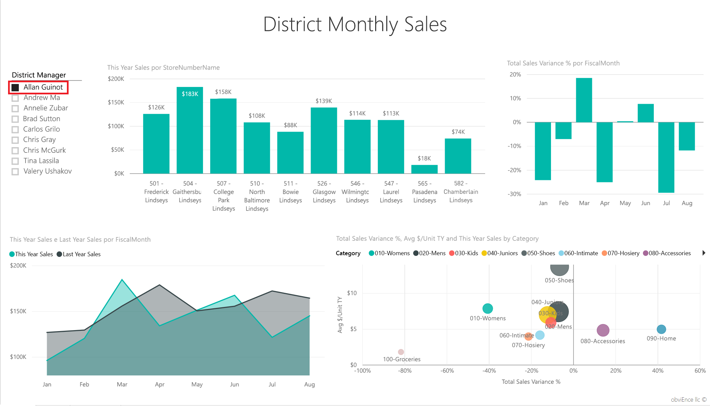

   Observe que o distrito de Artur teve um desempenho superior no Ano Passado em março e junho.
2. Agora, com Artur ainda selecionado, selecione a bolha Feminino.

   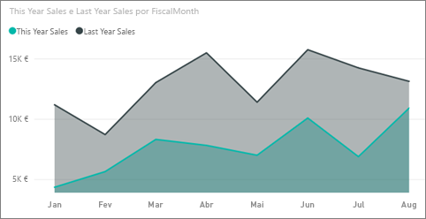

   Observe que para a categoria Feminino, o seu distrito nunca cumpriu o volume do ano passado.
3. Explore os outros gestores e categorias de distrito – que outras informações pode encontrar?
4. Quando estiver pronto, volte ao dashboard.

## O que os dados estão a indicar sobre o crescimento de vendas deste ano?
A última área que queremos explorar é o nosso crescimento, as novas lojas abertas este ano.

1. Selecione o mosaico "Lojas Abertas Este Ano".

   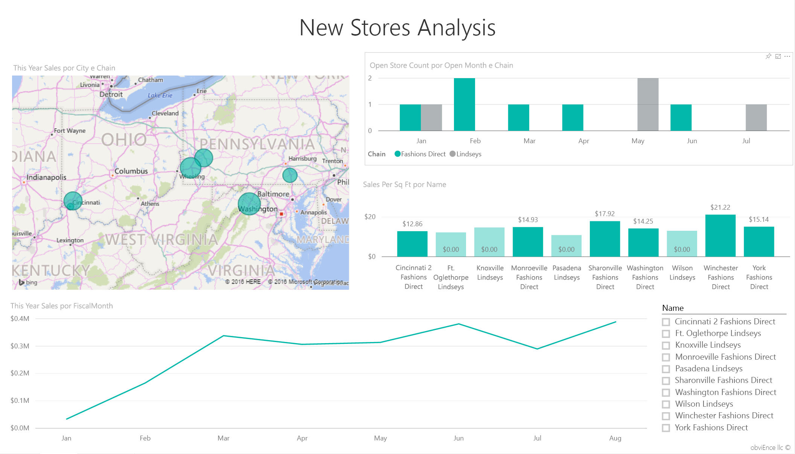

   Como pode ser visto no mosaico, foram abertas mais lojas Fashion Direct do que Lindseys este ano.
2. Veja o gráfico “Vendas por metros quadrados por Nome”:

   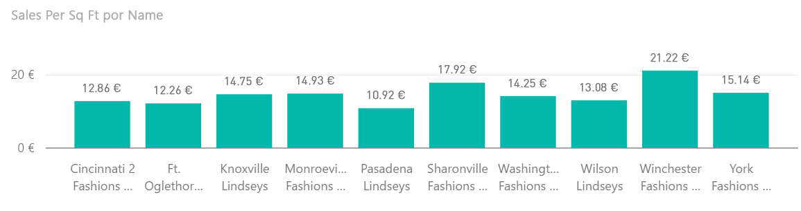

    Existem bastantes diferenças na Média de Vendas por Metros Quadrados entre as novas lojas.
3. Clique no item de legenda Fashions Direct no gráfico à direita superior. Observe que, mesmo para a mesma cadeia, a melhor loja (Winchester Fashions Direct) tem um desempenho significativamente superior à pior loja (Cincinnati 2 Fashions Direct): 21,22 $ vs. 12,86 $, respetivamente.

   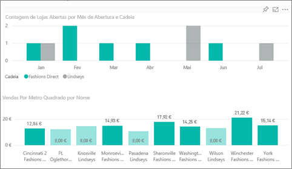
4. Clique em Winchester Fashions Direct na segmentação de dados e observe o gráfico de linhas. Os primeiros números de vendas foram comunicados em fevereiro.
5. Clique em Cincinnati 2 Fashions Direct na segmentação de dados e verá no gráfico de linhas que a loja foi aberta em junho e que parece ser a loja com o pior desempenho.
6. Como antes, explore ao clicar nas outras barras, linhas e bolhas em todos os gráficos e veja que informações pode descobrir.

Este é um ambiente seguro para experimentar. Pode sempre optar por não guardar as alterações. No entanto, se as guardar, pode sempre aceder a Obter Dados para obter uma nova cópia deste exemplo.

## Ligar aos seus dados
Esperamos que esta apresentação tenha mostardo como os dashboards, as Perguntas e Respostas e os relatório do Power BI podem fornecer informações sobre dados de revenda. Agora, é sua vez: ligue-se aos seus próprios dados. Com o Power BI, pode ligar-se a uma grande variedade de origens de dados. Obtenha mais informações sobre como [começar a utilizar o Power BI](service-get-started.md).

## Próximos passos
* [Descarregue o pacote de conteúdos de exemplo de Análise de Revenda](sample-tutorial-connect-to-the-samples.md)
* [Transferir um ficheiro zip de todos os ficheiros de exemplo](http://go.microsoft.com/fwlink/?LinkId=535020)    
* [Descarregue o livro do Excel para este exemplo do Power BI](http://go.microsoft.com/fwlink/?LinkId=529778)    
* [Obter dados (para o Power BI)](service-get-data.md)    
* [Power BI - Conceitos Básicos](service-basic-concepts.md)    
* Mais perguntas? [Pergunte à Comunidade do Power BI](http://community.powerbi.com/)
