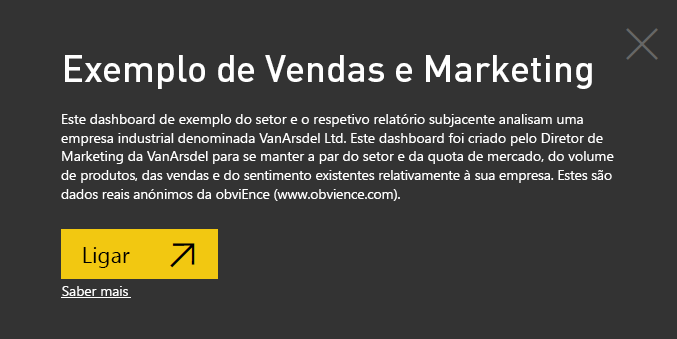
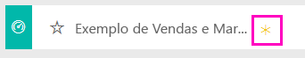
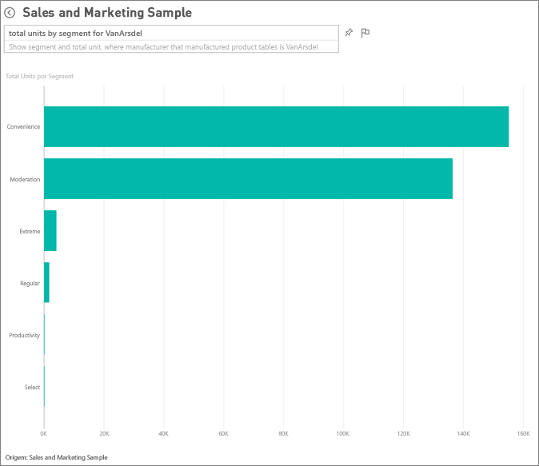
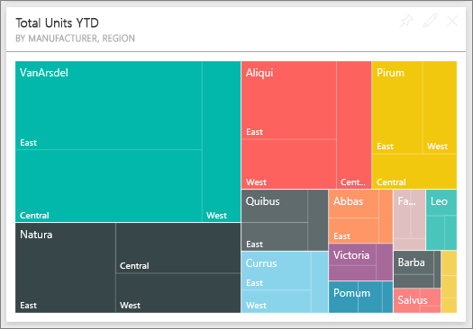
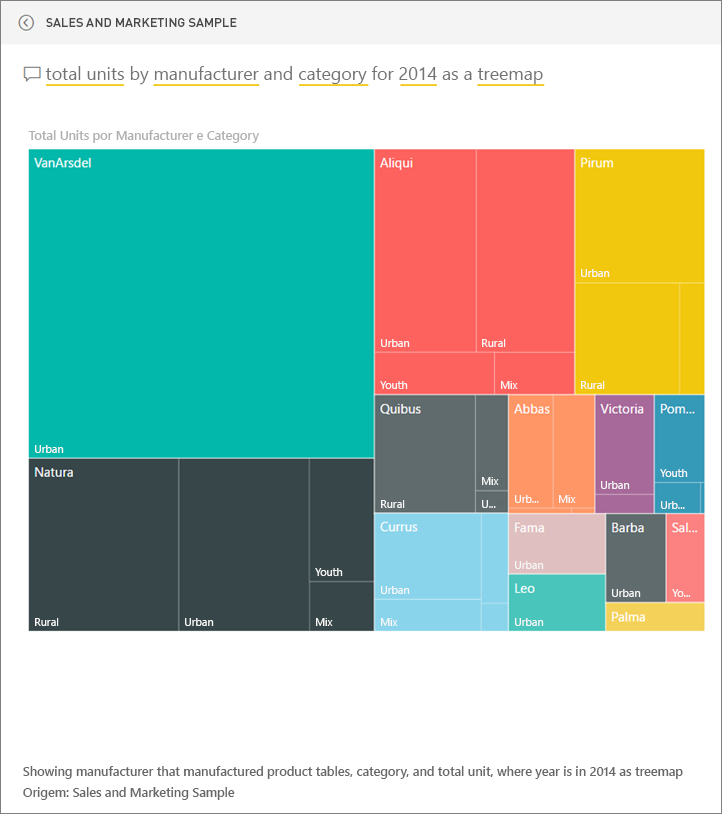
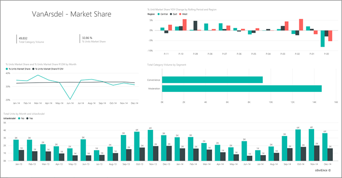
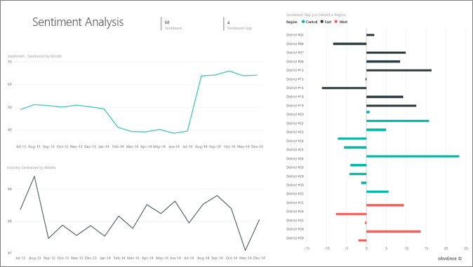
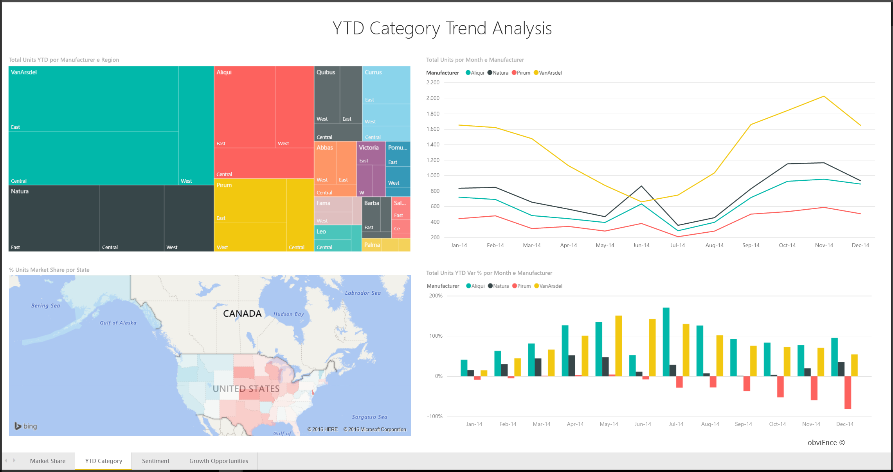
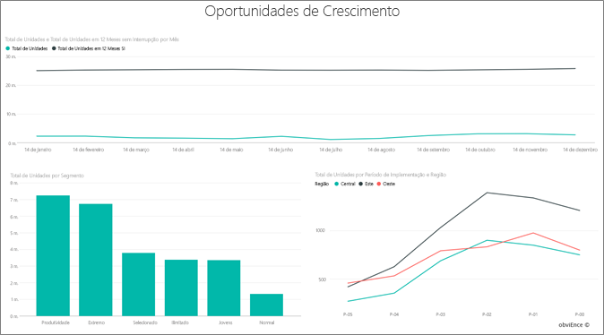

# Exemplo de Vendas e Marketing para o Power BI: fazer um tour

## Descrição geral do exemplo de Vendas e Marketing
O **Exemplo de Vendas e Marketing** contém um dashboard e um relatório para uma empresa industrial fictícia chamada VanArsdel Ltd. Este dashboard foi criado pelo Diretor de Marketing (CMO) da VanArsdel para ficar atento ao setor e à participação de mercado da sua empresa, ao volume de produto, às vendas e à sensibilidade.

A VanArsdel tem muitos concorrentes, mas é a líder do mercado no seu setor. O CMO quer aumentar a participação no mercado e descobrir as oportunidades de crescimento. Mas, por algum motivo, a participação no mercado da VanArsdel começou a cair, com uma queda significativa em junho.

Este exemplo faz parte de uma série de exemplos que ilustra como o Power BI pode ser utilizado com dados, relatórios e dashboards voltados para os negócios. Estes são dados reais anónimos da obviEnce (www.obvience.com).

## Pré-requisitos

 Para poder utilizar o exemplo, primeiro tem de transferi-lo como um [pacote de conteúdos](https://docs.microsoft.com/en-us/power-bi/sample-sales-and-marketing#get-the-content-pack-for-this-sample), [.pbix](http://download.microsoft.com/download/9/7/6/9767913A-29DB-40CF-8944-9AC2BC940C53/Sales-and-Marketing-Sample-PBIX.pbix) ou [livro do Excel](http://go.microsoft.com/fwlink/?LinkId=529785).

### Obter o pacote de conteúdos para este exemplo

1. Abra o serviço Power BI (app.powerbi.com) e inicie sessão.
2. No canto inferior esquerdo, selecione **Obter dados**.
   
    
3. Na página Obter Dados que aparece, selecione **Exemplos**.
   
   
4. Selecione o **Exemplo de Vendas e Marketing** e, em seguida, escolha **Ligar**.  
  
   
   
5. O Power BI importa o pacote de conteúdos e adiciona um novo dashboard, relatório e conjunto de dados para a sua área de trabalho atual. O novo conteúdo é assinalado com um asterisco amarelo. 
   
   
  
### Obter o ficheiro .pbix para este exemplo

Em alternativa, pode transferir o exemplo como um ficheiro .pbix, que foi concebido para utilização com o Power BI Desktop. 

 * [Exemplo de Vendas e Marketing](http://download.microsoft.com/download/9/7/6/9767913A-29DB-40CF-8944-9AC2BC940C53/Sales%20and%20Marketing%20Sample%20PBIX.pbix)

### Obter o livro do Excel para este exemplo
Também pode [transferir apenas o conjunto de dados (livro do Excel)](http://go.microsoft.com/fwlink/?LinkId=529785) para este exemplo. O livro contém as folhas do Power View que pode ver e modificar. Para ver os dados não processados, selecione **Power Pivot > Gerir**.

## O que nos diz o nosso dashboard?
Vamos começar o nosso tour no dashboard e examinar os mosaicos que o CMO decidiu afixar. Podemos ver informações sobre a nossa participação no mercado, vendas e sensibilidade. E podemos ver esses dados divididos por região, hora e concorrência.

* Os mosaicos de número abaixo da coluna esquerda mostram volume de vendas do setor no ano passado (50K), a participação no mercado (% 32,86%), o volume de vendas (16K), a pontuação de sensibilidade (68) a lacuna (4) e o total de unidades vendidas (1M).
* O gráfico de linha superior mostra como a nossa participação no mercado varia ao longo do tempo. A nossa participação no mercado realmente cai em junho. Além disso, a nossa participação R12M (12 meses sem interrupção) que estava a aumentar até agora, está a começar a cair.
* O nosso principal concorrente é a Aliqui (evidente no mosaico de gráfico de coluna do meio).
* A maioria dos nossos negócios está nas regiões leste e central.
* O gráfico de linha na parte inferior mostra que a nossa queda em junho não é sazonal – nenhum dos nossos concorrentes mostram a mesma tendência.
* Os dois mosaicos de "Total de unidades" mostram unidades vendidas, por segmento e por região/fabricante. O segmento de mercado maior para a nossa indústria é **Produtividade** e **Conveniência**.

### Utilizar o P e R para aprofundar
#### Que segmentos conduzem as nossas vendas? Correspondem à tendência do setor?
1. Selecione o mosaico "Descrição Geral do total de Unidades por Segmento", que abrirá as Perguntas e Respostas.
2. Escreva **para VanArsdel** no final da consulta existente. O P e R interpreta a pergunta e apresenta um gráfico atualizado com a resposta. O nosso volume de produto vem da Conveniência e da Moderação.

   
3. A nossa participação nas categorias **Moderação** e **Conveniência** é muito alta; são os segmentos nos quais podemos concorrer.
4. Navegue de volta ao dashboard ao selecionar o nome do dashboard na barra de navegação superior (navegação de trilho).

#### Com o que se aparece a participação de mercado total para a categoria (versus região)?
1. Observe o mosaico "Total de Unidades YTD por Fabricante, Região". Como será a participação de mercado do total de unidades por categoria?

   
2. Na caixa de pergunta na parte superior do dashboard, escreva a pergunta **total de unidades por fabricante e categoria de 2014 como um treemap**. Veja como a visualização é atualizada à medida que escreve a pergunta.
   
3. Para comparar as descobertas, afixe o gráfico até no dashboard. Muito interessante; em 2014 a VanArsdel vendeu apenas produtos que se enquadram na categoria **Urbano**.
4. Navegue de volta para o dashboard.

Os dashboards também são um ponto de entrada nos relatórios.  Se um mosaico for criado a partir de um relatório subjacente, clicar nesse mosaico abre o relatório.

No nosso dashboard, a linha R12M (12 meses sem interrupção) mostra que a nossa participação no mercado já não está a aumentar ao longo do tempo, está inclusive a diminuir um pouco. E por que temos uma grande queda na participação do mercado em junho? Para investigar melhor, clique nesta visualização para abrir o relatório subjacente.

### O nosso relatório tem 4 páginas
#### A página 1 do nosso relatório concentra-se no mercado da VanArsdel.

1. Examine o gráfico de colunas "Total de Unidades por Mês e isVanArsdel" na parte inferior. A coluna preta representa a VanArsdel (os nossos produtos) e a concorrência é apresentada a verde. A queda em junho de 2014 que a VanArsdel teve não ocorre na concorrência.
2. O gráfico de barras "Volume de Categoria Total por Segmento", no meio à direita, é filtrado para mostrar os 2 principais segmentos de VanArsdel. Veja como este filtro foi criado:  

   a.  Expanda o painel Filtros à direita.  
   b.  Clique para selecionar a visualização.  
   c.  Em Filtros de Nível Visual, repare que **Segmento** é filtrado para incluir apenas **Conveniência** e **Moderação**.  
   d.  Modifique o filtro ao selecionar Segmento para expandir essa secção e **Produtividade** para adicionar também esse segmento.  
3. Em "Total de Unidades por Mês e isVanArsdel", clique no "Sim" perto na legenda para a filtragem cruzada da página por VanArsdel. Veja que nós não competimos no segmento de Produtividade.
4. Clique no "Sim" preto novamente para remover o filtro.
5. Veja o gráfico de linhas. Ele mostra as participações de mercado mensal e 12 meses sem interrupção. Os dados de 12 meses sem interrupção ajudam a suavizar as flutuações mensais e mostram as tendências de longo prazo. Selecione Conveniência e Moderação no gráfico de barras para ver quanta flutuação existe na participação de mercado para cada segmento. O segmento de Moderação mostra muito mais flutuação no mercado do que o segmento de Conveniência.

Ainda queremos descobrir por que a nossa participação no mercado caiu tanto em junho. Vamos verificar a Sensibilidade.

#### A página 3 do nosso relatório concentra-se na Sensibilidade.

Os tweets, o Facebook, os blogues, os artigos, etc. contribuem para o sentimento mostrado nos gráficos de duas linhas. O gráfico de sensibilidade na parte superior esquerda mostra que a sensibilidade pelos nossos produtos foi bastante neutra até fevereiro. Em seguida, começou uma grande queda em fevereiro e aumentou em junho. O que aconteceu para causar esta queda na sensibilidade? Precisamos de examinar origens externas. Em fevereiro, vários artigos e publicações do blogue classificaram o suporte ao cliente da VanArsdel como o pior do setor. Esta má publicidade tem uma correlação direta com o sentimento do cliente e as vendas. A VanArsdel trabalhou muito para melhorar o suporte ao cliente e os clientes e o setor tomaram nota. Em julho, o sentimento positivo começou a aumentar e, em seguida, esteve sempre elevado nos 60s. Este aumento no sentimento é refletido nas "Unidades Totais por Mês", nas páginas 1 e 3. Talvez isto explique parcialmente a nossa queda de participação no mercado em junho?

A lacuna de sensibilidade seria outra área a explorar: que distritos têm a maior lacuna de sensibilidade, de que forma isto pode ser gerido e descobrir formas de replicar noutros distritos.

#### A página 2 do nosso relatório concentra-se na Tendência de Categoria YTD

* De todas as empresas nesta categoria, a VanArsdel é a maior e os nossos maiores concorrentes são a Natura, a Aliqui e a Pirium. Vamos estar de olho nelas.
* A Aliqui está a crescer, mas o volume de produto ainda está baixo em comparação connosco.
* O treemap mostra a VanArsdel em verde. Na região leste, os clientes preferem a concorrência, na região central estamos bem e a nossa participação de mercado na região leste é a mais pequena.
* A geografia tem um impacto nas unidades vendidas. Leste é a região dominante para a maioria dos fabricantes e a VanArsdel tem uma forte presença na região Central.
* No gráfico "% de Unidades Totais YTD por Mês e Fabricante" no canto superior direito, temos uma variação positiva, o que é um bom sinal, estamos ainda melhor do que no ano passado, mas a nossa concorrente, a Aliqui, também.

#### A página 4 do nosso relatório concentra-se na análise de produtos dos concorrentes.

* O gráfico da parte inferior esquerda mostra todos os segmentos de categoria, exceto dois segmentos mais fortes da VanArsdel. Para filtrar por categoria, clicar nas barras de ajuda a identificar as potenciais áreas de expansão para a VanArsdel. Os segmentos **Extremo** e **Produtividade** estão a crescer mais rapidamente do que outros.
* Mas não concorremos nestes segmentos. Se quisermos mover para essas áreas, podemos utilizar os nossos dados para ver que segmentos são populares em que regiões. Pode investigar questões como a região que está a crescer mais rapidamente e qual seria o nosso principal concorrente nesse segmento.
* Lembra-se da queda da nossa participação de mercado em junho? Junho é um excelente mês para o segmento de Produtividade - um segmento em que não competimos de todo. Isso poderia ajudar a explicar a nossa queda de participação de mercado em junho.

Ao filtrar as visualizações por VanArsdel, por segmento, por mês e por região, podemos descobrir as oportunidades de crescimento para VanArsdel.

Este é um ambiente seguro para experimentar. Pode optar por não guardar as alterações. No entanto, se as guardar, pode sempre aceder a **Obter Dados** para obter uma nova cópia deste exemplo.

## Próximos passos: ligar-se aos seus dados
Esperamos que este tour lhe tenha mostrado como os dashboards, o P e R e os relatórios do Power BI podem apresentar informações sobre os dados de vendas e marketing. Agora é a sua vez — ligue-se aos seus próprios dados. Com o Power BI, pode ligar-se a uma grande variedade de origens de dados. Saiba mais sobre como [começar a utilizar o Power BI](service-get-started.md).  
