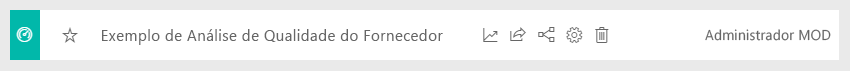
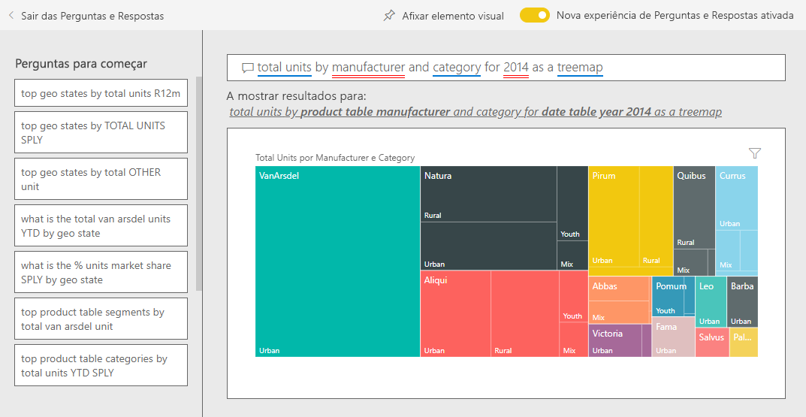

# Exemplo de Vendas e Marketing do Power BI: veja uma apresentação

O exemplo de Vendas e Marketing contém um dashboard e um relatório para uma empresa industrial fictícia chamada VanArsdel Ltd. O Diretor de Marketing (CMO) da VanArsdel criou este dashboard para ficar atento ao setor e à quota de mercado da empresa, ao volume de produtos, às vendas e ao sentimento.

A VanArsdel tem muitos concorrentes, mas é a líder do mercado no seu setor. O CMO quer aumentar a participação no mercado e descobrir as oportunidades de crescimento. No entanto, por motivos desconhecidos, a quota de mercado da VanArsdel começou a cair, com uma queda significativa em junho.

Este exemplo faz parte de uma série que mostra como pode utilizar o Power BI com dados, relatórios e dashboards orientados para negócios. Foi criado com dados reais da [obviEnce](http://www.obvience.com/), que foram mantidos anónimos. Os dados estão disponíveis em vários formatos: pacote de conteúdos, ficheiro .pbix do Power BI Desktop ou livro do Excel. Veja [Exemplos do Power BI](sample-datasets.md). 

Este tutorial explora o pacote de conteúdos do exemplo de Vendas e Marketing no serviço Power BI. Uma vez que a experiência do relatório é semelhante no Power BI Desktop e no serviço, também pode acompanhar com o ficheiro .pbix de exemplo no Power BI Desktop. 

Não precisa de uma licença do Power BI para explorar os exemplos no Power BI Desktop. Se não tiver uma licença do Power BI Pro, pode guardar o exemplo em A Minha Área de Trabalho no serviço Power BI. 

## Obter o exemplo

Para poder utilizar o exemplo, primeiro tem de transferi-lo como um [pacote de conteúdos](#get-the-content-pack-for-this-sample), um [ficheiro .pbix](#get-the-pbix-file-for-this-sample) ou um [livro do Excel](#get-the-excel-workbook-for-this-sample).

### Obter o pacote de conteúdos para este exemplo

1. Abra o serviço Power BI (app.powerbi.com), inicie sessão e abra a área de trabalho onde quer guardar o exemplo.

   Se não tiver uma licença do Power BI Pro, pode guardar o exemplo em A Minha Área de Trabalho.

2. No canto inferior esquerdo, selecione **Obter Dados**.
   
   
3. Na página **Obter Dados** apresentada, selecione **Exemplos**.
   
4. Selecione o **Exemplo de Vendas e Marketing** e, em seguida, selecione **Ligar**.   
  
   
   
5. O Power BI importa o pacote de conteúdos e adiciona um novo dashboard, um relatório e um conjunto de dados à área de trabalho atual.
   
   
  
### Obter o ficheiro .pbix para este exemplo

Em alternativa, pode transferir o exemplo de Vendas e Marketing como um [ficheiro .pbix](https://download.microsoft.com/download/9/7/6/9767913A-29DB-40CF-8944-9AC2BC940C53/Sales%20and%20Marketing%20Sample%20PBIX.pbix), que foi concebido para utilização com o Power BI Desktop.

### Obter o livro do Excel para este exemplo

Se quiser ver a origem de dados deste exemplo, também está disponível como um [livro do Excel](https://go.microsoft.com/fwlink/?LinkId=529785). O livro contém as folhas do Power View que pode ver e modificar. Para ver os dados não processados, ative os suplementos de Análise de Dados e, em seguida, selecione **Power Pivot > Gerir**. Para ativar os suplementos do Power View e do Power Pivot, veja [Explorar os exemplos do Excel](sample-datasets.md#explore-excel-samples-inside-excel) para obter detalhes.

## O que nos diz o nosso dashboard?
Vamos começar a nossa representação no dashboard e examinar os mosaicos que o CMO decidiu afixar. Podemos ver informações sobre a nossa participação no mercado, vendas e sensibilidade. Os dados estão divididos por região, hora e concorrência.

* Os mosaicos de número na coluna esquerda mostram o volume de vendas do setor no ano passado (50 mil), a quota de mercado (32,86%), o volume de vendas (16 mil), a pontuação de sentimento (68), o intervalo de sentimento (4) e o total de unidades vendidas (1 milhão).
* O gráfico de linhas superior ( **% Units Market Share vs. % Units Market Share Rolling 12 Months** [% de Quota de Mercado em Unidades vs. % de Quota de Mercado em Unidades dos Últimos 12 Meses]) mostra como a nossa quota de mercado flutua ao longo do tempo. Observe a grande queda em junho. A nossa quota nos últimos 12 meses (R12M), que vinha aumentando, está agora a começar a cair.
* O nosso principal concorrente é a Aliqui, como é evidente no mosaico de gráfico de colunas do meio (**Total Units YTD Variance %** [% de Variância de Total de Unidades Ano Até à Data]).
* A maioria dos nossos negócios está nas regiões leste e central.
* O gráfico de linhas na parte inferior (**Total Units for 2014** [Total de Unidades para 2014]) mostra que a nossa queda em junho não é sazonal; nenhum dos nossos concorrentes mostra a mesma tendência.
* Os mosaicos **Total Units Overall** (Total de Unidades Gerais) e **Total Units YTD** (Total de Unidades Ano Até à Data) à direita mostram as unidades vendidas, por segmento e por região/fabricante. Os maiores segmentos de mercado para a nossa indústria são **Productivity** (Produtividade) e **Convenience** (Conveniência).

## Utilizar o P e R para aprofundar

Ao utilizar as Perguntas e Respostas, pode descobrir detalhes adicionais nos dados.

### Que segmentos conduzem as nossas vendas? Correspondem à tendência do setor?
1. Selecione o mosaico **Total Units Overall por Segment** (Total de Unidades Gerais Por Segmento), que abre as Perguntas e Respostas e introduz a consulta, *total units by segment* (total de unidades por segmento).
2. No final da consulta existente, adicione: *para VanArsdel*. O P e R interpreta a pergunta e apresenta um gráfico atualizado com a resposta. Repare que o nosso volume de produtos é proveniente, sobretudo, dos segmentos **Convenience** (Conveniência) e **Moderation** (Moderação).

   
3. A nossa quota nas categorias **Moderation** (Moderação) e **Convenience** (Conveniência) é alta; é nestes segmentos que podemos concorrer.
4. Volte ao dashboard ao selecionar o **Exemplo de Vendas e Marketing** no painel de navegação superior.

### Com o que se aparece a participação de mercado total para a categoria (versus região)?
1. Observe o mosaico **Total Units YTD by Manufacturer, Region** (Total de Unidades Ano Até à Data por Fabricante, Região). Qual é o total da quota de mercado em unidades por categoria?

   
2. Selecione a caixa de perguntas na parte superior do dashboard e escreva a pergunta *total units por manufacturer e category para 2014 como um treemap*. Veja como a visualização é atualizada à medida que escreve a pergunta.

   
3. Para comparar as descobertas, afixe o gráfico até no dashboard. Observe este facto interessante: Em 2014, a VanArsdel vendeu apenas produtos na categoria **Urban** (Urbano).
4. Volte ao dashboard.

## Relatório do Exemplo de Vendas e Marketing

Os dashboards são um ponto de entrada nos relatórios. Se um mosaico for criado a partir de um relatório subjacente, selecionar esse mosaico abre o relatório.

No nosso dashboard, a linha **% Units Market Share R12M** (% de Quota de Mercado em Unidades R12M) no gráfico **% Units Market Share vs. % Units Market Share Rolling 12 Months** (% de Quota de Mercado em Unidades vs. % de Quota de Mercado em Unidades dos Últimos 12 Meses), mostra que a nossa quota de mercado já não está a aumentar ao longo do tempo. Até está a diminuir um pouco. Por que motivo ocorreu uma grande queda da quota de mercado em junho? 

O relatório do exemplo de Vendas e Marketing tem quatro páginas.
 
### Página VanArsdel - Market Share (VanArsdel - Quota de Mercado)
A primeira página do relatório foca-se na quota de mercado da VanArsdel.

1. No dashboard, selecione o gráfico **% Units Market Share vs. % Units Market Share Rolling 12 Months** (% de Quota de Mercado em Unidades vs. % de Quota de Mercado em Unidades dos Últimos 12 Meses) para abrir a página **VanArsdel - Market Share** (VanArsdel - Quota de Mercado) do relatório do Exemplo de Vendas e Marketing.

   

2. Examine o gráfico de colunas **Total Units por Month e isVanArsdel** (Total de Unidades por Mês e isVanArsdel) na parte inferior do relatório. A coluna preta representa a VanArsdel (os nossos produtos) e a concorrência é apresentada na coluna verde. A queda em junho de 2014 que a VanArsdel teve não se verificou na concorrência.

3. O gráfico de barras **Volume de Categoria Total por Segmento**, à direita, é filtrado para mostrar os dois principais segmentos da VanArsdel. Veja como este filtro foi criado:  

   a. Selecione o gráfico **Total Category Volume por Segment** (Volume de Categoria Total por Segmento).

   b. Selecione o painel **Filtros** à direita para expandi-lo.  

   c. Em **Filtros de nível visual**, repare que **Segment** (Segmento) é filtrado para incluir apenas os segmentos **Convenience** (Conveniência) e **Moderation** (Moderação).  

   d. Modifique o filtro ao selecionar **Segment** (Segmento) para expandi-lo e **Productivity** (Produtividade) para adicionar esse segmento.  

4. No gráfico **Total Units por Month e isVanArsdel** (Total de Unidades por Mês e isVanArsdel), selecione **Yes** (Sim) na legenda para a filtragem cruzada da página por VanArsdel. No gráfico **Volume de Categoria Total por Segmento**, observe que não competimos no segmento **Produtividade**.

5. Selecione **Yes** (Sim) novamente na legenda para remover o filtro.

6. Observe o gráfico de linhas **% Units Market Share e % Units Market Share R12M por Month** (% de Quota de Mercado em Unidades e % de Quota de Mercado em Unidades R12M por Mês). Mostra a quota de mercado mensal e a quota de mercado dos últimos 12 meses. Os dados dos meses anteriores ajudam a eliminar as flutuações mensais e mostram as tendências de longo prazo. No gráfico de barras **Total Category Volume por Segment** (Volume Total de Categorias por Segmento), selecione **Convenience** (Conveniência) e, em seguida, **Moderation** (Moderação) para ver a flutuação da quota de mercado em cada segmento. Repare que o segmento **Moderation** (Moderação) mostra muito mais flutuação da quota de mercado.

Ainda queremos descobrir por que a nossa participação no mercado caiu tanto em junho. Em seguida, vamos verificar a página **Análise de Sentimentos** do relatório.

### Página Sentiment Analysis (Análise de Sentimentos)
A terceira página do relatório foca-se no sentimento do consumidor.

Os Tweets, o Facebook, os blogues e os artigos contribuem para o sentimento do consumidor, que é apresentado nos dois gráficos de linhas no lado esquerdo da página. O gráfico **VanArsdel - Sentiment by Month** (VanArsdel - Sentimento por Mês) no canto superior esquerdo mostra que o sentimento relativo aos nossos produtos foi sobretudo neutro até fevereiro. Depois, começou uma grande queda em fevereiro, seguida de um aumento em junho. O que aconteceu para causar esta queda na sensibilidade? 

Vejamos as origens externas. Em fevereiro, vários artigos e mensagens de blogue classificaram o suporte ao cliente da VanArsdel como o pior do setor. Esta má publicidade tem uma correlação direta com o sentimento do cliente e as vendas. A VanArsdel trabalhou muito para melhorar o suporte ao cliente, tendo os clientes e o setor reparado nesse esforço. Em julho, o sentimento positivo começou a aumentar e, em seguida, esteve sempre elevado acima de 60. Este aumento do sentimento é refletido nos gráficos **Total Units por Month** (Total de Unidades por Mês) na primeira e segunda páginas do relatório. Talvez isto explique parcialmente a nossa queda de participação no mercado em junho?

O intervalo de sentimento pode ser outra área a ser explorada. Quais os distritos que têm o maior intervalo de sentimento, de que forma pode a gestão aproveitar essa informação e como pode replicá-lo noutros distritos?

### Página YTD Category Trend Analysis (Análise das Tendências de Categorias do Ano Até à Data)
A segunda página do relatório foca-se na tendência de categoria do ano até à data.

Repare nos seguintes detalhes:
* A VanArsdel é a maior empresa nesta categoria e os seus maiores concorrentes são a Natura, a Aliqui e a Pirium. Vamos estar de olho nelas.
* A Aliqui está a crescer, mas o volume de produto ainda está baixo em comparação connosco.
* O treemap mostra a VanArsdel em verde. Na região leste, os clientes preferem a nossa concorrência, mas na região central temos um bom desempenho. A nossa participação na região leste é a mais baixa.
* A geografia tem um impacto nas unidades vendidas. A região Leste é a região dominante para a maioria dos fabricantes e a VanArsdel tem uma forte presença na região Central.
* No gráfico **Total Units YTD Var % por Month e Manufacturer** (% de Variância de Total de Unidades Ano Até à Data por Mês e Fabricante) no canto inferior direito, observe que temos uma variação positiva, o que é um bom sinal. Estamos melhor do que no ano passado, mas a nossa concorrente, Aliqui, também apresenta melhorias.

### Página Growth Opportunities (Oportunidades de Crescimento)
A quarta página do relatório foca-se na análise de produtos dos concorrentes.

Repare nos seguintes detalhes:
* O gráfico **Total de Unidades por Segmento** na parte inferior esquerda mostra todos os segmentos de categoria, exceto os dois segmentos mais fortes da VanArsdel. Selecione cada um dos segmentos, à vez, para identificar possíveis áreas de expansão para a VanArsdel. 
* Repare que os segmentos **Extreme** (Extremo) e **Productivity** (Productivity) estão a crescer mais rapidamente do que outros. No entanto, não competimos nesses segmentos. Se quisermos mover para esses segmentos, poderemos utilizar os nossos dados para ver que segmentos são populares em determinadas regiões. Podemos ainda investigar questões como a região que está a crescer mais rapidamente e qual seria o nosso principal concorrente nesse segmento.
* Lembra-se da queda da nossa participação de mercado em junho? Junho é um mês importante para o segmento **Produtividade**, um segmento no qual não competimos de todo. Este detalhe poderia ajudar a explicar a queda da nossa quota de mercado em junho.

Ao filtrar as visualizações por VanArsdel, por segmento, por mês e por região, podemos descobrir as oportunidades de crescimento para VanArsdel.

## Next steps: Ligar aos seus dados
Aqui pode explorar à vontade, pois pode optar por não guardar as alterações. No entanto, se as guardar, pode sempre aceder a **Obter Dados** para obter uma nova cópia deste exemplo.

Esperamos que este tour tenha mostrado como os dashboards, o P e R e os relatórios do Power BI podem apresentar informações sobre os dados de recursos humanos. Agora, é a sua vez: ligue-se aos seus próprios dados. Com o Power BI, pode ligar-se a uma grande variedade de origens de dados. Para saber mais, veja [Introdução ao serviço Power BI](service-get-started.md).
