# Exemplo de Análise de Qualidade de fornecedor para o Power BI: faça um tour

## Uma breve descrição geral de exemplo da Análise de Qualidade do Fornecedor
Este dashboard de exemplo do setor e o respetivo relatório subjacente focam-se num dos desafios típicos da cadeia de fornecimento – a análise de qualidade do fornecedor.
Duas métricas principais estão envolvidas na análise: o número total de defeitos e o tempo de inatividade total que causou estes defeitos. Este exemplo tem dois objetivos principais:

* Compreender quem são os melhores e os piores fornecedores, no que respeita à qualidade
* Identificar as instalações fabris que melhor localizam e rejeitam defeitos, para minimizar o período de indisponibilidade

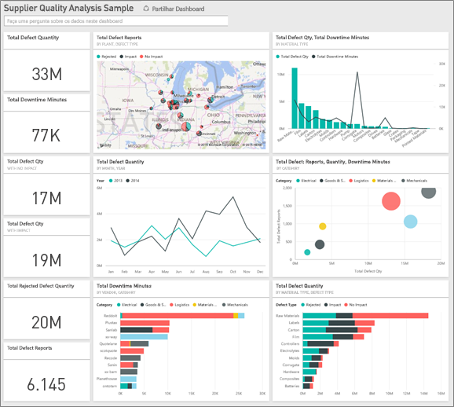

Este exemplo faz parte de uma série de exemplos que ilustra como o Power BI pode ser utilizado com dados, relatórios e dashboards voltados para os negócios.
Os exemplos são dados reais de obviEnce ([www.obvience.com](http://www.obvience.com/)) que foram mantidos anónimos.

## Pré-requisitos

 Para poder utilizar o exemplo, primeiro tem de transferi-lo como um [pacote de conteúdos](https://docs.microsoft.com/en-us/power-bi/sample-supplier-quality#get-the-content-pack-for-this-sample), um [ficheiro .pbix](http://download.microsoft.com/download/8/C/6/8C661638-C102-4C04-992E-9EA56A5D319B/Supplier-Quality-Analysis-Sample-PBIX.pbix) ou um [livro do Excel](http://go.microsoft.com/fwlink/?LinkId=529779).

### Obter o pacote de conteúdos para este exemplo

1. Abra o serviço Power BI (app.powerbi.com) e inicie sessão.
2. No canto inferior esquerdo, selecione **Obter dados**.
   
    
3. Na página Obter Dados que aparece, selecione **Exemplos**.
   
   
4. Selecione o **exemplo de Análise de Qualidade do Fornecedor**, em seguida, escolha **Ligar**.  
  
   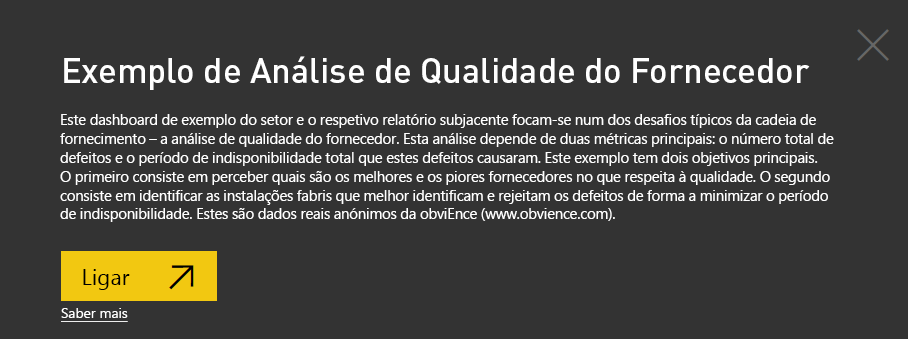
   
5. O Power BI importa o pacote de conteúdos e adiciona um novo dashboard, relatório e conjunto de dados para a sua área de trabalho atual. O novo conteúdo é assinalado com um asterisco amarelo. 
   
   
  
### Obter o ficheiro .pbix para este exemplo

Em alternativa, pode transferir o exemplo como um ficheiro .pbix, que foi concebido para utilização com o Power BI Desktop. 

 * [Exemplo de Análise de Qualidade do Fornecedor](http://download.microsoft.com/download/8/C/6/8C661638-C102-4C04-992E-9EA56A5D319B/Supplier-Quality-Analysis-Sample-PBIX.pbix)

### Obter o livro do Excel para este exemplo
Também pode [transferir apenas o conjunto de dados (livro do Excel)](http://go.microsoft.com/fwlink/?LinkId=529779) para este exemplo. O livro contém as folhas do Power View que pode ver e modificar. Para ver os dados não processados, selecione **Power Pivot > Gerir**.

## Tempo de inatividade causado por materiais com defeito
Vamos analisar o tempo de inatividade causado por material defeituoso e ver os fornecedores que são responsáveis.  

1. No dashboard, selecione o mosaico de número **Quantidade Total de Defeitos** ou **Total de Minutos de Inatividade**.  

   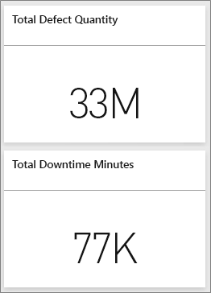  

   O relatório "Exemplo de Análise de Qualidade do Fornecedor" abre a página "Análise de Tempo de Inatividade". Observe que temos um total de 33 M peças com defeito, e o tempo de inatividade total causado por estas peças com defeito é de 77 K minutos. Alguns materiais têm menos peças com defeito, mas podem causar um atraso enorme, resultando num maior tempo de inatividade. Vamos explorá-los na página do relatório.  
2. Ao observarmos a linha **Total de Minutos de Inatividade** no gráfico de combinação **Defeitos e Tempo de Inatividade (min) por Tipo de Material**, vemos que os materiais ondulados causam a maior parte do tempo de inatividade.  
3. Selecione a coluna **Ondulado** no mesmo gráfico de combinação para ver as fábricas que são mais afetadas por este defeito e o fornecedor responsável.  

   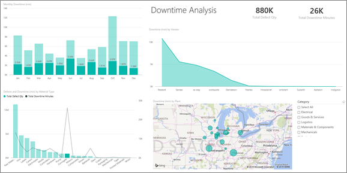  
4. Selecione fábricas individuais no mapa para ver que fornecedores ou material é responsável pelo tempo de inatividade nessa fábrica.

### Quais são os piores fornecedores?
 Queremos encontrar os oito piores fornecedores e determinar qual é a percentagem do tempo de inatividade de que eles são responsáveis. Podemos fazê-lo ao alterar o gráfico de área **Tempo de Inatividade (min) por Fornecedor** para um treemap.  

1. Na página 3 do relatório, "Análise de Inatividade", selecione **Editar Relatório** no canto superior esquerdo.  
2. Selecione o gráfico de área **Tempo de Inatividade (min) por Fornecedor** e, no painel Visualizações, selecione Treemap.  

   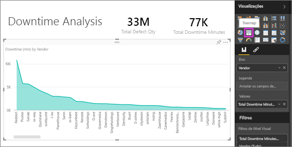  

    O treemap coloca automaticamente o campo **Fornecedor** como **Grupo**.  

    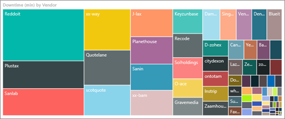  

   Neste treemap, podemos ver quais são os oito principais fornecedores nos oito blocos à esquerda do treemap. Também podemos ver que se responsabilizam por cerca de 50% de todos os minutos de inatividade.  
3. Selecione **Exemplo de Análise de Qualidade do Fornecedor** na barra de navegação superior para voltar ao dashboard.

### Comparar fábricas
Agora vamos explorar as fábricas que fazem um trabalho de melhor gestão de material com defeito, resultando num tempo de inatividade inferior.  

1. Selecione o mosaico do mapa **Relatórios do Total de Defeitos por Fábrica, Tipo de Defeito**.  

    O relatório abre a página "Qualidade do Fornecedor".  

   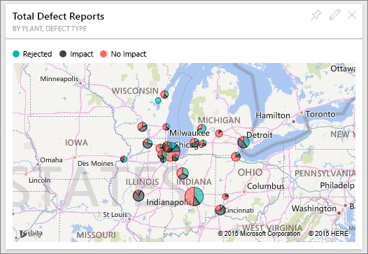  
2. Na legenda do mapa, selecione o círculo **Impacto**.  

    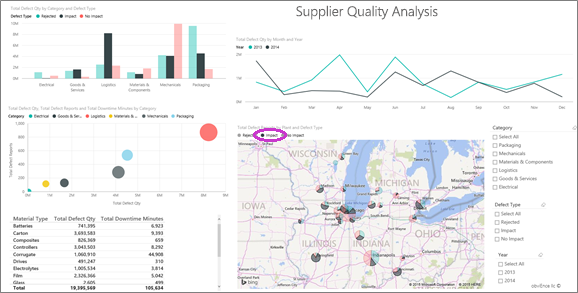  

    Repare no gráfico de bolhas que **Logística** é categoria mais problemática – é a maior em termos de quantidade total de defeitos, relatórios do total de defeitos e total de minutos de inatividade. Vamos explorar melhor esta categoria.  
3. Selecione a bolha de Logística no gráfico de bolhas e observe as fábricas em Springfield, IL e Naperville, IL. Naperville parece fazer um melhor trabalho de gestão de fornecimentos com defeitos, uma vez tem um número alto de rejeição e alguns impactos, comparado ao grande número de impactos de Springfield.  

   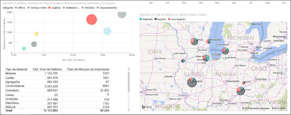  
4. Selecione **Exemplo de Análise de Qualidade do Fornecedor** na barra de navegação superior para voltar à área de trabalho ativa.

## Que tipo de material é melhor gerido?
O melhor tipo de material gerido é o que tem o tempo de inatividade mais baixo ou nenhum impacto, independentemente da quantidade de defeitos.

* No dashboard, observe o mosaico **Quantidade Total de Defeitos por Tipo de Material, Tipo de Defeito**.

  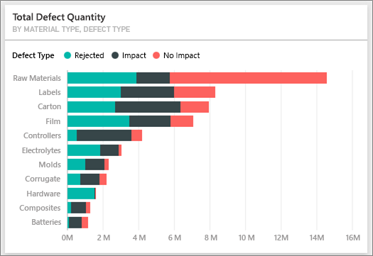

Repare que **Matérias-Primas** tem um total elevado de defeitos, mas a maioria dos defeitos é rejeitada ou não tem impacto.

Vamos ver se as matérias-primas não causam muito tempo de inatividade, apesar da quantidade de defeito alta.

* No dashboard, observe o mosaico **Quantidade Total de Defeitos, Total de Minutos de Inatividade por Tipo de Material**.

  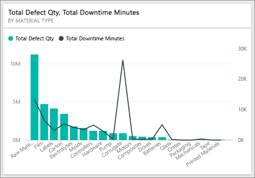

Aparentemente as matérias-primas são bem geridas: elas têm mais defeitos, mas menos minutos de inatividade total.

### Comparar defeitos com o tempo de inatividade por ano
1. Selecione o mosaico do mapa **Relatórios do Total de Defeitos por Fábrica, Tipo de Defeito** para abrir o relatório na primeira página do relatório, Qualidade do Fornecedor.
2. Repare que **Quantidade de Defeitos** é maior em 2014 do que em 2013.  

    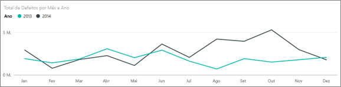  
3. Mais defeitos traduz-se em mais tempo de inatividade? Podemos fazer perguntas na caixa de P e R para descobrir.  
4. Selecione **Exemplo de Análise de Qualidade do Fornecedor** na barra de navegação superior para voltar ao dashboard.  
5. Como sabemos que as matérias-primas têm o maior número de defeitos, na caixa de pergunta, escreva "mostrar tipos de materiais, ano e quantidade total de defeitos".  

    Havia muitos mais defeitos de matérias-primas em 2014 do que em 2013.  

    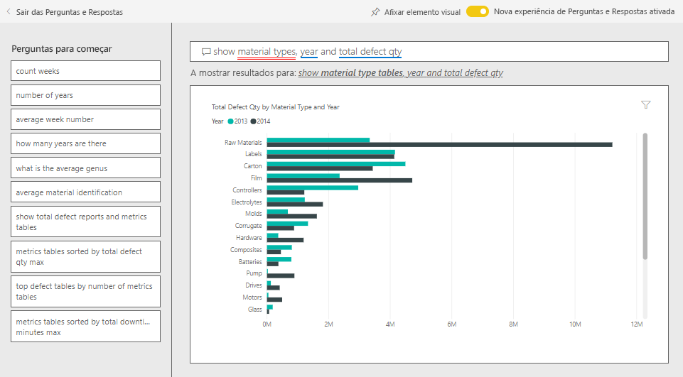  
6. Agora, altere a pergunta para "mostrar tipos de materiais, ano e total de minutos de tempo de inatividade".  

   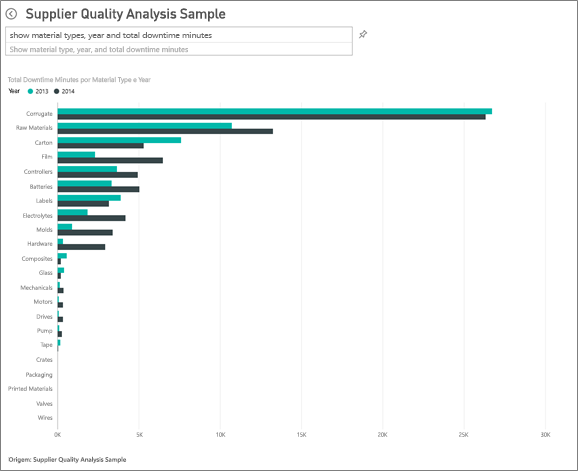

O tempo de inatividade de matérias-primas era quase o mesmo em 2013 e 2014, mesmo que houvesse muitos mais defeitos que matérias-primas do que em 2014.

O que acontece é que mais matérias-primas com defeitos em 2014 não levaram a mais tempo de inatividade no mesmo período.

### Compare defeitos com o tempo de inatividade mês a mês
Vejamos outro mosaico de dashboard relacionado com a quantidade total de defeitos.  

1. Selecione a seta para voltar  no canto superior esquerdo acima da caixa de pergunta para voltar ao dashboard.  

    Ao analisarmos mais atentamente o mosaico **Quantidade Total de Defeitos por Mês, Ano**, vemos que o primeiro semestre de 2014 tinha um número semelhante de defeitos a 2013, mas no segundo semestre de 2014, o número de defeitos aumentou significativamente.  

    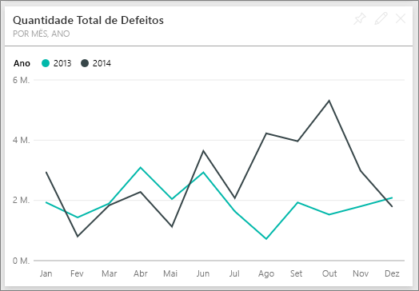  

    Vamos ver se este aumento na quantidade de defeitos conduziu a um aumento igual em minutos do tempo de inatividade.  
2. Na caixa de pergunta, escreva "total de minutos de inatividade por mês e ano como um gráfico de linhas".  

   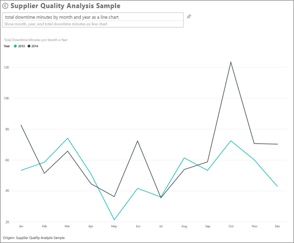

   Vemos um salto em minutos de inatividade durante junho e outubro, mas fora isso, o salto no número de defeitos não resulta em tempo de inatividade consideravelmente maior. Isto mostra que estamos a gerir bem os defeitos.  
3. Para afixar este gráfico ao seu dashboard, selecione o ícone de pino  à direita da caixa de pergunta.  
4. Para explorar os meses de exceções, verifique os minutos de tempo de inatividade durante outubro por tipo de material, localização da fábrica, categoria, etc., ao fazer perguntas como "minutos de tempo de inatividade total em outubro pela fábrica".    
5. Selecione a seta para voltar  no canto superior esquerdo acima da caixa de pergunta para voltar ao dashboard.

Este é um ambiente seguro para experimentar. Pode optar por não guardar as alterações. No entanto, se as guardar, pode sempre aceder a **Obter Dados** para obter uma nova cópia deste exemplo.

## Próximos passos: ligar-se aos seus dados
Esperamos que este tour tenha mostrado como os dashboards, o P e R e os relatórios do Power BI podem apresentar informações sobre os dados de gastos na qualidade do fornecedor. Agora é a sua vez — ligue-se aos seus próprios dados. Com o Power BI, pode ligar-se a uma grande variedade de origens de dados. Saiba mais sobre como [começar a utilizar o Power BI](service-get-started.md).
