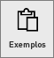
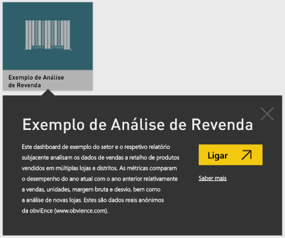
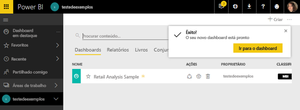
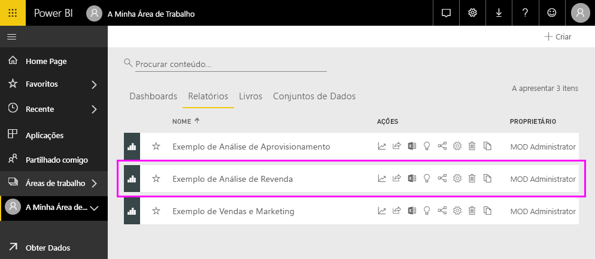
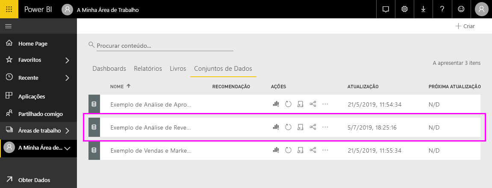
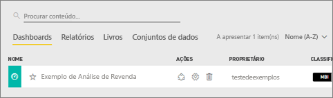
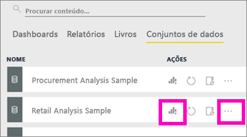
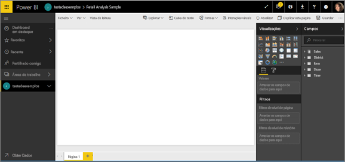
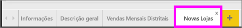
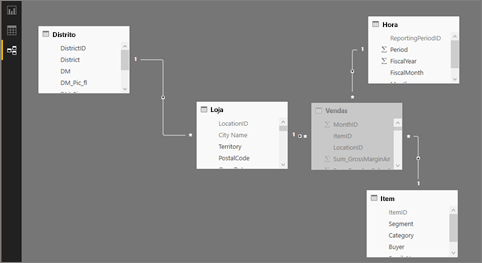

# Exemplos do Power BI

Recomendamos que comece pelo artigo [Conjuntos de dados de exemplo do Power BI](sample-datasets.md). Nesse artigo, irá aprender tudo sobre os exemplos; como obtê-los, onde guardá-los, como utilizá-los e algumas das histórias de cada um deles. Em seguida, quando tiver algumas noções básicas, volte a este Tutorial.   

### Pré-requisitos
Os exemplos estão disponíveis para o serviço Power BI e para o Power BI Desktop. Para acompanhar, vamos utilizar o exemplo da Análise de Revenda.

O pacote de conteúdos de exemplo de *Análise de Retalho* utilizado neste tutorial consiste num dashboard, relatório e conjunto de dados.
Para se familiarizar com este pacote de conteúdos específico e o respetivo cenário, pode [ver uma apresentação do exemplo Análise de Revenda](sample-retail-analysis.md) antes de começar.

## Acerca deste tutorial
Este tutorial ensina-o 
- como importar um pacote de conteúdos de exemplo, como adicioná-lo ao serviço Power BI e como abrir o conteúdo. Um *pacote de conteúdos* é um tipo de exemplo em que o conjunto de dados é fornecido num pacote com um dashboard e relatório. 
-  Abra um ficheiro .pbix de exemplo no Power BI Desktop.

## Exemplos e serviço Power BI

1. Abra e inicie sessão no serviço Power BI (app.powerbi.com).
2. Selecione **Obter Dados** na parte inferior do painel de navegação esquerdo. Se **Obter Dados** não for apresentado, expanda o painel de navegação, selecionando .
   
   
5. Selecione **Exemplos**.  
   
   
6. Selecione o *Exemplo de Análise de Revenda* e selecione **Ligar**.   
   
   

## O que foi importado exatamente?
Com os pacotes de conteúdos de exemplo, quando seleciona **Ligar**, o Power BI está, na verdade, a trazer uma cópia desse pacote de conteúdos e a armazená-la na cloud. Uma vez que a pessoa que criou o pacote de conteúdos incluiu um conjunto de dados, um relatório e um dashboard, é isso que obtém ao clicar em **Ligar**. 

1. O Power BI cria o novo dashboard e lista-o no separador **Dashboards**. O asterisco amarelo permite-lhe saber que é novo.
   
   
2. Abra o separador **Relatórios**.  Aqui, verá um novo relatório denominado *Exemplo de Análise de Revenda*.
   
   
   
   Veja o separador **Conjuntos de dados**.  Existe também um novo conjunto de dados.
   
   

## Explorar o conteúdo novo
Agora explore o dashboard, o conjunto de dados e o relatório por conta própria. Existem muitas formas diferentes de navegar para os dashboards, relatórios e conjuntos de dados e apenas uma dessas formas está descrita abaixo.  

> [!TIP]
> Quer uma pequena ajuda primeiro?  Experimente ver a [Apresentação do exemplo de Análise de Revenda](sample-retail-analysis.md) para obter instruções passo a passo deste exemplo.
> 
> 

1. Regresse ao separador **Dashboards** e selecione o dashboard *Exemplo de Análise de Revenda* para abri-lo.    
   
   
2. É aberto o dashboard.  Tem uma variedade de mosaicos de visualização.
   
   
3. Selecione um dos mosaicos para abrir o relatório subjacente.  Neste exemplo, vamos selecionar o gráfico de área (descrito a rosa na imagem anterior). O relatório é aberto na página que contém esse gráfico de área.
   
    
   
   > [!NOTE]
   > Se o mosaico tiver sido criado com as [Perguntas e Respostas do Power BI](power-bi-q-and-a.md), deve ter sido aberta a página Perguntas e Respostas. Se o mosaico tiver sido [afixado do Excel](service-dashboard-pin-tile-from-excel.md), o Excel Online será aberto no Power BI.
   > 
   > 
1. De volta ao separador **Conjuntos de dados**, tem várias opções para explorar o conjunto de dados.  Não poderá abrir e ver todas as linhas e colunas (como no Power BI Desktop ou no Excel).  Quando alguém partilha um pacote de conteúdos com colegas, normalmente, quer partilhar as informações e não dar aos colegas acesso direto aos dados. No entanto, isso não significa que não pode explorar o conjunto de dados.  
   
   
   
   * Uma forma de explorar o conjunto de dados é ao criar as suas próprias visualizações e relatórios do zero.  Selecione o ícone de gráfico  para abrir o conjunto de dados no modo de edição de relatórios.
     
       
   * Outra forma de explorar o conjunto de dados é executar as [Informações Rápidas](service-insights.md). Selecione as reticências (...) e a opção **Obter informações**. Quando as informações estiverem prontas, selecione **Ver informações**.
     
       

## Exemplos e Power BI Desktop 
Quando abre o ficheiro PBIX de exemplo pela primeira vez, é apresenta a Vista de relatório na qual pode explorar, criar e modificar qualquer número de páginas de relatórios com visualizações. A Vista de relatório proporciona praticamente a mesma experiência de design que a Vista de edição de um relatório no serviço Power BI. Pode mover as visualizações de um lado para o outro, copiar e colar, unir, etc.

A diferença é que ao utilizar o Power BI Desktop, pode trabalhar com as suas consultas e modelar os seus dados para certificar-se que os seus dados suportam as melhores informações nos seus relatórios. Então pode guardar o seu ficheiro do Power BI Desktop onde quiser, quer seja na sua unidade local ou na cloud.

1. Abra o [ficheiro .pbix de exemplo da Análise de Revenda](http://download.microsoft.com/download/9/6/D/96DDC2FF-2568-491D-AAFA-AFDD6F763AE3/Retail-Analysis-Sample-PBIX.pbix) no Power BI Desktop. 

    

1. O ficheiro é aberto na Vista de relatório. Reparou nos quatro separadores na parte inferior do editor de relatórios? Tal significa que existem quatro páginas neste relatório e que a página “Novas Lojas” está atualmente selecionada. 

    .

3. Para obter uma descrição detalhada do editor de relatórios, veja [Apresentação do editor de relatórios](service-the-report-editor-take-a-tour.md)

## O que foi importado exatamente?
Quando abre o ficheiro PBIX de exemplo no Desktop, o Power BI está, na verdade, a trazer uma cópia desses dados e a armazená-la na cloud. No Desktop, o utilizador tem acesso ao relatório ***e ao conjunto de dados subjacente***. Quando os dados forem carregados, o Power BI Desktop tentará localizar e criar relações para o utilizador.  

1. Mude para a [Vista de dados](desktop-data-view.md) ao selecionar o ícone de tabela .
 
    

    A Vista de Dados ajuda a inspecionar, explorar e compreender os dados no modelo do Power BI Desktop. É diferente do modo como vê as tabelas, as colunas e os dados no Editor de Consultas. Com a Vista de Dados, está a ver os seus dados após eles terem sido carregados no modelo.

    Quando está a modelar seus dados, às vezes deseja ver o que está realmente numa tabela ou coluna, sem criar um elemento visual na tela de relatório, geralmente imediatamente abaixo do nível de linha. Isso é particular verdadeiro quando está a criar colunas calculadas e medidas, ou quando precisa de identificar um tipo de dados ou uma categoria de dados.

1. Mude para a [Vista de relações](desktop-relationship-view.md) ao selecionar o ícone .
 
    

    A Vista de Relações mostra todas as tabelas, colunas e relações no modelo. Aqui pode ver, alterar e criar relações.

## Explorar o conteúdo novo
Agora, explore o conjunto de dados, as relações e o relatório. Para obter ajuda para começar, aceda a [Guia de Introdução ao Desktop](desktop-getting-started.md).    

## Próximos passos
[Conceitos básicos do Power BI](service-basic-concepts.md)

[Exemplos para o serviço Power BI](sample-datasets.md)

[Origens de dados para o Power BI](service-get-data.md)

Mais perguntas? [Pergunte à Comunidade do Power BI](http://community.powerbi.com/)

