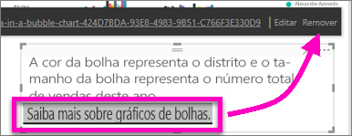

# Adicionar uma hiperligação a uma caixa de texto num relatório
As caixas de texto podem ser adicionadas a relatórios, afixadas em dashboards de relatórios e adicionadas diretamente a dashboards. Pode adicionar hiperligações a uma caixa de texto, independentemente do local onde esta se encontre.  

> **NOTA**: para obter informações sobre hiperligações nas tabelas e matrizes do Power BI, veja [Hyperlinks in tables](power-bi-hyperlinks-in-tables.md) (Hiperligações nas tabelas). Para obter informações sobre como adicionar caixas de texto ao **dashboard**, veja [Adicionar um mosaico diretamente a partir do dasboard](service-dashboard-add-widget.md). 
> 
> 

<iframe width="560" height="315" src="https://www.youtube.com/embed/_3q6VEBhGew#t=0m55s" frameborder="0" allowfullscreen></iframe>

## Para adicionar uma hiperligação a uma caixa de texto num relatório
1. [Crie uma caixa de texto e adicione algum texto](power-bi-reports-add-text-and-shapes.md). 
2. Selecione o texto existente ou adicione novo texto a ser utilizado como hiperligação.
   
   
3. Selecione o ícone da hiperligação .
4. Escreva ou cole o URL no campo da hiperligação e selecione **Concluído**.
   
   
5. Teste a ligação.  
   
   
   
   * Coloque o cursor em qualquer lugar no texto realçado para visualizar o URL.  
     
      
   * Selecione o URL para abrir a página numa nova janela do browser.

## Para remover a hiperligação, mas deixar o texto
1. Na caixa de texto, selecione a hiperligação para destacá-la,
   
     
2. Escolha **Remover**. 

## Próximos passos
[Caixas de texto nos relatórios do Power BI](power-bi-reports-add-text-and-shapes.md)

Mais perguntas? [Pergunte à Comunidade do Power BI](http://community.powerbi.com/)

