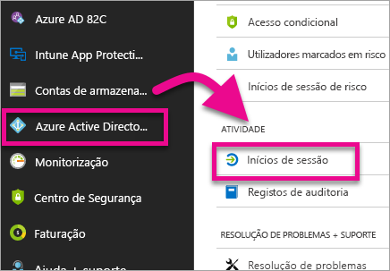
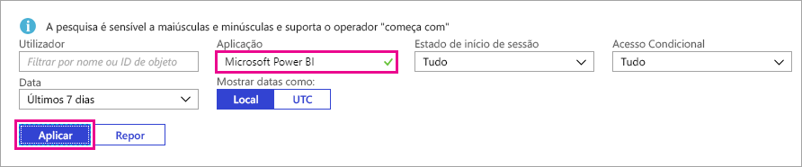
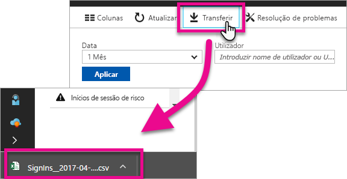

# Encontrar utilizadores do Power BI que iniciaram sessão
Se for administrador inquilino e quiser ver quem iniciou sessão no Power BI, pode utilizar os relatórios de acesso e utilização do Azure Active Directory para obter visibilidade.

<iframe width="640" height="360" src="https://www.youtube.com/embed/1AVgh9w9VM8?showinfo=0" frameborder="0" allowfullscreen></iframe>

Pode aceder ao relatório de atividades nos portais [novo](https://docs.microsoft.com/azure/active-directory/active-directory-reporting-activity-sign-ins) e [clássico](https://docs.microsoft.com/azure/active-directory/active-directory-view-access-usage-reports) do Azure Active Directory (Azure AD). Embora o vídeo acima utilize o portal clássico como exemplo, este artigo irá realçar o novo portal.

> [!NOTE]
> Este relatório de atividades inclui utilizadores do Power BI (gratuito) e do Pro, mas não os identifica pela licença que possuem.
> 
> 

## Requisitos
Seguem-se os requisitos para ver o relatório de atividades de início de sessão.

* Os utilizadores com a função de Administrador Global, Administrador de Segurança ou Leitor de Segurança podem aceder aos dados.
* Qualquer utilizador (não administrador) pode aceder aos respetivos inícios de sessão.
* O seu inquilino tem de ter uma licença do Azure AD Premium associada ao mesmo para ver o relatório de atividades de início de sessão.

## Utilizar o portal do Azure para ver inícios de sessão
Pode utilizar o portal do Azure AD para ver a atividade de início de sessão.

1. Navegue até ao **portal do Azure** e selecione **Azure Active Directory**.
2. Em **Atividade**, selecione **Inícios de sessão**.
   
    
3. Filtre a aplicação por **Microsoft Power BI** ou **Power BI Gateway** e selecione **Aplicar**.
   
    **Microsoft Power BI** destina-se a atividade de início de sessão relacionada com o serviço enquanto **Power BI Gateway** destina-se a inícios de sessão específicos do gateway de dados no local.
   
    

## Exportar os dados
Tem duas opções para exportar os dados de início de sessão. Pode fazê-lo ao transferir um ficheiro csv ou pode utilizar o PowerShell.

### Transferir csv
No ecrã Atividade, pode selecionar **Transferir** na barra de ferramentas. Isto irá transferir um ficheiro csv para os dados atualmente filtrados.

### PowerShell
Pode utilizar o PowerShell para exportar os dados de início de sessão. Está disponível um [exemplo](https://docs.microsoft.com/azure/active-directory/active-directory-reporting-api-sign-in-activity-samples#powershell-script) na documentação do Azure AD.

> [!NOTE]
> Para que o exemplo do PowerShell funcione, não se esqueça de seguir os [pré-requisitos para aceder à API de relatórios do Azure AD](https://docs.microsoft.com/en-us/azure/active-directory/active-directory-reporting-api-prerequisites).
> 
> 

## Retenção de dados
Os dados relacionados com início de sessão podem estar disponíveis durante um máximo de 30 dias. Para obter mais informações, veja [Políticas de retenção de relatórios do Azure Active Directory](https://docs.microsoft.com/azure/active-directory/active-directory-reporting-retention).

## Próximos passos
[Relatórios de atividade de início de sessão no portal do Azure Active Directory (Novo Portal)](https://docs.microsoft.com/azure/active-directory/active-directory-reporting-activity-sign-ins)  
[Ver os relatórios de acesso e utilização (Portal Clássico)](https://docs.microsoft.com/azure/active-directory/active-directory-view-access-usage-reports#view-or-download-a-report)  
[Exemplo de script de início de sessão do PowerShell](https://docs.microsoft.com/azure/active-directory/active-directory-reporting-api-sign-in-activity-samples#powershell-script)  
[Políticas de retenção de relatórios do Azure Active Directory](https://docs.microsoft.com/azure/active-directory/active-directory-reporting-retention)  
[Utilizar a auditoria na sua organização](service-admin-auditing.md)  
[Ativação da Versão de Avaliação Pro alargada](service-extended-pro-trial.md)

Mais perguntas? [Experimente perguntar à Comunidade do Power BI](https://community.powerbi.com/)

